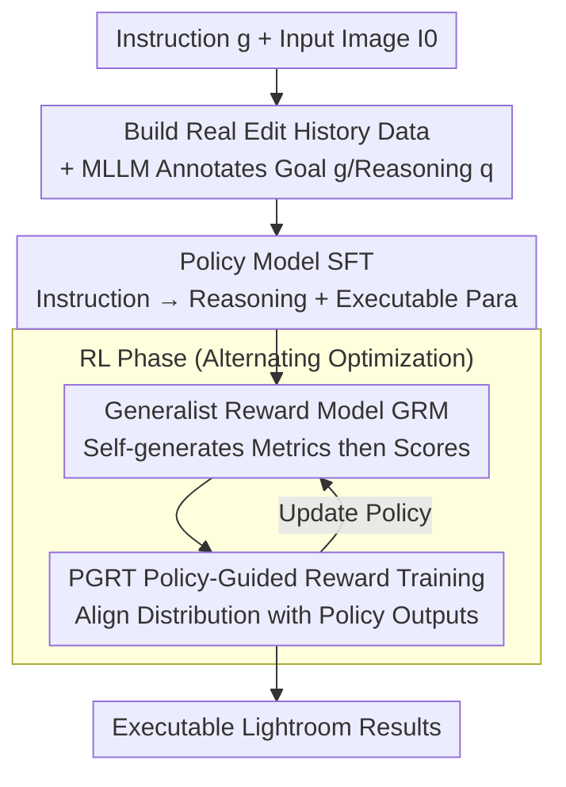

# RetouchIQ: MLLM Agents for Instruction-Based Image Retouching with Generalist Reward

**Conference**: CVPR 2026  
**Paper**: [CVF Open Access](https://openaccess.thecvf.com/content/CVPR2026/html/Wu_RetouchIQ_MLLM_Agents_for_Instruction_Based_Image_Retouching_with_Generalist_Reward_CVPR_2026_paper.html)  
**Code**: Not released  
**Area**: Agent / Multimodal VLM / Image Retouching  
**Keywords**: MLLM agent, Image Retouching, Reinforcement Learning, Generalist Reward Model, Lightroom

## TL;DR
Addressing the challenges that "creative retouching is inherently subjective" and "rule-based rewards from single reference images are unreliable," this paper proposes RetouchIQ. The framework enables an MLLM agent to translate natural language instructions into executable Lightroom parameters. It utilizes a Generalist Reward Model (GRM) that "generates case-by-case evaluation metrics and then assigns scores," combined with Policy-Guided Reward Training (PGRT) for RL. Experimental results on the self-built RetouchEval and the MIT-Adobe5K dataset demonstrate superior semantic consistency and perceptual quality compared to MLLM and Diffusion baselines.

## Background & Motivation

**Background**: Image retouching requires adjusting tone, color, and lighting while preserving realism and semantic consistency. Early methods learned to predict interpretable editing steps but failed to capture specific user intents or handle diverse text instructions. Recent diffusion models can follow natural language for enhancement/editing but often introduce unintended changes to image content and environment due to sampling stochasticity. The latest trend involves MLLM agents controlling professional retouching software (e.g., Adobe Lightroom, PicsArt) via tool calls.

**Limitations of Prior Work**: Existing MLLM-agent solutions mostly use reinforcement learning to **reproduce manual editing results**. however, creative retouching is naturally subjective—the same instruction can yield multiple equally valid results, and different users may provide distinct yet effective edits. Consequently, anchoring training to **single reference edits** using rule-based, pixel-level rewards (e.g., pixel difference with GT) becomes unreliable: a high-quality edit might receive a low score for differing from the reference, while a poor edit might receive a high score due to accidental proximity to the reference.

**Key Challenge**: Verifiable reward, which is effective in objective domains like mathematics or programming, fails in subjective and open-ended retouching tasks—there is no unique, verifiable ground truth. Forcing pixel-based or reference-based comparisons fails to capture semantic quality or artistic preference.

**Goal**: (1) Develop a reward signal that reflects subjective aesthetics and fairly evaluates various reasonable results for the same instruction; (2) Enable an MLLM agent to reliably map high-level aesthetic goals to precise Lightroom parameter controls; (3) Address the distribution shift problem during reward model training.

**Key Insight**: Drawing inspiration from "Generalist Reward Models" in the LLM field, this work replaces fixed rules with an RL-finetuned MLLM that **generates a set of evaluation metrics case-by-case** before scoring, providing scalar feedback based on multimodal reasoning.

**Core Idea**: Utilize a Generalist Reward Model (GRM) that "sets its own criteria and then scores" to replace rule-based rewards (based on pixel differences from a single reference) to drive RL, and use PGRT to align the reward model with the actual edit distribution produced by the policy model.

## Method

### Overall Architecture
RetouchIQ consists of a **policy model** that translates user natural language instructions into two outputs: a **reasoning trajectory** describing semantic interpretation and aesthetic intent, and a sequence of **parameterized editing operations** (e.g., `{exposure=+0.9; contrast=-30}`) executable in Lightroom. Training occurs in two stages: first, SFT is used to help the model learn the "instruction → reasoning → edit parameters" mapping from real user edits; second, RL allows the model to explore diverse reasoning paths and editing schemes, gradually discovering better strategies under scalar feedback from the GRM. The GRM itself is also trained via SFT+RL and aligned with the policy distribution using PGRT; during training, the policy model and reward model are **optimized alternately** to reinforce each other.

### Key Designs

**1. Data Construction from Real Edit History + MLLM Annotation: Bringing Training Data Closer to Real Scenarios**

An ideal training sample includes the image pair $(I_0, I)$, the natural language editing goal $g$, the reasoning process $q$ for the optimal strategy, and the Lightroom parameter sequence $e$. The authors collect $(I_0, I)$ and corresponding $e$ directly from **real user edit histories** in Lightroom—unlike existing work that synthesizes "after" images using presets, real human edits are naturally more realistic. The two missing components—the user's intent $g$ and the reasoning $q$—are supplemented by a **fixed MLLM annotator**. The annotator takes the triplet $(I_0, I, e)$, infers intent $g$ based on differences and steps, and generates simulated reasoning $q$. Samples with unclear intents or inconsistencies are systematically filtered. The final training set for the policy model contains **190K** image-instruction pairs, with three instruction variants of different lengths/complexities per image to increase diversity.

**2. Policy Editing Model: SFT for Instruction → Reasoning + Executable Lightroom Parameters**

The policy model is initialized from a pretrained MLLM backbone (Qwen2.5-VL-7B) and finetuned on the instruction-reasoning-edit corpus. Given an input image $I_0$ and instruction $g$, the model autoregressively generates textual reasoning $q$ and structured edit steps $e$. The objective is the negative log-likelihood $L_{\text{SFT}}=-\sum_t\log p_\theta(y_t\mid y_{<t},I_0,g)$, where the output sequence includes both natural language reasoning and structured editing operations. This stage allows the model to learn the semantic mapping between "linguistic aesthetic intent ↔ executable editing parameters," providing a strong initialization for subsequent RL. Compared to black-box diffusion, this "reasoning-before-parameters" approach is controllable, transparent, and executable.

**3. Generalist Reward Model (GRM): Case-by-Case Scoring via Self-Generated Metrics**

The success of RL depends heavily on reward quality. Standard criteria for successful editing vary by image and instruction, making fixed rules inadequate. The GRM is an MLLM reward model that takes the image pair $(I_0, \text{Execute}(I_0, e))$ and instruction $g$. It **first generates a set of metrics describing "what key features a successful edit should have"** (e.g., "should have autumn yellow/orange tones (25%)", "well-balanced white balance (20%)"), and **then provides a scalar reward based on these metrics** (e.g., weighted scores $6\times25\%+8\times20\%\dots=7.3$). The GRM is also trained via SFT followed by RL. In the SFT stage, paired data $(I_0, I, I_w)$ is used (where strong edit $I$ comes from real users and weak edit $I_w$ is generated by a frozen MLLM perturbing parameters), using the loss $L_{\text{SFT}}^{\text{reward}}=-\sum_t\log p_\phi(y_t\mid y_{<t},I_0,I,I_w,g)$ to learn "explain aesthetic metrics before scoring." The strategy RL goal is to maximize the expected reward $J(\theta)=\mathbb{E}_{q,s\sim\pi_\theta}[r_\phi(g,I_0,\text{Execute}(I_0,e))+r_{\text{format}}(q,s)]$, where $\text{Execute}(\cdot)$ denotes running the predicted edits in the Lightroom engine. This allows the reward to adapt case-by-case and provide precise feedback reflecting subjective aesthetics.

**4. PGRT Policy-Guided Reward Training: Eliminating Reward Model Training Distribution Shift**

SFT for GRM relies on perturbation-based weak edits. however, the authors found that perturbations are often **single-point adjustments** (e.g., only exposure/color temperature), whereas the policy model typically produces **combined and complex edits**. This distribution shift causes the reward model to perform poorly on real policy outputs. PGRT trains the reward model on data consistent with the policy's editing distribution. During RL, **results generated by the policy model** replace perturbed images as weak edits $I_w$. The reward function becomes $J(\phi)=\mathbb{E}_{m,r,r_w\sim\pi_\phi}[\mathbb{I}[r>r_w]+r_{\text{format}}(m,r,r_w)]$, where $\mathbb{I}[\cdot]$ is a 0-1 indicator that penalizes the model for incorrectly giving a higher score to a weaker edit. Since PGRT depends on policy output, the policy and reward models are **optimized alternately**. For the initial reward model training, perturbed edits are used for cold-starting.

### A Complete Example
Take the instruction "I want it to have an autumn vibe and a natural feel": The policy model reads $I_0$ + instruction, outputs reasoning ("First adjust exposure to highlight the subject... increase color temperature for a warm tone") and parameters $e$ → Lightroom executes to get the "after" image → GRM generates metrics ("should have autumn yellow/orange tones (25%)", "proper white balance (20%)"...) → Scores are given to the policy's output $after_u$ (strong) and $after_w$ (weak, sampled from another policy iteration under PGRT), such as 8.2 for $after_u$ and 5.4 for $after_w$ → Strategy is updated via gradient ascent based on $\mathbb{I}[r>r_w]$. The policy and GRM iterate alternately to converge on parameters that match the instruction's aesthetics.

## Key Experimental Results

Policy and reward models are based on Qwen2.5-VL-7B; GLM-4.5V is used as the MLLM annotator/perturber. Benchmarks include the self-built **RetouchEval** (300 pairs across quality enhancement, style transfer, and local retouching) and the public **MIT-Adobe5K** (400 test images). Metrics: **L1/L2** for difference from GT; **SC** = Semantic Consistency, **PQ** = Perceptual Quality (both evaluated by GLM-4.5V); **O** = Overall; MIT-Adobe5K uses PSNR/LPIPS/SSIM.

### Main Results
RetouchEval comparison across three categories (Selected SC/PQ/O, higher is better):

| Method | Enhancement O | Style Transfer O | Local Retouching O | Type |
|------|------|------|------|------|
| FLUX-PRO | 6.10 | 6.42 | 6.22 | Diffusion |
| GPT-5 | 6.62 | 6.82 | 6.47 | General MLLM |
| Gemini-2.5 | 6.64 | 6.05 | 6.31 | General MLLM |
| MonetGPT | 6.78 | 5.95 | 6.48 | MLLM Agent |
| JarvisArt | 6.90 | 7.13 | 6.42 | MLLM Agent |
| RetouchIQ-GRM | **7.51** | **7.31** | **6.65** | Ours |

MIT-Adobe5K (PSNR↑/LPIPS↓/SSIM↑):

| Method | SSIM↑ | LPIPS↓ | PSNR↑ |
|------|------|------|------|
| GPT-5 | 0.72 | 0.26 | 20.82 |
| MonetGPT | 0.82 | 0.17 | 23.10 |
| JarvisArt | 0.76 | 0.23 | 21.03 |
| RetouchIQ-SFT | 0.84 | 0.20 | 22.37 |
| RetouchIQ-GRM | **0.86** | **0.16** | **23.14** |

### Ablation Study
Comparison of reward signal types (RetouchEval Enhancement, SC/PQ higher is better):

| Configuration | Enhancement SC↑ | Enhancement PQ↑ | Enhancement O↑ | Description |
|------|------|------|------|------|
| RetouchIQ-SFT | 6.71 | 6.67 | 6.69 | SFT only, no RL |
| RetouchIQ-Rule | 7.14 | 6.61 | 6.87 | RL with rule-based reward |
| RetouchIQ-GRM | **7.57** | **7.48** | **7.51** | RL with GRM |

### Key Findings
- **GRM > Rule-based Reward > SFT only**: The overall score for enhancement increases from 6.69 → 6.87 → 7.51, indicating that the generalist reward model drives subjective retouching better than rule-based rewards, and the RL stage provides significant gains.
- **PGRT improves both Reward and Policy**: As shown in Figure 5, PGRT aligns the reward model distribution with actual policy outputs, achieving the highest reward accuracy on that set, which in turn trains the best performing policy model—validating the core hypothesis of alignment.
- **Cross-benchmark Generalization**: On MIT-Adobe5K, which differs from the training instruction set, RetouchIQ-GRM still leads (SSIM 0.86/LPIPS 0.16/PSNR 23.14), proving the method does not just overfit self-built data.
- The authors noted that JarvisArt sometimes achieves high SC scores and provided a case study in the appendix to analyze this phenomenon.

## Highlights & Insights
- **Transferring "Generalist Reward Models" from LLM to Multimodal Retouching**: Allowing the reward model to self-generate metrics case-by-case elegantly bypasses the roadblock where subjective tasks lack a unique verifiable GT.
- **PGRT addresses Distribution Shift in Reward Models**: Explicitly identifying the shift between perturbed weak edits (single adjustment) and actual policy outputs (complex combinations), and using policy outputs for alignment, is an insight applicable to any RLHF/RLAIF reward training.
- **Executable + Interpretable Retouching**: Outputting Lightroom parameters instead of pixels makes the edits controllable, reversible, and auditable, making it more suitable for professional workflows than black-box diffusion.
- **Real Human Edit Histories as Data Source**: Compared to synthesized presets, real-world pairs are naturally realistic. Combining them with MLLM-inferred intent/reasoning is a practical paradigm for data construction.

## Limitations & Future Work
- **Backbone Aesthetic Bias**: As the GRM is an MLLM, it inherits biases from its backbone. Since evaluations (SC/PQ) also use an MLLM (GLM-4.5V), there is a risk of "circular reasoning" between the judge and the reward, requiring more human evaluation for validation.
- **Lightroom Parameter Binding**: The method relies on Lightroom's interface. Porting to other software or pixel-level local edits would require rebuilding the data and action space.
- **Alternating Training Cost**: Alternating optimization between the policy and reward models, combined with SFT followed by RL for GRM, results in a complex training pipeline.
- **Limited Gains in Local Retouching**: The overall score improvement for local retouching was the smallest (6.65 vs. 6.42), as fine-grained spatial localization remains a challenge.

## Related Work & Insights
- **vs. Verifiable Rewards**: While verifiable rewards work for objective tasks, RetouchIQ's GRM uses dynamic metrics to handle subjective image editing.
- **vs. Diffusion Editing**: Diffusion models allow instructions but often destroy the original image's structure; RetouchIQ outputs parameters, preserving structure and ensuring interpretability.
- **vs. Existing MLLM Agents**: JarvisArt uses rule-based rewards aimed at reproducing manual edits, often failing on customized requests. RetouchIQ's GRM + PGRT leads in semantic consistency and perceptual quality.
- **vs. Generalist Reward Models (LLM)**: This extends the concept of "LLM as a judge" to "MLLM evaluating images via dynamically generated metrics" for visual creative tasks.

## Rating
- Novelty: ⭐⭐⭐⭐ First to apply Generalist Reward Models to solve the "lack of unique GT" in retouching; PGRT alignment insight is solid.
- Experimental Thoroughness: ⭐⭐⭐⭐ Self-built RetouchEval + Public MIT-Adobe5K, comparison with 6 baselines, and ablation of Rule vs. GRM vs. PGRT.
- Writing Quality: ⭐⭐⭐⭐ Logical flow with clear motivation and well-organized pipelines.
- Value: ⭐⭐⭐⭐ Professional retouching agents with executable/interpretable outputs have strong practical prospects; the PGRT approach is valuable for broader RL training.

<!-- RELATED:START -->

## Related Papers

- [\[AAAI 2026\] PerTouch: VLM-Driven Agent for Personalized and Semantic Image Retouching](../../AAAI2026/llm_agent/pertouch_vlm-driven_agent_for_personalized_and_semantic_image_retouching.md)
- [\[CVPR 2026\] Universal Guideline-Driven Image Clustering via a Hybrid LLM Agent](universal_guideline-driven_image_clustering_via_a_hybrid_llm_agent.md)
- [\[CVPR 2026\] REALM: An MLLM-Agent Framework for Open World 3D Reasoning Segmentation and Editing on Gaussian Splatting](realm_mllm_agent_3d_reasoning_gaussian.md)
- [\[ICLR 2026\] WebArbiter: A Principle-Guided Reasoning Process Reward Model for Web Agents](../../ICLR2026/llm_agent/webarbiter_a_principle-guided_reasoning_process_reward_model_for_web_agents.md)
- [\[ACL 2026\] Exploring Reasoning Reward Model for Agents](../../ACL2026/llm_agent/exploring_reasoning_reward_model_for_agents.md)

<!-- RELATED:END -->
## Related Papers

- [\[AAAI 2026\] PerTouch: VLM-Driven Agent for Personalized and Semantic Image Retouching](../../AAAI2026/llm_agent/pertouch_vlm-driven_agent_for_personalized_and_semantic_image_retouching.md)
- [\[CVPR 2026\] NitroGen: An Open Foundation Model for Generalist Gaming Agents](nitrogen_an_open_foundation_model_for_generalist_gaming_agents.md)
- [\[CVPR 2026\] Universal Guideline-Driven Image Clustering via a Hybrid LLM Agent](universal_guideline-driven_image_clustering_via_a_hybrid_llm_agent.md)
- [\[CVPR 2026\] REALM: An MLLM-Agent Framework for Open World 3D Reasoning Segmentation and Editing on Gaussian Splatting](realm_mllm_agent_3d_reasoning_gaussian.md)
- [\[ACL 2026\] Exploring Reasoning Reward Model for Agents](../../ACL2026/llm_agent/exploring_reasoning_reward_model_for_agents.md)

<!-- RELATED:END -->
