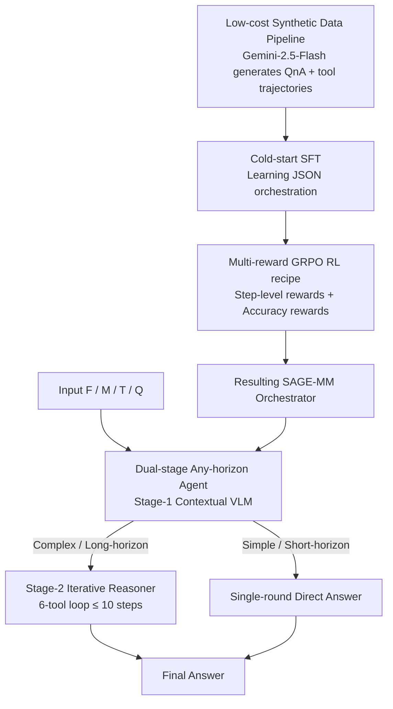

# SAGE: Training Smart Any-Horizon Agents for Long Video Reasoning with Reinforcement Learning

**Conference**: CVPR 2026  
**Paper**: [CVF Open Access](https://openaccess.thecvf.com/content/CVPR2026/html/Jain_SAGE_Training_Smart_Any-Horizon_Agents_for_Long_Video_Reasoning_with_CVPR_20_paper.html)  
**Code**: https://github.com/allenai/SAGE  
**Area**: Agent / Video Understanding / LLM Reasoning  
**Keywords**: Long Video Reasoning, Any-Horizon Agent, Tool Use, GRPO Reinforcement Learning, Synthetic Data

## TL;DR
SAGE transforms long video reasoning from the "DIRECT" paradigm, which feeds thousands of frames in a single pass for a one-shot answer, into an "AGENT" paradigm that performs multi-round on-demand retrieval like humans. By utilizing an orchestrator VLM (SAGE-MM) capable of coordinating 6 tools, combined with low-cost synthetic data and multi-reward GRPO post-training, SAGE achieves up to a 6.1% improvement in open-ended QA on the SAGE-Bench and a 14.6% gain for long videos exceeding 10 minutes.

## Background & Motivation

**Background**: Current State-of-the-Art (SOTA) video reasoning models (e.g., Gemini-2.5, Qwen3-VL) primarily follow the DIRECT paradigm. Given a batch of sampled frames (often thousands), the model performs sequence prediction to generate an answer in one shot, effectively "watching the entire long video from start to finish."

**Limitations of Prior Work**: Humans do not watch a 2-hour video in its entirety to find an answer; instead, they iteratively "skip, rewind, and zoom in" to locate target information. Feeding an entire long video into a model is both expensive and inefficient. Furthermore, a few existing works in the AGENT paradigm (e.g., VideoMind, VideoExplorer) **rely excessively on a single temporal grounding tool**, attempting to ground events across the entire video—a strategy that often fails due to the lack of robust grounding models for long-form content. Additionally, these agent systems are often "over-engineered" for Multiple Choice Questions (MCQ) and perform poorly on real-world open-ended QA.

**Key Challenge**: Video duration is highly variable (from seconds to hours). An ideal system should **directly answer** simple/short video questions while performing **multi-round retrieval** for complex/long video questions—possessing "any-horizon" capabilities. However, existing RL post-training recipes are designed for DIRECT models and exhibit instability when video length varies dynamically. Moreover, open-ended QA lacks verifiable rewards (RLVR works for math/MCQ via string matching but fails for open-ended generation).

**Goal**: This paper investigates whether a long video reasoning model can be effectively trained within the AGENT paradigm using RL, breaking it down into three sub-problems: training data (A1), efficient system design (A2), and an RL recipe for multi-round reasoning (A3).

**Key Insight**: Drawing inspiration from human "any-horizon reasoning" behavior—where one might skip through long videos or watch short ones in one go—the system should not struggle with temporal grounding across an entire video. Instead, it should act like a human by using external knowledge (web search) and speech transcripts to narrow the search space, followed by precise grounding within **short sub-segments**.

**Core Idea**: An orchestrator VLM (SAGE-MM) is employed to autonomously switch between "direct answering" and "multi-round tool calling." This is combined with low-cost synthetic data for cold-start SFT and multi-reward GRPO post-training to instill any-horizon reasoning capabilities into the model.

## Method

### Overall Architecture
SAGE is a long video reasoning **agent system** centered around the orchestrator VLM, SAGE-MM. The system receives four inputs: 128 uniformly sampled frames ($F$), video metadata ($M$, including path and duration), tool definitions ($T$), and the user query ($Q$). SAGE-MM operates in two stages: **Stage-1 (Contextual VLM)** first understands the video context and query intent to either provide a direct answer (short-horizon) or initiate the first tool call; **Stage-2 (Iterative Reasoner)** runs in a loop of up to 10 steps, deciding whether it can answer or requires another tool based on history, until a final answer is produced. Both stages share the same set of 6 tools: `web-search`, `parse-website`, `transcribe-speech`, `ground-event`, `extract-video-parts`, and `analyze`. A critical difference is that SAGE does **not** perform grounding on the entire video; instead, it predicts "coarse event boundaries" and performs grounding within **short sub-segments of no more than 10 minutes**.

Training is required to enable an open-source VLM to serve as the SAGE-MM orchestrator. The training pipeline involves: using Gemini-2.5-Flash to synthesize QnA and tool-use trajectories at low cost $\rightarrow$ cold-start SFT to teach the model JSON-formatted orchestration $\rightarrow$ multi-reward GRPO post-training to inject any-horizon capabilities. These three key designs—the agent system, synthetic data, and the RL recipe—correspond to the three branches in the figure below.

### Key Designs

**1. Dual-stage Any-Horizon Agent System: Enabling On-demand Switching between Single and Multi-round**

To address the inefficiencies of the DIRECT paradigm and the over-reliance on whole-video grounding in existing agents, SAGE employs a two-stage orchestration. Stage-1 (Contextual VLM) runs once, taking $\{T, F, Q, M\}$ as input to output a JSON string containing `video-context`, `query-intent`, `recommended-tool`, and `final-answer` (filled if direct, otherwise null), allowing "short videos to be watched at once." Stage-2 (Iterative Reasoner) enters a multi-step loop, processing the history of tool results and context to output `answerable`, `recommended-tool`, and `final-answer`, capping at 10 steps to prevent infinite loops.

The system also utilizes a toolset that includes `web-search` and `transcribe-speech`, allowing it to leverage **linguistic and external knowledge** beyond visual data. For example, knowing the 2024 F1 season standings significantly narrows the temporal search space when watching a 2025 livery launch video. Most importantly, SAGE only predicts timestamps within **short sub-segments of $\le 10$ minutes**, which is more robust than whole-video grounding.

**2. Low-cost Synthetic Data Pipeline: Full-coverage QnA Generation via Long-Context LLMs**

Collecting high-quality QnA for long videos is expensive (~$30 per 1-hour video on Prolific). Traditional "bottom-up" synthesis via 10–30 second snippets is also slow. This work leverages the long-context capabilities of Gemini-2.5-Flash to generate 10–20 QnA pairs for an **entire** video at once. The key trick is forcing the model to predict a `percent_video_parsed` field for each QnA, ensuring **full coverage** across the timeline rather than clustering at the beginning. Manual audits show an error rate of only 5%, achieving a $\sim 100\times$ cost reduction compared to human labeling and a $\sim 10\times$ speedup compared to snippet-based pipelines.

The pipeline also synthesizes tool-calling trajectories. Using Gemini-2.5-Flash as the SAGE orchestrator, 4 trajectories are synthesized per question, and unique input-action pairs form the cold-start SFT dataset. The final dataset includes 99.1k questions across 6659 videos, from which 7.68k samples are filtered for RL (half requiring tools, half single-round) to promote any-horizon behavior.

**3. Multi-reward GRPO Post-training Recipe: LLM-as-judge for Open-ended QA Rewards**

To solve the lack of verifiable rewards in open-ended generation, SAGE uses GRPO for **trajectory-level** optimization. For a trajectory $\tau_i = \{(S_1,A_1),\dots,(S_N,A_N)\}$, a scalar reward $R_i$ is **distributed uniformly across all actions**: $R_i = (s_1+s_2+\dots+s_N) + a_N$, where $s_j$ is the step-level reward and $a_N$ is the final accuracy reward.

The step-level reward $s_j$ is the sum of: `format` (+0.05 for required fields, -0.10 otherwise), `reasonable-tool` ($\pm 0.10$ based on GPT-4o judgment), `args-repeat` (penalty $-0.05\cdot\sqrt{\text{num-repetitions}}$), and `args-valid` (-0.1 for illegal parameters). The accuracy reward $a_N$ uses GPT-4o as a judge for a binary verdict: -2.0 for invalid JSON, -0.5 for incorrect answers with $N\ge 1$, +1.25 for correct answers using visual tools, and +1.0 for other correct answers. The +1.25 bonus encourages the use of difficult visual tools (`extract-video-parts`/`ground-event`), while the penalty for "incorrect with tools" forces the model to balance its any-horizon direct-answering capability.

## Key Experimental Results

### Main Results
Evaluations were conducted on the self-developed **SAGE-Bench** (1744 manually verified samples, avg. length 727s, focusing on visual information). GPT-4o served as the judge for both open-ended and MCQ scores.

| Configuration (SAGE-MM backbone) | overall | open-ended | visual | Description |
|--------|---------|-----------|--------|------|
| Qwen2.5-VL-7B (DIRECT base) | 58.6 | 45.4 | 55.2 | Base |
| SAGE: Qwen2.5-VL-7B [+SFT][+RL] | 63.4 | 51.5 | 62.2 | overall +4.8, open-ended **+6.1** |
| Qwen3-VL-8B (DIRECT base) | 64.9 | 54.0 | 61.9 | Stronger base |
| SAGE: Qwen3-VL-8B [+SFT][+RL] | 68.0 | 55.6 | 64.0 | overall +3.1 |
| SAGE-Flash: Qwen3-VL-8B [+SFT][+RL] | **71.8** | 62.4 | 69.9 | overall +6.9, surpasses GPT-4o (71.6) |

Compared to existing AGENT systems (VideoAgent 42.0, VideoMind 50.0, VideoExplorer 50.1), which perform significantly worse on open-ended questions (mostly 28–35), SAGE demonstrates that prior agents were over-engineered for MCQ. The RL phase provides a 4.1% gain over SFT alone.

### Key Experimental Results (Long Video Binning)

| Evaluation | Setting | Long Video Performance | Gain |
|------|------|-------------|------|
| SAGE-Bench 600–1200s bin | SAGE (Qwen3-VL-8B) | 63.2 | **+8.2** |
| SAGE-Bench 600–1200s bin | SAGE-Flash | 69.6 | **+14.6** |
| MINERVA (>600s videos) | SAGE vs Base | — | +2.6, surpasses other reasoning models |
| Video-MMMU | SAGE-Flash | 68.1 | Outperforms Video-R1 (61.5) |

Binning by duration reveals that SAGE performs similarly to the DIRECT baseline for short videos (0–300s) but leads significantly for long videos (>600s), validating the core hypothesis of the any-horizon design.

### Ablation Study

| Configuration | Video-MMMU | Video-MME | Description |
|------|-----------|-----------|------|
| SAGE-Flash (Qwen3-VL-8B [+SFT][+RL]) | 68.1 | 63.5 | Full |
| w/o ground-event | 65.8 | 65.6 | Remove temporal grounding |
| w/o ground-event & extract-video-parts | 61.8 | 66.2 | Remove frame extraction |

### Key Findings
- **Visual tools are the primary drivers of long video reasoning**: Removing `ground-event` and `extract-video-parts` drops the Video-MMMU score from 68.1 to 61.8. However, on Video-MME (perception-heavy), these tools actually hinder performance (63.5 vs 66.2), suggesting tool effectiveness depends on task type.
- **Fine-tuned SAGE-MM outperforms closed-source orchestrators**: SAGE-Flash surpasses variants using Gemini-2.5-Flash as the SAGE-MM, indicating that fine-tuning helps the model not only call tools but also better assimilate their outputs.
- **Gains scale with video length**: The 600–1200s bin shows the most significant improvement, whereas the short video bin remains nearly stagnant.

## Highlights & Insights
- **Formalizing "Any-Horizon" as a trainable objective**: Beyond simply adding tools, RL rewards (penalizing tool failure vs. rewarding direct answers) explicitly force the model to switch between strategies based on difficulty.
- **`percent_video_parsed` for temporal coverage**: A small prompt design that effectively solves coverage bias in synthetic data generation.
- **Grounding within $\le$ 10-minute sub-segments**: A pragmatic engineering approach that acknowledges the limits of grounding models for long content by using language/knowledge to narrow the search space first.
- **Trajectory-level reward backfilling**: Distributing final accuracy rewards across each action bypasses the credit assignment problem in multi-round agents.

## Limitations & Future Work
- **Ours**: Training data is limited to 13 YouTube entertainment channels, resulting in narrow domain coverage. Future work will expand domains and allow the system to autonomously synthesize new tools.
- **Heavy reliance on closed-source LLM-as-judge**: Using Gemini and GPT-4o for synthesis and rewards introduces cost, reproducibility risks, and potential bias distillation.
- **Task-dependent tool utility**: Tools help in reasoning but may hurt in pure perception tasks (e.g., Video-MME), and the orchestrator lacks a theoretical guarantee for its decisions.
- **Minimal gain on short videos**: The overhead of the agentic approach provides zero to negative returns in simple scenarios.

## Related Work & Insights
- **vs DIRECT Video Reasoning (Video-R1 / LongVILA-R1)**: These models feed frames in one shot and rely on string-matching rewards, which fail for open-ended QA. SAGE's multi-round agent + LLM-judge approach is significantly stronger for open-ended generation.
- **vs Grounding-heavy Agents (VideoMind / VideoExplorer)**: Former systems over-rely on whole-video grounding and MCQ optimization. SAGE uses a broader toolset and focuses on real-world open-ended scenarios.

## Rating
- Novelty: ⭐⭐⭐⭐ Systematizing any-horizon behavior into a Slack/RL framework is innovative, though components like GRPO and LLM-as-judge are existing techniques.
- Experimental Thoroughness: ⭐⭐⭐⭐ Comprehensive across backbones and benchmarks; however, gains are absent for short videos and depend heavily on self-built benchmarks.
- Writing Quality: ⭐⭐⭐⭐ The A1/A2/A3 problem decomposition is clear and diagrams are intuitive.
- Value: ⭐⭐⭐⭐ Provides a convincing proof-of-concept for shifting from DIRECT to AGENT paradigms for long video reasoning.

<!-- RELATED:START -->

## Related Papers

- [\[CVPR 2026\] WebGym: Scaling Training Environments for Long-Horizon Visual Web Agents with Realistic Tasks](webgym_scaling_training_environments_for_long-horizon_visual_web_agents_with_rea.md)
- [\[ICLR 2026\] MEM1: Learning to Synergize Memory and Reasoning for Efficient Long-Horizon Agents](../../ICLR2026/llm_agent/mem1_learning_to_synergize_memory_and_reasoning_for_efficient_long-horizon_agent.md)
- [\[ACL 2026\] SOLAR-RL: Semi-Online Long-horizon Assignment Reinforcement Learning](../../ACL2026/llm_agent/solar-rl_semi-online_long-horizon_assignment_reinforcement_learning.md)
- [\[CVPR 2026\] Symphony: A Cognitively-Inspired Multi-Agent System for Long-Video Understanding](symphony_a_cognitively-inspired_multi-agent_system_for_long-video_understanding.md)
- [\[CVPR 2026\] HAVEN: Hierarchical Long Video Understanding with Audiovisual Entity Cohesion and Agentic Search](haven_hierarchical_long_video_understanding_with_audiovisual_entity_cohesion.md)

<!-- RELATED:END -->
