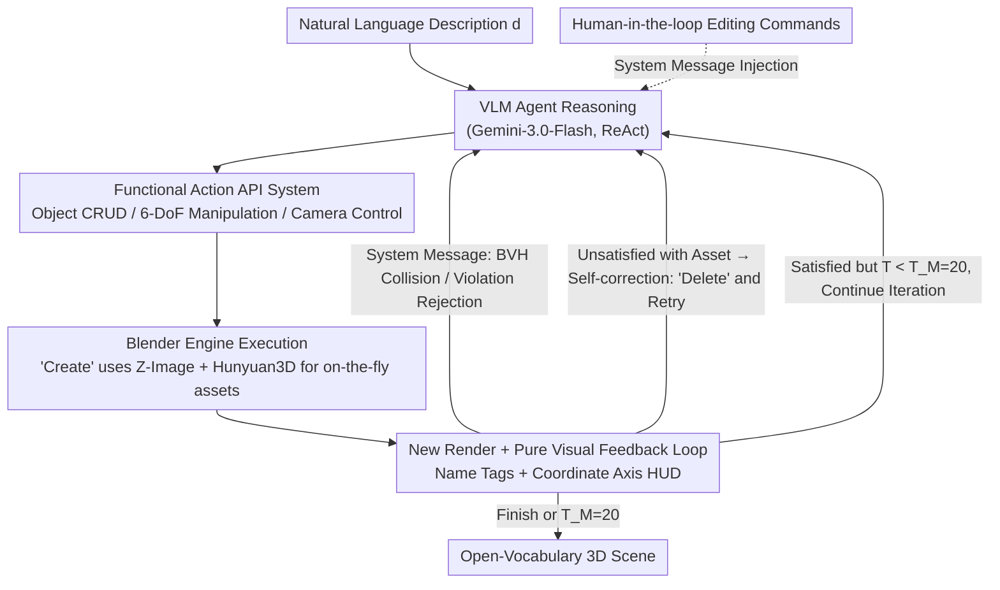

# SceneAssistant: A Visual Feedback Agent for Open-Vocabulary 3D Scene Generation

**Conference**: CVPR 2026  
**arXiv**: [2603.12238](https://arxiv.org/abs/2603.12238)  
**Code**: [github.com/ROUJINN/SceneAssistant](https://github.com/ROUJINN/SceneAssistant)  
**Area**: 3D Vision / LLM Agent  
**Keywords**: 3D Scene Generation, Open-vocabulary, VLM Agent, Visual Feedback, ReAct, Action API

## TL;DR

This paper proposes SceneAssistant, a VLM agentic framework based on pure visual feedback. By designing 14 functional Action APIs, it enables Gemini-3.0-Flash to iteratively generate and optimize open-vocabulary 3D scenes within a ReAct closed loop. This approach eliminates the need for predefined spatial relationship templates or external layout solvers. In human evaluations across 30 scenes, it achieved a Layout score of 7.600 (compared to 5.800 for SceneWeaver) and a Human Preference rate of 65%.

## Background & Motivation

**Background**: Text-to-3D scene generation methods are categorized into three types: (1) Data-driven methods (e.g., 3D-FRONT, ATISS) are limited to specific indoor categories; (2) Procedural methods (e.g., Infinigen, ProcTHOR) require complex scripts or templates; (3) LLM-based methods (e.g., Holodeck, SceneWeaver, LayoutVLM) utilize LLM reasoning to generate spatial constraints, which are then optimized by solvers.

**Limitations of Prior Work**: LLM-based methods rely on predefined spatial relationship primitives (such as "on", "face_to", "in front of"), which are domain-specific (typically for indoor scenes). When user descriptions involve complex spatial configurations outside the predefined vocabulary, the optimization process fails or yields suboptimal layouts. Furthermore, most methods are open-loop, failing to perform corrections based on rendering results after layout generation.

**Key Insight**: Modern VLMs (pre-trained on internet-scale data) possess **latent spatial awareness and planning capabilities**. These capabilities can be stimulated and utilized through carefully designed operation interfaces rather than being replaced by external optimization or predefined templates.

**Key Insight**: Instead of viewing 3D scene generation as a constraint-solving problem, this work simulates the workflow of a human 3D designer: observe $\rightarrow$ reason $\rightarrow$ operate $\rightarrow$ observe $\rightarrow$ iterative refinement. Through a complete Action API, the VLM remains within its "optimal reasoning zone," while a visual feedback loop provides self-correction capabilities.

## Method

### Overall Architecture

The core objective is to bypass the traditional "constraint solving" path. Instead of requiring the LLM to output spatial primitives for a solver, the VLM is treated as a 3D designer capable of using Blender, operating in a loop of "observe render $\rightarrow$ think $\rightarrow$ act $\rightarrow$ observe." Specifically, given a natural language description $d$, the VLM agent (Gemini-3.0-Flash) iterates following the ReAct paradigm. In each step, it receives the current scene render, object metadata, and historical action sequence. After reasoning, it selects a batch of Action APIs to execute. The Blender engine implements these actions and renders a new image, which is sent back. This continues until the agent calls Finish or reaches the maximum steps $T_M = 20$. 3D assets are generated on-the-fly via a pipeline of Z-Image (text-to-image) + Hunyuan3D (image-to-3D mesh). The entire system is training-free, relying on prompt engineering to constrain agent behavior (e.g., $+Z$ as up, incremental construction, mandatory visual verification).

### Key Designs

**1. Functional Action API System: Abstracting Blender Code for High-Level Planning**

A major pain point is that requiring the VLM to write raw Blender Python code introduces high syntactic overhead, diverting the model's attention from spatial planning to syntax correctness. SceneAssistant encapsulates low-level operations into 14 semantically intuitive atomic commands across three categories: **Object Management** (Create transforms descriptions into 3D assets, Duplicate, Delete; created objects default to the scene center for subsequent placement; Delete allows removing unsatisfactory generations); **6-DoF Manipulation** (Place for absolute XYZ positioning, Rotate for XYZ rotation—together covering full 6-DoF, Scale for dimensions, Translate for incremental adjustments); **Camera Control** (ViewScene for panorama presets, FocusOn to center an object, RotateCamera / MoveCamera for arbitrary states). This allows the VLM to issue semantic commands like "translate the sofa 0.5m to the right." Ablations show that replacing these APIs with raw JSON results in a Layout drop of 0.595 and a Human Preference drop of 29pp due to cognitive dispersion.

**2. Pure Visual Feedback Loop: Rendering as the Sole Basis for Decision-making**

Most LLM-based methods are open-loop—they do not revisit the render once the layout is generated, making spatial misalignments irreparable. Here, only the **current** render is fed back (to avoid context overload from historical images), alongside the action history and object coordinates. To bridge the gap between 2D observation and 3D operation, **Visual Augmentation** is applied: object name tags and a coordinate axis HUD are overlaid on the render, informing the agent of object positions and orientations. A **System Message Mechanism** enforces hard constraints—BVH-tree collision detection automatically notifies the agent of intersections, and invalid action sequences are rejected with feedback. Ablations indicate this is the most critical component: removing visual feedback (reverting to one-shot generation) causes Layout to drop by 1.345 and Preference by 38pp.

**3. Self-correction and Quality Control: Using the Loop to Absorb Stochasticity**

Generative models like Hunyuan3D have inherent uncertainty and may produce poor-quality assets. SceneAssistant treats "generation failure" as part of the feedback loop. Upon observing the actual appearance of a new object in the next step, the agent can Delete it and modify the text description to re-Create it. Combined with physical safeguards—automatic ground alignment (lifting objects if $Z < 0$) and continuous collision feedback—the system remains robust against individual generation failures.

### An Integration Example: From a Sentence to a Living Room

Using "a cozy living room with a sofa facing a TV" as an example:

- **Steps 1-2**: The agent calls Create("sofa"); it spawns at the center. Next, the agent views the panorama, confirms the appearance, and uses Place to move it to $(-1.5, 0, 0)$ and Rotate to face $+X$.
- **Steps 3-4**: Create("TV"). Observation reveals the generated mesh is too coarse, looking like a cabinet. The agent Deletes it and re-Creates with the description "a flat-screen TV on a stand."
- **Step 5**: The TV is Placed opposite the sofa at $(1.8, 0, 0.5)$ and rotated. A system message reports a BVH collision with a coffee table; the agent uses Translate to nudge it away.
- **Human-in-the-loop**: After the initial scene is set, a user can inject an edit command, e.g., "place a rug under the sofa." The agent continues to Create/Place until Finish.

### Loss & Training

No training. The system is entirely training-free, driven by prompt engineering that defines operational standards for the VLM agent.

## Key Experimental Results

### Main Results: Human Evaluation (10 evaluators, Scale 1-10)

| Scene Type | Method | Layout Correctness↑ | Object Quality↑ | Human Preference↑ |
|:---|:---|:---:|:---:|:---:|
| Indoor (8 scenes) | Holodeck | 4.475 | 4.763 | 6.25% |
| Indoor (8 scenes) | SceneWeaver | 5.800 | 6.150 | 36.25% |
| Indoor (8 scenes) | **Ours** | **6.888** | **6.950** | **61.25%** |
| Open-vocab (22 scenes) | NoActionAPI | 7.005 | 6.591 | 35.91% |
| Open-vocab (22 scenes) | NoVisFeedback | 6.255 | 5.673 | 26.82% |
| Open-vocab (22 scenes) | **Ours** | **7.600** | **7.277** | **65.00%** |

### Ablation Study

| Ablation Variant | Layout↑ | Obj Quality↑ | Pref↑ | Gain vs. Full |
|:---|:---:|:---:|:---:|:---|
| **SceneAssistant (Full)** | **7.600** | **7.277** | **65.00%** | — |
| NoActionAPI (JSON output) | 7.005 | 6.591 | 35.91% | Layout -0.595, Pref -29pp |
| NoVisFeedback (one-shot) | 6.255 | 5.673 | 26.82% | Layout -1.345, Pref -38pp |
| NoVisualPrompt (No labels/HUD) | — | — | — | Layout chaos, localization failure |
| NoCollisionCheck (No feedback) | — | — | — | Unresolved physical penetrations |

### Key Findings

- **Visual feedback is the most critical component**: Its removal led to the largest Layout drop (1.345), as one-shot methods cannot perceive or correct spatial misalignments.
- **Action APIs significantly reduce cognitive load**: Despite having visual feedback, the difference between API and JSON shows a 29pp Preference gap. JSON forces the agent to manage low-level data structures, distracting from reasoning.
- **Holodeck's limitation**: It achieved only 6.25% Preference in indoor scenes, highlighting the constraints of predefined spatial relations and the Unity pipeline.
- **Open-vocabulary Advantage**: Ours performed even better in non-indoor scenes (Layout 7.600).
- **Collision Feedback**: Essential for physical plausibility; visual feedback alone is insufficient to implicitly infer penetration issues.

## Highlights & Insights

- **Sophisticated API Abstraction**: The level of abstraction is neither too low (Blender code) nor too high (predefined relations), fitting perfectly within the VLM's "reasoning sweet spot."
- **Pure Visual Feedback Paradigm**: It bypasses structured intermediate representations like scene graphs or hypergraphs, directly leveraging VLM visual understanding for a more universal approach.
- **Modular Architecture**: New APIs (e.g., GenerateFloorTexture) can be added without modifying the core framework.
- **Pragmatic Human-AI Design**: It acknowledges VLM limitations and allows human feedback to bridge the final gap in complex scenarios.

## Limitations & Future Work

- Evaluation is based solely on human evaluation (30 scenes × 10 evaluators) and lacks reproducible automated metrics.
- Performance is capped by the capabilities of the VLM (Gemini-3.0-Flash) and the 3D generator (Hunyuan3D).
- Maximum 20-step limit may be insufficient for highly complex scenes.
- Direct comparison with SceneWeaver on open-vocabulary scenes was not possible (as SceneWeaver does not support them).
- The token cost of API calls has not been analyzed for economic viability.

## Related Work & Insights

- **vs. Holodeck**: Predefined spatial relations + physical solvers $\rightarrow$ restricted to indoor domains.
- **vs. SceneWeaver**: Reflective agent but still dependent on predefined primitives + hybrid interfaces.
- **vs. SceneCraft/3D-GPT**: Direct Blender code generation $\rightarrow$ frequent syntax errors and distracted reasoning.
- **Insight**: The API abstraction paradigm for VLM-as-Agent is valuable for any system requiring VLM-tool interaction. The observation that "VLMs have latent spatial capabilities; the key is how to stimulate them" warrants deeper research.

## Rating

⭐⭐⭐⭐ (4/5)

**Overall Evaluation**: The paper presents an elegant agentic framework based on pure visual feedback with well-designed Action APIs. The open-vocabulary capability is a strong differentiator. The main drawbacks are the limited scale of evaluation and the fact that the contribution lies more in system/engineering design rather than fundamental algorithmic innovation. However, as a systemic work, it provides a clear advancement for the 3D scene generation field.

<!-- RELATED:START -->

## Related Papers

- [\[CVPR 2026\] REALM: An MLLM-Agent Framework for Open World 3D Reasoning Segmentation and Editing on Gaussian Splatting](realm_mllm_agent_3d_reasoning_gaussian.md)
- [\[CVPR 2026\] Seeing as Experts Do: A Knowledge-Augmented Agent for Open-Set Fine-Grained Visual Understanding](seeing_as_experts_do_a_knowledge-augmented_agent_for_open-set_fine-grained_visua.md)
- [\[CVPR 2026\] Vinedresser3D: Towards Agentic Text-guided 3D Editing](vinedresser3d_towards_agentic_text-guided_3d_editing.md)
- [\[CVPR 2026\] Learning to Select Visual Tools from Experience](learning_to_select_visual_tools_from_experience.md)
- [\[CVPR 2026\] NitroGen: An Open Foundation Model for Generalist Gaming Agents](nitrogen_an_open_foundation_model_for_generalist_gaming_agents.md)

<!-- RELATED:END -->
