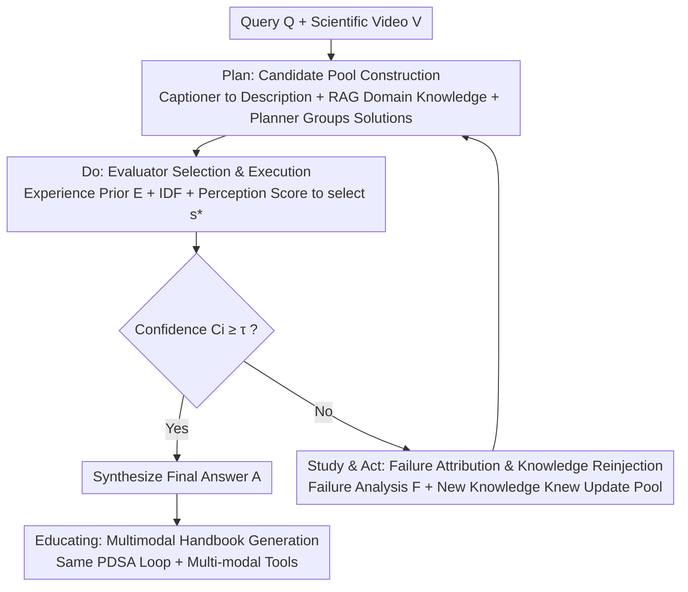

# SciEducator: Scientific Video Understanding and Educating via Deming-Cycle Multi-Agent System

**Conference**: CVPR 2026  
**Paper**: [CVF Open Access](https://openaccess.thecvf.com/content/CVPR2026/html/Xu_SciEducator_Scientific_Video_Understanding_and_Educating_via_Deming-Cycle_Multi-Agent_System_CVPR_2026_paper.html)  
**Code**: To be confirmed (Paper states it will be open-sourced)  
**Area**: Agent / Video Understanding / Multimodal VLM  
**Keywords**: Multi-Agent System, Scientific Video Understanding, Deming Cycle (PDSA), Self-Evolving Workflow, Science Education Content Generation

## TL;DR
SciEducator transforms the Deming Cycle (Plan–Do–Study–Act) from management science into a self-evolving multi-agent closed loop. By iteratively performing "planning–execution–review–improvement," the system understands scientific experiment videos and generates multi-modal educational handbooks for children. On the self-constructed SciVBench, it significantly outperforms closed-source MLLMs like GPT-4o and Gemini, as well as existing video agents.

## Background & Motivation
**Background**: General Multimodal Large Language Models (MLLMs) and video agent systems can effectively perform perception, understanding, and QA for daily videos by combining visual encoders, LLMs, and temporal modeling.

**Limitations of Prior Work**: Existing methods struggle in "scientific video understanding" scenarios, which require **external professional knowledge** and **rigorous step-by-step reasoning**. Pure MLLMs lack the ability to call external tools and integrate resources effectively, leading to hallucinations and unstable performance. Current agent systems often fail to provide feasible initial plans for scientific tasks and **lack a systematic mechanism for self-evolution and workflow optimization based on prior execution results**—failures cannot be learned from.

**Key Challenge**: The essence of scientific video understanding is "high certainty + multi-step reasoning," whereas one-time LLM planning is "low certainty + prone to deviation." If a plan is executed to the end without adjustment, any step's deviation is amplified. Rectifying this requires a feedback loop capable of perceiving "performance quality" and re-planning accordingly.

**Goal**: To build a multi-agent system that can both understand complex scientific experiment videos and transform the results into reproducible educational materials, while self-correcting through multiple iterations.

**Key Insight**: The authors draw inspiration from the **Deming Cycle (PDSA)** in management—a closed-loop philosophy designed for "continuous quality improvement," which naturally fits the need for "approaching high-confidence answers through trial and error."

**Core Idea**: Rewrite the "Plan–Do–Study–Act" of PDSA into a multi-agent self-evolving reasoning and feedback mechanism. The loop is driven by confidence, using failure attribution and new knowledge to continuously update the candidate solution pool.

## Method

### Overall Architecture
The system $S$ receives a user query $Q$ and a scientific video $V$, aiming to provide a self-consistent answer $A=S(Q,V;P,E,T)$, where the planner $P$ and evaluator $E$ are the protagonists of the PDSA cycle, and $T$ is a set of tools/agents dynamically configured by stage. The system comprises 16 specialized components (10 agents + 6 tools), categorized into "Dynamic Invocation" (task planning, content acquisition, web/literature retrieval, etc.) and "Fixed Execution" (knowledge base maintenance, multi-modal synthesis, handbook generation).

The workflow consists of two major stages. The **Understanding Stage** runs a PDSA closed loop: In the Plan stage, a captioner converts the video (sampled at 1 fps) into temporal descriptions $V_{content}$, and a retrieval-augmented agent extracts entity keywords from internal corpora to retrieve domain knowledge $K$. The planner then generates a **candidate solution pool** $M_i$. In the Do stage, an evaluator scores each solution, selects the optimal $s^*$ for execution to obtain result $R_i$, and estimates confidence $C_i$. If $C_i$ is high enough, the answer is synthesized; otherwise, the system enters the Study stage for failure attribution $F_i$ and knowledge replenishment, followed by the Act stage to rebuild the solution pool $M_{i+1}$, cycling until $C_i \ge \tau$ or the maximum number of rounds is reached. The **Educating Stage** reuses the same PDSA loop (with different tools and no video input) to transform the understood scientific phenomena into children-friendly multi-modal electronic handbooks.

### Key Designs

**1. PDSA Self-Evolving Loop: Replacing "Single-Shot Planning" with "Confidence-Driven Iterative Correction"**

To address the issue where LLM plans easily deviate and cannot learn from errors, the authors instantiate the Deming Cycle as a closed-loop controller. In the Do stage of each round, after obtaining $R_i$, the planner estimates confidence $C_i=P(R_i,Q,V)$ based on the query, video context, and executed plan. This represents whether "current evidence is sufficient for a convincing answer." If $C_i$ is high, the loop terminates; otherwise, it proceeds to Study/Act. This mechanism shifts the decision to "think for another round" to the system itself rather than a fixed $N$ steps—stopping early for easy questions and iterating for complex ones. Ablations show that as the maximum rounds increase from 1 to 5, relevance and accuracy across physics/chemistry/daily tasks rise monotonically, proving that iterations accumulate understanding.

**2. Candidate Pool + Evaluator Selection: Using "Experience Prior + IDF + Perception Score" to Pick the Most Cost-Effective Solution**

To tackle the unfeasibility of initial plans for scientific tasks, the planner generates a **solution pool** $M_i$. An evaluator then selects the best solution based on time/token efficiency, success probability, feasibility, and overall performance. The scoring consists of two parts: objective items $A_{obj}$ rely on an experience prior $E$ (derived from 20 random probe calls per tool/agent to collect average latency, token usage, and success rate), plus IDF to measure the discriminative power of keywords—$\text{IDF}(k)=\log\!\big(N/(f(k)+1)\big)$, where $N$ is the corpus size and $f(k)$ is the document frequency; subjective items $A_{percep}$ are assessed by an LLM based on coverage, logic, scientific rigor, and clarity. Finally, $s^*=\arg\max_{s\in M_i}\big(A_{obj}(s;E,\text{IDF})+\lambda A_{percep}(s)\big)$. Ablation (Tab. 4) shows that removing $E$, IDF, or $A_{percep}$ leads to increased time, tokens, and rounds while decreasing accuracy.

**3. Study & Act Failure Attribution and Knowledge Reinjection: Learning from Failures for Re-planning**

When confidence is insufficient, the system enters the Study stage: the planner diagnoses why the current round failed (e.g., tool failure, broad/irrelevant retrieval, insufficient video detail), producing analysis $F_i$ and merging useful evidence into the knowledge base: $F_i,K_{i+1}=P(R_i,K_i,Q,V,T_{Study})$, where $K_{i+1}=K_i\cup K_{new}$. Subsequently, the Act stage rebuilds the next solution pool $M_{i+1}=\Gamma_{Act}(F_i,K_{i+1},M_i)$. Specific actions include super-resolution for blurry frames, increasing captioning frame rates for missed actions, or refining queries with specific entities. Domain knowledge $K$ is retrieved once in the first round and then updated incrementally. Ablation (Tab. 5) shows that removing both $K_{new}$ and $F$ drops physics accuracy from 65.31 to 45.94, proving review and knowledge replenishment are core to pool quality.

**4. Multimodal Educational Handbook Generation: Extending "Understanding" to "Teaching"**

After identifying scientific principles, the Educating stage triggers a multi-modal retrieval-generation pipeline to produce children-oriented handbooks containing: experiment guidance, equipment lists with purchase links, illustrated step-by-step processes, safety notices with audio prompts, and principle summaries. Using the same PDSA loop (where input is just the query and confidence is based on relevance/quality/attractiveness/educational value), an entity recognition agent extracts keys, while specialized agents retrieve steps, safety warnings, and equipment images. Image and speech synthesis tools generate visuals and audio, and a final agent integrates all elements into a polished handbook.

## Key Experimental Results

### Main Results
Benchmark **SciVBench**: 54 physics, 54 chemistry, and 103 daily phenomenon videos collected from platforms, with 500 expert-verified scientific QA pairs (160/148/192 respectively). Inputs use video only (no subtitles/audio) to ensure answers derive from visual understanding. Understanding is measured by **Rel (Relevance)** and **Acc (Accuracy)**, averaged from Qwen3-Max scores (0/0.5/1).

| Model | Phys Rel | Phys Acc | Chem Rel | Chem Acc | Daily Rel | Daily Acc |
|------|------|------|------|------|------|------|
| GPT-4o (Closed API) | 47.50 | 34.69 | 39.86 | 31.42 | 30.73 | 27.86 |
| Gemini 2.0 Flash (Closed API) | 52.81 | 38.75 | 46.96 | 36.15 | 34.64 | 31.25 |
| Claude 3.7 Sonnet (Closed API) | 44.06 | 31.88 | 40.20 | 31.76 | 31.77 | 28.65 |
| VideoAgent (MAS) | 49.06 | 36.56 | 45.61 | 34.80 | 30.47 | 27.34 |
| videoagent (MAS) | 46.25 | 35.31 | 46.62 | 37.16 | 31.51 | 28.13 |
| **Ours (SciEducator)** | **81.88** | **65.31** | **73.97** | **64.86** | **64.58** | **62.24** |

SciEducator leads across all categories, with Accuracy ~26–30 percentage points higher than the strongest baseline. The Educating side (Tab. 2) uses **win rate (%)** across Relevance, **IQ (Instructional Quality)**, Attractiveness, and **EV (Educational Value)**.

| Model | Relevance | IQ | Attractiveness | EV |
|------|------|------|------|------|
| Gemini 2.0 Flash | 10.00 | 2.50 | 0.00 | 5.00 |
| GPT-4o | 7.50 | 5.00 | 2.50 | 7.50 |
| Claude 3.7 Sonnet | 5.00 | 5.00 | 0.00 | 5.00 |
| **Ours (SciEducator)** | **77.50** | **87.50** | **97.50** | **82.50** |

### Ablation Study
Evaluator component ablation (Tab. 4, time/token normalized to 1.00; max 5 rounds):

| Configuration | Time↓ | Token↓ | Avg Rounds↓ | Acc↑ |
|------|------|------|------|------|
| EA w/o E (No Prior) | 1.20 | 1.18 | 4.09 | 57.50 |
| EA w/o IDF | 1.08 | 1.06 | 3.99 | 59.90 |
| EA w/o $A_{percep}$ | 1.14 | 1.13 | 4.17 | 54.50 |
| **EA (Full)** | **1.00** | **1.00** | **3.79** | **64.00** |

Study stage $K_{new}$ and failure analysis $F$ ablation (Tab. 5):

| Configuration | Phys Rel | Phys Acc | Chem Rel | Chem Acc | Daily Rel | Daily Acc |
|------|------|------|------|------|------|------|
| w/o $K_{new}$ & $F$ | 59.69 | 45.94 | 53.04 | 45.27 | 35.94 | 32.55 |
| w/o $K_{new}$ | 65.94 | 50.94 | 61.82 | 54.05 | 38.28 | 34.64 |
| w/o $F$ | 71.56 | 55.63 | 66.55 | 57.09 | 48.95 | 45.83 |
| **Full** | **81.88** | **65.31** | **73.97** | **64.86** | **64.58** | **62.24** |

### Key Findings
- **PDSA iteration is the primary contributor**: Increasing max rounds from 1 to 5 monotonically improves Rel/Acc. For education, win rate on IQ rose from 0 to 92.50, proving the cycle effectively accumulates understanding.
- **Failure analysis $F$ is more critical than $K_{new}$**: Removing both drops physics Acc to 45.94. Removing $K_{new}$ only yields 50.94, while removing $F$ only yields 55.63—indicating that "attributing why it was wrong" is the most valuable step for rebuilding the pool.
- **Evaluator components share the workload**: Removing the experience prior $E$ increases average rounds and drops accuracy, showing that prior cost estimation helps the system avoid inefficient paths.

## Highlights & Insights
- **Interdisciplinary leverage**: Adapting the management Deming Cycle into a "self-evolving engine" for MAS is a novel and transferable approach for tasks requiring iterative correction.
- **Confidence-driven adaptive budget**: Using $C_i$ to determine loop termination allows the system to dynamically allocate "compute" based on difficulty—saving resources on easy tasks and iterating on hard ones.
- **"Understand to Teach" loop**: Most video understanding work ends at QA. This paper reuses the PDSA loop for educational content generation, demonstrating a high-value downstream application.
- **Transferable Trick**: Building an experience prior $E$ via random probe calls (latency/token/success) is a lightweight method for "tool profiling" applicable to any MAS framework requiring cost-effective selection.

## Limitations & Future Work
- **Reliance on LLM judges**: Metrics like Rel/Acc/Win Rate depend on models like Qwen3-Max, which may introduce bias.
- **Benchmark scale**: SciVBench is relatively small (211 videos, 500 QA).
- **Efficiency overhead**: Multi-agent orchestration and multi-round PDSA imply significant time and token costs compared to single MLLM calls.
- **Future directions**: Integrating multi-model voting or human verification, expanding benchmark coverage, and performing logic/weight sensitivity analyses.

## Related Work & Insights
- **vs. General MLLMs**: They lack external tool integration and step-by-step correction. Ours uses a closed loop to incorporate knowledge and reviews, achieving 26–30% higher accuracy.
- **vs. Existing VideoAgents**: Current MAS often use linear pipelines or one-time planning. Ours excels by introducing failure attribution and knowledge back-injection in the Study/Act stages.
- **vs. Auto-coding/Task Agents**: While those show potential, they suffer from hallucinations. SciEducator's contribution is a **systematic self-optimization mechanism** that explicitly encodes "continuous improvement" into the workflow.

## Rating
- Novelty: ⭐⭐⭐⭐⭐ PDSA × MAS self-evolution is a unique interdisciplinary entry point.
- Experimental Thoroughness: ⭐⭐⭐⭐ Strong main experiments and ablations, though the benchmark scale is modest and relies on LLM judging.
- Writing Quality: ⭐⭐⭐⭐ Clear methodology and PDSA mapping; solid formalization.
- Value: ⭐⭐⭐⭐ Scientific understanding + education is a meaningful direction with a highly transferable self-evolution design.

<!-- RELATED:START -->

## Related Papers

- [\[CVPR 2026\] Symphony: A Cognitively-Inspired Multi-Agent System for Long-Video Understanding](symphony_a_cognitively-inspired_multi-agent_system_for_long-video_understanding.md)
- [\[CVPR 2026\] Think, Then Verify: A Hypothesis-Verification Multi-Agent Framework for Long Video Understanding](think_then_verify_a_hypothesis-verification_multi-agent_framework_for_long_video.md)
- [\[CVPR 2026\] Refer-Agent: A Collaborative Multi-Agent System with Reasoning and Reflection for Referring Video Object Segmentation](refer-agent_a_collaborative_multi-agent_system_with_reasoning_and_reflection_for.md)
- [\[CVPR 2026\] HAVEN: Hierarchical Long Video Understanding with Audiovisual Entity Cohesion and Agentic Search](haven_hierarchical_long_video_understanding_with_audiovisual_entity_cohesion.md)
- [\[CVPR 2026\] Paper2Figure: A Multi-Agent Collaborative System for Figure Generation Towards Academic Research Paper](paper2figure_a_multi-agent_collaborative_system_for_figure_generation_towards_ac.md)

<!-- RELATED:END -->
