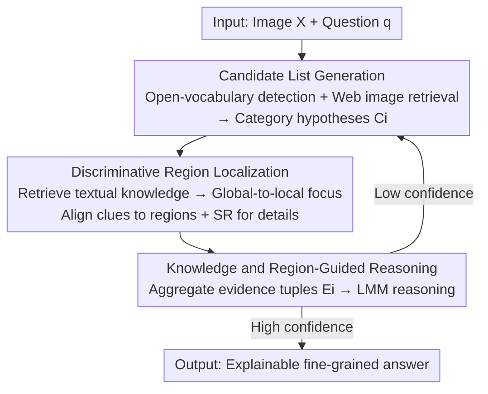

# Seeing as Experts Do: A Knowledge-Augmented Agent for Open-Set Fine-Grained Visual Understanding

**Conference**: CVPR 2026  
**Paper**: [CVF Open Access](https://openaccess.thecvf.com/content/CVPR2026/html/Chen_Seeing_as_Experts_Do_A_Knowledge-Augmented_Agent_for_Open-Set_Fine-Grained_CVPR_2026_paper.html)  
**Code**: None  
**Area**: Agent / Multimodal VLM  
**Keywords**: Fine-grained visual understanding, Knowledge-augmented Agent, Retrieval-grounding coupling, Open-set reasoning, FGExpertBench

## TL;DR
This paper redefines fine-grained visual understanding from "assigning a label" to "reasoning with evidence like an expert," proposing KFRA, a three-stage closed-loop Agent. It first retrieves candidate hypotheses, then grounds the retrieved textual knowledge to discriminative image regions, and finally enables the Large Multimodal Model (LMM) to reason and self-correct based on multimodal evidence. On the self-constructed FGExpertBench, KFRA achieves up to a 19% improvement over base models.

## Background & Motivation

**Background**: Fine-grained visual understanding (distinguishing similar bird species, car models, dog breeds, etc.) has long been treated as a "closed-set classification" problem—using local part detection or attention aggregation within a fixed taxonomy to compress a complex instance into a single category token. Even with the recent introduction of Large Multimodal Models (LMMs) and Retrieval-Augmented Generation (RAG), the optimization objective remains unchanged: predicting a single label from a fixed category list.

**Limitations of Prior Work**: Compressing an instance into a classification token is equivalent to collapsing expert knowledge into a flat decision boundary, making models powerless against unseen subcategories, abnormal states, or context-related questions. The paper cites that existing fine-grained models suffer a 30–40% drop in accuracy when encountering unseen species or domains. Although LMMs allow open-vocabulary recognition, their predictions are "pattern matching" rather than "evidence-based reasoning," which is prone to hallucinations.

**Key Challenge**: Recognition $\neq$ Reasoning. When experts face unfamiliar instances, they do not rely on memory to report answers directly. Instead, they **hypothesize candidate categories $\rightarrow$ retrieve references $\rightarrow$ focus on discriminative features $\rightarrow$ verify hypotheses with factual knowledge**, forming an "evidence chain" that connects perception with external knowledge. Existing Agents treat retrieval and reasoning as two loosely coupled independent steps, where retrieved knowledge is passively fed into the context without ever grounding to specific visual evidence, thus failing to replicate this evidence chain.

**Goal**: To enable machines to replicate the expert's "observation–hypothesis–verification" loop, transforming fine-grained understanding from label prediction to **evidence-driven open-set reasoning**. The framework aims to be task-agnostic (covering identification, attributes, actions, counting, causality, and knowledge inference) without requiring task-specific retraining.

**Core Idea**: Establish **retrieval–grounding coupling**, where retrieved textual knowledge is not just auxiliary context but an **executable signal** that actively guides spatial grounding and hypothesis verification; transforming the LMM from a passive label predictor into an active "evidence builder."

## Method

### Overall Architecture

KFRA (Knowledge-Augmented Fine-Grained Reasoning Agent) is an Agent coordinated by a Large Multimodal Controller (Qwen3-A3B in the implementation) that manages a set of specialized perception/reasoning tools. Given an image $X$ and a natural language question $q$, it executes a **three-stage closed-loop reasoning cycle**, with each stage refining and verifying the results of the previous one:

1. **Candidate List Generation**: Open-vocabulary detection identifies entities in the image, followed by web-level image retrieval to assemble a set of candidate category hypotheses (with confidence scores) for each entity.
2. **Discriminative Region Localization**: For each candidate hypothesis, its textual knowledge (e.g., "red beak," "striped wings") is retrieved, and a global-to-local focusing mechanism aligns these textual clues to specific image regions; super-resolution enhancement is invoked if details are missing.
3. **Knowledge and Region-Guided Reasoning**: Hypotheses, textual knowledge, and grounded visual masks are packed into evidence tuples and fed to the LMM for cross-object reasoning to produce an answer. If the answer confidence is low, the controller re-invokes previous stages to refine the hypotheses or localization, forming a self-correction loop.

To evaluate this capability, the paper introduces **FGExpertBench** (300 images / 1500 QA, covering six reasoning dimensions, semi-automatically generated by GPT-4o and verified by domain experts), which is more comprehensive than existing benchmarks like FOCI-Bench, FG-BMK, or KVG-Bench (see Table 1).

### Key Designs

**1. Candidate List Generation: Replacing Closed Classification with Retrieval-Augmented Open Hypothesis Space**

To address the issue that a "closed taxonomy cannot accommodate unseen categories," this stage does not produce a final answer but **constructs an open-set hypothesis space**. First, an open-vocabulary detector $\mathcal{F}_{det}$ (Grounding-DINO) segments the image into entity regions $\{x_i\}_{i=1}^N = \mathcal{F}_{det}(X)$. Then, for each $x_i$, an image retriever $\mathcal{S}_{img}$ (Google Lens) searches the web for visually similar samples and their textual descriptions $\mathcal{R}^{\text{img}}_i = \{(I_{ij}, T_{ij})\}_{j=1}^{M}$. Finally, the LMM merges the retrieval results with $q$ to output a ranked list of candidate categories with confidence scores $C_i = \{(c, p_i(c)) \mid c \in \mathcal{Y}_i\}$, where $\mathcal{Y}_i$ is an open label space **inferred** from the retrieval content rather than a predefined list. This allows unseen species to enter the candidates without dataset-specific supervision.

**2. Discriminative Region Localization: Grounding Retrieved Knowledge to Pixels (Core of Retrieval–Grounding Coupling)**

This is the key distinction from standard retrieval Agents. While typical Agents simply feed retrieved knowledge to the LMM, KFRA grounds each textual clue to a specific region for verification. Specifically, for each candidate $c$, a text retriever $\mathcal{S}_{tex}$ (Wikipedia) fetches relevant factual descriptions $\mathcal{K}_{i,c} = \mathcal{S}_{tex}(c)$, which are parsed into structured discriminative clues $\mathcal{A}_{i,c} = \{a^{(k)}_{i,c}\}_{k=1}^{m_{i,c}}$ (e.g., specific body parts or unique colors). A global-to-local focusing module $\mathcal{F}_{foc}$ (based on VisionReasoner) then aligns each clue to the region, producing attention masks and alignment confidence $(\mathcal{M}^{(k)}_{i,c}, s^{(k)}_{i,c}) = \mathcal{F}_{foc}(x_i, a^{(k)}_{i,c})$, where $\mathcal{M}^{(k)}_{i,c} \in [0,1]^{h\times w}$. This process consists of two stages: a global stage using CLIP-style semantic similarity for coarse localization, and a local stage using patch-level attention to refine boundaries.

If the alignment confidence of the best clue is low ($\max_k s^{(k)}_{i,c} < \tau$), an OseDiff super-resolution enhancer $\mathcal{F}_{sr}$ reconstructs high-frequency details in the most credible region:

$$\tilde{x}_i = \mathcal{F}_{sr}(x_i \odot \mathcal{M}^{(k^\star)}_{i,c}), \quad k^\star = \arg\max_k s^{(k)}_{i,c}$$

The enhanced patch is then re-sent to $\mathcal{F}_{foc}$. This stage is **bidirectional**: textual knowledge guides attention localization, and visual evidence iteratively refines the retrieved clues, forming a loop between semantics and perception.

**3. Knowledge and Region-Guided Reasoning: Multimodal Evidence Aggregation + Self-Correction Loop**

The final stage bundles all information into evidence tuples $E_i = \{(c, p_i(c), \mathcal{K}_{i,c}, \mathcal{A}_{i,c}, \mathcal{M}_{i,c}) \mid c \in C_i\}$. The LMM then reasons under all evidence conditions: $P(y|X,q) = \mathcal{F}_{lmm}(X, q, \{E_i\}_{i=1}^N)$, with $\hat{y} = \arg\max_y P(y|X,q)$. Crucially, if the confidence of $\hat{y}$ is low, the controller **recursively invokes previous stages** to refine hypotheses or localization. Because the answer is based on a traceable evidence chain rather than one-shot pattern matching, KFRA's conclusions are both factual and explainable.

### Example: Which bird is male?

The input shows two woodpeckers with the question "Which is male?". Stage 1 detects two entities, Bird A and Bird B. Web retrieval yields candidates [Red-cockaded Woodpecker, Nuttall's Woodpecker] for Bird A and [Downy, Red-cockaded] for Bird B. Stage 2 retrieves discriminative knowledge for Red-cockaded: "black cap and nape + large white cheek patch + male-exclusive red cockade," grounding clues like "head/back/belly" to regions. Simultaneously, it retrieves that "males have small red streaks on the sides of the black cap." Stage 3 aggregates evidence: Bird A shows a faint red streak, leading to the reasoning "the top one is male." Every step is supported by visible evidence, whereas a standalone LMM might answer "cannot determine gender."

## Key Experimental Results

### Main Results (FGExpertBench, Accuracy % across 6 dimensions)

KFRA achieves SOTA across all reasoning dimensions. When based on GLM-4.5V, it reaches an average of 74.81%, surpassing the strongest commercial model, Gemini-2.5-Flash (69.98%), by 4.83 points. When based on Qwen2.5-VL, it shows a net gain of 19.14 points over the base model. Agent baselines (VSA / MMSearch) only achieve 39.24% / 36.81%, largely because their retrieval lacks fine-grained category alignment and evidence grounding.

| Model | Obj. | Attr. | Act. | Cnt. | Rsn. | Know. | Average |
|------|------|-------|------|------|------|-------|---------|
| GPT-4o | 66.50 | 65.31 | 67.35 | 61.33 | 68.46 | 61.19 | 65.03 |
| Gemini-2.5-Flash | 68.96 | 69.39 | 71.43 | 69.33 | 68.67 | 72.12 | **69.98** |
| VSA (Agent) | 31.68 | 44.90 | 51.02 | 31.33 | 38.67 | 37.81 | 39.24 |
| MMSearch (Agent) | 27.09 | 39.80 | 38.78 | 26.00 | 48.00 | 41.65 | 36.81 |
| Qwen2.5-VL-7B (Base) | 33.50 | 42.86 | 63.27 | 46.67 | 34.00 | 41.53 | 48.64 |
| **KFRA (Qwen2.5-VL-7B)** | 68.47 | 64.29 | 75.51 | 68.00 | 64.67 | 65.76 | 67.78 |
| **KFRA (GLM-4.5V-12B)** | 74.88 | 74.49 | 77.55 | 71.33 | 75.33 | 75.29 | **74.81** |

On six traditional fine-grained classification (FGIC) datasets, KFRA is equally competitive, with the GLM-4.5V version averaging 90.24%. Even the lighter Qwen2.5-VL-7B reaches 85.10%, a 23.61 point increase over the base model.

### Ablation Study (FGExpertBench, Qwen2.5-VL-7B Base, Baseline 48.64%)

Ablation by incremental tool addition. Abbreviations: KR=Knowledge Reference (Wikipedia), VS=Visual Search (Google Lens), OD=Open-vocabulary Detection (Grounding-DINO), GF=Global-to-local Focusing, SR=Super-resolution (OseDiff).

| Configuration | Acc. % | Gain | Description |
|------|--------|---------|------|
| Base standalone | 48.64 | — | No tools |
| Perception only (VS+OD+GF+SR) | 49.56 | +0.92 | Low gain without factual grounding |
| Introducing KR | 50.21 | +1.57 | External knowledge begins to help |
| Incremental components | 52.83 / 57.15 / 63.42 | +4.19+ | Steady increase with more tools |
| Full | **67.78** | **+19.14** | Complete closed loop |

### Key Findings
- **KR (External Knowledge) is most critical**: Using only perception modules yields minimal gains, confirming that "seeing finer" is insufficient without factual knowledge grounding to drive reasoning.
- VS/OD ensure reliable hypotheses, while GF/SR handle spatial alignment and verification. Their **synergy** is required to form the loop.
- KFRA shows the most significant advantage in **Reasoning and Knowledge** categories, which demand explicit evidence construction.
- "Fine-Grained Anything" extension: Combining LMM tags with KFRA can turn a general open-vocabulary detector into a fine-grained expert (e.g., refining "Dog" into "Labrador Retriever").

## Highlights & Insights
- **Retrieval–grounding coupling is the true differentiator**: Unlike other Agents that leave knowledge at the text level, KFRA forces each textual clue to be grounded to a pixel mask for verification. This approach is transferable to any task requiring "checking image details against external knowledge" (e.g., medical imaging, defect detection).
- **Confidence-triggered adaptive mechanisms**: Leveraging confidence scores to decide when to invoke super-resolution or restart the reasoning cycle is an efficient way to allocate compute.
- **Task-agnostic and zero-training**: By abstracting task differences into a unified "evidence construction" process, the framework covers various tasks without needing retraining.

## Limitations & Future Work
- The framework relies on external APIs (Google Lens, Wikipedia), introducing latency and potential retrieval errors. The multi-step design increases computational overhead compared to single-forward models.
- The pipeline is heavily dependent on the first-stage retrieval recall—if the correct category is not retrieved, subsequent grounding and reasoning cannot correct the omission.
- Future improvements could involve integrating retrieval recall into end-to-end optimization or adding a decision step to determine if re-retrieval is necessary.

## Related Work & Insights
- **vs. Traditional Fine-Grained Models**: Conventional models suffer 30–40% drops on unseen classes; KFRA uses retrieval to construct an open hypothesis space, handling unseen subcategories effectively.
- **vs. Monolithic LMMs**: LMMs are "pattern-based" passive recognizers prone to hallucination; KFRA uses them as active reasoning engines with evidence verification.
- **vs. General Knowledge Agents**: Standard Agents treat retrieval and reasoning as independent; KFRA's retrieval–grounding coupling significantly outperforms them (67.78% vs. ~37–39% on FGExpertBench).

## Rating
- Novelty: ⭐⭐⭐⭐ The retrieval-grounding coupling is a substantial improvement over loosely coupled Agents, though components are existing tools.
- Experimental Thoroughness: ⭐⭐⭐⭐ Comprehensive evaluation across benchmarks and datasets, though sensitivity analysis for confidence thresholds is missing.
- Writing Quality: ⭐⭐⭐⭐ Clear narrative with well-aligned stages and formulas.
- Value: ⭐⭐⭐⭐ Significant plug-and-play improvements with an open-source benchmark provide practical value for fine-grained reasoning.

<!-- RELATED:START -->

## Related Papers

- [\[CVPR 2026\] SceneAssistant: A Visual Feedback Agent for Open-Vocabulary 3D Scene Generation](sceneassistant_a_visual_feedback_agent_for_openvoc.md)
- [\[ACL 2026\] MOOSE-Copilot: A Web-Based Interactive Assistant for Unified Exploratory and Fine-Grained Scientific Hypothesis Discovery](../../ACL2026/llm_agent/moose-copilot_a_web-based_interactive_assistant_for_unified_exploratory_and_fine.md)
- [\[ECCV 2024\] VideoAgent: A Memory-augmented Multimodal Agent for Video Understanding](../../ECCV2024/llm_agent/videoagent_a_memory-augmented_multimodal_agent_for_video_understanding.md)
- [\[CVPR 2026\] Simple Agents Outperform Experts in Biomedical Imaging Workflow Optimization](simple_agents_outperform_experts_in_biomedical_imaging_workflow_optimization.md)
- [\[CVPR 2026\] CGL: Advancing Continual GUI Learning via Reinforcement Fine-Tuning](cgl_advancing_continual_gui_learning_via_reinforcement_fine-tuning.md)

<!-- RELATED:END -->
