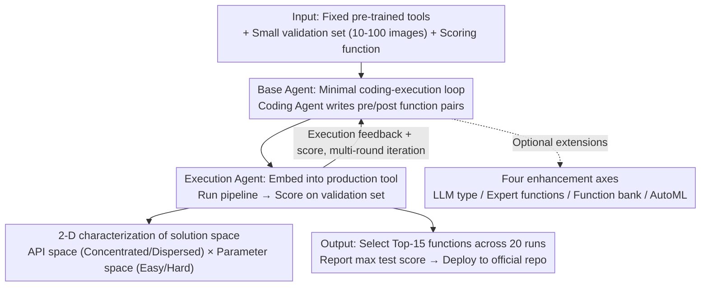

# Simple Agents Outperform Experts in Biomedical Imaging Workflow Optimization

**Conference**: CVPR 2026  
**Paper**: [CVF Open Access](https://openaccess.thecvf.com/content/CVPR2026/html/Wang_Simple_Agents_Outperform_Experts_in_Biomedical_Imaging_Workflow_Optimization_CVPR_2026_paper.html)  
**Code**: https://xuefei-wang.github.io/simpleagent-opt (Project page, framework open-sourced)  
**Area**: LLM Agent  
**Keywords**: Code Optimization Agents, Tool Adaptation, Biomedical Imaging, Agent Design Space, AutoML

## TL;DR
Addressing the "last mile" adaptation challenge of scientific tools, this paper utilizes a minimal "coding-execution" closed-loop agent. Using only a few dozen validation images, it automatically generates pre/post-processing code. Across three production-grade biomedical imaging pipelines (Polaris/Cellpose/MedSAM), it consistently outperforms expert-tuned code that originally took weeks or months to develop. The study systematically proves that complex components like tree search, function libraries, and AutoML are not universally beneficial.

## Background & Motivation
**Background**: Pre-trained computer vision tools such as Polaris, Cellpose, and MedSAM have become production-grade solutions in clinics and laboratories. However, when scientists apply them to "custom datasets" in their own labs, performance often drops significantly due to differences in microscopy, lighting, resolution, staining protocols, and artifacts.

**Limitations of Prior Work**: Bridging this domain shift typically only has two impractical paths: (1) Fine-tuning models, which requires thousands of annotated images rarely available in a single lab; (2) Writing custom pre/post-processing code to bridge the domain gap, which consumes weeks to months of a scientist's time, severely encroaching on research productivity.

**Key Challenge**: Scientists usually possess only a "gold standard" small validation set of 10–100 images. Can this small validation set be used as an objective function to let an AI agent automatically write adaptation code? Existing "Scientific Agents" are either massive complex systems designed for open-ended discovery (hierarchical planning, huge tool spaces) or MLE agents (building new solutions from scratch), neither of which directly addresses the narrow yet critical task of "adapting existing production tools."

**Goal**: To identify the most practical and simplest agent framework capable of reliably adapting fixed pre-trained production tools to new custom datasets and to decompose the agent design space to quantify the utility of each component.

**Key Insight**: Instead of assuming "more complex is better," the authors start bottom-up from a minimal Base Agent and introduce complex components one by one in controlled ablations to see which designs truly drive performance.

**Core Idea**: A minimal "Coding Agent + Execution Agent" closed loop is used to iteratively generate processing functions based on validation set scores. A 2-D framework of "API Space × Parameter Space" is proposed to explain why the same complex component performs inconsistently across different tasks.

## Method

### Overall Architecture
This is a "design space study" paper: it first establishes a minimal viable Base Agent, then systematically adds or removes complex components to clarify the complexity required for "tool adaptation." The core loop consists of three parts: Task Prompt, Coding Agent (LLM generates pre/post-processing function pairs), and Execution Agent (embeds functions into the production tool, runs the pipeline, scores on the small validation set, and returns feedback). The Base Agent adds two pieces of context to the prompt as a research baseline: Data Prompt (data context) + API List (relevant function list). After multiple iterations across 20 runs, the Top-15 functions are selected, the highest test set score is reported, and the optimal function is merged into the official codebase for deployment.

### Key Designs

**1. Base Agent: Minimal "Coding-Execution" Loop + Two Context Blocks**

The limitation of existing "Scientific Agents" is their pile of hierarchical planning and massive tool spaces for open discovery, which is overkill for "writing adaptation code for existing tools." The authors compress the agent to its minimum: the Coding Agent generates candidate pre/post-processing function pairs, while the Execution Agent executes them within a production tool and scores them on a validation set. Scores and errors are fed back into the prompt for iteration. To provide domain context, the Base Agent includes a Data Prompt (explaining data types like "medical/cell/fluorescence/microscopy" and channel meanings) and an API List (98 selected functions from OpenCV, Skimage, and Scipy with docstrings). The effectiveness of this minimal framework lies in transforming expensive manual tuning into an automatic search driven by validation scores, finding solutions in 1–2 days of compute and saving weeks of human effort.

**2. Four Enhancement Axes of the Agent Design Space**

To determine if complex components are necessary, the authors identify and systematically toggle four common axes on the Base Agent: (a) **LLM Type**—using large general models (GPT-4.1), strong reasoning models (o3), and small open-source models (Llama 3.3-70B); (b) **Expert Functions**—inserting human-written post-processing functions into the prompt as in-context examples; (c) **Function Bank**—using historically generated functions as persistent memory, feeding back the Top-3 and Bottom-3 performers to guide exploration; (d) **AutoML Agent**—triggered every 5 rounds to select Top-3 functions, identify optimizable hyperparameters, and run 24 trials of hyperparameter search each. The value of this design lies in comparing complex designs under a single baseline, revealing that most components perform inconsistently and lack universal benefits.

**3. "API Space × Parameter Space" 2-D Solution Space Characterization**

While scores appeared chaotic—expert functions helped Polaris but hurt MedSAM, and reasoning LLMs helped MedSAM but hindered Polaris—the authors introduce a 2-D framework for explanation: (1) **API Space**—Concentrated (solutions rely on a few high-frequency key APIs) vs. Dispersed (allowing diverse API combinations), quantified by edge weight entropy; (2) **Parameter Space**—Easy to optimize (falling within LLM default preferences) vs. Hard to optimize (requiring highly specific values). Based on this, the tasks are positioned: Polaris = Concentrated + Hard; Cellpose = Concentrated + Easy; MedSAM = Dispersed + Easy. This framework explains the phenomena: Expert functions are beneficial for "Hard Parameter Spaces" (Polaris) but restrict necessary exploration in "Dispersed API Spaces" (MedSAM).

### Loss & Training
This paper does not train models but treats adaptation as black-box optimization: each agent configuration is run across 20 different random seeds, with each run generating 60 trials (20 rounds × 3 function pairs per round). To mitigate overfitting, final performance is not taken from a single best validation function but by selecting the Top-15 functions based on validation scores across 20 runs and reporting the highest score on the test set. Scoring objectives are task-specific: Maximize validation F1 for Polaris, Mean Precision (AP) at IoU=0.5 for Cellpose, and the sum of Normalized Surface Dice (NSD) and Dice Similarity Coefficient (DSC) for MedSAM.

## Key Experimental Results

Three pipelines cover scales from molecular to macro: Polaris (single-molecule fluorescence spot detection, 95 validation images), Cellpose (cell instance segmentation, 100 validation images), and MedSAM (medical segmentation, skin cancer modality, 25 validation images). The baseline is the official expert code tuned by the original authors over weeks or months.

### Main Results (Design Choice Study, Table 2)

| Configuration | Polaris (F1) | Cellpose (AP@IoU0.5) | MedSAM (NSD+DSC) |
|------|------|------|------|
| Expert Baseline | 0.841 | 0.402 | 0.820 |
| Base Agent (Ours) | 0.867 | 0.409 | 0.971 |
| + Expert Functions | 0.929 | 0.410 | 0.888 |
| + Function Bank | 0.889 | 0.416 | 0.943 |
| Reasoning LLM (o3) | 0.844 | 0.412 | 1.020 |
| Small Model (Llama 3.3-70B) | 0.805 | 0.397 | 0.918 |
| w/o Data Prompt | 0.856 | 0.406 | 0.952 |
| w/o API List | 0.868 | 0.417 | 1.037 |

Key observation: Except for "Small Model" on certain tasks, all agent configurations outperform the expert baseline, with the largest gain on MedSAM (0.820 → 0.971). The same component can have mixed results—Expert functions pushed Polaris from 0.867 to 0.929 but dropped MedSAM from 0.971 to 0.888.

### Ablation Study

| Configuration | Polaris | Cellpose | MedSAM | Description |
|------|------|------|------|------|
| w/o Data Prompt | 0.856 ↓ | 0.406 ↓ | 0.952 ↓ | Performance drops across all tasks; context is necessary. |
| w/o API List | 0.868 ↑ | 0.417 ↑ | 1.037 ↑ | Performance rises across all tasks; list introduces bias. |
| Base Agent | 0.867 | 0.409 | 0.971 | — |
| + Function Bank | 0.889 | 0.416 | 0.943 | Increases diversity, but hurts dispersed space (MedSAM). |
| AIDE Tree Search Agent | 0.872 | 0.414 | 0.971 | Complex tree search shows no significant advantage. |

### Key Findings
- **Two Stable Conclusions**: Removing the Data Prompt leads to performance drops across all tasks (data context is essential). Removing the API List leads to gains across all tasks—analysis shows that providing a list introduces harmful bias (e.g., overcalling `remove_small_objects`/`remove_small_holes`), whereas LLM intrinsic knowledge is sufficient.
- **AutoML is Not a Panacea**: Non-agentive AutoML failed across all three tasks. Integrating AutoML into the framework improved MedSAM but hindered Polaris due to overfitting on the validation set. Reducing AutoML frequency or trial counts lowered validation scores but increased test scores (Polaris test 0.877 → 0.910).
- **Tree Search Offers No Advantage**: Given a fixed budget of effective solutions, the specialized AIDE tree search agent showed no significant advantage over minimal configurations (Polaris 0.872 vs 0.889, MedSAM tied at 0.971), indicating that extra complexity in tree search does not yield out-of-the-box benefits for tool adaptation.
- **Critical Parameters Determine Outcome**: Polaris's "Hard" parameter status was tied specifically to the `threshold_abs` of `peak_local_max`—LLMs systematically deviated from the optimal range. Manually setting it to 0.9 resulted in a massive score increase, confirming the issue is LLM bias rather than search capability.

## Highlights & Insights
- **"Simple Beats Complex" with Evidence**: As AI agents become increasingly complex, this paper uses controlled ablations to prove that a minimal framework is sufficient and more transparent and reproducible for narrow tasks—a practical path for frontline scientists.
- **"API Space × Parameter Space" as a Transferable Diagnosis Tool**: This transforms the decision of "which component to add" from guesswork into a predictable engineering roadmap based on task characteristics.
- **Real-world Deployment Loop**: Functions generated by the agent were merged into official production codebases, validating the path from research to production rather than just paper benchmarks.
- **"Overfitting Alert" for Agentic Optimization**: When using a small validation set as an objective function, excessive hyperparameter search can lead to overfitting on validation but degradation on test sets—a reminder for all automated optimization driven by small datasets.

## Limitations & Future Work
- The framework was only validated on three biomedical imaging pipelines; its generalizability to other scientific domains (e.g., remote sensing, materials) remains to be tested.
- The "API Space × Parameter Space" characterization relies on a posteriori analysis of the Top-20 solutions. There is a lack of a priori methods to predict a task's location before optimization.
- The AutoML overfitting issue was addressed only with empirical mitigations (reducing frequency/trials); a more principled protocol for balanced search is still needed.
- Small models (Llama 3.3-70B) fell below the expert baseline in some tasks, indicating a performance floor for the base LLM within the "minimalist framework."

## Related Work & Insights
- **vs MLE Agents (AIDE [15], etc.)**: While they use complex tree search to build new models from scratch, this work writes adaptation code for fixed production tools. Direct comparison showed AIDE's tree search had no significant advantage for this specific task.
- **vs Scientific Agents (Biomni [12], etc.)**: These are designed for open-ended discovery with massive tool spaces and RAG, resulting in high complexity. This work proves a minimal code+exec loop is sufficient for "tool adaptation" and provides systematic component-level analysis and production deployment.
- **vs Classic AutoML (Optuna [1], etc.)**: Classic AutoML is limited by manually predefined search spaces. LLM agents can dynamically generate code and parameter spaces. This paper notes they can be synergistic—LLM for structure search and AutoML for parameter search—but warns that simple concatenation can introduce new issues like overfitting.

## Rating
- Novelty: ⭐⭐⭐⭐ Systematic proof of "simple beats complex" combined with a 2-D solution space diagnosis is highly insightful.
- Experimental Thoroughness: ⭐⭐⭐⭐⭐ Solid coverage across three scales, multiple component ablations, AutoML/tree search comparisons, and real-world deployment.
- Writing Quality: ⭐⭐⭐⭐ Clear logic and strong visual support; some mechanism explanations are qualitative.
- Value: ⭐⭐⭐⭐⭐ Provides a practical roadmap for frontline scientists and has already impacted official production codebases.

<!-- RELATED:START -->

## Related Papers

- [\[CVPR 2026\] Seeing as Experts Do: A Knowledge-Augmented Agent for Open-Set Fine-Grained Visual Understanding](seeing_as_experts_do_a_knowledge-augmented_agent_for_open-set_fine-grained_visua.md)
- [\[ICML 2026\] AgentXRay: White-Boxing Agentic Systems via Workflow Reconstruction](../../ICML2026/llm_agent/agentxray_white-boxing_agentic_systems_via_workflow_reconstruction.md)
- [\[ACL 2026\] Verified Critical Step Optimization for LLM Agents](../../ACL2026/llm_agent/verified_critical_step_optimization_for_llm_agents.md)
- [\[AAAI 2026\] A2Flow: Automating Agentic Workflow Generation via Self-Adaptive Abstraction Operators](../../AAAI2026/llm_agent/a2flow_automating_agentic_workflow_generation_via_self-adaptive_abstraction_oper.md)
- [\[AAAI 2026\] DEPO: Dual-Efficiency Preference Optimization for LLM Agents](../../AAAI2026/llm_agent/depo_dual-efficiency_preference_optimization_for_llm_agents.md)

<!-- RELATED:END -->
