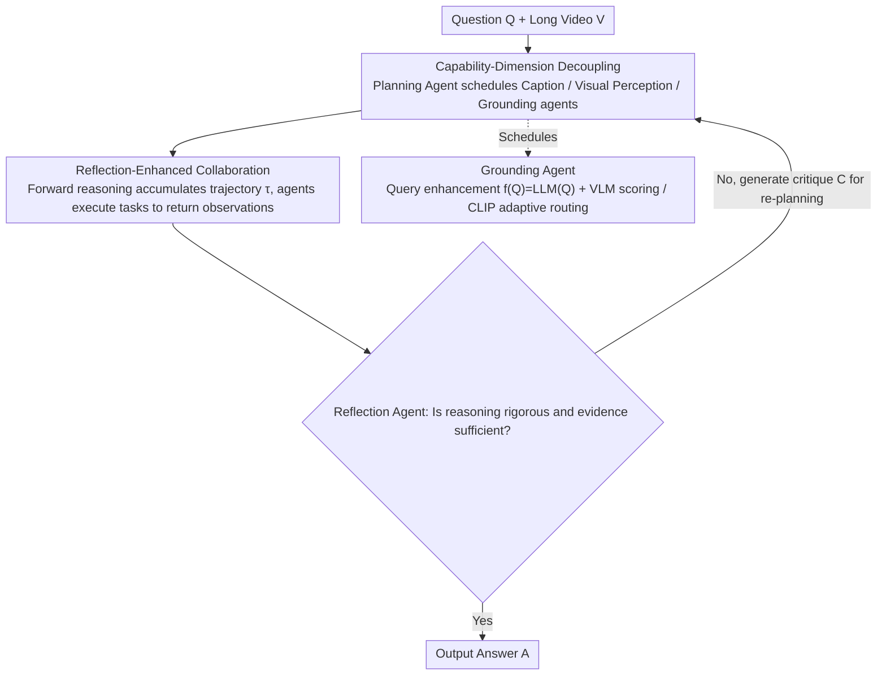

# Symphony: A Cognitively-Inspired Multi-Agent System for Long-Video Understanding

**Conference**: CVPR 2026  
**Paper**: [CVF Open Access](https://openaccess.thecvf.com/content/CVPR2026/html/Yan_Symphony_A_Cognitively-Inspired_Multi-Agent_System_for_Long-Video_Understanding_CVPR_2026_paper.html)  
**Code**: https://github.com/Haiyang0226/Symphony  
**Area**: Agent / Video Understanding / Multimodal VLM  
**Keywords**: Long-video understanding, Multi-agent system, Cognitive capability decoupling, Reflection-enhanced collaboration, Video grounding

## TL;DR
Symphony mimics human cognition by decomposing long-video understanding into multiple specialized agents based on "capability dimensions" (Planning, Reflection, Grounding, Caption, and Visual Perception). It employs an Actor-Critic-style reflection-enhanced dynamic collaboration mechanism to iteratively correct reasoning and introduces a grounding agent that "expands queries first, then scores with VLM" for complex problems. It achieves SOTA on LVBench, LongVideoBench, Video-MME, and MLVU, outperforming the previous best on LVBench by 5.0%.

## Background & Motivation
**Background**: Long-video understanding (LVU) is becoming increasingly critical in scenarios such as sports commentary, intelligent surveillance, and film analysis. Current mainstream approaches are MLLM-based agents: they either use VLM to build video databases + RAG to retrieve relevant segments to handle long sequences, or rely on an LLM to decompose tasks and iteratively use tools to explore the solution space.

**Limitations of Prior Work**: Both paths have significant flaws. The RAG route struggles to generate effective retrieval queries for complex questions, and video databases suffer from noise and redundancy, leading to inaccurate retrieval. The task decomposition route places all reasoning pressure on the core LLM; once task complexity exceeds the model's reasoning capacity, performance drops sharply, and the agent degrades into performing "simple actions" rather than deep reasoning. While Multi-Agent Systems (MAS) are promising, existing methods (e.g., VideoMultiAgents which split by modality, or LvAgent which uses fixed teams with linear voting) either face high cross-modal information exchange costs or use static linear pipelines that constrain solution space exploration, failing to surpass the capability ceiling of a single agent.

**Key Challenge**: Long videos feature high information density, long temporal spans, and multi-hop questions, requiring reasoning based on "divide-and-conquer + iterative error correction." Simple task decomposition and collaboration mechanisms are insufficient for long-chain reasoning, while purely embedding-based retrieval to compress temporal context loses key information for complex questions.

**Goal**: To design a MAS capable of effectively decomposing LVU sub-tasks and enabling dynamic collaboration for error correction between agents, while solving the grounding problem where complex questions fail to precisely locate relevant segments.

**Key Insight**: Cognitive psychology decomposes human cognition into core dimensions such as perception, attention, reasoning, language, and decision-making. Accordingly, the authors propose an LVU task decomposition paradigm that **decouples by capability dimensions (rather than modalities)**—this minimizes coupling between agents and reduces information integration costs.

**Core Idea**: Utilize a centralized MAS to decompose reasoning into specialized agents corresponding to cognitive dimensions. By using "reflection-enhanced dynamic collaboration" and a "grounding agent capable of reasoning," the cognitive burden of each agent is reduced while the exploration of the solution space is expanded.

## Method

### Overall Architecture
Symphony is a centralized multi-agent system configured with five functionally specialized agents based on cognitive dimensions: the **planning agent** and **reflection agent** are jointly responsible for reasoning and decision-making; the **grounding agent** simulates "attention" by highlighting key video segments; the **caption agent** processes text captions for the "language" function; and the **visual perception agent** executes "perception" tasks. Compared to modality-based splitting (which leads to tight coupling and high interaction costs), capability-dimension decoupling distributes the cognitive load across low-coupling specialized modules, mitigating the capacity overload of monolithic architectures.

During runtime, the planning agent serves as the central coordinator: given a question $Q$ and a long video $V$, it performs global task planning, multi-round scheduling of other agents, integrates information, and produces the final answer. The action space is $A=\{G, V, S\}$ (Grounding, Visual Perception, Caption). In the forward reasoning stage, the planning agent outputs the next sub-task $a_t = \pi(S_t)$ based on the current state, where $S_t = (Q, \tau_{t-1})$ and $\tau_{t-1} = (a_1, o_1, \dots, a_{t-1}, o_{t-1})$ represents the history trajectory. Specialized agents execute $a_t$ to produce observation $o_t$ and update the state until sufficient evidence is gathered. Subsequently, the reflection agent processes the final state $S_T$: if the reasoning chain is rigorous and evidence is sufficient, it terminates; otherwise, it generates a critique $C = \phi(S_T)$ and updates the trajectory/state, re-triggering the planning agent's forward reasoning to expand the MAS exploration space.

### Key Designs

**1. Capability-Dimension Decoupled Task Allocation: Decoupling by "Capability" instead of "Modality"**

To address "single LLM reasoning overload and high cross-modal interaction costs in modality-based splitting," the authors leverage cognitive psychology to split LVU into five capability-dimension agents: Planning (decision), Reflection (decision/reasoning verification), Grounding (attention), Caption (language), and Visual Perception (perception). The visual perception agent includes three tools: frame inspector, global summary, and multi-segment analysis; the caption agent performs entity recognition, sentiment analysis, and topic modeling. **Mechanism**: Modality-based splitting forces agents to process features in isolation, making deep cross-modal interaction difficult. Capability-dimension decoupling minimizes dependencies and reduces integration costs by clearly defining "who is responsible for which cognitive function," thereby distributing the capacity overload of monolithic models. Ablations (Tab. 4) show that adding caption, visual perception, and reflection agents step-by-step increases the LVBench score from 65.7 to 71.8.

**2. Reflection-Enhanced Dynamic Collaboration: Using an Independent "Critic" Instead of Single-Agent Self-Correction**

To address "linear static pipelines constraining solution space exploration and single-agent self-correction prone to overconfidence," the authors design reflection-enhanced dynamic reasoning inspired by the Actor-Critic framework. The planning agent acts as the core policy $\pi$ (Actor), generating sub-tasks and dynamically constructing solution paths; the reflection agent acts as the verification model $\phi$ (Critic), providing critical analysis of the reasoning process and final results. This is theoretically grounded in Verifier's Law—"verifying a solution is much easier than generating it." The collaboration is formalized in Algorithm 1: an inner loop where the planning agent repeatedly issues actions to $\{G, V, S\}$ and accumulates trajectories until TERMINATE; an outer loop where the reflection agent determines $(C, \text{Valid}) \leftarrow \phi(S_T)$. If invalid, critique $C$ is merged into the state for another round (max $M$ rounds). **Mechanism**: An independent reflection agent mitigates the overconfidence common in self-correction, expands the exploration space, and provides significant gains on difficult problems. Removing the independent reflection agent (allowing the planning agent to self-reflect) results in a 2.5% drop.

**3. Thinking Grounding Agent: Query Expansion + VLM Scoring with Adaptive Routing Between VLM/CLIP**

To address "original queries failing to capture abstract concepts and temporal actions in CLIP retrieval for complex questions," the grounding mechanism was redesigned. Grounding seeks to select a set of segments $S=\{s\,|\,\text{sim}(f(Q), s) \ge \theta\}$ relevant to query $Q$ from video $V$. Complex questions typically manifest as **question ambiguity** (vague references, abstract concepts, high-level actions without explicit entities) or **multi-hop reasoning** (requiring linking evidence across scenes). Traditional CLIP uses $f(Q)=Q$ and $\text{sim}=\text{CLIP}(Q, s)$, failing on abstract concepts (e.g., "bribery") and temporal sequences (e.g., "entering the city"). The authors introduce two improvements: first, LLM-enhanced queries $f(Q)=\text{LLM}(Q)$ use world knowledge to instantiate vague terms and explicitly supplement logical clues; second, VLM replaces CLIP for scoring $\text{sim}(f(Q), s)=\text{VLM}(f(Q), s)$. The video is split into non-overlapping segments and sparsely sampled; the VLM outputs a score (1–4 scale: 4=core elements visible; 3=partial evidence; 2=no explicit clues, requires multi-hop linking; 1=irrelevant) and a rationale, executed in parallel to reduce latency. Crucially, the grounding agent **retains the CLIP module and adaptively routes based on question complexity**—using CLIP for simple questions to save compute and VLM for hard questions for precision. Ablations (Tab. 5) show a score of 52.2 for pure CLIP compared to 68.6 for Qwen2.5VL-7B (+16.4%) and 71.8 for Seed1.6VL.

## Key Experimental Results

### Main Results
Four LVU benchmarks (LVBench avg. 68 min; LongVideoBench Val; Video-MME Long-subset only; MLVU), metrics are accuracy (Score %). Planning/Reflection agents use DeepSeek R1, Caption agent uses DeepSeek V3, Visual Perception/Grounding agents use Doubao Seed 1.6 VL.

| Method | LVBench | LongVideoBench(Val) | Video-MME Long | MLVU |
|------|------|------|------|------|
| Gemini-1.5-Pro (Comm. VLM) | 33.1 | 64.0 | 67.4 | - |
| GPT-4o | 48.9 | 66.7 | 65.3 | 54.9 |
| OpenAI o3 | 57.1 | 67.5 | 64.7 | - |
| Seed 1.6 VL* (Open-source VLM) | 58.1 | 66.1 | 68.4 | 65.3 |
| Qwen2.5-VL-72B | 47.7 | 60.7 | 63.9 | 53.8 |
| DVD* (Agent) | 66.8 | 67.2 | 61.5 | - |
| VideoDeepResearch (VDR) | 55.5 | 70.6 | 76.3 | 64.5 |
| VideoChatA1 | - | 65.4 | 71.2 | 76.2 |
| **Symphony (Ours)** | **71.8** | **77.1** | **78.1** | **81.0** |

(* indicates results reproduced by authors) Symphony achieves SOTA across all four benchmarks: LVBench is 5.0% higher than DVD, and LongVideoBench is 6.5% higher than VDR. In LVBench's six capability dimensions (Tab. 3), it leads in most: Entity Recognition (ER) 70.0, Event Understanding (EU) 69.4, Key Information Retrieval (KIR) 77.2, Reasoning (Rea) 69.4, Summarization (Sum) 72.5.

### Ablation Study
Incremental addition of agents (LVBench, Tab. 4):

| Planning | Caption | Visual Perception | Reflection | Score(%) |
|------|------|------|------|------|
| ✓ | | | | 65.7 |
| ✓ | ✓ | | | 68.2 |
| ✓ | ✓ | ✓ | | 69.6 |
| ✓ | ✓ | ✓ | ✓ | **71.8** |

Grounding strategy ablation (LVBench, Tab. 5; time in seconds):

| Grounding Tool | Score(%) | Time(s) |
|------|------|------|
| Caption-based (DVD GPT-4.1) | 61.2 | 8.2* (excl. DB config) |
| CLIP-based | 52.2 | 33.7 |
| VLM = Qwen2.5VL-7B | 68.6 | 37.4 |
| VLM = Seed 1.6VL | **72.1** | 54.8 |

### Key Findings
- **Every capability-dimension agent contributes**: Caption agent +2.5 (65.7→68.2), Visual Perception agent +1.4 (68.2→69.6), Reflection agent +2.2 (69.6→71.8). Feeding full captions directly to the planning agent overloads context and drops performance by 1.4%, proving that a specialized caption agent's "analyze then return" approach avoids context overflow.
- **VLM grounding is key for accuracy but carries efficiency costs**: Pure CLIP is only 52.2; Qwen2.5VL-7B adds +16.4% to reach 68.6 with similar latency to CLIP. Seed1.6VL has the highest accuracy (72.1) but takes longer—hence the grounding agent routes adaptively to balance performance and compute.
- **Not winning on every benchmark**: Compared to LvAgent's voting strategy (Tab. 7), Symphony leads significantly on LVBench (71.8 vs 64.3), but is lower on LongVideoBench (77.1 vs 80.0), Video-MME (78.1 vs 81.7), and MLVU (81.0 vs 83.9). This suggests the proposed method's strengths are most evident in the most difficult, reasoning-dependent benchmark (LVBench).

## Highlights & Insights
- **Capability-Dimension Decoupling Paradigm**: "Splitting by capability rather than modality" is a clear and transferable organizational principle for MAS, minimizing coupling and information integration costs.
- **Verifier's Law Implementation**: Using an independent reflection agent as a Critic to explicitly engineer the principle that "verification is easier than generation" effectively mitigates overconfidence in LLM agents.
- **Grounding as a Reasoning Problem**: Upgrading "relevant segment retrieval" from pure similarity matching to "LLM query expansion + VLM scoring with rationale," combined with adaptive routing, is a pragmatic strategy for handling varying question complexities.
- **Reusable Trick**: The 1–4 segment relevance scoring protocol (including judgment criteria and reasoning output for each level) is a lightweight protocol that enables VLMs to provide interpretable grounding results.

## Limitations & Future Work
- **Performance Trade-offs**: Symphony is lower than LvAgent's voting strategy on LongVideoBench, Video-MME, and MLVU, excelling mainly on LVBench; robustness across different task distributions needs refinement.
- **Heavy Model Dependency**: Planning/Reflection use DeepSeek R1, and Perception/Grounding use Doubao Seed 1.6 VL. Multi-agent + multi-round scheduling (up to 15 rounds and 15 tool calls) implies significant inference cost and latency.
- **Explicit Efficiency Costs**: VLM grounding is the most accurate but slowest (Seed 1.6 VL at 54.8s). Adaptive routing mitigates this, but the overall pipeline remains heavy.
- **Future Directions**: Combining reflection/voting mechanisms with LvAgent's approach, performing more systematic precision-efficiency trade-offs for sampling FPS and segment intervals, and reducing dependence on closed-source/large VLMs.

## Related Work & Insights
- **vs VideoMultiAgents**: It splits agents by modality (text/visual/graph) but treats features in isolation; Symphony decouples by capability to minimize coupling and integration costs.
- **vs LvAgent**: It uses fixed teams for discussion and voting but follows a static linear pipeline; Symphony uses reflection-enhanced dynamic collaboration, allowing the planning agent to construct solution paths dynamically. Notably, LvAgent's voting strategy remains superior on easier benchmarks.
- **vs DVD (Single Agent + Caption DB)**: DVD builds a multi-granularity video database relying on caption-query similarity, which is expensive and noisy; Symphony's grounding agent uses VLM with rationales, outperforming DVD by 5.0% on LVBench.
- **vs VideoAgent/VideoChat-A1**: Single-agent models degrade when task complexity exceeds reasoning capacity; Symphony distributes cognitive load across multiple agents to break through the capability ceiling of single agents.

## Rating
- Novelty: ⭐⭐⭐⭐ The combination of capability-dimension decoupling, reflection-enhanced collaboration, and reasoning-based grounding is solid, though individual components (MAS, Actor-Critic, query expansion) have historical roots.
- Experimental Thoroughness: ⭐⭐⭐⭐⭐ Comprehensive coverage across four benchmarks + LVBench dimension breakdown + five ablation groups (agent/grounding tool/sampling/voting), with honest reporting of results where it lags behind LvAgent.
- Writing Quality: ⭐⭐⭐⭐ Clear mapping of cognitive concepts and formalization of algorithms; rich illustrations.
- Value: ⭐⭐⭐⭐ Long-video understanding is a high-demand area; the designs for decoupling and reflection are valuable for the agent community.

<!-- RELATED:START -->

## Related Papers

- [\[CVPR 2026\] SciEducator: Scientific Video Understanding and Educating via Deming-Cycle Multi-Agent System](scieducator_scientific_video_understanding_and_educating_via_deming-cycle_multi-.md)
- [\[CVPR 2026\] Refer-Agent: A Collaborative Multi-Agent System with Reasoning and Reflection for Referring Video Object Segmentation](refer-agent_a_collaborative_multi-agent_system_with_reasoning_and_reflection_for.md)
- [\[ICLR 2026\] LH-Deception: Simulating and Understanding LLM Deceptive Behaviors in Long-Horizon Interactions](../../ICLR2026/multi_agent/lh-deception_simulating_and_understanding_llm_deceptive_behaviors_in_long-horizo.md)
- [\[CVPR 2026\] MOTOR-Bench: A Real-world Dataset and Multi-agent Framework for Zero-shot Human Mental State Understanding](motor-bench_a_real-world_dataset_and_multi-agent_framework_for_zero-shot_human_m.md)
- [\[CVPR 2026\] Paper2Figure: A Multi-Agent Collaborative System for Figure Generation Towards Academic Research Paper](paper2figure_a_multi-agent_collaborative_system_for_figure_generation_towards_ac.md)

<!-- RELATED:END -->
