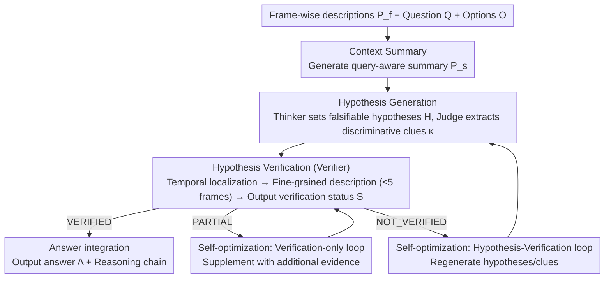

# Think, Then Verify: A Hypothesis-Verification Multi-Agent Framework for Long Video Understanding

**Conference**: CVPR 2026  
**arXiv**: [2603.04977](https://arxiv.org/abs/2603.04977)  
**Code**: [GitHub](https://github.com/Haorane/VideoHV-Agent)  
**Area**: LLM Agent  
**Keywords**: Long Video Understanding, Multi-Agent, Hypothesis Verification, VideoQA, Evidential Reasoning

## TL;DR
VideoHV-Agent is proposed to refactor long video question answering into a "hypothesis-verification" process: the Thinker rewrites answer options into testable hypotheses, the Judge extracts discriminative clues, the Verifier localizes evidence within the video for validation, and the Answerer synthesizes evidence to provide the final result. It achieves SOTA on EgoSchema, NextQA, and IntentQA while maintaining higher inference efficiency than existing agent-based methods.

## Background & Motivation
**Background**: LLM-driven video understanding has made significant progress, yet long video QA remains challenging. Models must process dense, redundant content and perform reasoning across extended time spans. Existing approaches include keyframe selection, multi-stage pipelines (localize-then-reason), and agent frameworks (iterative search to aggregate semantically relevant segments).

**Limitations of Prior Work**: (i) Chain-of-Thought methods are prone to semantic drift and error accumulation in long reasoning chains; (ii) existing agent frameworks are essentially "relevance-driven"—repeatedly searching for segments relevant to the current plan and re-planning based on findings, leading to expensive trial-and-error loops; (iii) planners often decompose video complexity (length, redundancy) while ignoring the complexity of the question itself (compositional constraints, temporal ordering, causal premises).

**Key Challenge**: The core difficulty of long video QA is not "how to find relevant segments," but "what exactly to look for." Existing methods follow a "search-then-reason" order, whereas the correct sequence should be "think-then-find."

**Goal**: To replace reactive relevance retrieval with structured hypothesis-verification reasoning.

**Key Insight**: The "thinking before finding" principle—the system must clarify what video evidence is required for each candidate answer to hold true before collecting evidence.

**Core Idea**: Refactor VideoQA into a structured reasoning workflow consisting of hypothesis generation, clue extraction, evidence verification, and answer integration.

## Method

### Overall Architecture
VideoHV-Agent transforms long video QA from "answering after watching" to "guessing then verifying": it first establishes a falsifiable hypothesis for each option based on the question, then queries the video only for key evidence necessary to verify these hypotheses. Four agents collaborate in a pipeline—inputting frame-wise descriptions $\mathcal{P}_f$ + question $Q$ + options $O$, passing through query-aware summary $\mathcal{P}_s$ → hypothesis $H$ → discriminative clues $\kappa$ → evidence $E$ → verification status $S$, finally yielding answer $A$ and a transparent reasoning chain. The pipeline consists of three stages: context summarization, two-step reasoning (generation + verification), and self-optimization.

### Key Designs

**1. Context Summary: Decoupling "Global" and "Local"**

Frame-wise descriptions are detailed but create long, noisy contexts. The design decouples their two uses: **frame-wise descriptions are strictly reserved for subsequent segment localization** (local task requiring precise timestamps), while **global reasoning utilizes only a concise query-aware summary $\mathcal{P}_s$**. Compared to previous methods that concatenate all frame descriptions into a long context, this decoupling preserves detail while keeping the global context compact.

**2. Hypothesis Generation (Step 1): Target Setting + Minimum Discriminative Evidence**

- **Thinker Agent**: Generates a testable hypothesis $h_i$ for each candidate option $o_i$, explicitly stating "if $o_i$ is correct, which entities/actions/temporal-causal constraints must appear in the video." It initially filters obviously incorrect options using the summary to reduce noise.
- **Judge Agent**: Distills **discriminative clues $\kappa$** from the hypothesis set $H$—the **minimum** observed evidence needed to distinguish between hypotheses (e.g., a specific object interaction, a sequence of events, or a visual outcome).
- The clue mechanism ensures verification focuses solely on the critical points that differentiate the options, rather than verifying every hypothesis in isolation.

**3. Hypothesis Verification (Step 2): Inspecting Only Decision-Relevant Frames**

The **Verifier Agent** follows three steps: (i) **Temporal Localization**—using frame descriptions to find the time window where clues are most likely to appear; (ii) **Fine-grained Description**—invoking fine-grained captioning within that window (maximum 5 frames per call); (iii) **Clue Verification**—outputting $\text{status}(\kappa) \in \{\text{VERIFIED}, \text{PARTIAL}, \text{NOT\_VERIFIED}\}$ with brief justifications. This significantly reduces computational overhead by avoiding full video scans.

**4. Self-Optimization Loop: Adaptive Supplementation**

Verification is not a one-shot process; different statuses trigger different levels of feedback:
- **PARTIAL**: Triggers a "verification-only" loop to retrieve additional evidence from new timestamps.
- **NOT_VERIFIED**: Triggers a "hypothesis-verification" loop to regenerate hypotheses and clues (performing specific or discriminative augmentation).
- Experiments show most samples are resolved in a single loop, avoiding meaningless repeated scanning.

### Walkthrough Example ("What did the protagonist do after putting down the cup?" 4 options)
1. **Summary**: Generates $\mathcal{P}_s$, filters options unrelated to the "cup," leaving A, B, and C.
2. **Thinker**: Formulates hypotheses for A = "opened the door," B = "answered the phone," and C = "picked up keys," specifying required actions for each.
3. **Judge**: Distills discriminative clue $\kappa$ = "the next object the right hand interacts with after putting down the cup."
4. **Verifier**: Localizes the time window of "putting down the cup" → performs fine-grained description of 5 frames → observes "right hand reaching for the doorknob."
5. **Decision**: Clue points to A, status = VERIFIED, outputs A and the reasoning chain without further loops.

### Loss & Training
This method is a **zero-shot reasoning framework and does not involve training**. All four agents use GPT-4o as the LLM backbone, while the frame-level captioner utilizes LaViLa/CogAgent.

## Key Experimental Results

### Main Results

| Benchmark | Metric | VideoHV-Agent | VideoAgent2 | VideoMultiAgents | Gain |
|------|------|--------------|-------------|-----------------|------|
| EgoSchema (subset) | Accuracy | **81.0%** | 80.6% | 75.4% | +0.4% |
| NextQA (val) | Accuracy | **80.7%** | 80.5% | 79.6% | +0.2% |
| NextQA ATP-hard | Accuracy | **71.2%** | 68.2% | - | +3.0% |
| IntentQA (test) | Accuracy | **75.6%** | 73.9% | - | +1.7% |

### Ablation Study

| Configuration | Accuracy | Description |
|------|---------|------|
| Full model | 81.0% | Complete VideoHV-Agent |
| w/o hypothesis | 76.0% | Removed hypothesis generation, -5% |
| w/o clue | 78.6% | Removed clue generation, -2.4% |
| w/o verification status | 74.0% | Removed verification status mechanism, -7% |

### Key Findings
- **The verification status mechanism provides the largest contribution** (-7% when removed), indicating that adaptive self-optimization loops are a functional necessity rather than decorative explanations.
- **Gains are more significant on the ATP-hard subset (+3%)**, demonstrating that the hypothesis-verification paradigm excels at complex reasoning problems.
- **Inference efficiency outperforms all baseline methods**: Average 123.66s per question, lower than VideoAgent (129.46s) and VideoTree (160.21s), while achieving the highest accuracy.
- Most samples require only one loop, with diminishing returns for extra loops.

## Highlights & Insights
- **The "Think-then-Find" paradigm shift** is ingenious—transforming VideoQA from reactive "search-reason-search" to proactive "hypothesize-verify," aligning with scientific hypothesis testing. This approach is transferable to any task requiring evidence retrieval from massive data.
- **The three-level verification status** (VERIFIED/PARTIAL/NOT_VERIFIED) is well-designed, allowing different granularities of self-optimization and avoiding blind full-pipeline retries.
- **Simultaneous improvement in efficiency and accuracy**: By replacing full video scanning with clue-oriented targeted searches, the system is both more accurate and faster.

## Limitations & Future Work
- Dependency on GPT-4o as a backbone results in high costs; open-source alternatives have not been explored.
- The quality of the frame-level captioner directly impacts reasoning, yet the paper does not deeply analyze how captioning errors propagate.
- Testing was restricted to multiple-choice formats; performance on open-ended QA was not verified.
- The maximum number of self-optimization loops must be preset; determining when to stop dynamically remains an open problem.

## Related Work & Insights
- **vs VideoAgent2**: Also an agent framework but uses uncertainty-guided retrieval, which remains relevance-driven; VideoHV-Agent’s hypothesis-driven approach is more directional.
- **vs VideoMultiAgents**: Allocates agents by modality (vision/language), whereas VideoHV-Agent allocates by reasoning role (think/judge/verify/answer), better aligning with scientific reasoning.
- **vs TraveLER**: Follows a CoT + localization "ask-find-evaluate-replan" loop but lacks the explicit clarity of hypotheses and adaptive verification statuses.

## Rating
- Novelty: ⭐⭐⭐⭐⭐ The hypothesis-verification paradigm is a fresh approach to long video understanding.
- Experimental Thoroughness: ⭐⭐⭐⭐ Covering three benchmarks and detailed ablations, though lacking open-ended QA evaluation.
- Writing Quality: ⭐⭐⭐⭐⭐ Clear motivational derivation and systematic methodology description.
- Value: ⭐⭐⭐⭐ The hypothesis-verification paradigm can be extended to other information retrieval and reasoning tasks.

<!-- RELATED:START -->

## Related Papers

- [\[CVPR 2026\] HAVEN: Hierarchical Long Video Understanding with Audiovisual Entity Cohesion and Agentic Search](haven_hierarchical_long_video_understanding_with_audiovisual_entity_cohesion.md)
- [\[CVPR 2026\] WorldMM: Dynamic Multimodal Memory Agent for Long Video Reasoning](worldmm_dynamic_multimodal_memory_agent_for_long_video_reasoning.md)
- [\[CVPR 2026\] Resolving Evidence Sparsity: Agentic Context Engineering for Long-Document Understanding](resolving_evidence_sparsity_agentic_context_engineering_for_long-document_unders.md)
- [\[CVPR 2026\] CarePilot: A Multi-Agent Framework for Long-Horizon Computer Task Automation in Healthcare](carepilot_a_multi-agent_framework_for_long-horizon_computer_task_automation_in_h.md)
- [\[ECCV 2024\] VideoAgent: A Memory-augmented Multimodal Agent for Video Understanding](../../ECCV2024/llm_agent/videoagent_a_memory-augmented_multimodal_agent_for_video_understanding.md)

<!-- RELATED:END -->
