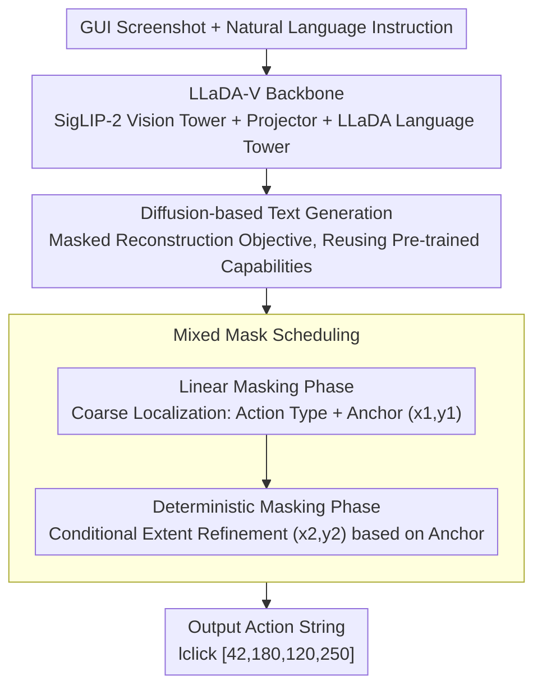

# Towards GUI Agents: Vision-Language Diffusion Models for GUI Grounding

**Conference**: CVPR 2026  
**arXiv**: [2603.26211](https://arxiv.org/abs/2603.26211)  
**Code**: None  
**Area**: GUI Agent / Vision-Language Models  
**Keywords**: GUI Grounding, Discrete Diffusion Models, LLaDA-V, Mixed Masking, UI Understanding

## TL;DR

This paper presents the first systematic study of Discrete Diffusion Vision-Language Models (DVLM) for GUI Grounding. By adapting LLaDA-V for single-step action prediction and proposing a mixed mask scheduling strategy (linear + deterministic) to capture geometric hierarchical dependencies between bounding box coordinates, the authors demonstrate the feasibility of diffusion models as a foundation for GUI Agents across Web, Desktop, and Mobile interfaces.

## Background & Motivation

GUI Grounding is a fundamental capability for building multimodal GUI Agents: given a natural language instruction and a screenshot, the model must locate the target element and generate the corresponding action. This is key to automating software operations and digital workflows.

**Limitations of Prior Work**:
- Autoregressive (AR) vision-language models (e.g., Qwen2.5-VL, CogAgent, UI-TARS) dominate GUI Grounding research.
- AR models inherit inherent architectural constraints: **sequential decoding** and **unidirectional attention**.
- These limitations prevent the model from utilizing subsequent context tokens when generating coordinate tokens.

**Potential of Discrete Diffusion Models**:
- Discrete Diffusion Vision-Language Models (DVLM) like LLaDA-V and MMaDA have shown excellence in multimodal understanding and reasoning.
- DVLMs offer three unique advantages: **bidirectional attention**, **parallel token generation**, and **iterative refinement**.
- However, their potential in GUI Grounding remains entirely unexplored.

**Key Challenge**:
GUI Grounding output consists of structured action strings (e.g., `lclick [42,180,120,250]`), containing an action type and bounding box coordinates $B = (x_1, y_1, x_2, y_2)$. Here, $(x_1, y_1)$ serves as the action anchor, while $(x_2, y_2)$ defines the spatial extent, creating a geometric hierarchical dependency. The default linear mask scheduling in LLaDA-V corrupts all tokens randomly, which may disrupt the model's ability to learn these consistent geometric dependencies.

## Method

### Overall Architecture

The paper aims to answer a previously unverified question: Can DVLMs handle GUI Grounding? To this end, the authors adapted the existing LLaDA-V (8B), which consists of a LLaDA discrete diffusion language tower, a SigLIP-2 vision tower, and a two-layer MLP projector that aligns visual embeddings into the language token space. The pipeline is straightforward: the GUI screenshot and natural language instruction are fed into the model, which outputs an action string like `lclick [42,180,120,250]` or `type_in [50,90,200,130] hello`. The difficulty lies not in "generating text," but in enabling a diffusion model that originally masks tokens randomly to learn the geometric dependencies between coordinates, which is addressed by the mixed masking strategy.

### Key Designs

**1. Reformulating GUI Grounding as Diffusion-based Text Generation: Reusing LLaDA-V's Pre-trained Capabilities for Coordinate Prediction**

Instead of designing new detection heads, the authors treat "element localization" as a text generation problem. Given an image $v$ and an instruction $p_0^1$, the model generates tokens for the action type and bounding box coordinates. The training follows the discrete diffusion masked reconstruction objective: randomly replacing a portion of response tokens with the mask token `[M]` and requiring the model to restore them. The loss is calculated only on the masked positions:

$$L(\theta) = -\mathbb{E}\Big[\tfrac{1}{t} \sum_i \mathbb{1}[r_t^{1,i}=[M]] \times \log p_\theta(r_0^{1,i} \mid v, p_0^1, r_t^1)\Big]$$

During inference, starting from a fully masked sequence, the model performs reverse diffusion to denoise tokens step-by-step, using a low-confidence re-masking strategy to re-guess uncertain positions. This approach allows the model to inherit the capabilities gained from LLaDA-V’s three-stage pre-training (vision-language alignment, instruction tuning, and reasoning enhancement) with almost zero modification, while its inherent bidirectional attention allows it to see both preceding and succeeding context when writing coordinates, bypassing the flaws of AR sequential decoding.

**2. Mixed Mask Scheduling: Embedding Geometric Hierarchies (Anchor before Extent) into Masking Strategies**

This is the core modification of the paper. A bounding box $B=(x_1,y_1,x_2,y_2)$ does not consist of four equivalent numbers: $(x_1,y_1)$ is the action anchor determining where the point is, while $(x_2,y_2)$ defines the extent only after the anchor is fixed. These have a conditional rather than parallel relationship. Default linear masking in LLaDA-V corrupts tokens randomly and rarely creates a configuration where the "anchor is visible but the extent is masked," preventing the model from learning this dependency. The authors split training into two phases: a Linear Masking phase using standard scheduling with mask probability $p_{mask}=(1-\varepsilon)t+\varepsilon$ for coarse-grained localization; and a Deterministic Masking phase where all response tokens are masked, requiring the model to complete the remaining coordinates conditioned on the image $I$, instruction $N$, and known anchor $(x_1,y_1)$. This reinforces the modeling of the conditional probability:

$$p_\theta(x_2, y_2 \mid a_{type}, x_1, y_1, I, N)$$

This forces a "coarse-to-fine" workflow: first identifying an `lclick` at anchor $(42,180)$, then completing the extent to $(120,250)$.

**3. Data Scaling and Annotation Cleaning: Satisfying Diffusion Model Priors with More and Cleaner Supervision**

After confirming feasibility with 7k Mind2Web samples, the authors expanded the training set to a 120K multi-domain mix: Mind2Web (20K) + WebLinX (20K) + OS-Atlas (60K, covering Web/Mobile/Desktop) + Rico Widget Caption (20K). Two annotation details were crucial: random cropping of high-resolution screenshots (ensuring target elements remain within the crop) to prevent small elements from disappearing, and using OCR text-associated labels instead of pure icon-level labels to provide an extra layer of text anchors for coordinate prediction. This data expansion provided a larger SSR gain than the mixed masking itself, suggesting that for a diffusion model with smaller pre-training scale, data-driven priors are a key lever for closing the performance gap.

**4. Inference Parameter Trade-offs: Coordinating Steps, Generation Length, and Block Length for Latency-Accuracy Balance**

Diffusion inference involves three variables: diffusion steps, generation length, and block length. The authors found that setting all three to 64 provided the best trade-off. Increasing these parameters further (e.g., from 64 to 128) results in stagnant SSR (e.g., 80.67% vs 80.63% on Mind2Web) while significantly increasing latency. This indicates that short outputs like coordinates do not require extremely deep denoising steps to converge.

### Loss & Training

The training objective is the masked language modeling loss for discrete diffusion mentioned above. Initial feasibility experiments were conducted on 7k Mind2Web samples for 10 epochs. Large-scale experiments used the 120K multi-domain mix, training the linear and deterministic phases of mixed masking separately. Evaluation used two metrics: **Action-Type F1** for action classification accuracy and **Step Success Rate (SSR)** to determine if the predicted bounding box center falls within the ground-truth box.

## Key Experimental Results

### Main Results

Comparison of AR vs NAR (Non-Autoregressive) GUI Grounding (120K training data):

| Dataset | Metric | Phi (3B) | Qwen2.5-VL (3B) | Qwen2.5-VL (7B) | LLaDA-V (Linear) | LLaDA-V (Mixed, Ours) |
|--------|------|----------|------------------|------------------|----------------|---------------------|
| Mind2Web | SSR (%) | 56.8 | 79.3 | 81.9 | 82.4 | **83.9** |
|  | F1 (%) | 94.4 | 99.6 | 99.9 | 98.5 | **100.0** |
| ScreenSpot-Web-Icon | SSR (%) | 62.6 | 79.1 | 85.4 | 57.8 | 63.1 |
| ScreenSpot-Web-Text | SSR (%) | 77.0 | 83.0 | 83.0 | 73.5 | 74.8 |
| VisualWebArena | SSR (%) | 68.5 | 88.9 | 87.2 | 61.4 | **67.5** |

SSR Gain of Mixed Masking vs Linear Masking:
- Mind2Web: +1.6
- ScreenSpot-Web-Icon: +5.3
- ScreenSpot-Web-Text: +1.3
- VisualWebArena: **+6.1**

### Ablation Study

**Impact of Inference Parameters** (Mind2Web 7K):

| Steps | Gen Length | Block Length | Converge Step | SSR (%) | Latency (s) |
|----------|----------|--------|----------|---------|---------|
| 32 | 32 | 32 | 13 | 78.15 | 2.56 |
| 64 | 64 | 64 | 25 | 80.67 | 4.84 |
| 128 | 128 | 128 | 25 | 80.63 | 5.01 |

**Impact of Cropping + OCR Annotation** (Mind2Web 7K):

| Configuration | SSR (%) | Latency (s) | Note |
|------|---------|---------|------|
| Raw Screenshot | 80.67 | 4.84 | Baseline |
| Cropping + OCR Label | **83.31** | **4.46** | +2.68 SSR, -0.38s |

**Effect of Data Scaling** (Linear Masking):

| Dataset | 7K Training SSR | 120K Training SSR | Gain |
|--------|-----------|-------------|------|
| ScreenSpot-Web-Text | 54.4 | 73.5 | +19.1 |
| ScreenSpot-Web-Icon | 19.9 | 57.8 | +37.9 |
| VisualWebArena | 32.4 | 61.4 | +29.0 |

### Key Findings

1. **DVLM possesses GUI Grounding capabilities**: Even LLaDA-V fine-tuned on only 7k samples reaches 80.67% SSR on Mind2Web, proving diffusion models can perform spatial localization.
2. **Mixed masking consistently improves accuracy**: Gains of 1.3-6.1 points in SSR across all 4 benchmarks validate the effectiveness of explicitly modeling anchor-extent conditional dependencies.
3. **Significant gains from data scaling**: 120K multi-domain data improved SSR by 20+ points on average while reducing latency by 1-1.5s and convergence steps by 8-9.
4. **Gap with AR models remains**: LLaDA-V (8B) lags behind Qwen2.5-VL (7B) by ~15-20 points on ScreenSpot and VWA. This is considered reasonable given the massive difference in pre-training data volume.
5. **Latency is the primary bottleneck**: Mixed masking introduces additional latency (3-6.5s vs 1.1s for AR) due to the necessity of two-stage sequential inference.

## Highlights & Insights

- **First exploration of diffusion models for GUI Grounding**: Fills a gap in DVLM applications, finding that bidirectional attention and iterative refinement indeed aid coordinate prediction.
- **Clever "coarse-to-fine" mixed mask design**: Encoding the geometric hierarchy (anchor → extent) into the mask schedule is an elegant way to inject domain priors into the diffusion process.
- **Unexpected efficiency gains from data scaling**: More data not only improves accuracy but reduces convergence steps and latency, suggesting better priors accelerate the denoising process.
- **Honest assessment of the AR gap**: The paper does not shy away from DVLM's disadvantages in pre-training scale and latency, positioning itself as an "exploratory study" rather than claiming total superiority.

## Limitations & Future Work

1. **Severe Latency Issues**: Multi-step denoising makes the model 3-6 times slower than AR models, which is unfriendly for real-time interaction.
2. **Single-step Actions Only**: Currently only handles single-step grounding; multi-step planning and action sequences are left for future work.
3. **Unequal Pre-training Data**: LLaDA-V's pre-training data is far less than Qwen2.5-VL's; performance gaps might narrow with more sufficient pre-training.
4. **Two-stage Dependency Adds Complexity**: The dependency of the deterministic phase on the linear phase's output introduces extra sequential computation.
5. **Simplified Action Types**: Only supports `lclick`, `hover`, and `type_in`, whereas real GUI operations are more complex (scroll, drag, etc.).
6. **Lack of Comparison with Latest GUI Agent Systems**: No end-to-end comparison with complete systems like UI-TARS or OS-Atlas.

## Related Work & Insights

- **LLaDA-V / MMaDA**: Foundational architectures for discrete diffusion VLM, proving the paradigm's feasibility in multimodal understanding.
- **CogAgent / UI-TARS**: Representative AR methods achieving strong GUI Grounding through large-scale pre-training and instruction tuning.
- **SeeClick / UGround**: Methods for GUI pre-training and synthetic data augmentation that provide data strategies for DVLMs.
- **D3PM**: Theoretical foundation for discrete diffusion using uniform category transitions.

## Rating

- Novelty: ⭐⭐⭐⭐ (First use of DVLM for GUI Grounding, creative mixed masking, though based on existing model adaptation)
- Experimental Thoroughness: ⭐⭐⭐⭐ (4 benchmarks, parameter ablations, data scaling analysis, but lacks comparison with full GUI Agent systems)
- Writing Quality: ⭐⭐⭐⭐ (Clear positioning, honest about trade-offs, though some tables are slightly cluttered)
- Value: ⭐⭐⭐⭐ (Opens a new direction for diffusion models in GUI Agents, though limited by latency and performance gaps)

<!-- RELATED:START -->

## Related Papers

- [\[CVPR 2026\] BAMI: Training-Free Bias Mitigation in GUI Grounding](bami_training-free_bias_mitigation_in_gui_grounding.md)
- [\[ICML 2026\] Scaling, Benchmarking, and Reasoning of Vision-Language Agents for Mobile GUI Navigation](../../ICML2026/llm_agent/scaling_benchmarking_and_reasoning_of_vision-language_agents_for_mobile_gui_navi.md)
- [\[CVPR 2026\] GUI-CEval: A Hierarchical and Comprehensive Chinese Benchmark for Mobile GUI Agents](gui-ceval_a_hierarchical_and_comprehensive_chinese_benchmark_for_mobile_gui_agen.md)
- [\[CVPR 2026\] OS-Oracle: A Comprehensive Framework for Cross-Platform GUI Critic Models](os-oracle_a_comprehensive_framework_for_cross-platform_gui_critic_models.md)
- [\[CVPR 2026\] MMBench-GUI: A Unified Hierarchical Evaluation Framework for Multi-Platform GUI Agents](mmbench-gui_a_unified_hierarchical_evaluation_framework_for_multi-platform_gui_a.md)

<!-- RELATED:END -->
