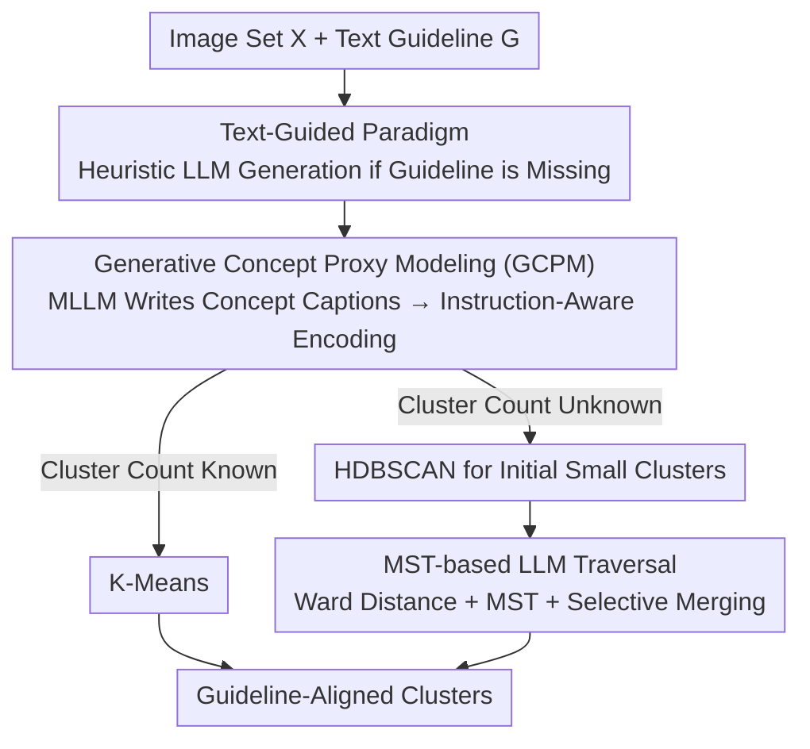

# Universal Guideline-Driven Image Clustering via a Hybrid LLM Agent

**Conference**: CVPR 2026  
**Paper**: [CVF Open Access](https://openaccess.thecvf.com/content/CVPR2026/html/Zhong_Universal_Guideline-Driven_Image_Clustering_via_a_Hybrid_LLM_Agent_CVPR_2026_paper.html)  
**Code**: https://clustering-agent.github.io/ (Project Page)  
**Area**: LLM Agent / Image Clustering  
**Keywords**: Text-guided clustering, concept-proxy, instruction-aware embedding, minimum spanning tree (MST), training-free

## TL;DR
This paper proposes the first training-free hybrid LLM agent that unifies various image clustering scenarios (general / fine-grained / multi-view / long-tail) via "text guidelines." It first uses an MLLM to translate images into "concept-proxy captions" and then passes them to an instruction-aware embedding model, resulting in guideline-aligned embeddings fed directly into traditional clustering algorithms. When the number of clusters is unknown, an LLM traversal based on a Minimum Spanning Tree (MST) is used to selectively merge small clusters, reducing expensive LLM calls from $O(M^2)$ to $O(M\log M)$. This approach outperforms specialized training-based methods across four task categories.

## Background & Motivation

**Background**: Traditional image clustering approaches (K-Means, DBSCAN) rely on static encoders to generate embeddings and group them via mathematical distance metrics, which inherently lack an understanding of visual semantics. Subsequent deep clustering research introduced specialized training strategies to guide the clustering process.

**Limitations of Prior Work**: These methods are highly "fragmented"—approaches optimized for general object classification fail at fine-grained distinction, and designs for balanced distributions collapse on long-tail data. Multi-view clustering cannot handle multiple standards simultaneously. Each scenario requires a specialized solution or retraining, restricting practical deployment. Existing text-guided methods only handle single, concrete criteria (e.g., "by color" OR "by species," but not both), require retraining for new criteria, or assume the number of clusters is known.

**Key Challenge**: Real-world user demand is "clustering based on a natural language guideline"—ranging from simple instructions ("group by color") to composite multi-attribute requirements ("organize sneakers by brand and purpose"). An intuitive solution of "directly feeding images and guidelines into a multimodal instruction-aware embedder" fails due to two reasons: first, existing multimodal embedders cannot handle complex guidelines; second, key but visually non-prominent attributes in the guidelines are often "overshadowed" by visually dominant but irrelevant features (e.g., when grouping cards by suit, the layout of the card numbers may dominate the suit intent).

**Goal**: Construct the first training-free unified clustering framework driven by text guidelines that spans "general ↔ fine-grained, global ↔ local, balanced ↔ long-tail," while reconciling the powerful semantic reasoning of LLMs with controllable computational costs.

**Key Insight**: Instead of letting the embedder "see the image with the instruction" directly, insert a text intermediary. Use an MLLM to "translate" the image into text descriptions focusing only on relevant attributes according to the guideline. This explicitly disentangles visual attributes before encoding, resulting in guideline-aligned embeddings that naturally support combining multiple criteria into a single representation.

**Core Idea**: Disentangle visual attributes via "concept-proxy captions" before encoding (GCPM), and handle cluster discovery where the cluster count is unknown using "MST-guided selective LLM merging"—utilizing the efficiency of embeddings for routine decisions and reserving expensive LLMs only for scenarios with high semantic complexity.

## Method

### Overall Architecture
The system is a training-free two-stage hybrid agent. The input is a set of images $X=\{x_1,\dots,x_N\}$ plus a text guideline $G$ (provided by the user or automatically generated by an LLM via heuristic prompts if missing). The output consists of clusters $C=\{C_1,\dots,C_M\}$ aligned with the guideline, i.e., $C=f(G,X)$.

The first stage, **GCPM**, converts "image + guideline" into guideline-aligned embeddings: an MLLM writes concept-proxy captions for each image according to attribute sets $A\subseteq G$, which are then encoded by an instruction-aware embedding model. The results are fed to standard clustering algorithms. The second stage diverges based on whether the cluster count is known: if known, K-Means is used; if unknown (common in the real world), HDBSCAN generates initial small clusters, followed by **MST-based LLM Traversal** to selectively merge homogeneous clusters into larger ones.

### Key Designs

**1. Text-Guided Paradigm and Auto Guideline Generation: Transforming "Clustering Criteria" from Hard-Coded to Natural Language**

Fragmentation occurs because "clustering criteria" are hard-coded into models or training objectives. This framework abstracts criteria into a text guideline $G$ containing a set of grouping attributes $A=\{a_1,\dots,a_k\}\subseteq G$ (e.g., "tail shape" or "wing color" in bird clustering). The framework switches tasks by simply reading this text, naturally supporting composite, multi-view, and abstract semantics. If no explicit guideline is provided, heuristic prompts allow the LLM to generate appropriate guidelines, sometimes exploring unsupervised data substructures to identify base criteria. This process remains entirely unsupervised—no ground-truth labels are included in prompts.

**2. Generative Concept Proxy Modeling (GCPM): Disentangling Visual Attributes via a Text Intermediary**

Directly using multimodal instruction-aware embedders has two flaws: fine-grained attributes not explicitly asked about are submerged, and visually dominant but irrelevant attributes take over. GCPM bypasses this with a text intermediary: first, an MLLM acts as a captioning model $f_{caption}$ to extract concept-focused descriptions:

$$c_i = f_{caption}(A, x_i), \quad A \subseteq G,$$

This step explicitly "surfaces" attributes specified in the guideline into text, achieving disentanglement. Second, an instruction-aware embedding model $f_{embed}$ encodes this concept-proxy caption:

$$h_i = f_{embed}(S, c_i), \quad S \subseteq G,$$

where $S$ specifies the focus for the current clustering. The resulting embeddings $H=\{h_1,\dots,h_N\}$ are sent to standard algorithms: $C=\text{Clustering}(H)$. The intermediary text forces visual disentanglement (e.g., "number" and "suit" on a card are stated separately), ensuring embeddings are organized by guidelines rather than visual saliency.

**3. MST-based LLM Traversal: Reducing Merging Costs from $O(M^2)$ to $O(M\log M)$**

When the cluster count is unknown, HDBSCAN tends to produce consistent small clusters but fails to merge homogeneous clusters (high precision, low recall). Using an LLM to judge "which small clusters should merge" is semantically reliable but $O(M^2)$ pairwise comparisons are too expensive. The MST traversal calculates **Ward distance** between clusters (including singletons) produced by HDBSCAN:

$$d(C_1, C_2) = \frac{|C_1|\cdot|C_2|}{|C_1|+|C_2|}\,\lVert m_{C_1} - m_{C_2}\rVert^2,$$

where $m_{C_i}$ is the cluster centroid. A minimum spanning tree $T=MST(D)$ is constructed from the distance matrix $D$, providing a traversal order that prioritizes evaluate the closest cluster pairs. Along the edges of $T$ in ascending order of distance, pairs are sent to a merging LLM $f_{merge}$:

$$p = f_{merge}(G, C_i, C_j), \quad p \in \{0,1\},$$

Each cluster is represented by the GCPM captions of the $K=5$ samples closest to the centroid. If $p=1$, they merge. The process stops if no merges occur in a round. Efficiency is further improved via caching and skipping previously rejected pairs. The expected LLM calls are proved to be $O(M\log M)$.

## Key Experimental Results

### Main Results
The framework was evaluated across four task types: General Clustering (GC: CIFAR-10 / STL-10 / ImageNet-10), Multi-view Clustering (MC: Fruit / Card / CIFAR10-MC), Fine-grained Clustering (FC: CUB / Dogs / Cars / Flowers), and a new Long-tail Ecommerce Clustering (LC: ABO-LC). Backbones included QWen2.5-VL-Instruct(7B) for captioning and merging. Embedders used were GCPM-I (INSTRUCTOR-large), GCPM-E (E5-Mistral), and GCPM-G (GME-Qwen2-VL). All sessions were zero-shot/training-free.

General Clustering (Known cluster count, ACC %):

| Method | Training Required | CIFAR-10 | STL-10 | ImageNet-10 |
|------|-----------|-----------|-----------|-----------|
| IDCTCL (Prev. SOTA) | Yes | 92.7 | 92.7 | 97.2 |
| LFSS | Yes | 93.4 | 86.1 | 93.2 |
| IC\|TC (LLM-based) | No | 88.4 | 97.4 | - |
| **GCPM-G (Ours)** | No | **94.1** | **98.8** | **98.8** |

GCPM-G achieved 98.8% ACC on ImageNet-10, outperforming the training-based IDCTCL by 1.6%. On Multi-view (Fruit), GCPM-G reached 99.9% NMI.

Long-tail Ecommerce ABO-LC (10,756 items / 4,952 clusters, 78.7% of clusters ≤2 samples, unknown count):

| Method | ACC | NMI | ARI |
|------|-----|-----|-----|
| IC\|TC (Known count) | 5.5 | 35.3 | 5.3 |
| GCPM-I + K-Means | 55.7 | 92.9 | 38.4 |
| GCPM-E + HDBSCAN (Pre-merge) | - | 92.3 | 28.2 |
| **GCPM-E + MST Traversal** | - | 93.1 | **51.5** |

Under extreme long-tail conditions, the "balanced cluster" assumption of K-Means fails. HDBSCAN+MST achieved the highest ARI of 51.5 without knowing the cluster count.

### Ablation Study

Impact of MST Traversal on HDBSCAN results (BCubed Precision/Recall on ImageNet-10):

| Configuration | Clusters | B-Prec. | B-Rec. |
|------|------|---------|--------|
| K-Means (Known) | 10 | 98.6 | 98.6 |
| HDBSCAN (Pre-merge) | 7034 | 99.7 | 19.9 |
| HDBSCAN + MST (Post-merge) | 251 | 93.5 | 62.3 |

Value of GCPM Concept-proxy Captions (NMI %):

| Caption Strategy | ImageNet-10 | Card-Number | Stanford Cars |
|--------------|-------------|-------------|---------------|
| Image Only | 94.7 | 71.9 | 61.5 |
| Standard Caption | 93.7 | 73.3 | 69.2 |
| **GCPM Caption** | **96.7** | **82.0** | **86.2** |

### Key Findings
- **MST Traversal is decisive for automatic cluster discovery**: On ImageNet-10, ARI increased from 0.3 to 72.1, solving the "high precision, low recall" issue of HDBSCAN.
- **Embedder hierarchy with exceptions**: Generally, MLLM embeddings (GCPM-G) > LLM embeddings (GCPM-E) > Standard instruction-aware encoding (GCPM-I). However, on the Card dataset, GCPM-E outperformed GCPM-G on number criteria because text-based disentanglement proved more effective than direct multimodal embedding.
- **Task type determines MST gains**: GC and abstract semantic criteria see massive improvements; FC gains are more modest due to conservative merging thresholds used for fine-grained differentiation.
- **Efficiency is controllable**: The LLM calls/sample ratio (0.81–1.34) is significant lower than $O(M^2)$, making it feasible for real-world application.

## Highlights & Insights
- **"Text Disentanglement" is the most clever tactic**: Rather than relying on embedders to separate entangled visual attributes, using an MLLM to "write them out" forces a clean separation that direct multimodal encoding misses.
- **LLM as an "Expensive but Precise Referee"**: Using MST to decide when to invoke the LLM is a reusable paradigm for any "cheap approximation + expensive judgment" pipeline.
- **Training-Free SOTA**: Performing zero-shot inference and outperforming specialized training underscores that the semantic priors of modern VLM/LLMs can replace task-specific training.

## Limitations & Future Work
- **Reliance on LLM/MLLM Quality**: Caption extraction and merging are dependent on the model; errors in attribute detection or pair judgment propagate to the results.
- **Precision Loss from Unsupervised Guidelines**: Merging can lead to slight precision drops due to ambiguous unsupervised guidelines.
- **Limited Gains in FC**: Fine-grained scenarios require extremely precise judgment, leading to conservative merging that limits the impact of MST.
- **Latency/Cost**: While $O(M\log M)$, a call/sample ratio near 1 still presents challenges for very large-scale deployment.

## Related Work & Insights
- **vs Multi-Sub / Multi-MaP**: These rely on proxy learning and are restricted to specific scenarios; Ours handles composite criteria via GCPM without training.
- **vs IC\|TC**: IC\|TC pioneered training-free LLM clustering but is limited to single criteria and expensive dataset iterations; Ours supports abstract guidelines and reduces LLM calls via MST.
- **vs ClusterLLM**: ClusterLLM uses triplet comparisons but requires embedding fine-tuning; Ours is training-free and supports multiple standards.

## Rating
- Novelty: ⭐⭐⭐⭐⭐ 
- Experimental Thoroughness: ⭐⭐⭐⭐⭐ 
- Writing Quality: ⭐⭐⭐⭐ 
- Value: ⭐⭐⭐⭐⭐ 

<!-- RELATED:START -->

## Related Papers

- [\[AAAI 2026\] PerTouch: VLM-Driven Agent for Personalized and Semantic Image Retouching](../../AAAI2026/llm_agent/pertouch_vlm-driven_agent_for_personalized_and_semantic_image_retouching.md)
- [\[ACL 2026\] CLAG: Adaptive Memory Organization via Agent-Driven Clustering for Small Language Model Agents](../../ACL2026/llm_agent/clag_adaptive_memory_organization_via_agent-driven_clustering_for_small_language.md)
- [\[ICLR 2026\] Exploratory Memory-Augmented LLM Agent via Hybrid On- and Off-Policy Optimization](../../ICLR2026/llm_agent/exploratory_memory-augmented_llm_agent_via_hybrid_on-_and_off-policy_optimizatio.md)
- [\[CVPR 2026\] RetouchIQ: MLLM Agents for Instruction-Based Image Retouching with Generalist Reward](retouchiq_mllm_agents_for_instruction-based_image_retouching_with_generalist_rew.md)
- [\[ACL 2025\] GuideBench: Benchmarking Domain-Oriented Guideline Following for LLM Agents](../../ACL2025/llm_agent/guidebench_guideline_following.md)

<!-- RELATED:END -->
