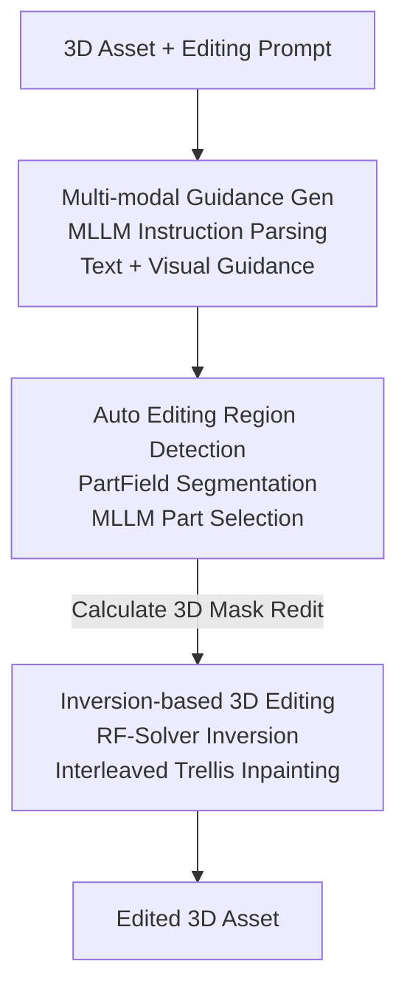

# Vinedresser3D: Towards Agentic Text-guided 3D Editing

**Conference**: CVPR 2026  
**Paper**: [CVF Open Access](https://openaccess.thecvf.com/content/CVPR2026/html/Chi_Vinedresser3D_Towards_Agentic_Text-guided_3D_Editing_CVPR_2026_paper.html)  
**Area**: Agent / 3D Vision  
**Keywords**: Text-guided 3D editing, MLLM Agent, Native 3D generation, Inversion-based editing, Mask-free  

## TL;DR
Vinedresser3D utilizes an MLLM (Gemini-2.5-Flash) as the central controller to schedule three types of tools—image editing, 3D segmentation, and inversion-based inpainting—within the latent space of the native 3D generative model Trellis. Using only a text prompt, it automatically localizes editing regions, generates multi-modal guidance, and performs high-quality "add/modify/delete" 3D editing without requiring manual 3D masks from the user.

## Background & Motivation

**Background**: Text-guided 3D editing (modifying an existing 3D asset using natural language) currently follows three main paradigms. First, Score Distillation Sampling (SDS) methods backpropagate gradients from 2D diffusion models to 3D representations for per-scene optimization. Second, "2D editing + 3D reconstruction" methods modify rendered images via multi-view diffusion and reconstruct them into 3D. Third is concurrent work like VoxHammer, which edits directly in the latent space of native 3D generative models.

**Limitations of Prior Work**: The SDS paradigm suffers from extremely slow per-scene optimization and unintended global changes due to imprecise parameter tuning. The "2D editing + 3D reconstruction" route is limited by multi-view inconsistency and spatial information loss from occlusions, leading to poor quality in unobserved regions and destruction of unedited geometry. While VoxHammer operates in 3D, it **still requires manual 3D masks** and struggles to understand complex instructions.

**Key Challenge**: An ideal text-guided 3D editing system must simultaneously achieve semantic understanding of complex instructions, precise automatic localization of 3D editing regions, and editing that adheres to prompts without damaging preserved parts. No existing single model excels in all three; capable MLLMs cannot directly manipulate 3D, while 3D generative models lack high-level semantic reasoning and require human-provided masks.

**Goal**: To decompose the problems of instruction understanding, region localization, and execution into sub-tasks for specialized tools, coordinated by a planning-capable MLLM brain.

**Key Insight**: The authors observe that MLLMs, image editing models, 3D segmentation, and native 3D flow models have reached maturity. They advocate for a shift from "single-model methods" to a "3D editing agent" paradigm. A notable finding is that although MLLMs are primarily trained on 2D data, they exhibit implicit 3D semantic understanding (e.g., correctly inferring which parts belong to an editing zone).

**Core Idea**: By using an MLLM as the planning core, the 3D editing process is reformulated into an agent pipeline: "Instruction Understanding $\rightarrow$ Multi-modal Guidance Generation $\rightarrow$ Automatic 3D Masking $\rightarrow$ Inversion-based Inpainting in Trellis Latent Space." This achieves mask-free, structure-preserving, high-quality 3D editing.

## Method

### Overall Architecture
The input is a 3D asset and editing prompt; the output is the edited asset. Centered on Gemini-2.5-Flash, the pipeline consists of three stages: **First, the MLLM parses instructions into structured text guidance and selects a view for an image editing model to produce visual guidance. Second, 3D segmentation and the MLLM automatically determine the editing voxels ($R_{\text{edit}}$). Finally, inversion and masked inpainting are performed in the Trellis latent space, where only editing regions are modified while other voxels are "copied back" from the original inversion trajectory to preserve identity.** Since Trellis generation is two-stage (structure then appearance), the pipeline is split into structural and appearance-level guidance.

### Key Designs

**1. Multi-modal Guidance Generation: Decoupling Instructions into Layered Text and Reference Images**

Native 3D models only typically accept simple text or single images and cannot reason through instructions like "turn the car into a train" while preserving details. Vinedresser3D uses multi-step prompting to "translate" instructions: the MLLM views multi-view renders of the asset to ① output a full description, identify components to be modified, and determine the edit type (addition/modification/deletion); ② predict the edited full description, constrained to preserve fine-grained details in non-edited areas; ③ extract standalone descriptions for new parts; and ④ further **decompose descriptions into structure-related (for stage 1 geometry) and appearance-related (for stage 2 latent features)**. Additionally, the MLLM selects the optimal viewpoint from 24 candidates for visual fidelity, feeding it to the Nano Banana model to generate a reference image.

**2. Automatic Editing Region Detection: Mask-Free 3D Mask via PartField + MLLM + KNN**

This eliminates manual masks. For modification/deletion, PartField segments the asset into $S$ semantic parts. The asset, colored segmental views, and target text are fed to the MLLM to select the editing part $P_{\text{edit}}$, leaving the rest as preserved parts $P_{\text{pres}}=A\setminus P_{\text{edit}}$. To refine localization, the MLLM selects the best granularity among $S\in[3,8]$. For modifications, to prevent Trellis from accidentally modifying empty voxels adjacent to preserved geometry, the system defines $R_{\text{edit}}$ as:

$$R_{\text{edit}} = \begin{cases} C\setminus A & \text{addition}\\ P_{\text{edit}} & \text{deletion}\\ P_{\text{edit}}\cup(C\setminus \text{bbox}_{\text{pres}})\cup V & \text{modification} \end{cases}$$

Where $V=\{v\mid v\in \text{bbox}_{\text{pres}}\setminus A,\ \text{PropKNN}(v)>\tau\}$, $C$ is the voxel grid, and $\tau$ is a threshold for the proportion of $P_{\text{edit}}$ voxels among $k$-nearest neighbors.

**3. Inversion-based 3D Editing: RF-Solver and Interleaved Trellis Inpainting**

The asset is inverted to structural noise using RF-Solver, which incorporates a second-order Taylor term $X_{i-1}=X_i+(t_{i-1}-t_i)v_\theta(X_i,t_i)+\tfrac{1}{2}(t_{i-1}-t_i)^2 v_\theta^{(1)}(X_i,t_i)$ to improve fidelity over standard first-order solvers. Inversion uses CFG=0 to minimize reconstruction error. During denoising, voxels outside $R_{\text{edit}}$ are replaced with features from the original inversion trajectory.

The core innovation is **Interleaved Trellis**: only using text guidance leads to poor detail due to scarce 3D training data, whereas only using image guidance fails in occluded areas. The agent **alternates one step of Trellis-text and one step of Trellis-image**, interleaving the velocity fields of both models to achieve broad semantic alignment and high-fidelity detail.

## Key Experimental Results

### Main Results
Evaluation was conducted on 57 assets (Trellis gen, GSO, PartObjaverse-Tiny). Metrics include CLIP-T (text alignment), CD/PSNR/SSIM/LPIPS (preservation), and FID (overall quality). 

| Method | Manual Mask Needed | CLIP-T↑ | CD↓ | PSNR↑ | SSIM↑ | LPIPS↓ | FID↓ |
|------|:--:|--------|------|-------|-------|--------|------|
| Instant3dit | ✓ | 0.227 | 0.027 | 20.86 | 0.851 | 0.153 | 80.35 |
| VoxHammer | ✓ | 0.235 | 0.027 | 24.36 | 0.890 | 0.087 | 34.95 |
| Trellis | ✓ | 0.247 | 0.010 | 37.35 | 0.984 | 0.017 | 31.10 |
| **Ours** (Mask-free) | ✗ | **0.252** | 0.016 | 29.45 | 0.953 | 0.045 | **29.49** |
| **Ours w/ HM** | ✓ | **0.252** | **0.008** | **37.69** | **0.984** | **0.015** | **27.38** |

The mask-free version achieves SOTA in CLIP-T and FID. With human masks (HM), the method outperforms all baselines across all metrics. User studies show a >79.3% preference rate over VoxHammer/Trellis.

### Ablation Study

| Config | PSNR↑ | SSIM↑ | LPIPS↓ | FID↓ |
|------|-------|-------|--------|------|
| Ours (Full) | 29.45 | 0.953 | 0.045 | 29.49 |
| w/o Trellis-text | 28.06 | 0.943 | 0.054 | 30.59 |
| w/o $R_{\text{edit}}$ | 25.65 | 0.921 | 0.068 | 33.95 |

### Key Findings
- **Removing $R_{\text{edit}}$ causes the largest drop**: PSNR drops and FID increases significantly. Without the mask injecting preservation features, the denoising process lacks regularization, damaging preserved parts.
- **Interleaved sampling is crucial**: Relying solely on the image branch leads to distortions in occluded areas, while the text branch provides semantic stability.
- CFG=0 during inversion is counter-intuitively the most stable for minimizing reconstruction error, unlike standard generation.

## Highlights & Insights
- **Bridging 2D MLLM to 3D**: Demonstrates that 2D-trained MLLMs can implicitly understand 3D semantics and coordinate 3D pipelines.
- **Automated Localization**: Resolves the friction of manual 3D masking by using part segmentation combined with MLLM-based spatial reasoning.
- **Interleaved Denoising**: A lightweight, transferable trick for fusing multi-modal guidance by alternating velocity fields to balance disparate strengths.

## Limitations & Future Work
- The MLLM **does not accept native 3D input**, relying on rendered views, which limits direct 3D reasoning.
- The pipeline is **highly dependent on external tool quality** (e.g., PartField's accuracy); errors in segmentation propagate downstream.
- Evaluation scale (57 assets) is relatively small, and the robustness to vague or adversarial user prompts requires more extensive testing.

## Related Work & Insights
- **vs. VoxHammer**: Both use latent space editing, but Vinedresser3D's mask-free automation and complex instruction handling provide a significant usability advantage.
- **vs. 2D-proxy methods (e.g., Instant3dit)**: By operating in the 3D latent space, Vinedresser3D avoids the inconsistency and quality degradation common in multi-view reconstruction pipelines.

## Rating
- Novelty: ⭐⭐⭐⭐⭐ 
- Experimental Thoroughness: ⭐⭐⭐⭐ 
- Writing Quality: ⭐⭐⭐⭐ 
- Value: ⭐⭐⭐⭐⭐ 

<!-- RELATED:START -->

## Related Papers

- [\[CVPR 2026\] REALM: An MLLM-Agent Framework for Open World 3D Reasoning Segmentation and Editing on Gaussian Splatting](realm_mllm_agent_3d_reasoning_gaussian.md)
- [\[ICML 2026\] HawkesLLM: Semantic Uncertainty Propagation in Agentic Text Simulation](../../ICML2026/llm_agent/hawkesllm_semantic_uncertainty_propagation_in_agentic_text_simulation.md)
- [\[CVPR 2026\] VULCAN: Tool-Augmented Multi Agents for Iterative 3D Object Arrangement](vulcan_tool-augmented_multi_agents_for_iterative_3d_object_arrangement.md)
- [\[CVPR 2025\] ATA: Adaptive Transformation Agent for Text-Guided Subject-Position Variable Background Generation](../../CVPR2025/llm_agent/ata_adaptive_transformation_agent_for_text-guided_subject-position_variable_back.md)
- [\[CVPR 2026\] SceneAssistant: A Visual Feedback Agent for Open-Vocabulary 3D Scene Generation](sceneassistant_a_visual_feedback_agent_for_openvoc.md)

<!-- RELATED:END -->
