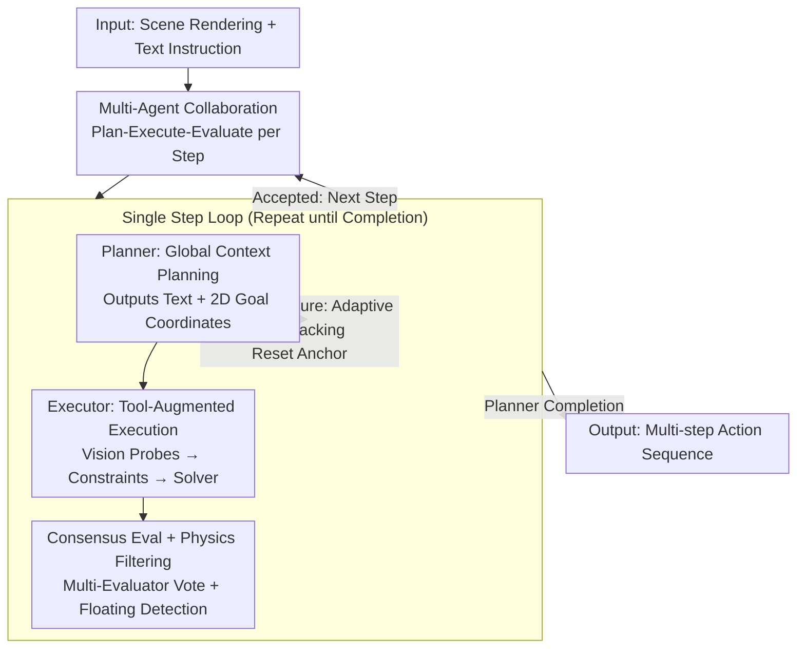

# VULCAN: Tool-Augmented Multi Agents for Iterative 3D Object Arrangement

**Conference**: CVPR 2026  
**Paper**: [CVF Open Access](https://openaccess.thecvf.com/content/CVPR2026/html/Kuang_VULCAN_Tool-Augmented_Multi_Agents_for_Iterative_3D_Object_Arrangement_CVPR_2026_paper.html)  
**Code**: [vulcan-3d.github.io](https://vulcan-3d.github.io) (Project Page)  
**Area**: Agent / 3D Vision  
**Keywords**: Multi-Agent, Tool-Augmented, 3D Object Arrangement, MCP, Long-horizon Planning

## TL;DR
VULCAN upgrades "3D object repositioning based on instructions" from a single-step edit to a multi-agent long-horizon task with a "Plan-Execute-Evaluate" loop. It replaces fragile raw script operations with MCP vision APIs and constraint solvers, utilizes three types of specialized agents to distribute global planning and local execution, and incorporates adaptive backtracking search to recover from deadlocks. On 25 complex scenes, it reduces collision and floating rates to 0, significantly outperforming all baselines.

## Background & Motivation
**Background**: As Multi-modal Large Language Models (MLLMs) become increasingly effective in 2D vision-language tasks, several works have begun employing MLLMs for 3D object arrangement—moving, rotating, or inserting objects to create a reasonable layout based on a rendered image and a text instruction. The mainstream approach involves MLLMs reading an intermediate representation (textual scene descriptions, code scripts, or rendered images) to generate a complete edit in a single step.

**Limitations of Prior Work**: These methods treat arrangement as a **single-step process**, moving from the initial scene to the target state via one comprehensive edit. However, real-world tasks are often multi-step (e.g., "clear the table first, then move the table, finally set the chairs"). The single-step paradigm cannot represent dependencies where step A must precede step B. Furthermore, the visual grounding of MLLMs is weak; it is difficult for them to map a "line of code in a script" to a "precise point in 3D space," as they are either overwhelmed by raw 3D data or lack sufficient spatial relationship info from simplified inputs.

**Key Challenge**: In iterative arrangement, any analysis or execution error **propagates along the chain and accumulates**, leading the entire process astray within a few steps. Moreover, assigning "long-horizon global strategy + single-step fine execution + physical plausibility verification" to a single MLLM causes severe overload and context window issues. Additionally, the search space for multi-step arrangement expands exponentially with the number of steps, making exhaustive search infeasible.

**Goal**: To enable the system to **flexibly decompose tasks** like a human—solving simple requests in a single step while automatically decomposing complex requests into ordered multi-step plans, ensuring high fidelity and recoverability at every step.

**Key Insight**: Recent progress in MLLM tool calling and the Model Context Protocol (MCP) suggests a new path: outsourcing low-level tasks that MLLMs struggle with to externally defined APIs. Following this logic, the authors outsource "analysis" and "execution" to specialized modules and address multi-step fragility through multi-agent collaboration combined with backtracking search.

**Core Idea**: Use "MCP vision tools + constraint solvers" to replace fragile raw code editing, drive long-horizon arrangement with a collaboration loop of "Planning/Execution/Evaluation" specialized agents, and efficiently find a feasible path to the target in an exponential search space using adaptive backtracking.

## Method

### Overall Architecture
VULCAN aims to solve the following: given an image $I$ rendered under a fixed camera $C$, an underlying 3D scene $S$, and a text instruction $T$, output a sequence of **single-object arrangement actions** that progressively reach the goal while maintaining physical plausibility (Collision-Free, Floating-Free, and High Semantic Quality at every step).

The system follows a "Plan-Execute-Evaluate" loop, where each step is completed by three specialized agents in relay: **Planner** (observes global context to decide what to move and where to move it) $\rightarrow$ **Executor** (uses a tool library to translate high-level intent into precise 3D poses) $\rightarrow$ **Evaluator** (visually inspects the quality of the step, cooperating with rule-based physical checks to accept or reject). This loop repeats until the Planner determines the final layout satisfies the original instruction. Two key principles guide the division of labor: ① Only the Planner receives global context (instructions + history of all step renderings), while the Executor/Evaluator work within the local scope of the current step; ② Only the Executor directly operates on the 3D scene, while the other two agents only see rendered images. When a step fails repeatedly, adaptive backtracking moves the "restart anchor" to an appropriate depth to avoid the entire chain failing due to a single error.

### Key Designs

**1. MCP Vision Tool Library + Constraint Solver: Replacing fragile scripts with verifiable 2D→3D mapping**

The pain point is that asking an MLLM to write Blender scripts directly is too fragile—it must handle instruction grounding, calculate 3D geometry, and ensure physical plausibility simultaneously. VULCAN decomposes the Executor's function into a fixed three-stage pipeline: **Vision Probing → Constraint Construction → Optimization Solving**. The vision probes provide three MCP APIs for the agent to "actively look" at the scene: `ListObjectsInArea(x0,y0,x1,y1)` returns object names in an image region, `RayProbe(x,y)` casts a ray from the camera and returns the 3D position/object name/plane of the first hit, and `RenderWithHighlight(objs)` renders an instance segmentation map to disambiguate objects (e.g., identifying which specific "Book" is being referenced). After obtaining 3D elements, the agent assembles the intent into a set of geometric constraints—the vocabulary includes $\text{CloseToPix}(obj,x,y)$, $\text{Contact}(obj,dir,p)$, $\text{NoOverhang}$, $\text{Distance}(obj,obj_2,dist)$, $\text{FaceTo}$, $\text{Rotate}(obj,degree)$, etc. Finally, a **sampling-based solver** is used: it perturbs the Planner's target pixel $c$ with variance $\sigma_{pix}$ into variants $c'_{1..n}$, minimizes the constraint loss using AdamW for each variant to obtain candidate poses, pre-filters via an error threshold $\tau$, and uses collision detection to select the best collision-free solution.

$$\{c'_1,\dots,c'_n\}\sim\mathcal{N}(c,\sigma_{pix}),\quad T_i=\arg\min_T \mathcal{L}_{\text{constraint}}(T;D,c'_i)$$

This design fills the gap between "language-level intent" and "numerical-level pose" using deterministic modules. The MLLM only outputs symbolic intent, while physical validity is ensured by the solver and collision detection.

**2. Specialized Agent Collaboration + Context Partitioning: Separating long-horizon strategy from execution**

Forcing a single MLLM to handle both long-horizon strategy and fine-grained execution leads to overload. VULCAN splits roles: the **Planner** reads user instructions and the history of rendering timelines to understand scene evolution and decide the next move. It outputs both a text instruction and a normalized 2D target coordinate $c=(x,y)$. The **Executor** focuses only on the current step, using the tool library to project the 2D command into 3D. The **Evaluator** performs visual inspection. Information is strictly partitioned: global context is only for the Planner, and 3D scene access is only for the Executor. This reduces context burden and preserves reasoning quality.

**3. Consensus Evaluation + Rule-based Physics Check: Suppressing hallucinations via voting and deterministic checks**

The Evaluator rates arrangements on a five-point scale (terrible/bad/fair/good/excellent), but MLLMs occasionally hallucinate and rate poor placements as "excellent." VULCAN uses **consensus filtering** to mitigate this: multiple Evaluator agents run simultaneously, mapping ratings to $-2$ to $+2$ and averaging them; a solution is only accepted if the consensus score is positive. This is overlaid with **rule-based physical checks** (e.g., floating detection). To improve accuracy, input images are augmented with **visual annotations**: pixel labels and normalized dashed grids help the Planner and Executor, while arrows visualize the movement from start to end for the Evaluator.

**4. Adaptive Backtracking Search: Efficiently recovering from deadlocks**

Multi-step search spaces expand exponentially, and early mistakes can make later steps impossible. VULCAN introduces **adaptive backtracking**: it maintains an **anchor step** as a restart position. If a step fails repeatedly, the anchor moves back to half the current depth. If the action sequence reaches a new maximum length (progress), the anchor moves forward. This strategy prunes hopeless branches more effectively than exhaustive or fixed-step backtracking.

## Key Experimental Results

The dataset consists of 25 curated scenes with 111 unit tasks designed with inter-step dependencies. Metrics include Collision Rate (Coll.%↓), Floating Rate (Fl.%↓), Plausibility (MLLM 0-4 scale)↑, and Consistency (MLLM 0-4 scale)↑.

### Main Results

| Method | Coll.%↓ | Fl.%↓ | Plausibility↑ | Consistency↑ |
|:---|:---:|:---:|:---:|:---:|
| Blender-MCP | 0.459 | 0.774 | 3.348 | 2.973 |
| BlenderAlchemy | 0.631 | 0.676 | 3.368 | 2.770 |
| FirePlace* | 0.513 | 0.225 | 3.515 | 3.135 |
| **Ours** | **0.000** | **0.000** | **3.796** | **3.592** |

VULCAN achieves a **0** collision and floating rate while leading in plausibility and consistency.

### Ablation Study

| Configuration | Coll.%↓ | Fl.%↓ | Plaus.↑ | Const.↑ |
|:---|:---:|:---:|:---:|:---:|
| w/o Multi-Tool Library | 0.495 | 0.711 | 3.484 | 3.103 |
| w/o Backtracking | 0.036 | 0.054 | 3.703 | 3.549 |
| w/o MCP Tools | 0.603 | 0.738 | 3.357 | 3.067 |
| Single Agent | 0.000 | 0.000 | 3.623 | 3.328 |
| **Ours (Full)** | **0.000** | **0.000** | **3.796** | **3.592** |

### Key Findings
- **Tools/MCP are essential for physical correctness**: Removing the tool library or MCP tools causes collision and floating rates to spike.
- **Backtracking prevents rare physical flaws**: Disabling it causes non-zero physical errors, proving its value in escaping deadlocks.
- **Multi-agent setup preserves reasoning quality**: The single-agent variant maintains physical validity (due to the solver) but shows a significant drop in semantic plausibility and consistency.

## Highlights & Insights
- **Verifiable Evaluation**: Using consensus voting and rule-based checks to suppress MLLM hallucinations creates a robust "don't just trust the LLM" pattern.
- **High-leverage Visual Annotations**: Adding coordinate grids and arrows solves the MLLM difficulty in comparing similar images with almost zero cost.
- **Adaptive Anchor Backtracking**: Dynamically adjusting retry depth based on progress is more intelligent than fixed methods for long-horizon tasks.

## Limitations & Future Work
- **Single Camera Constraint**: Currently limited to a single view, making tasks requiring hidden perspectives (e.g., placing a chair behind a wall) difficult.
- **Heavy Dependence on Strong Backbones**: Reliability on weaker MLLMs or real-world robotic environments remains unverified.
- **Solver Sensitivity**: The trade-off between the number of parallel attempts and computational cost requires further exploration.

## Related Work & Insights
- **vs FirePlace / ScanEdit**: These use constraint solvers but are limited to single-step operations. VULCAN adds the "Iterative" dimension via multi-agent planning.
- **vs BlenderAlchemy**: Shares the multi-agent loop but lacks the interactive visual tools and solvers, which VULCAN proves are necessary for 2D→3D grounding.
- **vs Data-driven 3D Models**: VULCAN follows the paradigm of "MLLM commonsense + external tools" rather than training 3D generative models, offering better generalization.

## Rating
- Novelty: ⭐⭐⭐⭐
- Experimental Thoroughness: ⭐⭐⭐⭐
- Writing Quality: ⭐⭐⭐⭐
- Value: ⭐⭐⭐⭐

<!-- RELATED:START -->

## Related Papers

- [\[CVPR 2026\] Refer-Agent: A Collaborative Multi-Agent System with Reasoning and Reflection for Referring Video Object Segmentation](refer-agent_a_collaborative_multi-agent_system_with_reasoning_and_reflection_for.md)
- [\[ACL 2026\] Spec-o3: A Tool-Augmented Vision-Language Agent for Rare Celestial Object Candidate Identification](../../ACL2026/llm_agent/spec-o3_a_tool-augmented_vision-language_agent_for_rare_celestial_object_candida.md)
- [\[ICLR 2026\] PhyScensis: Physics-Augmented LLM Agents for Complex Physical Scene Arrangement](../../ICLR2026/llm_agent/physcensis_physics-augmented_llm_agents_for_complex_physical_scene_arrangement.md)
- [\[ICLR 2026\] InfoMosaic-Bench: Evaluating Multi-Source Information Seeking in Tool-Augmented Agents](../../ICLR2026/llm_agent/infomosaic-bench_evaluating_multi-source_information_seeking_in_tool-augmented_a.md)
- [\[CVPR 2026\] Paper2Figure: A Multi-Agent Collaborative System for Figure Generation Towards Academic Research Paper](paper2figure_a_multi-agent_collaborative_system_for_figure_generation_towards_ac.md)

<!-- RELATED:END -->
## Related Papers

- [\[ACL 2026\] Spec-o3: A Tool-Augmented Vision-Language Agent for Rare Celestial Object Candidate Identification](../../ACL2026/llm_agent/spec-o3_a_tool-augmented_vision-language_agent_for_rare_celestial_object_candida.md)
- [\[ICLR 2026\] PhyScensis: Physics-Augmented LLM Agents for Complex Physical Scene Arrangement](../../ICLR2026/llm_agent/physcensis_physics-augmented_llm_agents_for_complex_physical_scene_arrangement.md)
- [\[CVPR 2026\] Vinedresser3D: Towards Agentic Text-guided 3D Editing](vinedresser3d_towards_agentic_text-guided_3d_editing.md)
- [\[CVPR 2026\] Think, Then Verify: A Hypothesis-Verification Multi-Agent Framework for Long Video Understanding](think_then_verify_a_hypothesis-verification_multi-agent_framework_for_long_video.md)
- [\[CVPR 2026\] SceneAssistant: A Visual Feedback Agent for Open-Vocabulary 3D Scene Generation](sceneassistant_a_visual_feedback_agent_for_openvoc.md)

<!-- RELATED:END -->
