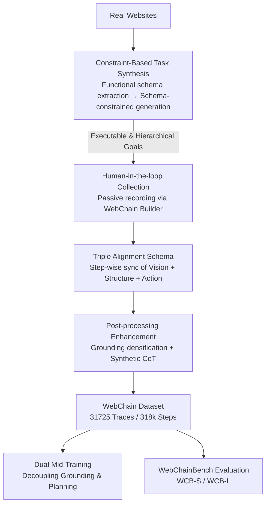

# WebChain: A Large-Scale Human-Annotated Dataset of Real-World Web Interaction Traces

**Conference**: CVPR 2026  
**Paper**: [CVF Open Access](https://openaccess.thecvf.com/content/CVPR2026/html/Fan_WebChain_A_Large-Scale_Human-Annotated_Dataset_of_Real-World_Web_Interaction_Traces_CVPR_2026_paper.html)  
**Code**: To be confirmed (authors claim full open-sourcing of data, collection tools, and benchmarks)  
**Area**: Web Agent / GUI Agent / Dataset  
**Keywords**: web agent, human-annotated traces, triple alignment, visual grounding, long-range planning

## TL;DR
WebChain is collected from real human operations on live websites, constructing the largest human-annotated web interaction trace dataset to date (31,725 traces, 318k steps, 428 domains). Its core feature is the "triple alignment" of visual screenshots, structural Accessibility Trees (AX Trees), and action coordinates. Based on this, a Dual Mid-Training recipe is proposed to decouple spatial grounding and long-range planning, achieving SOTA results on the self-built WebChainBench and multiple public GUI benchmarks.

## Background & Motivation
**Background**: Browsers serve as the gateway for most digital tasks. Enabling agents to "understand pages + click precisely + plan long-term" is a primary goal in the GUI agent field. While Vision-Language-Action (VLA) modeling has emerged, training such agents depends heavily on large-scale, high-quality interaction trace data.

**Limitations of Prior Work**: Existing data sources follow two problematic paths. **Open-source human-annotated datasets** (Mind2Web, WebLINX, GUIAct, etc.) are reliable but small—Mind2Web has 2,350 traces and WebLINX has 2,337, insufficient to validate the scaling laws of modern GUI agents; most also lack structural supervision like AX Trees. **Data synthesis methods** (Explorer, OS-Genesis, etc.) can scrape traces at low cost but fail against security mechanisms: they collapse during anti-crawling, CAPTCHA, or scenarios requiring authentication (e.g., banking, e-commerce checkout), missing high-value workflows.

**Key Challenge**: It is difficult to achieve scale, authenticity, and reproducibility simultaneously. Scale requires synthesis, which cannot access authenticated pages; quality requires human annotation, which is traditionally hard to scale. Worse, many scaling studies rely on **private datasets**, making core findings non-reproducible and hindering community consensus.

**Goal**: To build a "fully open-source + large-scale + human-annotated + multi-modal aligned" web interaction ecosystem that validates scaling effects and supports rigorous, reproducible evaluation.

**Key Insight**: Since synthesis cannot bypass security barriers, humans should operate real websites—while strictly recording every layer of context (pixels, page structure, executed actions) to form dense supervisory signals.

**Core Idea**: Use "Triple Alignment" to synchronize visual, structural, and action contexts into a trace, supported by a scalable human-in-the-loop collection pipeline. This data is then used to validate a Dual Mid-Training recipe that decouples spatial grounding from long-range planning.

## Method

### Overall Architecture
As a dataset paper, the "Method" consists of two parts: **data construction** (three-stage pipeline + triple alignment schema) and **utilization** (Dual Mid-Training recipe + WebChainBench).

Data construction follows a serial pipeline: first, use "functional constraints" for LLM-synthesized diverse task goals; second, have human annotators complete these tasks while passively recording multi-modal traces; finally, apply post-processing (visual grounding negative sampling + synthetic CoT reasoning). Each step includes vision, structure, action, and reasoning, forming a $(State, Action, Reward, Next State)$ tuple.

### Key Designs

**1. Triple Alignment: Enabling models to see pages and structural logic**

Existing datasets often provide only screenshots (lacking structure) or only DOM text (lacking vision), leading to spatial hallucinations. WebChain synchronizes three layers: **Visual Context** (viewport + full-page screenshots), **Structural Context** (HTML and AX Tree snapshots), and **Action Alignment** (pixel coordinates, bounding boxes, CSS selectors, XPath, and inner text). This ensures "what I see," "structural semantics," and "where I clicked" correspond perfectly. It is the **only** dataset covering real websites, human traces, bounding boxes, AX trees, and timestamps simultaneously.

**2. Constraint-Based Task Synthesis: Ensuring tasks are executable on specific sites**

To prevent LLM hallucinations (e.g., asking to sort by rating on a site without that feature), WebChain uses two steps. First, it performs **static function extraction** to obtain a structured functional schema: Domain Semantics and Interactivity & Logic (sorting, filters, and conditional dependencies). Then, a generator LLM synthesizes tasks **explicitly conditioned on this schema**, categorized by complexity: simple retrieval, multi-constraint navigation, and conditional dependency tasks.

**3. WebChain Builder: Passive dense supervision recording**

Synthesized tasks serve as targets for annotators. While humans complete tasks on real sites, the WebChain Builder tool **passively** records every step: DOM snapshots, actions (click/type/scroll), high-fidelity spatial data (coordinates + bounding boxes), and element metadata. This allows entry into high-value authenticated workflows. Traces average 10.02 steps, emphasizing long-range dependencies.

**4. Post-processing Enhancement: From single element to layout understanding and reasoning**

Raw traces are enhanced in two ways. **Visual Grounding Densification (VGD)**: By parsing the viewport and extracting bounding boxes for all interactive elements, it transforms "clicking one element" into a "layout-aware dense segmentation problem." **Synthetic Rationale Generation (CoT)**: A strong VLM generates natural language reasoning ("think aloud") for each action based on the global goal and history, making implicit cognitive processes explicit.

**5. Dual Mid-Training: Decoupling spatial grounding and long-range planning**

The training recipe separates Spatial-Grounding RLVR (SGRL) from Long-Chain RLVR (LCRL). The weighted reward is:
$$r_t = \alpha\, r_t^{\text{type}} + (1-\alpha)\, r_t^{\text{content}}$$
where $r_t^{\text{type}}$ is 1 if the action type matches the ground truth, and $r_t^{\text{content}}$ is 1 if parameters are correct (e.g., click falls within $b_t^*$). A key finding is that the two tasks have different perceptual requirements: **Spatial Grounding** benefits from Reasoner Prompting (RP), while **Long-range Planning** performs better with non-RP + VGD + LCRL.

### Related Work & Insights

| Feature | WebChain | Mind2Web | WebArena(Env) | WebLINX | GUIAct(multi) |
|------|----------|----------|---------------|---------|---------------|
| Traces | **31,725** | 2,350 | N/A | 2,337 | 5,696 |
| Steps | **318k** | 17,155 | N/A | 100k+ | 44k |
| Domains | **428** | 137 | 4 domains | 155 | 121 |
| Real Websites | ✓ | ✓ | × | ✓ | ✓ |
| Human Traces | ✓ | ✓ | × | ✓ | ✓ |
| Bounding Box | ✓ | ✓ | × | ✓ | ✓ |
| Accessibility Tree | ✓ | × | ✓ | × | × |
| Time Stamps | ✓ | ✓ | × | ✓ | × |

## Key Experimental Results

### Main Results: Success Rate (SR) on public GUI benchmarks

| Model | Training Data | Overall SR |
|------|----------|-----------|
| Qwen2.5-VL-3B | Zero-shot | 50.1 |
| Qwen2.5-VL-7B | Zero-shot | 70.9 |
| GUI-R1-3B | Other Datasets | 70.5 |
| WebChain-LCRL-3B +SGRL+CoT-SFT | WebChain | **77.3** |
| WebChain-LCRL-7B +SGRL+CoT-SFT | WebChain | **81.4** |

### Ablation Study: Gains of Dual Mid-Training on WCB-L

| Configuration | WCB-L |
|------|-------|
| GUI-R1-3B | 0.487 |
| Directly LCRL | 0.603 |
| +CoT-SFT | 0.629 |
| +SGRL | 0.632 |
| +Both (Dual Mid-Training) | **0.658** |

### Key Findings
- **Scale dictates long-range capability**: Performance on WCB-L rises monotonically with data volume, confirming WebChain's scale is essential for robust planning.
- **Opposing recipes for Grounding vs. Planning**: RP serves as a regularizer for spatial tasks but hurts planning; non-RP + VGD is superior for the latter.
- **VGD is a task-agnostic enhancement**: Including dense instruction-coordinate pairs improves data efficiency across all tasks.
- **CoT-SFT provides a stable warm start**: CoT mid-training raises the performance ceiling for downstream RL.

## Highlights & Insights
- **Bypassing the "authentication gap"**: Human-in-the-loop collection captures high-value workflows (banking, shopping) that automated crawlers cannot access.
- **Triple alignment mitigates spatial hallucinations**: Providing both bounding boxes and AX Trees forces the model to align intention with precise structural and visual targets.
- **Asymmetric training recipes**: The discovery that RP benefits grounding but hinders planning suggests that GUI agents should not be trained with a one-size-fits-all approach.

## Limitations & Future Work
- **VLM-generated CoT vs. Human intent**: Reasoning chains are post-hoc generations by a VLM, which may contain noise or deviate from the annotator's actual logic.
- **Rule-based rewards**: Rewards rely on coordinate matching and string supersets, which may misjudge semantically equivalent but formally different actions.
- **Maintenance cost**: Real websites evolve; maintaining the temporal relevance of offline human traces is a significant challenge.

## Rating
- Novelty: ⭐⭐⭐⭐ 
- Experimental Thoroughness: ⭐⭐⭐⭐ 
- Writing Quality: ⭐⭐⭐⭐ 
- Value: ⭐⭐⭐⭐⭐ 

<!-- RELATED:START -->

## Related Papers

- [\[ACL 2026\] YIELD: A Large-Scale Dataset and Evaluation Framework for Information Elicitation Agents](../../ACL2026/llm_agent/yield_a_large-scale_dataset_and_evaluation_framework_for_information_elicitation.md)
- [\[ICML 2026\] Video2GUI: Synthesizing Large-Scale Interaction Trajectories for Generalized GUI Agent Pretraining](../../ICML2026/llm_agent/video2gui_synthesizing_large-scale_interaction_trajectories_for_generalized_gui_.md)
- [\[CVPR 2026\] ModularAgent: A Task-Aware Modular Framework for Joint Optimization of Multimodal Large Language Models and World Models](modularagent_a_task-aware_modular_framework_for_joint_optimization_of_multimodal.md)
- [\[CVPR 2026\] Ego2Web: A Web Agent Benchmark Grounded in Egocentric Videos](ego2web_a_web_agent_benchmark_grounded_in_egocentric_videos.md)
- [\[ICLR 2026\] OpenAgentSafety: A Comprehensive Framework for Evaluating Real-World AI Agent Safety](../../ICLR2026/llm_agent/openagentsafety_a_comprehensive_framework_for_evaluating_real-world_ai_agent_saf.md)

<!-- RELATED:END -->
