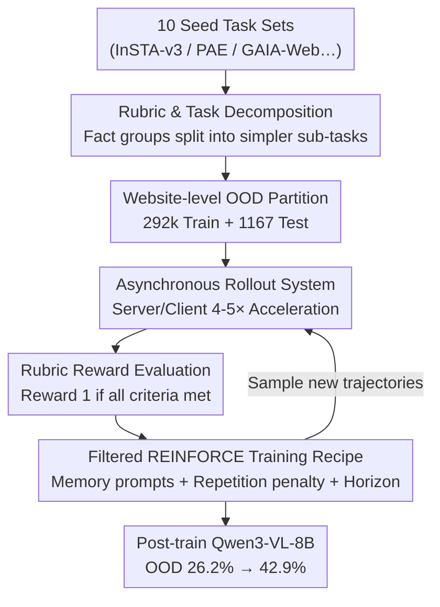

# WebGym: Scaling Training Environments for Long-Horizon Visual Web Agents with Realistic Tasks

**Conference**: CVPR 2026  
**Paper**: [CVF Open Access](https://openaccess.thecvf.com/content/CVPR2026/html/Bai_WebGym_Scaling_Training_Environments_for_Long-Horizon_Visual_Web_Agents_with_CVPR_2026_paper.html)  
**Area**: Agent  
**Keywords**: Visual web agent, reinforcement learning training environment, asynchronous rollout, task decomposition, rubric evaluation

## TL;DR
WebGym aggregates 10 existing web benchmarks and programmatically expands them into nearly 300,000 realistic web tasks with rubric evaluations. Combined with an asynchronous rollout system that provides 4-5× acceleration, it uses vanilla REINFORCE to improve the open-source Qwen3-VL-8B from 26.2% to 42.9% on an OOD test set consisting entirely of unseen websites, outperforming GPT-4o (27.1%) and GPT-5-Thinking (29.8%).

## Background & Motivation
**Background**: Visual web agents take screenshots as observations and output mouse and keyboard actions to complete multi-step tasks, such as "Comparing prices and specs of AirPod 3 and AirPod 2 on Apple.com." Recently, supervised fine-tuning or task-specific training has been shown to turn strong VLMs into capable web agents. Meanwhile, online reinforcement learning (RL) has proven effective for continuous improvement in text-based domains like coding and mathematics.

**Limitations of Prior Work**: Adapting RL to the visual web domain is exceptionally difficult due to three bottlenecks. First, **tasks are too few and static**: existing benchmarks are designed for evaluation, featuring small scales and fixed websites, whereas real websites are non-stationary. Second, **reliable rewards are lacking**: most web tasks lack reference answers, and trajectories often end on pages that look correct but are actually wrong, making binary success signals hard to determine. Third, **rollout is too slow**: browser simulation consumes significant wall-clock time, and naive synchronous sampling causes idle waiting for slow sessions, leading to CPU/GPU underutilization.

**Key Challenge**: Scaling RL requires the simultaneous fulfillment of three needs: a large and diverse task set, clear evaluation protocols, and high rollout throughput. Prior training environments (e.g., WebRL, PAE) typically fail to satisfy all three.

**Goal**: Build a training environment that truly supports RL scaling by addressing these three gaps and use it to train an open-source 8B VLM to SOTA levels.

**Key Insight**: Use an LLM to decompose seed tasks into structured "fact group rubrics" that serve as both evaluation standards and the basis for task decomposition. This allows for the programmatic generation of "simpler but well-defined" sub-tasks. An asynchronous server/client rollout system is implemented to eliminate synchronization barriers, followed by training with filtered REINFORCE.

## Method

### Overall Architecture
WebGym is a training environment comprising a data-evaluation-system-training suite. The pipeline starts by aggregating 10 high-frequency task sets as **seeds**. It uses GPT-4o to generate fact-group rubrics for each seed and **programmatically decomposes** them into simpler sub-tasks, totaling nearly 300,000 tasks. A website-level OOD test set is partitioned for strict isolation. During training, an **asynchronous rollout system** samples trajectories with high throughput. Rubrics categorize trajectories into binary rewards, and a **filtered REINFORCE** recipe (retaining only successful trajectories for behavioral cloning) updates the policy, supported by memory prompts, repetition penalties, horizon truncation, and sampling ratios.

### Key Designs

**1. Rubric-Driven Task Decomposition: Programmatic Fission of "Large Tasks"**

RL requires a massive volume of multi-difficulty tasks with dense reward signals. WebGym generates a structured rubric for each seed task using GPT-4o—decomposing evaluation into several **fact groups**, each containing one or more criteria. Task **difficulty** is defined as the total count of facts across all groups. Programmatic decomposition is allowed if and only if there are at least 2 fact groups and at least one group is "large" ($\ge 3$ facts). The decomposition creates **proper subsets** of the fact groups, ensuring that every subset contains at least one large group to avoid regression into trivial tasks. This ensures that generated tasks are non-trivial, strictly simpler than the original, and well-defined. Unlike PAE (which may synthesize unsolvable tasks) or AgentSynth (which requires rollout for task creation), WebGym's decomposition requires **no rollout**, making it controllable and low-cost. The final set includes 258,595 original tasks + 33,497 decomposed tasks = 292,092 total, covering 127,645 websites.

**2. Website-Level OOD Partition: Reliable Generalization Evaluation**

Prior works often use entire benchmarks as held-out sets, but benchmarks frequently share websites, domains, and task patterns. WebGym establishes a partition at the **task and website level**: constructing an OOD test set of 1,167 tasks, each from a **different website**, and deleting all tasks in the training set belonging to those test websites. This ensures that OOD tasks originate from websites entirely unseen during training, making the 42.9% result a more robust measure of cross-website generalization.

**3. Structured Rubric Reward: Fact Matching + Keyframe Selection**

Evaluating long-horizon visual tasks is difficult because trajectories may show partial progress or end on similar-looking but incorrect pages. WebGym uses LLM judging combined with reference sub-overrides. Each task is paired with a fact-group rubric; **reward is only granted if all criteria are satisfied**. To handle uninformative screenshots, the judge uses **keyframe selection** to retain evidence-bearing pages. Validation on 80 human-annotated trajectories shows that rubrics improve the accuracy and precision of GPT-4o, Qwen3-VL-8B, and Gemma3-27B judges. While the rubric can be overly strict (slight recall drop), this trade-off benefits RL by providing more precise learning signals.

**4. Asynchronous Rollout System: 4-5× Throughput for Web Agent RL**

The primary bottleneck in RL scaling is slow rollout. In synchronous implementations, a group of browser sessions moves in lockstep, causing "burst-and-idle" patterns where fast sessions wait for slow ones. WebGym adopts a **server/client architecture**: the CPU-side server uses a master/worker paradigm for browser simulation, while the GPU-side client hosts the agent and asynchronously receives observations. New tasks begin inference as soon as resources are free, with **no synchronization between steps or episodes**. In tests using 24 H100 GPUs and 64 CPUs to collect 1,800 trajectories, the asynchronous system finished in 48.6 minutes compared to 264 minutes for the synchronous version ($\approx 5.4\times$ speedup).

### Loss & Training
The policy is updated using a simplified **REINFORCE** approach: binary terminal rewards, no baseline, and no negative gradients—equivalent to online filtered behavioral cloning. The action space includes navigation actions (click/type/scroll/back/goto) using coordinate modes. Key training designs include:

- **Memory Prompt**: The model outputs an updated memory at each step, solving the problem of retaining information across steps (e.g., comparing products) without stuffing the entire history into the context.
- **Repetition Action Penalty**: Explicitly filtering steps where the next screenshot remains identical to the current one, which significantly improves sample efficiency by preventing action loops.
- **Difficulty Sampling**: While initial experiments favored hard tasks (ratio 2:5:3), it was found that **uniform sampling** (approx. $25:5:1$) provided the best results. Relying too heavily on hard tasks led to over-fitting due to the smaller effective task set.
- **Horizon Truncation**: Tightening the step count limit (from 15/30/45 down to 10/20/30) acts as a regularizer, removing inefficient "roundabout" success trajectories and focusing training on high-impact early decisions.

## Key Experimental Results

### Main Results
All figures represent success rates on the website-isolated OOD test set using Qwen3-VL-8B-Instruct as the base.

| Agent | Model | OOD Success Rate | Remarks |
| :--- | :--- | :--- | :--- |
| WebGym (Ours, Final) | Qwen3-VL-8B-Instruct + RL | **42.9%** | Memory+Penalty+Horizon(10,20,30)+Uniform |
| WebGym Baseline | Qwen3-VL-8B-Instruct (Pre-RL) | 26.2% | Un-tuned base model |
| GPT-5-Thinking | Closed-source + SoM | 29.8% | 300 task subset (budget limited) |
| GPT-4o | Closed-source + SoM | 27.1% | Full test set |

Ours outperforms GPT-5-Thinking by approximately 13.1 percentage points on unseen websites.

### Key Findings
- **Domain Breadth over Difficulty Mix**: Deleting half the sub-domains caused performance drops across all difficulty levels. Generalization is limited more by diversity than by the complexity of individual tasks.
- **Stability of Simple Tasks**: Experiments showed that using mainly "easy" tasks was surprisingly stable because they covered a vast array of websites, providing better generalization benefits than a narrow set of "hard" tasks.
- **Horizon Regularization**: Shorter horizons force the model to learn efficient navigation primitives. These primitives transfer effectively even to harder, longer evaluation tasks.

## Highlights & Insights
- **Dual-use Rubrics**: The fact-group rubric serves both as an evaluation metric (reducing false positives) and a task decomposition template, ensuring quality without the need for expensive rollout during task synthesis.
- **Defining Difficulty by Fact Count**: Quantifying difficulty by the total facts in a rubric proved structurally valid, as it correlated strongly with actual trajectory lengths.
- **Website-Level OOD Validity**: Implementing isolation at the website level rather than the benchmark level provides a more credible measure of a web agent's true generalization capabilities.

## Limitations & Future Work
- **LLM Judge Dependency**: Binary rewards depend on GPT-4o following rubrics. The inherent trade-off between strictness (precision) and missing successful trajectories (recall) remains.
- **Simple Training Algorithm**: The use of vanilla REINFORCE (filtered BC) means stronger RL objectives or baseline methods were not fully explored.
- **Resource Intensity**: Construction and evaluation rely heavily on GPT-4o and significant hardware resources (H100 GPUs and hundreds of CPUs), presenting a barrier to reproduction.

## Related Work & Insights
- **vs. PAE / WebRL**: WebGym ensures tasks are well-defined via rubric decomposition and optimizes rollout speed, overcoming the static or unsolvable nature of synthesized tasks in prior work.
- **vs. AgentSynth**: AgentSynth requires rollout for decomposition; WebGym decomposes tasks programmatically based on rubric fact groups, which is more cost-effective.
- **vs. Text-based RL**: Unlike coding or math where rewards are easy to verify, the web domain faces slow rollouts and difficult reward judgment. WebGym highlights that "easy" task diversity is often more valuable for agent generalization than it is for text-based reasoning.

## Rating
- Novelty: ⭐⭐⭐⭐ (Dual-use rubrics, website-level OOD, and asynchronous rollout provide solid structural innovations).
- Experimental Thoroughness: ⭐⭐⭐⭐⭐ (Includes human evaluation of judges, rollout benchmarks, scaling laws, and extensive ablations).
- Writing Quality: ⭐⭐⭐⭐ (Logical and clear, though some nuances are relegated to the appendix).
- Value: ⭐⭐⭐⭐⭐ (Provides the largest open-source training environment and an optimized rollout system; achieves SOTA results with an 8B model).

<!-- RELATED:START -->

## Related Papers

- [\[CVPR 2026\] SAGE: Training Smart Any-Horizon Agents for Long Video Reasoning with Reinforcement Learning](sage_training_smart_any-horizon_agents_for_long_video_reasoning_with_reinforceme.md)
- [\[ICLR 2026\] The Tool Decathlon: Benchmarking Language Agents for Diverse, Realistic, and Long-Horizon Task Execution](../../ICLR2026/llm_agent/the_tool_decathlon_benchmarking_language_agents_for_diverse_realistic_and_long-h.md)
- [\[CVPR 2026\] ReFAct: Empowering Multimodal Web Agents with Visual and Context Focusing](refact_empowering_multimodal_web_agents_with_visual_and_context_focusing.md)
- [\[ICML 2026\] Lifting Traces to Logic: Programmatic Skill Induction with Neuro-Symbolic Learning for Long-Horizon Agentic Tasks](../../ICML2026/llm_agent/lifting_traces_to_logic_programmatic_skill_induction_with_neuro-symbolic_learnin.md)
- [\[ICML 2026\] ACON: Optimizing Context Compression for Long-horizon LLM Agents](../../ICML2026/llm_agent/acon_optimizing_context_compression_for_long-horizon_llm_agents.md)

<!-- RELATED:END -->
