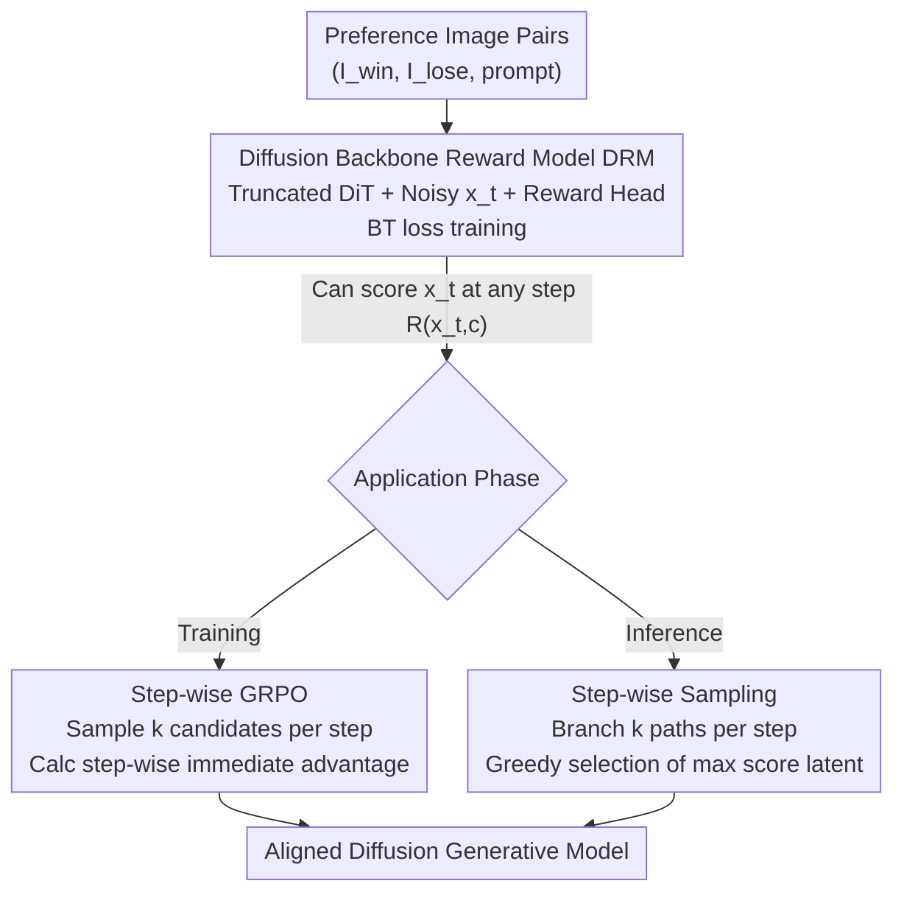

# DRM: Diffusion-based Reward Model With Step-wise Guidance

**Conference**: CVPR 2026  
**Paper**: [CVF Open Access](https://openaccess.thecvf.com/content/CVPR2026/html/Zhang_DRM_Diffusion-based_Reward_Model_With_Step-wise_Guidance_CVPR_2026_paper.html)  
**Code**: https://github.com/jjaxonx/DRM  
**Area**: Alignment RLHF / Diffusion Models  
**Keywords**: Diffusion Reward Model, Human Preference Alignment, Step-wise GRPO, Intermediate Noisy Latents, credit assignment  

## TL;DR
This paper utilizes the pre-trained diffusion model itself as the reward model backbone (DRM). By leveraging its unique ability to score noise latents at any denoising step, the authors design Step-GRPO for training with dense step-wise rewards and Step-wise Sampling for "explore-and-select" during inference. This approach significantly improves the generation quality of SD3.5-Medium without adding parameters and achieves 2.5–3.5 times faster convergence.

## Background & Motivation

**Background**: To align diffusion models with human preferences, the mainstream approach is to train a reward model (RM) from limited preference data and then use it to generate synthetic preference data or perform RL fine-tuning. Early RMs were fine-tuned from CLIP, while recent ones generally adopt Vision-Language Models (VLM, such as HPSv3) as backbones due to their stronger visual understanding.

**Limitations of Prior Work**: VLM backbones utilize CLIP-style visual encoders, where the pre-training objective is image-text semantic alignment—focusing more on "what is in the image" rather than "how well it is drawn." This information bottleneck compresses images into representations that are semantically heavy but perceptually weak, making them insensitive to attributes like aesthetics, composition, and structural integrity that truly govern human preferences. Furthermore, these RMs only evaluate the final clean image, treating the noisy intermediate states of the generation process as a black box.

**Key Challenge**: Preference alignment requires understanding both "aesthetics" and the "process," yet CLIP/VLM-style backbones lack both. Generation is a multi-step denoising process, but rewards are typically given only at the end. This leads to coarse credit assignment in RL methods like GRPO, where a single final reward is averaged across all time steps, failing to distinguish between good and bad intermediate actions.

**Goal**: To find a backbone naturally sensitive to perceptual quality that can evaluate latents at any denoising time step, using it to (1) provide dense step-wise rewards for RL and (2) directly guide sampling during inference.

**Key Insight**: The authors intuit that "the ability to generate with high fidelity implies an inherent understanding of aesthetics, composition, and detail." Thus, a pre-trained diffusion model is a natural evaluator of perceptual quality. Moreover, since diffusion backbones have seen latents at various noise levels during training, they can naturally score intermediate noisy states, filling the "process understanding" gap found in VLMs.

**Core Idea**: Replace VLMs with a pre-trained diffusion model (DiT) as the reward backbone. Leverage its ability to evaluate noise latents at any step for both training (Step-GRPO dense rewards) and inference (Step-wise Sampling).

## Method

### Overall Architecture

The DRM pipeline consists of three components: first, transforming a pre-trained DiT into a reward model and training it to score based on preference image pairs at random noise levels. Once trained, the DRM inherits diffusion priors and can provide a preference score $R(x_t, c)$ for a noise latent $x_t$ at any time step $t$. This "step-wise evaluable" capability is bifurcated into two downstream applications: Step-GRPO for calculating dense step-wise rewards and advantages during training, and Step-wise Sampling for branching and selecting the best path during inference. All three share the same DRM scoring function, differing only in how these step-wise scores are consumed.

### Key Designs

**1. Diffusion-based Reward Model (DRM): Converting a Generator into a Noise Latent Evaluator**

To address the issue that VLM backbones are "semantically aware but aesthetically weak and cannot evaluate intermediate states," the authors use the pre-trained diffusion model itself as the reward backbone. Specifically, they use the SD3.5-Medium DiT (2.5B) for initial weights, removing the last three transformer layers to align the parameter count with HPSv3-2B for a fair comparison. Given a noisy latent $x_t$ at time step $t$, it is fed into the modified DiT to obtain visual features $f_v \in \mathbb{R}^{L\times d}$, which are then projected into a scalar score via a reward head:

$$f_p = \mathrm{MLP}(f_v), \quad s = \mathrm{MLP}\big(\mathrm{Pooling}(\mathrm{Conv}(\mathrm{Reshape}(f_p)))\big)$$

The training data consists of 1.4 million triplets $(I_{win}, I_{lose}, p)$. The key insight resides in the training method: images are first encoded into $x_0$ using a VAE, then Gaussian noise is added at a **randomly sampled time step $t$** to obtain $x_t^{win}$ and $x_t^{lose}$. The DRM is then trained to score these noisy states using the Bradley-Terry loss:

$$L_{DRM} = -\log\sigma(s_{win} - s_{lose})$$

Because it is exposed to latents at various noise levels during training, the DRM learns to score any step—a fundamental capability distinguishing it from clean-image RMs. Ablations confirm this capability stems from the generative prior, as models trained from scratch significantly underperform.

**2. Step-wise GRPO: Solving Credit Assignment via Dense Step-wise Rewards**

Standard GRPO averages a single final reward across all steps, failing to distinguish the contribution of specific steps. The authors use the DRM's step-wise scoring to "anchor" rewards at every step. While standard Flow-GRPO advantages are calculated based on the final clean image $x_0$ (global, coarse):

$$\hat{A}^i_t = \frac{R(x^i_0, c) - \mathrm{mean}(\{R(x^j_0, c)\}_{j=1}^G)}{\mathrm{std}(\{R(x^j_0, c)\}_{j=1}^G)}$$

Step-GRPO performs local optimization at each reverse denoising step $t$. Starting from state $x_{t+1}$, it samples $k$ candidate next-steps $\{x_t^i\}_{i=1}^k$ using an SDE. The DRM provides immediate scores for these **intermediate noisy candidates**, and immediate advantages are calculated via group normalization:

$$\hat{A}^i_t = \frac{R(x^i_t, c) - \mathrm{mean}(\{R(x^j_t, c)\}_{j=1}^k)}{\mathrm{std}(\{R(x^j_t, c)\}_{j=1}^k)$$

This shifts the focus from the "final global result" to the relative quality of transitioning from $x_t$ to each candidate $x_t^i$, providing more precise, fine-grained supervision for policy gradients. Compared to methods like TempFlow-GRPO that use complex reward allocation with heavy sampling overhead, DRM evaluates intermediate states directly and more efficiently.

**3. Step-wise Sampling: Training-free "Explore-and-Select" Inference Guidance**

Deterministic samplers follow a single path and cannot correct early prediction errors. The authors utilize DRM as a dynamic guide during inference, creating a plug-and-play sampling strategy. At each time step $t$, the model "explores" by branching out $k$ candidate next-states $\{x_{t-1}^i\}_{i=1}^k$ using SDE sampling. It then "selects" by using DRM to score each candidate, choosing the one with the highest score:

$$x_{t-1} = \arg\max_{x_{t-1}^i} R(x_{t-1}^i, c)$$

By selecting the most promising path at each step, the model actively avoids "bad trajectories" that lead to low quality, preventing the cascading failures common in fixed trajectories. The cost is a linear increase in generation time with $k$, but it results in stable improvements across all preference metrics without a drop in diversity (no mode collapse) per LPIPS metrics.

### Loss & Training
The DRM itself uses the BT negative log-likelihood loss (as described in Design 1). It is trained for 1 epoch on 64 H20 (96GB) GPUs with a constant learning rate of $1\times10^{-5}$, a global batch size of 128, and images resized to $512\times512$. The RL fine-tuning phase uses LoRA (rank 32, $\alpha=64$) with a learning rate of 1e-4 on the SD3.5-Medium base. Inference uses the Flow Match Euler scheduler with 50 steps and CFG=4.5. Step-wise GRPO defaults to $k=6$, maintaining the same computational budget as standard GRPO (24 total samples / 6 per GPU).

## Key Experimental Results

### Main Results: RL Fine-tuning Comparison (SD3.5-Medium, Higher is Better)

| Method | ImageReward | PickScore | HPSv3 |
|------|------------|-----------|-------|
| SD3.5-Medium (Baseline) | 1.01 | 16.76 | 8.95 |
| + PickScore & GRPO | 1.14 | 16.94 | 9.64 |
| + HPSv3 & GRPO | 1.15 | 16.90 | 9.71 |
| + DRM & GRPO | 1.14 | 16.95 | 10.07 |
| **+ DRM & Step-GRPO** | **1.17** | **17.04** | **10.28** |

Even with standard GRPO, DRM reaches an HPSv3 of 10.07 (leading all competitors in the same framework). With Step-GRPO, all three metrics reach new SOTA levels.

### Ablation Study: Pre-trained Weights vs. Random Initialization (Preference Prediction Accuracy %)

| Configuration | Weights | Epoch | PickScore | HPDv2 | HPDv3 |
|------|------|-------|-----------|-------|-------|
| (a) Random Init | Random | 1 | 57.5 | 65.0 | 59.3 |
| (c) Random Init (Extended) | Random | 3 | 59.0 | 70.1 | 63.0 |
| (e) Pre-trained 512px | Pre-trained | 1 | 73.4 | 82.2 | 74.0 |

Pre-trained diffusion weights in one epoch vastly outperform random initialization trained for three epochs, proving that generative priors are essential for both training efficiency and performance upper bounds. Increasing training resolution (256→512) also yields consistent gains.

### Step-wise Sampling Quality-Efficiency Trade-off

| Candidates k | Time(s) | ImageReward | PickScore | HPSv3 | LPIPS |
|---------|--------|------------|-----------|-------|-------|
| k=1 | 2.88 | 1.01 | 16.76 | 8.95 | 0.650 |
| k=2 | 5.63 | 1.08 | 16.84 | 9.02 | 0.661 |
| k=4 | 7.75 | 1.14 | 16.81 | 9.32 | 0.663 |
| k=6 | 9.83 | 1.15 | 16.93 | 9.49 | 0.662 |

As a completely training-free method, quality increases with $k$. LPIPS scores indicate that diversity does not collapse.

### Key Findings
- **Generative Priors are Critical**: Random initialization cannot match pre-trained weights even with extended training, empirically supporting the "generator as evaluator" hypothesis.
- **Step-GRPO Converges Faster**: At the same computational budget, it converges 2.5× faster by step count and approximately 3.5× faster by GPU hours compared to GRPO. Even $k=2$ outperforms standard GRPO.
- **Minor Benchmark Trade-offs are Expected**: While DRM leads PickScore at 64.1%, its training objective involves noisy latents (leading to a slight domain shift). This results in a predictable minor trade-off on benchmarks composed solely of clean images compared to pure-image RMs.
- **Higher Noise is Harder to Judge**: Accuracy on the HPSv3 test set drops from 74.0 (t=0) to 65.11 (t=750) as noise increases, but remains robust overall, confirming that step-wise signals are usable.

## Highlights & Insights
- **Perspective Shift: "Generator as Evaluator"**: Rather than training a new RM, the paper "activates" the implicit aesthetic understanding of existing diffusion models. The backbone is "free" and naturally possesses the noise latent evaluation capability that VLMs lack.
- **One Key for Two Locks**: The same "step-wise evaluable" property serves both RL (Step-GRPO for credit assignment) and inference (Step-wise Sampling for select-and-explore). Consolidating these capabilities into one backbone is highly efficient.
- **Transferable Training-free Gains**: Step-wise Sampling is plug-and-play and can be applied to any diffusion process with a DRM-style evaluator to enhance quality without altering model weights.

## Limitations & Future Work
- The authors acknowledge a slight trade-off on standard clean-image benchmarks due to the domain shift from training on noisy latents.
- Step-wise Sampling inference costs grow linearly with $k$ ($k=6$ is ~3.4× slower than $k=1$), posing a significant latency penalty for high-quality generation scenarios.
- Experiments were primarily validated on the SD3.5-Medium + flow matching framework; the transferability to other diffusion families (e.g., DDPM) requires further testing.
- Accuracy of step-wise rewards decreases at high noise steps (65% at t=750), suggesting signals at early steps are noisy and might be a bottleneck for final quality.

## Related Work & Insights
- **vs. VLM-based RMs (HPSv3, PickScore)**: VLMs use CLIP encoders which are semantically strong but perceptually weak and limited to clean images. 2B DRM outperforms similar-sized HPSv3-2B, suggesting switching backbones is more effective than scaling parameters.
- **vs. Flow-GRPO / DanceGRPO**: These methods average final rewards across steps, resulting in coarse credit assignment. Step-GRPO uses DRM for immediate step-wise rewards and advantages.
- **vs. TempFlow-GRPO**: Targets credit assignment through complex score allocation with high sampling overhead; DRM evaluates intermediate states directly and efficiently.
- **vs. LPO**: While LPO explored diffusion-style RMs, it lacked systematic study. This work systematically unlocks the evaluation potential of diffusion backbones with specialized algorithms.

## Rating
- Novelty: ⭐⭐⭐⭐⭐ "Diffusion model as reward backbone + step-wise evaluation" is a genuine shift in perspective that unifies training and inference.
- Experimental Thoroughness: ⭐⭐⭐⭐ Covers preference benchmarks, RL fine-tuning, inference sampling, and multiple ablations, though focused on the SD3.5 base.
- Writing Quality: ⭐⭐⭐⭐⭐ Clear motivational derivation, well-aligned formulas and diagrams, and honest discussion of benchmark trade-offs.
- Value: ⭐⭐⭐⭐⭐ Provides a new plug-and-play backbone and two practical algorithms, with 2.5–3.5× faster convergence and open-source code.

<!-- RELATED:START -->

## Related Papers

- [\[ICLR 2026\] A2D: Any-Order, Any-Step Safety Alignment for Diffusion Language Models](../../ICLR2026/llm_alignment/a2d_any-order_any-step_safety_alignment_for_diffusion_language_models.md)
- [\[CVPR 2026\] Thinking with Frames: Generative Video Distortion Evaluation via Frame Reward Model](thinking_with_frames_generative_video_distortion_evaluation_via_frame_reward_mod.md)
- [\[ICLR 2026\] Eliminating Inductive Bias in Reward Models with Information-Theoretic Guidance](../../ICLR2026/llm_alignment/eliminating_inductive_bias_in_reward_models_with_information-theoretic_guidance.md)
- [\[ICLR 2026\] Reward Model Routing in Alignment](../../ICLR2026/llm_alignment/reward_model_routing_in_alignment.md)
- [\[CVPR 2026\] Unlocking Token Rewards via Training-Free Reward Attribution](unlocking_token_rewards_via_training-free_reward_attribution.md)

<!-- RELATED:END -->
