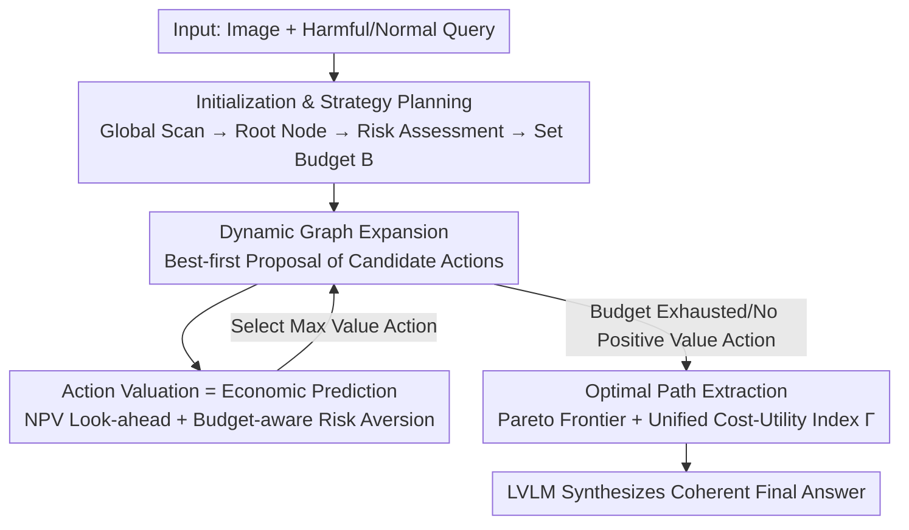

# EcoAlign: An Economically Rational Framework for Efficient LVLM Alignment

**Conference**: CVPR 2026  
**Paper**: [CVF Open Access](https://openaccess.thecvf.com/content/CVPR2026/html/Cheng_EcoAlign_An_Economically_Rational_Framework_for_Efficient_LVLM_Alignment_CVPR_2026_paper.html)  
**Code**: None  
**Area**: RLHF Alignment  
**Keywords**: LVLM Alignment, Inference-time Safety, Graph-of-Thought Search, Economic Rationality, Weakest-link Safety

## TL;DR
EcoAlign reframes the inference-time alignment of Large Vision-Language Models (LVLMs) as an "optimal path search problem under a limited compute budget." It utilizes a Net Present Value (NPV)-like look-ahead function to score candidate actions on a dynamically constructed Graph-of-Thought, balancing safety, utility, and cost while defining path safety via the "weakest link" principle to achieve superior safety and utility at lower compute costs.

## Background & Motivation
**Background**: Safe alignment for LVLMs (e.g., GPT-4V, Gemini, Qwen-VL) currently follows three routes: training-time alignment (SFT/RLHF, embedding safety into parameters), inference-time process alignment (e.g., Chain-of-Thought, guiding internal reasoning), and inference-time output alignment (e.g., SafeDecoding, filtering final output streams).

**Limitations of Prior Work**: Each route exhibits "economic inefficiency." Training-time alignment involves massive sunk costs, is static/non-adaptive, and often harms performance on benign tasks due to over-conservatism. Inference-time process alignment incurs high variable compute overhead by lengthening reasoning chains. Inference-time output alignment is local and nearsighted, lacking proactive economic control over the entire reasoning path.

**Key Challenge**: The authors identify a "safety–utility–cost" trilemma. The most critical economic failure is **process-blindness**: traditional safety evaluations only check final outputs, ignoring intermediate reasoning trajectories. Table 1 provides empirical evidence: a model can output harmful content first (e.g., "four steps for online fraud") and then append a benign disclaimer at the end. Simple **additive** safety scoring would misclassify this as safe, effectively paying for harmful processes and wasting compute on toxic reasoning that should be discarded.

**Goal**: To reconstruct alignment from "post-hoc security checks" to "real-time economic governance and resource allocation," finding a reasoning path that is safe, useful, and cost-effective within a fixed compute budget $B$.

**Key Insight**: Treat the LVLM as a **boundedly rational agent**. Rather than seeking a global optimum with infinite compute, it searches for the most "economically efficient" path under cognitive limitations and hard budget constraints—an application of Bounded Rationality theory from economics.

**Core Idea**: Replace "prospective-less CoT stacking" with "budget-constrained optimal pathfinding on a Graph-of-Thought," using a multiplicative, look-ahead economic value function to determine each step.

## Method

### Overall Architecture
EcoAlign is an **inference-time** framework (no parameter updates) that models LVLM inference as an economically rational search on a dynamic Directed Acyclic Graph (DAG). The pipeline consists of four steps: (1) A low-cost global scan to form an initial strategy and root node; (2) Iterative expansion of the multimodal Graph-of-Thought using best-first search, selecting actions with the highest "economic value"; (3) Action scoring via a look-ahead value function that balances safety/utility gains against compute costs, with the remaining budget dynamically tightening the search horizon; (4) Post-expansion multi-objective (Pareto) path extraction to select the most economical path for final answer synthesis.

Nodes in the graph carry three-dimensional self-scores: safety $s_v \in [-1, 1]$, utility $u_v$ (transformed non-negative scalar), and generation cost $c_v$ (number of text + visual tokens). A DAG property allows an action to **fuse** information from multiple parent nodes or **merge** redundant content into a representative node; only edges are added or redirected, ensuring no cycles.

### Key Designs

**1. Unified Cost-Utility Index + Weakest-link Safety: Quantifying Path Value**

Addressing "process-blindness and additive scoring loopholes," path-level scores are aggregated. For a path $P=(v_0, \dots, v_T)$, total utility and cost are summations: $U[P]=\sum_{t=1}^{T}u_{v_t}$ and $C[P]=\sum_{t=1}^{T}c_{v_t}$. Crucially, safety uses the **minimum value** rather than a sum:

$$S[P] = \min_{t=1\dots T} s_{v_t}.$$

This "weakest link" principle ensures that if one step in the chain is unsafe, the entire path is unsafe; any node with $s_{v_t} < 0$ is **immediately pruned**. This prevents the "harmful-then-benign" camouflage described in Table 1. The final metric is the Unified Cost-Utility Index:

$$\Gamma(P) = \frac{S[P]\cdot U[P]}{C[P]},$$

The global objective is to maximize this within budget: $P^\star=\arg\max_{P\subseteq G}\Gamma(P)\ \text{s.t.}\ C[P]\le B$. $\Gamma$ collapses the trilemma into a comparable scalar, while the min-safety term prevents dilution by local benign content.

**2. Initialization & Strategy Planning: Avoiding Blind Exploration**

To prevent wasting budget on unguided exploration, the process begins with a low-cost global scan to generate a high-level caption (root node $v_0$) and a low-resolution feature map (global context for grounding). The LVLM performs an initial risk assessment $s_{v_0}$; if potential risks are detected, a **strategy node** is generated as a child of $v_0$, outlining a "cautious exploration" plan (e.g., careful subject identification). The total budget $B$ is set according to the risk level—higher risk leads to tighter governance.

**3. Economic Value Function: Actions as Investments with NPV**

To prevent short-sightedness, each candidate action $a$ is assigned a **local return**:

$$\Gamma_{\text{local}}(a) = \frac{s_{v_{\text{new}}}\cdot u_{v_{\text{new}}}}{c_{v_{\text{new}}}}.$$

To avoid myopia, a **Net Present Value (NPV)**-like look-ahead value $V(a)$ is introduced by simulating a short rollout from the action's result state:

$$V(a) = \max_{R\in R_{\text{safe}}(a),\,|R|\le |R|_t}\ \sum_{i=1}^{|R|}\delta^{\,i-1}\,\Gamma_{\text{local}}(a'_i),$$

where $\delta \in (0, 1]$ is a discount factor representing the "time value of compute." Actions are selected using $a^\star(v)=\arg\max_{a\in A(v)}V(a)$ from the frontier nodes. Actions include low-cost **text generation**, high-cost **visual exploration**, and **structural optimization** (merging similar nodes or pruning dead ends).

**4. Budget-aware Risk Aversion: Shrinking Horizons with Scarcity**

The look-ahead horizon $|R|_t$ is not fixed but dynamically modulated by the remaining budget $B - C_t$:

$$|R|_t = \lfloor k\cdot (B-C_t)\rfloor.$$

As the budget tightens (higher scarcity), the look-ahead horizon shortens, making the agent more **risk-averse** and focused on certain, short-term gains, mimicking real economic behavior.

**5. Pareto Optimal Path Extraction: Multi-objective Dynamic Programming**

Since the min-safety metric violates the optimal substructure required by standard shortest-path algorithms, the framework **tracks the Pareto frontier**. Nodes are processed in topological order, and paths are represented as performance vectors $(U[P], C[P], S[P])$. Dominated paths are pruned to maintain diverse candidates. Finally, the Pareto frontier is filtered by $C[P] \le B$ and the optimal path $P^\star$ is selected via the global $\Gamma(P)$.

## Key Experimental Results

### Main Results
Evaluations cover safety (MMSafetyBench, MSSBench, SIUO), utility (OCRBench, MathVista, MMStar), and cost (Normalized Avg. Cost relative to Base = 1). Tested on 5 LVLMs (GPT-4o, Gemini-1.5-Flash, Qwen-VL-Max, InternVL3-14B, Llama-3.2-11B-Vision).

| Model | Method | MMSafety | SIUO | MathVista | Avg. Cost |
|------|------|----------|------|-----------|-----------|
| GPT-4o | CoT | 69.1 | 72.6 | 86.8 | 104.3 |
| GPT-4o | VLM-Guard | 88.4 | 74.0 | 69.7 | 3.1 |
| GPT-4o | **Ours** | **96.5** | **87.1** | 85.4 | 21.2 |
| Qwen-VL-Max | CoT | 79.0 | 57.2 | 89.5 | 114.0 |
| Qwen-VL-Max | **Ours** | **93.8** | **91.0** | **90.7** | **12.7** |
| Llama-3.2-11B | CoT | 49.1 | 51.7 | 64.4 | 108.3 |
| Llama-3.2-11B | **Ours** | **85.2** | **89.3** | 62.2 | 28.2 |

Ours achieves the highest safety scores across all models and benchmarks while maintaining high utility. Costs are significantly lower than CoT (e.g., 1/8th of CoT cost on Qwen-VL-Max). While VLM-Guard has minimal cost, its utility is severely degraded by over-aggressive interception.

### Ablation Study

| Configuration | Observation |
|------|------|
| Full (Dynamic Look-ahead + Smin + Economic Value) | Best trade-off. |
| Sub: Myopic Search (Fixed Horizon 0) | Reduced cost but failed complex utility tasks. |
| Sub: Fixed Horizon (No budget awareness) | Wasted budget on redundant exploration. |
| Sub: Smin $\rightarrow$ Slast | Safety dropped (e.g., 0.93 $\rightarrow$ 0.85 on Qwen). |
| Sub: Smin $\rightarrow$ Savg | Significant safety drop due to benign-ending dilution. |
| Sub: Remove Cost Norm ($\Gamma'=S\cdot U$) | Costs skyrocketed with no safety gain and utility loss. |

### Key Findings
- **Weakest-link safety (Smin) is indispensable**: There is a 10–14 point safety gap between Smin and Slast, proving that final-step assessment misses intermediate safety failures.
- **Cost normalization is the foundation of economic rationality**: Removing $/C[P]$ from $\Gamma$ results in higher costs without safety gains, sometimes even reducing utility due to unconstrained search.
- **Hyperparameter Sweet Spots**: $k=0.05$ (look-ahead factor) and $\delta=0.95$ (discount factor) offer the best utility/cost balance.

## Highlights & Insights
- **Economics of Alignment**: Reimagines alignment using Net Present Value, Bounded Rationality, and Pareto frontiers. $\Gamma=S\cdot U/C$ provides a unified, interpretable metric for the trilemma.
- **Min-safety vs. Process-blindness**: $S[P]=\min s_{v_t}$ effectively closes the loophole where harmful paths are "whitewashed" by benign endings.
- **Budget-driven Risk Aversion**: The dynamic horizon $|R|_t$ allows human-like economic intuition to emerge—becoming more conservative as resources dwindle.

## Limitations & Future Work
- **Dependency on LVLM Self-scoring**: Relies on the model's ability to evaluate $s_v$ and $u_v$. If the model has blind spots, the weakest-link principle may fail.
- **Evaluator Bias**: Comparisons using GPT-4o as a judge for GPT-4o performance may introduce potential evaluation bias.
- **Engineering Overhead**: The actual wall-clock latency of graph expansion and multiple API rounds was not fully detailed.
- **Closed Source**: Lack of open-source code increases the barrier for reproduction.

## Related Work & Insights
- **vs. Training-time (SFT/RLHF)**: These are static and often over-conservative. Ours is dynamic and per-query, offering better flexibility.
- **vs. Process Alignment (CoT)**: CoT is computationally expensive; Ours achieves higher safety at 1/4 to 1/8 of the cost via selective expansion.
- **vs. Output Alignment (VLM-Guard)**: These methods are shortsighted and harm utility; Ours proactive control maintains both safety and utility.

## Rating
- Novelty: ⭐⭐⭐⭐⭐ 
- Experimental Thoroughness: ⭐⭐⭐⭐ 
- Writing Quality: ⭐⭐⭐⭐⭐ 
- Value: ⭐⭐⭐⭐ 

<!-- RELATED:START -->

## Related Papers

- [\[ICML 2025\] MPO: An Efficient Post-Processing Framework for Mixing Diverse Preference Alignment](../../ICML2025/llm_alignment/mpo_an_efficient_post-processing_framework_for_mixing_diverse_preference_alignme.md)
- [\[ICLR 2026\] Learning More with Less: A Dynamic Dual-Level Down-Sampling Framework for Efficient Policy Optimization](../../ICLR2026/llm_alignment/learning_more_with_less_a_dynamic_dual-level_down-sampling_framework_for_efficie.md)
- [\[AAAI 2026\] Differentiated Directional Intervention: A Framework for Evading LLM Safety Alignment](../../AAAI2026/llm_alignment/differentiated_directional_intervention_a_framework_for_evading_llm_safety_align.md)
- [\[ICLR 2026\] Beyond RLHF and NLHF: Population-Proportional Alignment under an Axiomatic Framework](../../ICLR2026/llm_alignment/beyond_rlhf_and_nlhf_population-proportional_alignment_under_an_axiomatic_framew.md)
- [\[ACL 2026\] Alignment Data Map for Efficient Preference Data Selection and Diagnosis](../../ACL2026/llm_alignment/alignment_data_map_for_efficient_preference_data_selection_and_diagnosis.md)

<!-- RELATED:END -->
