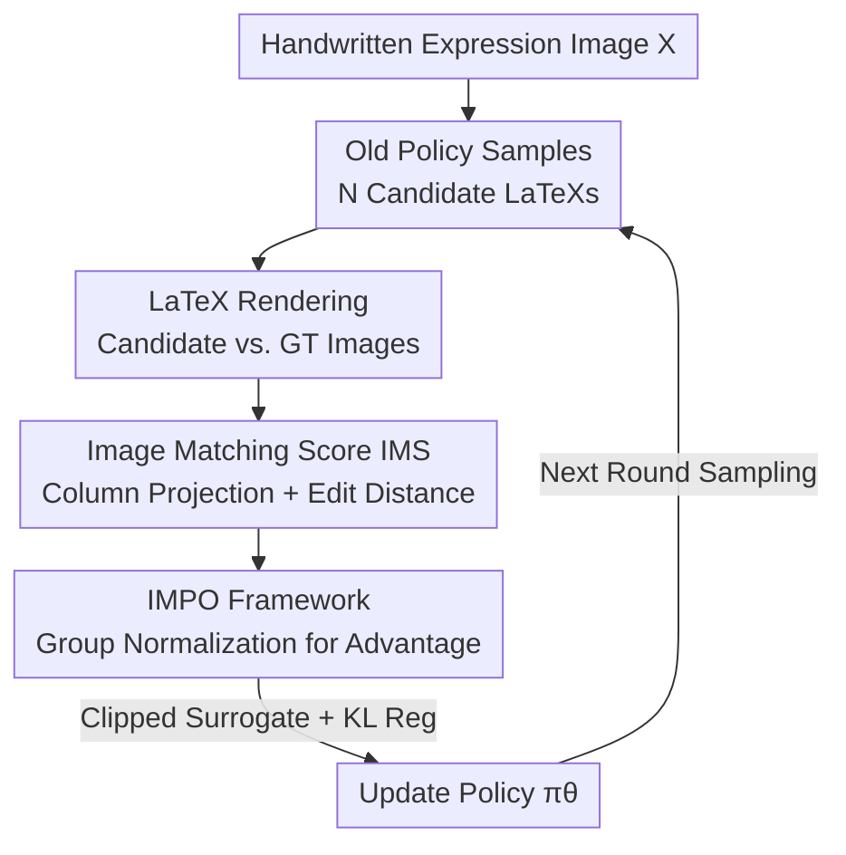

# From Pixel to Precision: Enhancing Handwritten Mathematical Expression Recognition with Image-Level Reward

**Conference**: CVPR 2026  
**Paper**: [CVF Open Access](https://openaccess.thecvf.com/content/CVPR2026/html/Liu_From_Pixel_to_Precision_Enhancing_Handwritten_Mathematical_Expression_Recognition_with_CVPR_2026_paper.html)  
**Code**: None  
**Area**: Visual Document Recognition / Reinforcement Learning  
**Keywords**: Handwritten Mathematical Expression Recognition, Image-Level Reward, GRPO, Visual Fidelity, Edit Distance  

## TL;DR
Addressing the fundamental misalignment in handwritten mathematical expression recognition where "LaTeX text similarity $\neq$ rendered image similarity," this paper proposes Image Matching Score (IMS)—a lightweight image-level reward based on column projection encoding and Levenshtein distance. This reward drives IMPO, a GRPO reinforcement learning framework without a value network. Across CROHME, HME100K, and M2E benchmarks, it increases ExpRate by an average of approximately 1.1% (up to 1.37%), achieving a new SOTA.

## Background & Motivation
**Background**: Handwritten Mathematical Expression Recognition (HMER) transcribes handwritten expressions into LaTeX code. Mainstream approaches treat this as an image-to-sequence task using sequence models (e.g., WAP, BTTR, CoMER, PosFormer), trained with Maximum Likelihood Estimation (MLE) or further fine-tuned via reinforcement learning with text-level rewards (BLEU, ROUGE, exact string match).

**Limitations of Prior Work**: All these objectives essentially optimize a **proxy goal** of "text similarity," whereas the true objective of HMER is **visual fidelity**—ensuring the rendered expression image matches the original handwriting. A systemic misalignment exists between LaTeX's dual representations (symbolic text vs. rendered image). On one hand, textually distinct LaTeX strings can render into **identical** images (e.g., `\sin x` vs. `\sin{x}`, `\left(...\right)` vs. `\biggl(...\biggr)`), leading text metrics to produce false negatives. On the other hand, a minor text error (e.g., a missing brace or a superscript written as a subscript) can cause the rendering to **collapse entirely**, despite incurring only a small penalty from character-level metrics.

**Key Challenge**: The direction of the optimization signal (text distance) is inconsistent with the true goal (visual consistency). This misalignment worsens as expressions become more complex and longer, where text-level rewards fail to capture structural correctness, resulting in significant performance degradation on long formulas.

**Goal**: To shift the optimization objective from "text-level supervision" to "image-level supervision" and identify an image similarity metric that is both **lightweight and sensitive to structural errors** for use as a reward.

**Key Insight**: The authors observe that mathematical formulas naturally possess a 2D structure arranged **from left to right in columns**. Therefore, by encoding rendered images into integer sequences via column projection and calculating sequence edit distance, local structural errors (such as superscript misalignment or similar character substitutions) can be captured at the pixel level without requiring heavy-duty image perception networks.

**Core Idea**: Use the "edit distance of column projection for rendered images" as the reward (IMS). This is integrated into the value-network-free GRPO framework (IMPO) to directly optimize visual fidelity, training the model for "rendered pairs" rather than "string pairs."

## Method

### Overall Architecture
IMPO reformulates HMER as a reinforcement learning problem. A policy network (a sequential HMER model like PosFormer) takes a handwritten image $X$ as input and generates a LaTeX token sequence $Y=\{y^{(t)}\}_{t=1}^{T}$. The reward is no longer derived from text similarity with a reference string but from the **visual similarity between the images rendered from the predicted LaTeX and the ground-truth LaTeX**. The pipeline is: given an input image, sample a set of $N$ candidate LaTeX sequences using the old policy $\pi_{\theta_{old}}$ $\to$ render each candidate and the ground truth into images $\to$ compute the sequence-level reward using IMS $\to$ perform group-relative normalization to obtain advantages $\to$ update the current policy $\pi_\theta$ using a clipped surrogate loss and KL regularization. This process **does not require a separate value network**, as GRPO estimates advantages using group-relative reward statistics.

### Key Designs

**1. Image Matching Score (IMS): Quantifying Visual Fidelity via Column Projection Edit Distance**

This design directly addresses the "text similarity $\neq$ visual similarity" issue by calculating distance on **rendered images** rather than LaTeX strings. The calculation follows three steps. First, **Image Preprocessing**: padding the predicted image $F_i$ and ground-truth image $G_i$ with white pixels (value 0) to the same maximum height, centering them vertically, and binarizing them with a fixed threshold of 128 to separate foreground symbols from the background. Finally, **all-blank columns are removed** to eliminate global horizontal translation. Second, **Column-wise Encoding**: each column is treated as a vertical binary vector, converted into a decimal integer. Thus, the entire image becomes an integer sequence. This is the essence of IMS: as mathematical expressions are naturally arranged from left to right, column encoding captures "horizontal combinations" while maintaining "vertical patterns" per column integer, making it sensitive to local structural errors like superscript misplacement or similar character substitutions (e.g., "V" vs. "v"). Third, **Similarity Calculation**: the standard Levenshtein edit distance $D_i$ is calculated between the predicted sequence $S_P$ and ground-truth sequence $S_G$, normalized by the longer sequence length $L_i=\max(|S_P|,|S_G|)$:

$$\mathrm{IMS}(F_i, G_i) = 1 - \frac{D_i}{L_i}, \quad \mathrm{IMS} \in [0,1].$$

A higher score indicates higher similarity. Compared to perceptual metrics like SSIM, IMS calculation is extremely lightweight and more robust to changes in rendering resolution (DPI).

**2. IMPO: Value-Network-Free Image-Level Policy Optimization based on GRPO**

Given an image-level reward, a stable optimization framework is needed to handle such "sequence-level sparse rewards." The authors choose GRPO (Group Relative Policy Optimization) over PPO. The key advantage of GRPO is the **removal of the value network**: it does not learn a value function but instead estimates advantages using normalized reward statistics within a sampled group of candidates. This saves computational resources and simplifies training, fitting naturally with sequence-level global rewards like IMS. Specifically, for an input image, $N$ candidates $Y_i$ are sampled from $\pi_{\theta_{old}}$, and the sequence-level reward $R_i$ is calculated using IMS. The advantage estimation $\hat{A}_i$ is then normalized within the batch—notably, this advantage is **constant** across all time steps $t$ of trajectory $i$. This treats "how well the expression renders" as a unified credit assignment signal, consistent with the nature of visual fidelity as a global property of the expression.

**3. Compound Loss with Clipped Surrogate and KL Regularization: Constraining Shifts**

To ensure stable training, the policy update minimizes a compound objective. The step-wise clipped surrogate objective is:

$$\mathcal{L}_{\mathrm{CLIP}}(\theta) = \min\!\big(\rho_{i,t}\hat{A}_i,\ \mathrm{clip}(\rho_{i,t}, 1\pm\epsilon)\hat{A}_i\big),$$

where $\rho_{i,t}=\dfrac{\pi_\theta(y_{i,t}\mid y_{i,<t})}{\pi_{\theta_{old}}(y_{i,t}\mid y_{i,<t})}$ is the importance ratio. A KL divergence regularization against a reference policy $\pi_{\theta_{ref}}$ is added, resulting in a joint step-wise loss $\mathcal{L}_{i,t}(\theta) = -\mathcal{L}_{\mathrm{CLIP}}(\theta) + \beta\,D_{KL}(\pi_\theta \,\|\, \pi_{\theta_{ref}})$. The final loss is the expectation over sampled trajectories and time steps: $\mathcal{L}(\theta)=\mathbb{E}_{\tau_i\sim\pi_{\theta_{old}}}\big[\sum_t \mathcal{L}_{i,t}(\theta)\big]$. The clipping term prevents excessively large updates, while the KL term keeps the policy from deviating too far from the reference—which is critical when rewards are discrete visual scores. This framework is **model-agnostic**, acting as a fine-tuning method for sequential HMER models regardless of their specific architecture.

### Mechanism
A case study in the paper illustrates why IMS reward is superior. The ground truth is `\sin(nz)`, but the baseline CoMER mistakenly recognizes it as `\sin(n2)` (misidentifying `z` as `2`). At the text level, `z` and `2` differ by only one character, so BLEU barely penalizes it, and `+IMPO-BLEU` continues to output `\sin(n2)`. However, on the rendered image, the column projection patterns of `z` and `2` differ significantly. IMS provides a larger penalty, guiding `+IMPO-IMS` to correct the output to `\sin(nz)`. This demonstrates that when an error is "textually small but visually large," only an image-level reward can provide the correct gradient direction.

## Key Experimental Results

### Main Results
Using PosFormer as the backbone on CROHME 2014/2016/2019, IMPO sets a new SOTA. (ExpRate is the percentage of predicted LaTeX exactly matching the ground truth; $\le1/\le2$ allows 1 or 2 errors).

| Dataset | Metric | PosFormer | IMPO (Ours) | Gain |
|--------|------|-----------|--------------|------|
| CROHME 2014 | ExpRate | 62.68 | **63.89** | +1.21 |
| CROHME 2016 | ExpRate | 61.03 | **62.04** | +1.01 |
| CROHME 2019 | ExpRate | 64.97 | **66.34** | +1.37 |
| CROHME 2019 | ≤1 error | 82.49 | **85.52** | +3.03 |
| HME100K | ExpRate | 69.51 | **70.67** | +1.16 |
| M2E | ExpRate | 58.33 | **59.56** | +1.23 |

Notably, gains in relaxed metrics ($\le1/\le2$) are generally larger than those in ExpRate, suggesting that IMPO not only increases accuracy but also **reduces the severity of errors**—converting "catastrophic rendering collapses" into "minor symbol discrepancies."

### Model-agnostic Verification
Applying IMPO to ABM, CoMER, and PosFormer backbones consistently improves ExpRate, proving that it addresses a **common problem** of "optimization goal misalignment" rather than being specific to one architecture.

| Backbone | Dataset | Vanilla ExpRate | +IMPO | Gain |
|------|--------|-----------------|-------|------|
| ABM | CROHME 2014 | 56.85 | 57.98 | +1.13 |
| CoMER | CROHME 2014 | 59.33 | 60.72 | +1.39 |
| CoMER | CROHME 2014 (≤2) | 75.66 | 83.21 | +7.55 |

### Ablation Study
Ablations on CoMER/CROHME 2014 (IMS-HDiv: using horizontal division; IMS-KBC: keeping blank columns; REIN-b: REINFORCE with baseline).

| Configuration (CROHME 2014) | ExpRate | Description |
|---------------------|---------|------|
| Vanilla (No RL) | 59.33 | Baseline |
| SSIM + GRPO | 60.11 | Replacement with SSIM reward |
| IMS + REIN-b | 59.77 | Replacement with REINFORCE |
| IMS-HDiv + GRPO | 59.68 | Horizontal instead of column-wise |
| IMS-KBC + GRPO | 60.36 | Keep blank columns (no shift removal) |
| **IMS + GRPO (Full)** | **60.72** | Complete IMPO |

### Key Findings
- **Column-wise encoding is critical**: Replacing column-wise with horizontal division (IMS-HDiv) caused ExpRate to drop from 60.72 to 59.68, demonstrating that the assumption of left-to-right expression arrangement is the core source of effectiveness.
- **IMS is more stable/robust than SSIM**: Across DPI changes (150→300), the Coefficient of Variation (CV) for IMS was only 0.62% compared to 1.21% for SSIM. Furthermore, SSIM instability scaled with formula length (CV reached 7.03% for 50+ tokens), while IMS remained stable at 1.34%.
- **Maximum benefit on long formulas**: Text-level rewards (BLEU/ROUGE) showed almost no improvement on long formulas (40+ tokens), whereas IMS achieved significant gains, confirming that text rewards lose efficacy as complexity increases while IMS maintains global layout fidelity.

## Highlights & Insights
- **Turning "Reward Design" into "Image Encoding"**: The core innovation is not a more complex network, but a lightweight metric constructed via column projection and edit distance. By compressing 2D space into 1D sequences, it makes edit distance directly applicable—simple, interpretable, and computationally cheap, yet more robust than heavy perceptual metrics like SSIM.
- **Universal Value of Aligning Rewards with Real Goals**: The true insight is identifying the specific "proxy vs. real goal" misalignment in HMER. This logic can migrate to any task where output has a standard renderable/executable form, such as code generation (executing code for reward) or SVG/chemical SMILES recognition.
- **GRPO's Synergy with Sequence-Level Visual Rewards**: Since IMS is an expression-level global score, GRPO's group normalization advantage provides a natural credit assignment method without the overhead of training a value network, making it highly practical for engineering.

## Limitations & Future Work
- **Reliance on Renderability**: IMS requires predicted LaTeX to be successfully rendered. The paper does not fully discuss how to score candidates with severe syntax errors that fail to render, which could cause missing reward signals in early training.
- **Fixed Renderer Assumption**: The benefit of removing blank columns is limited because horizontal shifts are rare with a fixed renderer; this implies IMS is partially designed for controlled rendering environments and may require adjustment for real-world scans with varying fonts/layouts.
- **Marginal Absolute Gains**: ExpRate improvements are around the 1% range. While stable and SOTA-setting, the upper bound is still constrained by the base model's recognition capability—IMPO acts as a "correction enhancer" rather than an "ability leap."

## Related Work & Insights
- **vs. Text-level Rewards**: These optimize string similarity, misjudging "different text but same image" as wrong and failing to penalize "small text change but collapsed image." IMPO aligns with the true goal of visual fidelity.
- **vs. SSIM/Image Rewards**: SSIM is sensitive to scale and formula length; IMS is more robust to DPI changes and more sensitive to local structural errors.
- **vs. Tree-Structured HMER**: Tree methods explicitly parse grammar but are less flexible. IMPO is model-agnostic and functions as a plug-in for any sequential model.

## Rating
- Novelty: ⭐⭐⭐⭐ Image-level rewards are known, but the "column projection + edit distance" construction and its synergy with GRPO is clever.
- Experimental Thoroughness: ⭐⭐⭐⭐⭐ Clear RQ analysis spanning three benchmarks, three backbones, and various robustness tests.
- Writing Quality: ⭐⭐⭐⭐ Clear motivation via Fig. 1, complete math, and intuitive case studies.
- Value: ⭐⭐⭐⭐ The methodology is transferable to other renderable generation tasks.

<!-- RELATED:START -->

## Related Papers

- [\[CVPR 2026\] UniMERNet: A Universal Network for Real-World Mathematical Expression Recognition](unimernet_a_universal_network_for_real-world_mathematical_expression_recognition.md)
- [\[CVPR 2026\] Rethinking BCE Loss for Multi-Label Image Recognition with Fine-Tuning](rethinking_bce_loss_for_multi-label_image_recognition_with_fine-tuning.md)
- [\[CVPR 2026\] ArtiMuse: Fine-Grained Image Aesthetics Assessment with Joint Scoring and Expert-Level Understanding](artimuse_fine-grained_image_aesthetics_assessment_with_joint_scoring_and_expert-.md)
- [\[CVPR 2026\] UPLiFT: Efficient Pixel-Dense Feature Upsampling with Local Attenders](uplift_efficient_pixel-dense_feature_upsampling_with_local_attenders.md)
- [\[CVPR 2025\] On the Generalization of Handwritten Text Recognition Models](../../CVPR2025/others/on_the_generalization_of_handwritten_text_recognition_models.md)

<!-- RELATED:END -->
