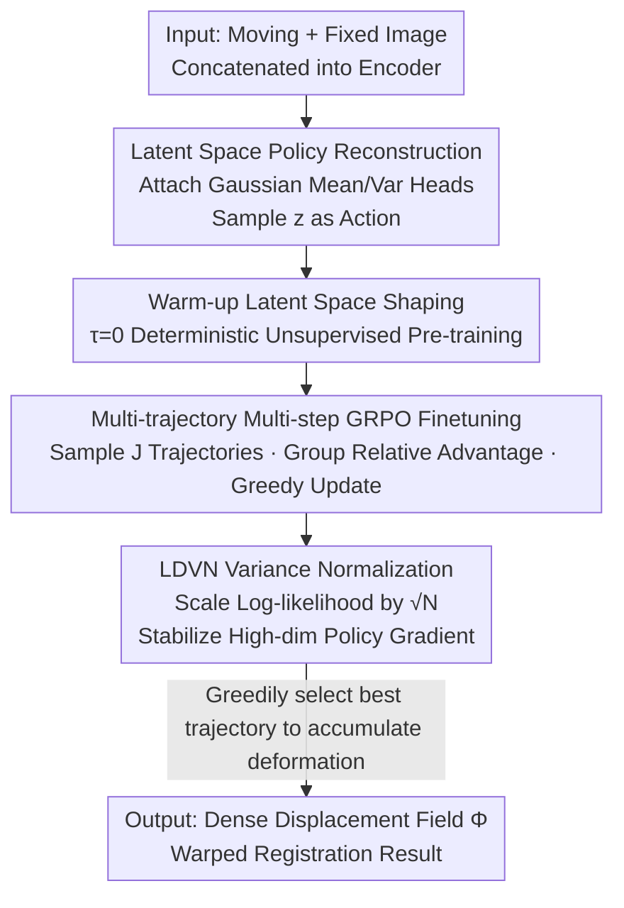

# MorphSeek: Fine-grained Latent Representation-Level Policy Optimization for Deformable Image Registration

**Conference**: CVPR 2026  
**Paper**: [CVF Open Access](https://openaccess.thecvf.com/content/CVPR2026/html/Zhang_MorphSeek_Fine-grained_Latent_Representation-Level_Policy_Optimization_for_Deformable_Image_Registration_CVPR_2026_paper.html)  
**Area**: Medical Image Registration / Reinforcement Learning  
**Keywords**: Deformable Registration, GRPO, Latent Space Policy Optimization, Weakly Supervised, Label Efficiency

## TL;DR
MorphSeek redefines deformable medical image registration as "policy optimization in the encoder's latent space"—attaching a Gaussian policy head to the top layer of a U-Net encoder to treat latent features as samplable actions. It first uses unsupervised warm-up to stabilize the latent space, then employs GRPO for multi-trajectory multi-step weakly supervised fine-tuning. Combined with LDVN to stabilize policy gradients in the tens-of-thousands-dimensional latent space, it improves Dice by 2–4% and reduces the folding rate (NJD) by 30–60% on three 3D registration benchmarks using minimal labels.

## Background & Motivation
**Background**: Deformable Image Registration (DIR) aims to establish voxel-level correspondences between two 3D medical images, outputting a dense displacement field $\Phi \in \mathbb{R}^{3\times H\times W\times D}$. In the deep learning era, the mainstream approaches follow the U-Net encoder-decoder structure like VoxelMorph, which maps image pairs directly to displacement fields in a single forward pass, providing high speed and accuracy.

**Limitations of Prior Work**: Two major challenges remain. First, **extreme label scarcity**—dense voxel-level supervision is nearly unobtainable in medical scenarios, forcing most models back to unsupervised losses based on image similarity. However, similarity metrics provide weak constraints for local boundaries and subtle structures, failing to align complex large deformations. Second, **the ceiling of a single forward pass**—performing inference once only fits global structural differences, failing to recover local boundaries and geometric details in large-scale non-rigid deformations typical of the thorax and abdomen.

**Key Challenge**: Solving large deformations requires "coarse-to-fine" multi-step optimization. Reinforcement Learning's (RL) Markov Decision Process naturally fits this iterative refinement. However, **treating the entire dense deformation field as the action space is disastrous**: millions of dimensions for actions lead to explosions in memory and sampling costs. Consequently, existing RL registration is either trapped in low-dimensional rigid transformations or, like SPAC, compresses image pairs into 64-dimensional plans—losing spatial details due to over-compression. The root problem lies in how to preserve fine-grained spatial information while shifting exploration from dense fields to a training-friendly low-dimensional (yet structured) space.

**Goal**: To stably solve high-difficulty large-deformation registration with limited labels while enabling RL to function effectively for 3D dense prediction.

**Key Insight**: The authors observe that one does not need to perform RL in the multi-million-dimensional deformation field; instead, one can **step back to the latent features at the top layer of the encoder**. Latent features are compressed into a compact representation of $C_L\times H_L\times W_L\times D_L$ while retaining spatial structure. Treating this as a samplable stochastic distribution (action) is both fine-grained and trainable.

**Core Idea**: Replace "direct RL on the dense deformation field" with "Gaussian policy on the encoder latent space + warm-up stabilization + multi-trajectory multi-step GRPO + LDVN variance normalization" to achieve a scalable, backbone-agnostic iterative registration optimization.

## Method

### Overall Architecture
MorphSeek is a **training paradigm** that can be applied to any encoder-decoder registration model (using U-Net as an example in the paper), formulating deformable registration as latent space policy optimization. It consists of three sequential phases: (A) **RL-friendly reconstruction**—attaching two Gaussian convolutional heads to the encoder's top layer to transform deterministic features $f_L$ into a samplable latent distribution, while decoupling the encoder and decoder (retaining skip connections); (B) **Unsupervised warm-up**—setting temperature $\tau$ to 0 to degrade the distribution to a deterministic variable and pre-training with unsupervised loss to embed anatomical information into the mean code, creating a stable latent structure; (C) **Weakly supervised fine-tuning with GRPO**—treating the encoder's stochastic output distribution as policy $\pi(z\mid\mu,\sigma)$, sampling a set of trajectories per step, calculating rewards using segmentation labels, and performing policy updates with group relative advantage. This iteratively reuses scarce labels from coarse to fine, with LDVN suppressing log-likelihood variance in the high-dimensional latent space.

### Key Designs

**1. Latent Space Gaussian Policy: Shifting Exploration of Tens of Thousands of Dimensions to the Encoder Top Layer**

Directly using the dense deformation field as the RL action space results in explosive memory and sampling costs, which is why RL registration has traditionally been limited to low-dimensional rigid transformations. MorphSeek's approach attaches two $1\times1$ convolutional heads—a mean head $W_\mu$ and a log-variance head $W_{\log\sigma}$—to the U-Net encoder's top layer feature $f_L\in\mathbb{R}^{C_L\times H_L\times W_L\times D_L}$. This parameterizes the deterministic tensor as a multivariate Gaussian $\mathcal{N}(\mu,\sigma^2)$. To stabilize training, output constraints and clipping are applied: $\mu=\tanh(W_\mu(f_L))\cdot\lambda_{\text{scale}}$, $\log\sigma=\mathrm{clip}(W_{\log\sigma}(f_L),\sigma_{\min},\sigma_{\max})$. A temperature $\tau>0$ regulates exploration intensity, and latent variables are sampled via reparameterization:

$$z=\mu+\tau\cdot\sigma\odot\epsilon,\quad \epsilon\sim\mathcal{N}(0,I)$$

The decoder input is then changed from the original $f_L$ to the sampled $z$: $\Phi=D(\{f_1,\dots,f_{L-1},z\})$. This step adds only two $1\times1$ convolutional heads (occupying <3% of total parameters), yet makes "sampling a latent vector" equivalent to "taking a step in the deformation space." This preserves the fine-grained spatial structure of $f_L$ while reducing exploration dimensionality from millions to tens of thousands, remaining backbone-agnostic.

**2. Deterministic Warm-up: Embedding Anatomical Information into the Mean Code to Prevent Policy Collapse**

Starting GRPO in a random latent space immediately would cause severe policy gradient oscillation, extreme sensitivity to hyperparameters, and unphysical deformations. MorphSeek first pre-trains the encoder and decoder on unlabeled data, **setting temperature $\tau=0$** (i.e., $z=\mu$) for a deterministic warm-up. This forces the network to write anatomical information into the mean code first, which empirically reduces the risk of posterior collapse and maintains the stochastic output variance needed for the GRPO exploration phase. The warm-up objective is an unsupervised loss plus a KL penalty on the Gaussian heads:

$$L_{\text{warm}}(\theta)=L_{\text{sim}}(I_f,I_m\circ\Phi)+\lambda_{\text{reg}}L_{\text{reg}}(\Phi)+\beta_{\text{KL}}L_{\text{KL}}\big(q_{\theta_E}(z\mid f_L)\,\|\,\mathcal{N}(0,I)\big)$$

The authors explicitly define warm-up as a "prior shaping and cost reduction" phase. It may not necessarily raise the ultimate performance ceiling, but it significantly reduces the time, compute, and instability risks required to reach the same accuracy. Experiments (TransMorph backbone, 20 independent trials) show that warm-up increases the successful convergence rate from 33% to 79% and reduces the average convergence epoch from ~120 to 75. In the GRPO phase, $L_{\text{warm}}$ is retained as a regularization term, acting as an "anatomical preservation" prior that keeps optimization near the warm-up manifold and suppresses reward hacking.

**3. Multi-trajectory Multi-step GRPO: Reusing Each Label Pair $T\times J$ Times**

This is the core mechanism that tightly couples weak supervision with iterative registration. During fine-tuning, the state $s_t$ is the current registration pair $\{I^{t-1}_m, I_f\}$, the action $a_t$ is the sampled latent $z$, and $t$ is the refinement step within a single forward pass. Accumulated deformation is initialized as $\Phi_0=\mathrm{Id}$. For each step and each sample, $J$ trajectories are sampled (differences arise from the encoder's stochasticity). Each trajectory decodes a single-step deformation $\phi^{(j)}_t$, and a scalar reward is calculated as the Dice increment minus a negative Jacobian determinant penalty:

$$R^{(j)}=w_{\text{Dice}}\cdot[\mathrm{Dice}(S_f,S_m\circ\Phi^{(j)}_t)-\mathrm{Dice}(S_f,S_m\circ\Phi_{t-1})]+w_{\text{NJD}}\cdot\mathrm{NJD}(\Phi^{(j)}_t)$$

Advantage $A^{(j)}=\frac{R^{(j)}-\bar R}{\sigma_R+\epsilon}$ is obtained by normalizing group rewards. This **per-sample normalization implicitly performs hard-example reweighting**: without normalization, simple samples with large absolute increments would dominate gradients. After standardization, learning signals from difficult anatomical pairs are preserved. The policy loss $L_{\text{policy}}(\theta_E)=-\frac{1}{J}\sum_j A^{(j)}\cdot\log\tilde\pi^{(j)}$ increases the sampling probability of high-reward trajectories. Simultaneously, a differentiable soft-Dice loss $L_{\text{Dice}}$ (using soft labels from trilinear interpolation) is computed. Note that rewards use hard labels and do not backpropagate gradients to faithfully reflect task metrics, while soft-Dice provides deterministic differentiable supervision. At the end of each step, the **trajectory with the highest reward is greedily selected** $j^*=\arg\max_j R^{(j)}$ to update the deformation field $\Phi_t\leftarrow\Phi_{t-1}\circ\phi^{(j^*)}$ and the moving image. Thus, a single label pair generates $T\times J$ relative supervision events across $T$ steps and $J$ trajectories—the source of its high label efficiency. Unlike PPO/TRPO's reliance on adjacent policy ratios, this uses a "fixed prior trust region": directly penalizing $\mathrm{KL}(\pi_{\theta_E}\|\mathcal{N}(0,I))$ with a target KL scheduler. Since warm-up already places the initial policy near $\mathcal{N}(0,I)$, keeping this KL small constrains drift in high-dimensional space without requiring a critic or ratios.

**4. LDVN Latent-Dimensional Variance Normalization: Preventing Numerical Explosion in High-Dimensional Latent Spaces**

The latent dimensionality $N=C_L\times H_L\times W_L\times D_L$ in conventional backbones often exceeds tens of thousands, far beyond typical GRPO applications. Summing log-likelihoods directly across all latent dimensions would lead to numerical instability in group relative log-likelihoods, weakening exploration distinctness and crashing training. LDVN adds a scale factor $s$ to rescale the log-likelihood:

$$\log\pi(z\mid\mu,\sigma)=-\frac{1}{2s}\sum_{i=1}^{N}\left[\left(\frac{z_i-\mu_i}{\tau\sigma_i}\right)^2+\log(2\pi\tau^2\sigma_i^2)\right]$$

Crucially, setting $s\propto\sqrt{N}$ (default $s=\sqrt{N}$) ensures that GRPO updates remain numerically stable across different latent dimensions while **preserving the group ranking and policy gradient direction**. LDVN only modifies the policy loss statistics and does not change the sampling distribution $\pi(z\mid\mu,\sigma)$ or temperature $\tau$—meaning it is purely a normalization trick to enable GRPO for high-dimensional dense prediction. The authors provide theoretical and empirical variance analysis (details in the supplement). This is the key enabler for moving GRPO from "several action dimensions" to "tens of thousands of latent dimensions."

### Loss & Training
The total loss for GRPO fine-tuning combines the policy loss, warm-up regularization, and soft-Dice:

$$L_{\text{grpo}}(\theta)=L_{\text{policy}}(\theta_E)+\lambda_{\text{warm}}L_{\text{warm}}(\theta)+\lambda_{\text{Dice}}L_{\text{Dice}}(\theta)$$

Training uses Adam (learning rate 1e-4) with a batch size of 1. During the warm-up phase, $\tau=0$ with unsupervised loss; in the fine-tuning phase, $\tau>0$ enables sampling. For cross-modal tasks (Abdomen MR←CT), the similarity term MSE is replaced with MIND descriptors.

## Key Experimental Results

### Main Results
Three 3D registration tasks (OASIS Brain MRI, LiTS Liver CT, Abdomen MR←CT) were conducted by integrating MorphSeek into VoxelMorph-L, TransMorph, and NICE-Trans backbones, with Trajs/Steps set to 6/3.

| Backbone + Setting | OASIS Dice↑ | OASIS NJD↓ | LiTS Dice↑ | Abdomen Dice↑ | Abdomen NJD↓ |
|------|------|------|------|------|------|
| VoxelMorph-L | 84.77 | 0.15 | 84.97 | 77.96 | 1.05 |
| + MorphSeek | **87.16** | **0.10** | **88.99** | **82.44** | **0.57** |
| TransMorph | 85.89 | 0.16 | 88.31 | 82.37 | 0.84 |
| + MorphSeek | **88.89** | **0.06** | **90.11** | **86.49** | **0.35** |
| NICE-Trans | 86.79 | 0.02 | 88.42 | 83.19 | 0.36 |
| + MorphSeek | **89.02** | 0.02 | **90.47** | **86.51** | **0.32** |
| CorrMLP (Compare) | 88.35 | 0.08 | 89.22 | 86.82 | 0.49 |
| SPAC (64-dim RL) | 78.92 | N/A | 75.38 | 69.29 | N/A |

On OASIS, Dice generally increases by 2–3% while NJD drops by about one-third. On the more difficult cross-modal Abdomen MR←CT, TransMorph improves by 4%+ and NJD is nearly halved. Most improvements are significant under the Wilcoxon signed-rank test (p<0.05). Compared to SPAC, which compresses image pairs to 64 dimensions, MorphSeek is over 10 points higher, confirming the value of "preserving fine-grained latent space."

### Ablation Study
Component Ablation (OASIS, cumulative):

| # | Config | Sample $f_L$ | Weak Superv. | Step/Traj | TransMorph Dice↑ | NJD↓ |
|---|------|------|------|------|------|------|
| 1 | Baseline | ✗ | ✗ | 1/– | 76.84 | 0.12 |
| 2 | + Gaussian Head | ✓ | ✗ | 1/– | 76.79 | 0.12 |
| 3 | + Dice Loss | ✓ | ✓ | 1/– | 86.08 | 0.29 |
| 4 | + Multi-step | ✓ | ✓ | 3/– | 86.37 | 0.35 |
| 5 | + GRPO (Full) | ✓ | ✓ | 3/6 | **88.89** | **0.06** |

Ablation of Trajectories × Refinement Steps (OASIS, TransMorph, Dice↑/NJD↓):

| Trajs\Steps | 1 | 2 | 3 | 4 |
|---|---|---|---|---|
| 2 | 86.71/0.08 | 87.13/0.08 | 87.78/0.08 | 87.94/0.08 |
| 4 | 86.89/0.07 | 87.96/0.06 | 88.26/0.06 | 88.14/0.08 |
| 6 | 87.67/0.06 | 88.72/0.05 | **88.89/0.06** | 88.51/0.07 |
| 8 | OOM | – | – | – |

### Key Findings
- **GRPO is the true driver**: Adding only the Gaussian head (Config 2) barely changes performance, proving that RL-friendly reconstruction is lightweight. Dice and NJD only significantly improve when multi-trajectory multi-step GRPO and LDVN are combined (Config 5). Simple Dice supervision (Config 3) increases Dice but fails to control NJD, suggesting the supervision signal isn't fully utilized.
- **Refinement steps saturate at 3**: Performance steadily increases from 1→3 steps. Beyond 3 steps, gains saturate and artifacts begin appearing in the deformation field, leading to NJD degradation—coinciding with the coarse-to-fine design of establishing coarse alignment first followed by local refinement. Trajectory counts beyond 8 result in OOM.
- **Notable label efficiency**: TransMorph + MorphSeek shows significant gains with only ~16 labeled pairs and approaches full-label performance with ~60 pairs—reaching 98.5% of full-label performance with 60% of the data, whereas the baseline requires 80% of labels to achieve comparable levels.
- **Warm-up as a stabilizer, not a ceiling**: It raises the stable training success rate from 33%→79% and reduces convergence epochs from ~120 to 75, while preventing posterior collapse. Removing the similarity term from $L_{\text{warm}}$ results in cases where "proxy metrics look good but anatomy is blurred."

## Highlights & Insights
- **"Stepping back to latent space" is the key translation for using RL in dense prediction**: Rather than performing RL in the multi-million-dimensional deformation field, treating the encoder top-level features as samplable actions preserves fine-grained detail while being trainable. This dimensionality reduction can be transferred to other 3D dense prediction tasks.
- **LDVN is a general enabler for scaling GRPO from "few dimensions" to "tens of thousands"**: By scaling log-likelihood with $s\propto\sqrt N$, it controls variance without changing the distribution. This is valuable for any work attempting policy gradients in high-dimensional latent spaces.
- **$T\times J$ relative supervision events**: This perspective cleverly explains label efficiency—the same label pair is used repeatedly as a "ranking judge" across multiple steps and trajectories, maximizing the information extracted from scarce labels.
- **Backbone-agnostic and optimizer-agnostic**: As a training paradigm rather than a specific architecture, it provided consistent gains across three different backbones, making it highly attractive for engineering.

## Limitations & Future Work
- **Inference latency increases linearly with steps**: While single-step latency is close to the original model and parameters increase by <3%, multiple steps are needed for large deformation gains, requiring a trade-off between accuracy and latency.
- **Trajectory count is hard-capped by memory at 8**: Sampling costs in high-dimensional latent space remain a ceiling, limiting more aggressive exploration.
- **Reliance on segmentation labels for rewards**: Although labeled as weakly supervised with high efficiency, the reward is essentially Dice increment; it cannot be used in completely unlabeled scenarios. The reward design (Dice + NJD weighting) is also relatively simple.
- **Significant details are in the supplement**: The LDVN variance derivation, specific forms of warm-up loss, hyperparameters, and hardware are moved to the supplement, reducing the self-contained reproducibility of the main text.

## Related Work & Insights
- **vs SPAC**: SPAC compresses image pairs into 64-dimensional plans and relies on an extra critic (SAC) for stability. The 64-dimensional bottleneck loses spatial details. MorphSeek uses tens of thousands of structural latent dimensions and is critic-free/ratio-free via GRPO, outperforming SPAC by over 10 Dice points.
- **vs Agent-based reg (Krebs et al.)**: They reduce the action space from dense DVF to B-spline PCA statistical models but require dense DVF supervision. MorphSeek requires only scarce segmentation labels for weak supervision rewards.
- **vs LapIRN / RIIR cascaded coarse-to-fine**: These use fixed deterministic cascade schedules. MorphSeek learns an adaptive multi-step exploration policy via GRPO and is stronger than LapIRN-stage3 given 100 label pairs.
- **vs PPO/TRPO trust regions**: Instead of constraining adjacent policy ratios, it uses a "fixed prior" KL to keep the policy near the warm-up manifold, which is more stable and efficient in high-dimensional space.

## Rating
- Novelty: ⭐⭐⭐⭐⭐ Reformulating deformable registration as encoder latent space policy optimization + using LDVN to stabilize high-dimensional GRPO is an original path for 3D dense prediction.
- Experimental Thoroughness: ⭐⭐⭐⭐ Three tasks, three backbones, multi-dimensional ablations (components, steps, label efficiency, warm-up) with significance tests. Points deducted for pushing many details to the supplement.
- Writing Quality: ⭐⭐⭐⭐ Clear motivation, complete formulas, and honest positioning of the warm-up phase. The main text relies slightly on the supplement.
- Value: ⭐⭐⭐⭐⭐ A backbone-agnostic training paradigm that significantly improves label efficiency and folding rates—highly practical for clinical registration and transferable to other tasks.

<!-- RELATED:START -->

## Related Papers

- [\[CVPR 2026\] From Pixel to Precision: Enhancing Handwritten Mathematical Expression Recognition with Image-Level Reward](from_pixel_to_precision_enhancing_handwritten_mathematical_expression_recognitio.md)
- [\[ACL 2025\] ASPO: Adaptive Sentence-Level Preference Optimization for Fine-Grained Multimodal Reasoning](../../ACL2025/llm_alignment/aspo_adaptive_sentence-level_preference_optimization_for_fine-grained_multimodal.md)
- [\[CVPR 2026\] SafeGRPO: Self-Rewarded Multimodal Safety Alignment via Rule-Governed Policy Optimization](safegrpo_self-rewarded_multimodal_safety_alignment_via_rule-governed_policy_opti.md)
- [\[CVPR 2026\] Bridging Human Evaluation to Infrared and Visible Image Fusion](bridging_human_evaluation_to_infrared_and_visible_image_fusion.md)
- [\[ACL 2025\] PRMBench: A Fine-grained and Challenging Benchmark for Process-Level Reward Models](../../ACL2025/llm_alignment/prmbench_a_fine-grained_and_challenging_benchmark_for_process-level_reward_model.md)

<!-- RELATED:END -->
