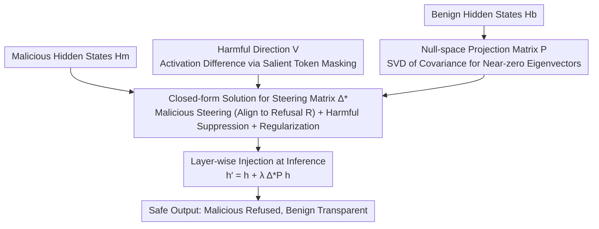

# Principled Steering via Null-space Projection for Jailbreak Defense in Vision-Language Models

**Conference**: CVPR 2026  
**arXiv**: [2603.22094](https://arxiv.org/abs/2603.22094)  
**Code**: None  
**Area**: LLM Alignment / VLM Safety  
**Keywords**: Jailbreak Defense, Activation Steering, Null-space Projection, VLM Safety, Test-time Defense

## TL;DR

Ours proposes NullSteer, an activation steering defense framework based on null-space projection. By restricting steering operations within the null space of benign activations, it effectively defends against visual jailbreak attacks without compromising the model's general capabilities.

## Background & Motivation

Vision-Language Models (VLMs) are highly vulnerable to visual jailbreak attacks when deployed in open scenarios—attackers hijack models to generate harmful content by adding adversarial perturbations to images or embedding malicious instructions. Existing defense methods mainly cover three directions:

**Training-time Defense** (e.g., adversarial training, safety fine-tuning): High computational cost, requires additional labeled data.

**Inference-time Defense** (e.g., prompt rewriting, multi-round detection): High latency, low efficiency.

**Activation Steering**: Lightweight and training-free, but possesses a critical flaw.

Activation steering methods guide safe outputs by injecting a "refusal direction vector" into the model's hidden states, serving as an efficient inference-time defense. However, **it does not distinguish between benign and malicious inputs**—the refusal vector affects all inputs simultaneously, leading to erroneous refusals of benign requests (i.e., the over-refusal problem), which severely damages the model's general utility. The authors observed that benign activations also shift after steering, explaining the root cause of over-refusal.

The core motivation is: Can a "**selective steering**" mechanism be designed such that steering operations only act on malicious inputs while remaining "transparent" to benign inputs?

## Method

### Overall Architecture

The design philosophy of NullSteer is clear: construct a linear transformation matrix $\Delta$ such that its projection within the benign activation subspace is zero (producing no perturbation), while dynamically guiding the model toward refusal semantics in malicious directions. The entire process is training-free, requiring only a small number of benign and malicious samples to estimate the projection matrix.

At inference time, the hidden state of each layer is modified:
$$\mathbf{h}^{(l)'} = \mathbf{h}^{(l)} + \lambda \tilde{\Delta}^{*(l)} \mathbf{P}^{(l)} \mathbf{h}^{(l)}$$

### Key Designs

**1. Null-space Projection Matrix P: A Mathematical Insurance for Benign Inputs**

The primary drawback of traditional activation steering is that the refusal vector is injected indiscriminately across all inputs, pushing benign requests toward refusal semantics, which leads to over-refusal and a decline in general utility. NullSteer addresses this by first defining a "benign safe zone": it collects $N_b$ hidden states from benign inputs to form a matrix $\mathbf{H}_b \in \mathbb{R}^{d \times N_b}$, requiring the final transformation matrix to satisfy $\Delta \mathbf{H}_b = \mathbf{0}$—meaning it falls within the null space of benign activations, producing zero perturbation. Solving for the null space of a $d \times N_b$ matrix directly is costly; the authors utilize the equivalence $\text{Null}(\mathbf{H}_b) = \text{Null}(\mathbf{H}_b \mathbf{H}_b^\top)$ to reduce the problem to a $d \times d$ covariance matrix. SVD is then applied to extract eigenvectors $\hat{\mathbf{U}}$ corresponding to near-zero eigenvalues to construct the projection matrix $\mathbf{P} = \hat{\mathbf{U}} \hat{\mathbf{U}}^\top$. The value of this step lies in providing a mathematical guarantee—rather than just empirical reduction—that benign activations remain unchanged before and after steering, blocking over-refusal at the source.

**2. Steering Learning for Malicious Directions: Dragging Malicious Activations Toward Refusal Semantics in Closed-form**

After protecting benign inputs, malicious inputs must be guided toward safe outputs; otherwise, zero perturbation results in zero defense. The authors collect $N_m$ hidden states of malicious inputs $\mathbf{H}_m$ with the goal of aligning the projected malicious activations to a target refusal activation $\mathbf{R}$, i.e., $\tilde{\Delta} \mathbf{P} \mathbf{H}_m = \mathbf{R}$. Since $\mathbf{P}$ is fixed and the target $\mathbf{R}$ is known, this is a linear least-squares problem with a closed-form solution, requiring no iterative training. Compared to schemes requiring gradient descent and hyperparameter tuning, this steering is practically "calculate once."

**3. Harmful Direction Suppression Term: Removing Residual Jailbreak Semantics**

Simply pulling malicious activations toward refusal may still leave residual jailbreak-related semantic features, causing the model to falter on edge cases. To address this, the authors extract an additional harmful direction $\mathbf{V}$—this is done by masking the tokens with the highest visual saliency in the image and measuring the resulting change in activation. This difference characterizes the direction of the "jailbreak signal." By incorporating this into a penalty term in the optimization objective $\|\tilde{\Delta} \mathbf{P} \mathbf{H}_m - \mathbf{V}\|_F^2$, the steering not only "guides to refusal" but also actively suppresses components along this harmful direction, effectively erasing residual attack traces beyond alignment. Ablations show this term contributes to further reductions in Toxicity and ASR.

### Loss & Training

The optimization objective of NullSteer consists of three terms and has a closed-form solution:

$$\tilde{\Delta}^* = \arg\min_{\tilde{\Delta}} \left( \|\tilde{\Delta}\mathbf{P}\mathbf{H}_m - \mathbf{R}\|_F^2 + \alpha\|\tilde{\Delta}\mathbf{P}\|_F^2 + \beta\|\tilde{\Delta}\mathbf{P}\mathbf{H}_m - \mathbf{V}\|_F^2 \right)$$

- First term: Aligns malicious activations to refusal semantics.
- Second term: Regularization to ensure smoothness of the transformation.
- Third term: Suppresses residual jailbreak feature directions.

The closed-form solution is obtained directly via the Moore-Penrose pseudoinverse, **requiring no gradient descent training**.

## Key Experimental Results

### Main Results

Evaluated on three VLMs (MiniGPT-4, Qwen2-VL, LLaVA-v1.5) against adversarial PGD perturbation attacks:

| Model | Metric | NullSteer | ASTRA (Prev. SOTA) | Undefended |
|------|------|-----------|---------------|--------|
| MiniGPT-4 (unconstrained) | Toxicity ↓ | **2.89%** | 4.48% | 52.12% |
| MiniGPT-4 (unconstrained) | ASR ↓ | **7.32%** | 9.09% | 53.64% |
| Qwen2-VL (ε=32/255) | Toxicity ↓ | **3.51%** | 5.45% | 51.62% |
| Qwen2-VL (ε=32/255) | ASR ↓ | **4.55%** | 5.00% | 70.46% |
| LLaVA-v1.5 (ε=32/255) | Toxicity ↓ | **31.82%** | 34.76% | 84.40% |
| LLaVA-v1.5 (ε=32/255) | ASR ↓ | **8.75%** | 10.91% | 56.36% |

General Capability (Utility) Maintenance:

| Model | MM-Vet | MMBench | XSTest |
|------|--------|---------|--------|
| MiniGPT-4 Original | 19.40 | 35.90 | 87.60 |
| MiniGPT-4 NullSteer | **21.05** | **36.25** | **87.80** |
| Qwen2-VL Original | 49.13 | 78.00 | 73.60 |
| Qwen2-VL NullSteer | 49.02 | **78.82** | **74.50** |

### Ablation Study

| Configuration | Toxicity ↓ | ASR ↓ | Utility ↑ | Explanation |
|------|-----------|-------|-----------|------|
| Undefended | 30.65% | 34.55% | 35.90 | Baseline |
| Reg + Refusal Align | 3.58% | 8.36% | 36.00 | Missing Harmful Suppress |
| Reg + Harmful Suppress | 4.02% | 8.57% | 36.00 | Missing Refusal Align |
| All Three Terms | **2.89%** | **7.32%** | **36.25** | Complementary |

### Key Findings

- Only about 8 benign samples are needed to construct a stable null-space projection.
- Approximately 100 malicious samples are sufficient to estimate the harmful direction.
- Safety and utility reach an optimal balance when steering intensity $\lambda \approx 5$.
- Remains effective under adaptive attacks (where the attacker knows the defense)—Jailbreak ASR drops from 49.1% to 19.3%.

## Highlights & Insights

1.  **Theoretical Elegance**: Formulates the safety alignment problem as a null-space constrained optimization, providing mathematical guarantees for benign representation invariance—a first in VLM defense.
2.  **Training-free**: The entire method possesses a closed-form solution, requiring no fine-tuning or gradient descent, adding virtually no latency during inference.
3.  **Selective Mechanism**: Perfectly solves the over-refusal problem of traditional activation steering—benign input activations are completely unaffected.
4.  **Cross-model Generalization**: Performs consistently across three different VLM architectures, demonstrating the universality of null-space constraints.

## Limitations & Future Work

1.  Relies on linear assumptions—assuming benign and malicious activation distributions can be separated via linear subspaces; might fail against highly non-linear attacks.
2.  Selection of null-space dimension $r$ requires pre-definition; different models or layers may require different settings.
3.  Currently only evaluates perturbation-based attacks; evaluation of typography-based visual attacks (text in images) remains limited.
4.  Selection of steering layer $l$ relies on empirical experience (e.g., layer 20 for 13B, layer 14 for 7B), lacking an adaptive selection mechanism.

## Related Work & Insights

- **AlphaEdit**: First used null-space projection for knowledge editing in LLMs to protect existing knowledge; served as the core inspiration for this paper.
- **ASTRA**: The primary comparison baseline, which uses adaptive activation steering but lacks null-space constraints.
- Null-space constraints have been widely validated in continual learning (GNSP, NS-Net, etc.); this paper introduces them for the first time into VLM safety alignment.
- Insight: Null-space projection provides a general "selective control" paradigm that could be extended to more scenarios requiring "changing certain behaviors while preserving others."

## Rating

- Novelty: ⭐⭐⭐⭐ — Null-space projection for VLM safety is a new combination, though null-space itself is widely used in CL/knowledge editing.
- Experimental Thoroughness: ⭐⭐⭐⭐⭐ — Three models, multiple attack intensities, adaptive attacks, comprehensive ablations.
- Writing Quality: ⭐⭐⭐⭐⭐ — Clear mathematical derivation, well-explained motivation.
- Value: ⭐⭐⭐⭐ — Provides a practical and theoretically interpretable solution for VLM safety defense.

<!-- RELATED:START -->

## Related Papers

- [\[ICLR 2026\] AlphaSteer: Learning Refusal Steering with Principled Null-Space Constraint](../../ICLR2026/llm_alignment/alphasteer_learning_refusal_steering_with_principled_null-space_constraint.md)
- [\[ICLR 2026\] Toward Universal and Transferable Jailbreak Attacks on Vision-Language Models (UltraBreak)](../../ICLR2026/llm_alignment/toward_universal_and_transferable_jailbreak_attacks_on_vision-language_models.md)
- [\[ICLR 2026\] Reasoned Safety Alignment: Ensuring Jailbreak Defense via Answer-Then-Check](../../ICLR2026/llm_alignment/reasoned_safety_alignment_ensuring_jailbreak_defense_via_answer-then-check.md)
- [\[ICLR 2026\] Mitigating the Safety Alignment Tax with Null-Space Constrained Policy Optimization](../../ICLR2026/llm_alignment/mitigating_the_safety_alignment_tax_with_null-space_constrained_policy_optimizat.md)
- [\[CVPR 2026\] Uncertainty-Aware Exploratory Direct Preference Optimization for Multimodal Large Language Models](uncertainty-aware_exploratory_direct_preference_optimization_for_multimodal_larg.md)

<!-- RELATED:END -->
