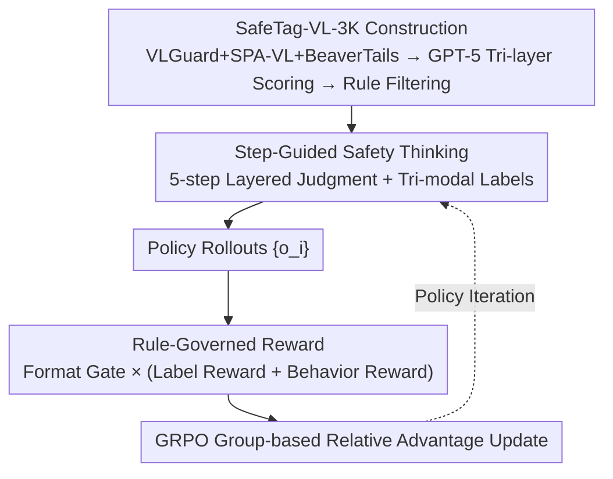

# SafeGRPO: Self-Rewarded Multimodal Safety Alignment via Rule-Governed Policy Optimization

**Conference**: CVPR 2026  
**Paper**: [CVF Open Access](https://openaccess.thecvf.com/content/CVPR2026/html/Rong_SafeGRPO_Self-Rewarded_Multimodal_Safety_Alignment_via_Rule-Governed_Policy_Optimization_CVPR_2026_paper.html)  
**Code**: https://github.com/XuankunRong/SafeGRPO  
**Area**: Alignment RLHF / Multimodal VLM / AI Safety  
**Keywords**: Multimodal Safety Alignment, GRPO, Rule-governed Reward, Self-reward, Compositional Safety Risk

## TL;DR
SafeGRPO integrates "verifiable rule-governed rewards" into GRPO, allowing Multimodal Large Language Models (MLLMs) to learn self-rewarded safety through a "step-guided reasoning process" (analyzing visual, text, and combined risks) without manual preference annotations. This approach enhances jailbreak defense, safety awareness, and stability across multiple safety benchmarks while minimizing degradation of general capabilities and avoiding excessive refusal.

## Background & Motivation

**Background**: Multimodal Large Language Models (MLLMs) have significantly advanced by unifying vision and language. Dominant safety alignment methods rely on large-scale supervised fine-tuning (SFT, e.g., VLGuard) or preference learning (DPO) to enhance safety.

**Limitations of Prior Work**: MLLMs face broader risks than text-only models, specifically **compositional safety risks**, where an image and text are safe individually but generate harmful semantics when **interpreted jointly** (e.g., a harmless image paired with a subtly phrased instruction implying harmful intent). Current models possess "shallow and text-driven" safety awareness, failing to identify such cross-modal implicit risks. Recent works attempt to mitigate this by letting models explicitly "reason about potential risks," but **unconstrained reasoning may inadvertently damage existing alignment**—the reasoning process itself may generate unsafe or misleading rationales since reasoning and safety are often treated as independent goals without supervision of the reasoning trajectory.

**Key Challenge**: While the GRPO paradigm (which refines reasoning via group-based comparison and self-rewarding) is ideal for supervising reasoning trajectories, **safety and ethical compliance cannot be directly verified** like mathematics or factual data. Verifiable rewards used in Reinforcement Learning from Verifiable Rewards (RLVR) fail on open-ended safety judgments due to the lack of a reliable signal for scoring "safety thinking."

**Goal**: To create **verifiable and fine-grained** safety reward signals for GRPO without relying on external preference models or human annotation, thereby constraining the safety of reasoning trajectories while aligning final behavior.

**Key Insight**: Since compositional risks arise from the interaction of vision, text, and their combination, "safety reasoning" can be explicitly decomposed into step-by-step judgments of these three layers, with ground-truth labels provided for each layer to make safety judgments **verifiable**.

**Core Idea**: A dataset with explicit tri-modal safety labels (SafeTag-VL-3K) serves as the ground truth. The model is required to output three layers of safety labels via "step-guided safety thinking" before responding. A set of **rule-governed rewards** (Format Gate $\times$ (Label Reward + Behavior Reward)) then drives GRPO for self-rewarded optimization.

## Method

### Overall Architecture
The objective of SafeGRPO is to drive GRPO with rule-governed, verifiable rewards to align the "safety" of multimodal reasoning. The pipeline consists of three stages: First, **constructing the SafeTag-VL-3K dataset** by aggregating image-text pairs from VLGuard, SPA-VL, and BeaverTails, re-labeling them with three-layer safety scores using GPT-5, and filtering according to specific rules. During training, the model performs rollouts using a **step-guided safety thinking** structured prompt—it first generates captions, then sequentially determines visual, text, and combined safety to output corresponding labels, and finally decides between "refusal + explanation" or "normal response" based on the combined label. Each rollout is scored by a **rule-governed reward**—passing through a format gate before calculating Label Reward (verifying correctly predicted labels) and Behavior Reward (verifying consistency between reasoning and action), resulting in a scalar for GRPO strategy updates.

### Key Designs

**1. SafeTag-VL-3K: Decomposing Compositional Safety Risk into Tri-layer Verifiable Labels**

Addressing the issue that "safety cannot be directly verified like math," this work constructs a modality-level dataset of 3K image-text pairs, each annotated with three explicit labels: `<visual_safe>`, `<text_safe>`, and `<combined_safe>`. The data sources mix VLGuard (originally for SFT) and SPA-VL (originally for DPO) to cover different safety distributions, and include 300 BeaverTails samples converted into "manuscript-style images" (embedding text into the visual modal) to simulate cross-modal embedding attacks.

Crucially, rather than adopting the original labels (which vary in definition), GPT-5 serves as an LLM-as-Judge to re-label each pair $(x_v, x_t)$, providing safety scores $s_m=\{s_v, s_t, s_c\}$ and confidence $c_m=\{c_v, c_t, c_c\}$ in $[0, 10]$. Threshold rules are used for discretization: $y_m=\text{unsafe}$ if $s_m \in [0, 3]$, $y_m=\text{safe}$ if $s_m \in [7, 10]$, and others are `discarded`. Only samples with $c_m \ge 7$ for all modes are retained, resulting in a high-consistency subset.

**2. Step-Guided Safety Thinking: Standardizing "Safety Reasoning" into Five Verifiable Steps**

Existing alignment paradigms (SFT/PPO/DPO) optimize the final output while ignoring the reasoning process—models might provide safe answers through unsafe or contradictory reasoning paths. This work uses a structured prompt to force reason-before-answering, decomposing reasoning into five steps: Step 1 (image captioning), Step 2 (visual safety judgment with `<visual_safe>` label), Step 3 (text safety judgment with label), Step 4 (joint judgment for **combined safety**), and Step 5 (summarizing risk causes). The model then provides a polite refusal if Step 4 is unsafe, or a helpful response if safe. Reasoning is wrapped in `<think></think>` and the answer in `<answer></answer>`. This provides verifiable intermediate states for the reward system.

**3. Rule-Governed Reward: Multi-granular Verifiable Rewards via Format Gating**

Without relying on learned or preference-based reward models, explicit verifiable rules score outputs based on structural format, modality-level label consistency, and behavior-reasoning alignment. The total reward is a **gated linear combination**:

$$R_{\text{safety}} = \mathbb{I}_{\text{format}} \cdot \left(0.5\,R_{\text{tag}} + 0.5\,R_{\text{behavior}}\right)$$

The format gate $\mathbb{I}_{\text{format}}$ is 1 only if the output follows the required sequence and is parsable. The label reward $R_{\text{tag}}$ uses a **hierarchical design dominated by the combined label**:

$$R_{\text{tag}} = \begin{cases} 0.5 + 0.25\,r_v + 0.25\,r_t, & s_c = \hat{s}_c \\ 0, & \text{otherwise} \end{cases}$$

The behavior reward $R_{\text{behavior}}$ ensures that the reasoning conclusion matches the final action: $R_{\text{behavior}} = \mathbb{1}[(s_c=\hat{s}_c)\wedge(a_c=\hat{a}_c)]$, where action $a_c$ is determined via keyword matching for refusal indicators (e.g., "sorry", "cannot").

## Key Experimental Results

### Main Results
The base model is Qwen3-VL-4B/8B-Thinking, trained using GRPO in the verl framework. Evaluations cover Jailbreak Defense (Safety Score), Safety Awareness (SIUO), and Over-sensitivity (MOSSBench, Refusal Rate of safe queries).

| Method (Qwen3-VL-8B-Thinking) | Avg Jailbreak Defense ↑ | Safety Awareness SIUO ↑ | Over-sensitivity Refusal ↓ |
| :--- | :--- | :--- | :--- |
| Base | 89.28 | 86.52 | 21.00 |
| + VLGuard | 97.01 | 90.47 | 95.00 ⚠️ |
| + ECSO | 95.68 | 89.34 | 26.33 |
| + Think-in-Safety | 97.69 | 88.80 | 64.00 ⚠️ |
| **+ SafeGRPO (Ours)** | **99.02** | **94.31** | **20.00** |

SafeGRPO achieved the best performance across all three dimensions. Notably, its Refusal Rate (20.00) is lower than the base model, whereas SFT-based baselines (VLGuard, Think-in-Safety) suffer from extreme over-refusal (95.00 and 64.00), sacrificing utility for safety.

### General Capabilities
| Method (Qwen3-VL-8B) | ScienceQA | MathVista | POPE | 5-Task Avg | Relative to Base |
| :--- | :--- | :--- | :--- | :--- | :--- |
| Base | 91.92 | 60.00 | 87.40 | 77.98 | — |
| + VLGuard | 5.60 | 20.10 | 19.20 | 16.94 | **↓61.04** (Collapse) |
| + Think-in-Safety | 39.51 | 58.90 | 63.20 | 52.02 | ↓25.96 |
| **+ SafeGRPO (Ours)** | 93.26 | 61.10 | 88.20 | **78.75** | **↑0.77** |

While SFT methods cause catastrophic forgetting or format misalignment, SafeGRPO slightly **improves** general capabilities, likely due to RL strengthening reasoning and mitigating forgetting.

### Ablation Study
| Configuration (Qwen3-VL-8B) | Safety Performance | Description |
| :--- | :--- | :--- |
| Base (No RL) | Lowest | No optimization |
| w/ Tag only | Medium | Safety perception supervision only |
| w/ Behavior only | Medium | Consistency supervision only |
| **Full SafeGRPO** | **Highest** | Multi-granular signal synergy |

### Key Findings
- **Over-sensitivity as a hidden cost**: Traditional alignment increases refusal rates to extreme levels; SafeGRPO maintains utility through reasoned decision-making.
- **RL preserves capabilities better than SFT**: SafeGRPO's RL approach avoids the performance collapse seen in micro-finetuning.
- **Combined label as the anchor**: Hierarchical rewards successfully prioritize joint image-text interpretation.

## Highlights & Insights
- **Transforming Safety into Verifiable Targets**: By decomposing safety into discrete tags, the framework allows RLVR-style optimization to be applied to subjective ethical alignment.
- **Format Gating x Hierarchical Rewards**: The combination of $\mathbb{I}_{\text{format}}$ as a hard gate and $R_{\text{tag}}$ as a hierarchical signal ensures purely verifiable supervision without needing large preference models.
- **Addressing Over-refusal**: SafeGRPO demonstrates that detailed reasoning can reduce false positives in safety triggers.

## Limitations & Future Work
- **Dependence on Closed-source LLMs**: Data labeling and evaluation rely on GPT-5 and GPT-4o-mini, potentially inheriting their biases.
- **Keyword-based Behavior Detection**: Using indicator words to judge refusal may introduce noise if the model uses nuanced language.
- **Data Scale**: The high-consistency filter removed "ambiguous" safety cases, meaning the model might struggle with realistic "gray area" inputs.

## Related Work & Insights
- **vs. VLGuard (SFT)**: VLGuard causes over-sensitivity and capability collapse; SafeGRPO improves safety while enhancing general performance.
- **vs. ECSO (Inference-time Defense)**: ECSO does not modify weights and has limited safety gains; SafeGRPO internalizes safety reasoning within the policy.
- **vs. Think-in-Safety (SFT Reasoning)**: Think-in-Safety suffers from significant capability drops (down 26); SafeGRPO uses GRPO to supervise the reasoning process itself.

## Rating
- **Novelty**: ⭐⭐⭐⭐ Decomposing compositional risk into verifiable labels for RL is an elegant bridge between RLVR and safety.
- **Experimental Thoroughness**: ⭐⭐⭐⭐ Solid across safety and general benchmarks, though missing direct comparison with large-scale PPO/DPO safety runs.
- **Writing Quality**: ⭐⭐⭐⭐ Clear motivation and well-defined reward structures.
- **Value**: ⭐⭐⭐⭐ Provides a reusable paradigm for "safe but not over-sensitive" alignment.

<!-- RELATED:START -->

<!-- RELATED:END -->

## Related Papers

- [\[ICLR 2026\] Mitigating the Safety Alignment Tax with Null-Space Constrained Policy Optimization](../../ICLR2026/llm_alignment/mitigating_the_safety_alignment_tax_with_null-space_constrained_policy_optimizat.md)
- [\[CVPR 2026\] Uncertainty-Aware Exploratory Direct Preference Optimization for Multimodal Large Language Models](uncertainty-aware_exploratory_direct_preference_optimization_for_multimodal_larg.md)
- [\[ICLR 2026\] GuardAlign: Test-time Safety Alignment in Multimodal Large Language Models](../../ICLR2026/llm_alignment/guardalign_test-time_safety_alignment_in_multimodal_large_language_models.md)
- [\[ICML 2026\] Long Live The Balance: Information Bottleneck Driven Tree-based Policy Optimization](../../ICML2026/llm_alignment/long_live_the_balance_information_bottleneck_driven_tree-based_policy_optimizati.md)
- [\[ICLR 2026\] Is On-Policy Data always the Best Choice for Direct Preference Optimization-based LM Alignment?](../../ICLR2026/llm_alignment/is_on-policy_data_always_the_best_choice_for_direct_preference_optimization-base.md)

<!-- RELATED:END -->
