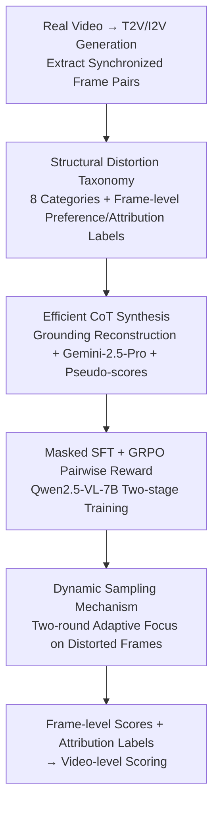

# Thinking with Frames: Generative Video Distortion Evaluation via Frame Reward Model

**Conference**: CVPR 2026  
**Paper**: [CVF Open Access](https://openaccess.thecvf.com/content/CVPR2026/html/Wang_Thinking_with_Frames_Generative_Video_Distortion_Evaluation_via_Frame_Reward_CVPR_2026_paper.html)  
**Area**: RLHF Alignment / Video Reward Model  
**Keywords**: Video reward model, structural distortion, GRPO, CoT synthesis, frame-level evaluation

## TL;DR
REACT is a frame-level reward model targeting "structural distortion" in generated videos. It establishes a taxonomy of eight distortion categories and labels 15,000 pairs of frame preference data. Using grounding reconstruction combined with Gemini-2.5-Pro, it synthesizes 6K CoT samples at low cost. Qwen2.5-VL-7B is trained in two stages via "Masked SFT + GRPO pairwise reward." During inference, a dynamic sampling mechanism focuses on frames most likely to be distorted, significantly outperforming existing video/image evaluators in both preference alignment and distortion identification.

## Background & Motivation
**Background**: Post-training of Text-to-Video (T2V) generation relies heavily on "Video Reward Models" (VRMs) to score results and perform RL alignment. Mainstream models like VideoScore, VideoReward, and UnifiedReward primarily evaluate three aspects: Visual Quality (VQ), Motion Quality (MQ), and Text Alignment (TA).

**Limitations of Prior Work**: Existing reward models almost entirely ignore "structural distortion"—structural anomalies of objects such as missing/repeated/deformed limbs, torso or facial warping, and unnatural mesh penetration between objects. Consequently, a video with high visual quality and temporal smoothness but an extra hand on a character can still receive high scores, leading the generative model in the wrong direction.

**Key Challenge**: Distortion evaluation fails through two existing routes. ① Video-level reward models have sampling rates that are too low (e.g., 2 fps). Since distortions are spatially local and frame-specific, low sampling rates miss problematic frames, and video-level labeling is too expensive to scale. ② Image Quality Assessment (IQA) models study artifacts, but artifacts in generated images are "sharp and clear-edged," whereas video distortions appear "blurred or fragmented" due to temporal inconsistency and motion. This significant domain gap causes image evaluators to perform poorly on video frames.

**Goal**: To create a reward model specifically for evaluating structural distortion in generated videos that provides both frame-level pointwise scores and interpretable attribution labels (type and location of distortion) to fill the gap in existing reward systems.

**Key Insight**: The authors choose a "frame-level" approach rather than video-level. Distortion is inherently local and detectable per frame; frame-level labeling is more efficient and allows large-scale data construction from limited videos. The model also leverages Chain-of-Thought (CoT) reasoning from MLLMs, allowing the model to "think before judging" for fine-grained analysis.

**Core Idea**: Transform structural distortion evaluation into a "frame-level MLLM reward model with CoT reasoning." This is achieved using a distortion taxonomy, low-cost CoT synthesis, Masked SFT to inject domain knowledge, and GRPO pairwise rewards to align with human preferences.

## Method

### Overall Architecture
The input to REACT is a "text prompt + single frame," and the output is a `<think>` reasoning process + `<answer>{attribution label, 1–5 score}`. During inference, frame-level scores are dynamically aggregated into a video-level score. The pipeline consists of three stages: **(a) Data Preparation**—building the taxonomy, collecting human preference/attribution labels, and synthesizing CoT via grounding tasks; **(b) Reward Model Learning**—using Qwen2.5-VL-7B as the base, applying Masked SFT to inject knowledge, followed by GRPO with pairwise rewards; **(c) Inference**—a dynamic sampling mechanism to adaptively select frames most likely to be distorted.

### Key Designs

**1. Structural Distortion Taxonomy + Frame-level Preference/Attribution Labeling: Defining Distortion**

Existing reward models lack a systematic taxonomy, making it difficult to pinpoint errors. REACT divides structural distortion into two main categories: **Abnormal Appearance** (object shape/structure deviation) and **Abnormal Interaction** (spatial relations violating physics). Appearance is further divided into animal-related and non-animal. For animals, the model analyzes limbs, torsos, and faces across deformation, deficiency, and repetition. By merging categories like limb deficiency and repetition, eight specific classes are defined: limb deformation, extra limbs, limb deficiency, torso deformation, facial deformation, non-animal collapse/distortion, motion blur, and mesh penetration.

Based on this, the authors collected **complex motion** videos from social platforms and generated content using models like Kling, HaiLuo, Seedream, Pika, Sora, and Luma. Frame pairs were constructed using different models for the same prompt or I2V paradigms to create pairs with identical semantics but different quality. A professional team of 34 produced **15K frame pairs (≈30K frames)** with >95% bbox accuracy and >90% attribution accuracy.

**2. Efficient CoT Synthesis: Reconstructing "Reasoning" as "Grounding"**

To enable Qwen2.5-VL-7B to perform CoT reasoning, a dataset with attribution labels, frame scores, and reasoning trajectories is required. Writing descriptions manually is costly, and current MLLMs fail to capture visual cues for distortion accurately. REACT solves this by **reconstructing the task as grounding**: annotators only draw bounding boxes on distorted regions, which is cheaper and easier to QC. These frames and boxes are fed to Gemini-2.5-Pro to **simulate the reasoning process** that leads to the correct label and location. After filtering by accuracy, **6K high-quality CoT samples** are generated.

Since the data consists of preferences without absolute scores, the authors **fake frame-level scores** based on the number of labels: no distortion = $[4.0, 5.0]$, one label = $[3.0, 4.0]$, two labels = $[2.0, 3.0]$, and three+ = $[1.0, 2.0]$. These pseudo-scores maintain human ranking consistency and provide score diversity for SFT, while fine-grained alignment is left to GRPO.

**3. Masked SFT + GRPO Pairwise Reward: Two-stage Training**

Prolonged SFT causes the model to memorize templates, leading to homogeneous reasoning trajectories that degrade GRPO performance, while too little SFT fails to inject domain knowledge. The authors use **Masked SFT**: the first epoch uses the full CoT (reasoning + label + score) in the loss. The second epoch **masks the reasoning trajectory** and only calculates loss for the final label and score. This refines labeling accuracy without forcing a rigid reasoning path, preserving diversity for RL.

The second stage uses **GRPO** to enhance reasoning and scoring. For input $q=\{c,f\}$, a group of $G=8$ responses is sampled, and advantages are calculated via group normalization:

$$A_i = \frac{R(o_i) - \mathrm{mean}(\{R(o_1),\dots,R(o_G)\})}{\mathrm{std}(\{R(o_1),\dots,R(o_G)\})}$$

Since training data lacks absolute scores, the authors designed a **pairwise reward** based on BTT loss. For frame pairs $\{f^A, f^B\}$, a set of rollouts is generated. The reward for each rollout consists of: **Format Reward** $R_{fmt}$ (1 if output is within `<think>` and `<answer>` tags); **Attribution Accuracy Reward**:

$$R_{attr}(o_i^j) = 0.6 \cdot a_{right} - 0.2 \cdot (a_{wrong} + a_{missing})$$

and **Preference Reward**: Instead of binary rewards, it uses predicted scores $s_i^A, s_i^B$ to calculate pairwise preference probability (including a "tie" option with hyperparameter $\theta=5$), taking the log-likelihood of the ground truth:

$$R_{pref} = \mathbb{I}(f^A \succ f^B)\log P(o^A \succ o^B) + \mathbb{I}(f^A \prec f^B)\log P(o^A \prec o^B) + \mathbb{I}(f^A = f^B)\log P(o^A = o^B)$$

The final reward is a weighted sum $R(o_i^j) = \lambda_1 R_{fmt} + \lambda_2 R_{attr} + \lambda_3 R_{pref}$.

**4. Dynamic Sampling Mechanism: Focusing on Distortion under Fixed Budget**

Uniform sampling often misses key distortion frames at low rates. Since distortions in generated videos are often correlated across adjacent frames, REACT uses **two-round adaptive sampling**. Round one samples uniformly at half the target fps. Based on the score distribution: if all frames are high-quality, the second round fills gaps sparsely; if frames fall below a low threshold (distortion detected), it samples densely near those frames at 1/4 fps; if scores are mixed, it randomly samples near frames below the mean. This increases the probability of hitting problematic frames without increasing the total sample count.

### Loss & Training
Base model: Qwen2.5-VL-7B. SFT uses LoRA (rank 32), LR 5e-4, AdamW, batch 64. GRPO uses LR 1e-6, $G=8$, 300 steps, rollout batch 256. Inference uses 2 fps with dynamic sampling, evaluated on REACT-Bench.

## Key Experimental Results

### Main Results
The benchmark REACT-Bench includes REACT-Video (500 human-annotated video pairs for alignment) and REACT-Frame (2.1K labeled frames for identification).

**Human Preference Alignment** (REACT-Video, Accuracy):

| Type | Model | Acc w/ Tie | Acc w/o Tie |
|------|-----------|-----------|------------|
| Video Evaluator | VideoScore2 | 0.342 | 0.521 |
| Video Evaluator | VideoReward | 0.415 | 0.551 |
| Video Evaluator | UnifiedReward | 0.416 | 0.701 |
| Image Evaluator | VisualQuality-R1 | 0.376 | 0.610 |
| General MLLM | Gemini-2.5-Pro | 0.370 | 0.534 |
| **Ours** | **REACT** | **0.610** | **0.813** |

REACT improves overall accuracy by approximately 20–40% over the strongest baseline (UnifiedReward), validating the necessity of explicit distortion modeling.

**Distortion Identification** (REACT-Frame, F1 Score):

| Model | Distorted Frame F1 | Normal Frame F1 |
|-----------|----------|----------|
| GPT-o3 | 0.641 | 0.379 |
| Gemini-2.5-Pro | 0.650 | 0.335 |
| MagicAccessor (SOTA IQA) | 0.554 | 0.285 |
| Qwen2.5-VL-7B (Base) | 0.162 | 0.292 |
| **REACT** | **0.845** | **0.671** |

### Ablation Study
| Config | Acc w/ Tie | Acc w/o Tie | Description |
|-----------|-----------|------------|------|
| REACT (Default) | 0.610 | 0.813 | Full Model |
| RL w/o SFT | 0.387 | 0.513 | Significant drop without SFT pre-training |
| RL w/o $R_{pref}$ | 0.352 | 0.514 | Binary reward is inferior to pairwise |
| REACT w/o DS | 0.519 | 0.725 | Removing dynamic sampling |

### Key Findings
- **SFT is a prerequisite for GRPO**: Without SFT, Qwen2.5-VL-7B lacks score diversity; SFT "ignites" the ability to differentiate quality.
- **Pairwise Preference Reward > Binary**: Using probabilistic pairwise likelihood conveys finer preference signals than hard thresholds.
- **Masking is the key SFT trick**: Masking reasoning in the second epoch avoids rigid template memorization and improves F1.
- **Dynamic Sampling provides stable gains**: It improves alignment from 0.519 to 0.610 by focusing on distorted frames.

## Highlights & Insights
- **Defining the Reward Blind Spot**: REACT addresses structural distortions like "extra limbs" that VRMs miss, defining a taxonomy to make the problem explicit.
- **Grounding for Cost-effective CoT**: Reconstructing text descriptions as bounding box tasks significantly lowers labeling costs.
- **GRPO for Alignment without Absolute Scores**: Designing a BTT-based reward allows for calibration to human preferences even when only pairwise data is available.

## Limitations & Future Work
- **Lack of Temporal Semantics**: REACT operates on single frames and cannot detect video-specific artifacts like flickering or sudden disappearance.
- **Pseudo-score Noise**: Converting label counts to random score intervals might introduce noise that averages out severity differences.
- **Closed-source Dependency**: Heavily reliant on Gemini-2.5-Pro for synthesis and a large manual labeling team.

## Related Work & Insights
- **vs Video Reward Models**: Existing models evaluate VQ/MQ/TA at low sampling rates; REACT complements them by specializing in frame-level structural distortion.
- **vs Image Evaluators**: IQA models suffer from a domain gap as video distortions are often blurry and fragmented rather than sharp.
- **Methodological Lineage**: Combines GRPO from the DeepSeek family with BTT loss from VideoReward in a new frame-level context.

## Rating
- Novelty: ⭐⭐⭐⭐ First frame-level reward model for structural distortion; grounding CoT synthesis is a clear innovation.
- Experimental Thoroughness: ⭐⭐⭐⭐ Strong results on REACT-Bench; comprehensive ablations and external validation.
- Writing Quality: ⭐⭐⭐⭐ Clear motivation and well-structured methodology.
- Value: ⭐⭐⭐⭐ Fills a critical gap in T2V training; the data synthesis method is highly reusable.

<!-- RELATED:START -->

## Related Papers

- [\[ACL 2025\] Rethinking Reward Model Evaluation Through the Lens of Reward Overoptimization](../../ACL2025/llm_alignment/rethinking_reward_model_evaluation_through_the_lens_of_reward_overoptimization.md)
- [\[CVPR 2026\] DRM: Diffusion-based Reward Model With Step-wise Guidance](drm_diffusion-based_reward_model_with_step-wise_guidance.md)
- [\[AAAI 2026\] GRAM-R²: Self-Training Generative Foundation Reward Models for Reward Reasoning](../../AAAI2026/llm_alignment/gram-r2_self-training_generative_foundation_reward_models_for_reward_reasoning.md)
- [\[CVPR 2026\] Unlocking Token Rewards via Training-Free Reward Attribution](unlocking_token_rewards_via_training-free_reward_attribution.md)
- [\[ACL 2026\] ConsistRM: Improving Generative Reward Models via Consistency-Aware Self-Training](../../ACL2026/llm_alignment/consistrm_improving_generative_reward_models_via_consistency-aware_self-training.md)

<!-- RELATED:END -->
