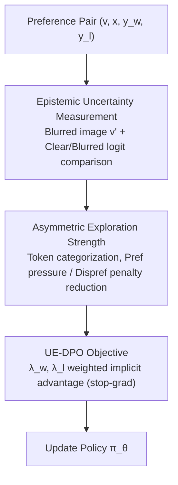

# Uncertainty-Aware Exploratory Direct Preference Optimization for Multimodal Large Language Models

**Conference**: CVPR 2026  
**Paper**: [CVF Open Access](https://openaccess.thecvf.com/content/CVPR2026/html/Zhang_Uncertainty-Aware_Exploratory_Direct_Preference_Optimization_for_Multimodal_Large_Language_Models_CVPR_2026_paper.html)  
**Code**: https://github.com/htzhang-code/UE-DPO  
**Area**: Alignment RLHF / Multimodal VLM  
**Keywords**: DPO, Multimodal Large Language Models, Hallucination Suppression, Epistemic Uncertainty, Token-level Credit Assignment

## TL;DR
UE-DPO shifts the optimization focus for hallucination suppression in Multimodal Large Language Models (MLLMs) from "visually sensitive tokens that the model already understands" to "critical cognitive blind-spot tokens that the model fails to comprehend." By quantifying these blind spots with token-level **epistemic uncertainty**, UE-DPO asymmetrically adjusts DPO gradient intensities for preferred and dispreferred branches. It outperforms similar methods like TPO and V-DPO on multiple hallucination benchmarks using significantly less data.

## Background & Motivation

**Background**: MLLMs integrate visual encoders with Large Language Models, achieving strong visual understanding but suffering from chronic **hallucinations**—describing objects absent from the image. Mainstream mitigation involves framing "visual-language alignment" as preference learning, using DPO to pull the model toward "image-faithful" responses from (preferred, dispreferred) pairs. A more granular sub-route involves **fine-grained credit assignment**: since the original DPO loss provides only sequence-level feedback, methods like TPO and V-DPO introduce token-level "visual sensitivity" signals (measuring the drop in token probability when the image is obscured or blurred) to assign extra weight to visual-related tokens.

**Limitations of Prior Work**: The "visual sensitivity" used by these methods is **estimated by the unreliable model currently undergoing training**. The issue is that high sensitivity toward a token indicates that the model **already knows how to utilize** that visual information. Continuing to apply pressure on these "mastered" tokens merely increases sensitivity to familiar cues. The real limitation to further reducing hallucinations lies in tokens with **low visual sensitivity that the model fails to understand but are critical** (e.g., background objects like the "ships" in Figure 1 of the paper); these tokens are ironically assigned the weakest optimization pressure.

**Key Challenge**: Guiding learning with "model-mastered sensitivity" leads to **self-referential bias**—reinforcing what is known while ignoring what is missing—causing alignment to stagnate at a shallow level.

**Goal**: To introduce a metric that directs optimization pressure toward the model's **cognitive deficiencies** rather than its mastered visual sensitivity, while separately handling preferred and dispreferred branches to avoid damaging existing visual knowledge.

**Key Insight**: The authors utilize **epistemic uncertainty**. If a model's confidence for a visual token given a clear image is **lower** than when given a blurred image where language priors dominate, it indicates the model's visual grounding is unstable (a "guessing" state). This contrast between "clear image performing worse than blurred image" precisely identifies cognitive blind spots.

**Core Idea**: Replace visual sensitivity with token-level epistemic uncertainty to distribute DPO optimization pressure. UE-DPO increases pressure on high-uncertainty blind-spot tokens in preferred samples for "exploratory self-correction," while simultaneously reducing penalties on beneficial visual knowledge in dispreferred samples. This is proven equivalent to introducing per-token entropy regularization in a reverse-KL regularized RL objective, reshaping it into a "generalized exploration advantage."

## Method

### Overall Architecture
Given preference data $(v, x, y_w, y_l)$ (image, prompt, preferred response, dispreferred response), UE-DPO applies diffusion noise to the image to obtain a blurred version $v'$. It calculates two signals for each token in the response: **epistemic uncertainty** $u$ (whether confidence in the visual token under a clear image is inferior to the language prior under a blurred image) and **visual sensitivity** $\Delta$ (the logit change between clear and blurred images). Tokens are categorized into three types to compute **asymmetric** exploration strength coefficients $\lambda_w, \lambda_l$. These are integrated into the DPO implicit advantage via stop-gradient to weight the gradients for updating the policy $\pi_\theta$.

### Key Designs

**1. Epistemic Uncertainty Measurement: Identifying Blind Spots via "Clear Image Underperforming Blurred Image"**

To direct pressure toward tokens the model fails to comprehend, a metric for "lack of understanding" is required. The paper creates a control group by adding diffusion noise to the clear image $v$ to obtain a blurred image $v'$:

$$v'(k) = \sqrt{\bar\xi_k}\, v + \sqrt{1-\bar\xi_k}\,\epsilon$$

In the blurred version, visual evidence is weakened, allowing language priors to dominate. At time step $t$, epistemic uncertainty is defined as the difference between the logit of the token $\hat a_t(v')$ (the one the model most likely predicts given the blurred image) and the target visual token $a_t$ under the **clear image**:

$$u(s_t, a_t) = \mathrm{logit}_\theta(\hat a_t(v')\mid v,x,y_{<t}) - \mathrm{logit}_\theta(a_t\mid v,x,y_{<t})$$

The intuition is straightforward: if, given a clear image, the model's confidence in the actual visual token is **lower** than its "guess" based on language priors ($u>0$), it indicates the model is guessing rather than grounded in vision. A larger $u$ signifies a deeper blind spot. The fundamental difference from traditional "visual sensitivity" is that high sensitivity only means the image affects the output (often for mastered content), whereas high $u$ represents a cognitive deficiency where the clear image fails to aid the model.

**2. Asymmetric Exploration Strength: Augmenting Pref. Exploration and Protecting Dispref. Knowledge**

Since the semantics of preferred and dispreferred branches are opposite, they are treated differently. The paper first defines **visual sensitivity** as $\Delta(s_t,a_t)=\mathrm{logit}_\theta(a_t\mid v,\cdots)-\mathrm{logit}_\theta(a_t\mid v',\cdots)$, and then applies asymmetric logic:

*Preferred Branch*: Identify **visually insensitive** tokens ($\Delta$ falls below the lower quantile $q_\tau$, denoted $I_w=1$). Among these, high-uncertainty tokens are blind spots where the model relies on language priors despite visual evidence (Type-I, pressure added). Low-uncertainty tokens are considered legitimate language dependencies (Type-II, unchanged). The exploration strength is:

$$\lambda_w(s_t,a_t) = 1 + \alpha\, \mathbb{1}\{I_w=1\}\,\sigma\!\left(\frac{u(s_t,a_t)-\mu_I}{\varsigma_I}\right)$$

*Dispreferred Branch*: Dispreferred responses are not entirely incorrect. **Visually sensitive** tokens ($\Delta\ge q_{1-\tau}$, denoted $I_l=1$) with high uncertainty suggest the model is already wavering. Applying standard heavy penalties here might erase nascent visual cognitions. Thus, the **penalty is reduced** based on uncertainty:

$$\lambda_l(s_t,a_t) = 1 - \alpha\, \mathbb{1}\{I_l=1\}\,\sigma\!\left(\frac{u(s_t,a_t)-\mu_I}{\varsigma_I}\right)$$

**3. UE-DPO Objective and Generalized Exploration Advantage: Theoretical Grounding**

The coefficients $\lambda$ are integrated as exponential weights into the DPO log-ratio using a stop-gradient:

$$\mathcal{L}_{\text{UE-DPO}} = -\mathbb{E}_{(x,y_w,y_l)\sim\mathcal D}\,\log\sigma\!\Big(\beta\sum_t \log\frac{\pi_\theta(a^w_t\mid s_t)^{\mathrm{sg}[\lambda_w]}}{\pi_{\text{ref}}(a^w_t\mid s_t)} - \beta\sum_t \log\frac{\pi_\theta(a^l_t\mid s_t)^{\mathrm{sg}[\lambda_l]}}{\pi_{\text{ref}}(a^l_t\mid s_t)}\Big)$$

Theoretically, the authors prove that introducing $\lambda$ is equivalent to adding a **per-token entropy regularization factor** to the KL-regularized RL objective, yielding an optimal policy $\pi^*(a|s) \propto \pi_{\text{ref}}(a|s)^{1/\lambda}$. This allows the target policy to **escape the visual deficiency priors** inherent in the reference model. The optimal advantage is generalized to a **generalized exploration advantage** $A^*_e = [Q^*(s,a)-V^*(s)] - \beta(\lambda - \mathbb{E}_{a'\sim\pi^*}[\lambda'])$.

### Loss & Training
The backbone models used include LLaVA-v1.5 (7B/13B) and Qwen2.5-VL-3B. Preference data includes RLHF-V (human feedback) and RLAIF-V (AI feedback). LoRA fine-tuning (rank 128) is employed with a max learning rate of 1e-5 and cosine annealing over 2 epochs. Exploration intensity $\alpha$ is set to 0.3 for 7B, 0.25 for 13B, and 0.15 for Qwen2.5-VL-3B. DPO $\beta=0.1$, and diffusion noise steps $k=500$.

## Key Experimental Results

### Main Results
UE-DPO was compared against similar preference learning methods on Object-HalBench, MMHal-Bench, and AMBER. Representative results for LLaVA-v1.5-7B are shown below (↓ lower is better, ↑ higher is better):

| Method (7B) | Data Size | Obj-Hal CHAIRs↓ | MMHal Score↑ | MMHal HalRate↓ | AMBER-g CHAIR↓ | AMBER-d F1↑ |
|:---:|:---:|:---:|:---:|:---:|:---:|:---:|
| LLaVA-v1.5-7B (Baseline) | – | 55.67 | 2.01 | 0.61 | 7.7 | 74.3 |
| mDPO | 10k | 35.70 | 2.39 | 0.54 | 4.4 | – |
| V-DPO† | 5.7k | – | 2.16 | 0.56 | 5.6 | 81.6 |
| TPO† | 5.7k | – | 2.47 | 0.51 | – | 85.0 |
| RLAIF-V | 16k | 16.0 | 3.00 | 0.38 | 3.0 | – |
| **UE-DPO† (RLHF-V)** | 5.7k | 13.72 | 2.82 | 0.48 | 2.9 | 85.7 |
| **UE-DPO (RLAIF-V)** | 16k | **11.62** | 2.95 | **0.37** | **2.5** | **87.0** |

† indicates training on the same dataset as UE-DPO. With only **5.7k samples** (RLHF-V), UE-DPO already outperforms TPO/V-DPO in the same setting. With the larger RLAIF-V set (16k), it achieves the lowest hallucination rates across all backbones.

### Ablation Study
Contribution of each branch (LLaVA-v1.5-7B, RLHF-V):

| Configuration | MMHal Score↑ | MMHal HalRate↓ | AMBER CHAIR↓ | Description |
|:---:|:---:|:---:|:---:|:---:|
| DPO | 2.26 | 0.60 | 3.7 | Original DPO |
| w/o pref. | 2.51 | 0.55 | 3.6 | Control on dispreferred only |
| w/o dispref. | 2.73 | 0.50 | 2.8 | Control on preferred only |
| **UE-DPO** | **2.82** | **0.48** | 2.9 | Combined control |

### Key Findings
- **Preferred branch as the primary engine**: Using only the preferred branch (w/o dispref.) significantly boosts MMHal Score from 2.26 to 2.73. The dispreferred branch provides auxiliary gains.
- **Selective adjustment is more effective**: Adjusting less than 50% of tokens ($\tau\approx0.4$) yields the best results compared to weighting all tokens, demonstrating that UE-DPO's selective credit assignment is more focused.
- **AMBER-d Acc/F1 Trade-off**: On RLHF-V, F1 improves but Accuracy slightly decreases as the model becomes more conservative. With the larger RLAIF-V set, both metrics recover, indicating the metric's sensitivity to data coverage.

## Highlights & Insights
- **Counterfactual design via clear/blurred image contrast**: Using diffusion noise to create a language-prior-dominated counterfactual effectively quantifies "guessing" behavior, avoiding the self-reinforcement bias of model-based self-evaluation.
- **Reframing hallucination suppression as "filling cognitive gaps"**: Shifting from "reinforcing what is known" to "addressing deficiencies" is a critical conceptual shift that bypasses the self-referential trap of previous credit assignment methods.
- **Theoretical-practical alignment**: $\lambda$ is both a gradient weight in engineering and a per-token entropy regularizer in theory, providing a closed-form explanation for why UE-DPO can escape visual deficiency priors.

## Limitations & Future Work
- **Dependency on blurred images as counterfactuals**: The diffusion noise level $k$ is a manually tuned hyperparameter; the fidelity of $u$ depends on this calibration.
- **Small object perception bottleneck**: Visualizations show that while the method can identify "low sensitivity + high uncertainty" for small background objects, the model may still fail to learn them due to fundamental perception limits of the backbone.
- **Hyperparameter sensitivity**: Factors like $\alpha, \tau, \beta, k$ require tuning, and $\alpha$ varies by backbone capability, lacking an adaptive mechanism for new models.

## Related Work & Insights
- **vs. TPO / V-DPO**: These use "visual sensitivity" to weight tokens, which UE-DPO argues reinforces already-known cues. UE-DPO targets blind spots and outperforms them with the same data size.
- **vs. mDPO / RLAIF-V**: These focus on data construction (e.g., GPT-4V correction). UE-DPO is orthogonal, modifying only the token-level credit assignment without changing the data itself.
- **vs. Post-hoc Decoding**: While decoding-time corrections don't address the root cause of alignment, UE-DPO fixes alignment issues during the training phase.

## Rating
- Novelty: ⭐⭐⭐⭐⭐ (The shift from visual sensitivity to cognitive deficiencies is insightful).
- Experimental Thoroughness: ⭐⭐⭐⭐ (Extensive benchmarks and backbones, though lacks stacking experiments with data construction methods).
- Writing Quality: ⭐⭐⭐⭐ (Clear motivation and derivation).
- Value: ⭐⭐⭐⭐ (Plug-and-play, data-efficient, and directly applicable to MLLM alignment).

<!-- RELATED:START -->

## Related Papers

- [\[ICLR 2026\] Sharpness-Aware Minimization in Logit Space Efficiently Enhances Direct Preference Optimization](../../ICLR2026/llm_alignment/sharpness-aware_minimization_in_logit_space_efficiently_enhances_direct_preferen.md)
- [\[ICML 2026\] Autoregressive Direct Preference Optimization](../../ICML2026/llm_alignment/autoregressive_direct_preference_optimization.md)
- [\[ACL 2026\] S2H-DPO: Hardness-Aware Preference Optimization for Vision-Language Models](../../ACL2026/llm_alignment/s2h-dpo_hardness-aware_preference_optimization_for_vision-language_models.md)
- [\[ICCV 2025\] Heuristic-Induced Multimodal Risk Distribution Jailbreak Attack for Multimodal Large Language Models](../../ICCV2025/llm_alignment/heuristic-induced_multimodal_risk_distribution_jailbreak_attack_for_multimodal_l.md)
- [\[ICML 2026\] Boosting Direct Preference Optimization with Penalization](../../ICML2026/llm_alignment/boosting_direct_preference_optimization_with_penalization.md)

<!-- RELATED:END -->
## Related Papers

- [\[ACL 2026\] S2H-DPO: Hardness-Aware Preference Optimization for Vision-Language Models](../../ACL2026/llm_alignment/s2h-dpo_hardness-aware_preference_optimization_for_vision-language_models.md)
- [\[ICCV 2025\] Heuristic-Induced Multimodal Risk Distribution Jailbreak Attack for Multimodal Large Language Models](../../ICCV2025/llm_alignment/heuristic-induced_multimodal_risk_distribution_jailbreak_attack_for_multimodal_l.md)
- [\[ACL 2026\] Topology-Enhanced Alignment for Large Language Models: Trajectory Topology Loss and Topological Preference Optimization](../../ACL2026/llm_alignment/topology-enhanced_alignment_for_large_language_models_trajectory_topology_loss_a.md)
- [\[ACL 2026\] Mitigating Selection Bias in Large Language Models via Permutation-Aware GRPO](../../ACL2026/llm_alignment/mitigating_selection_bias_in_large_language_models_via_permutation-aware_grpo.md)
- [\[ICLR 2026\] GuardAlign: Test-time Safety Alignment in Multimodal Large Language Models](../../ICLR2026/llm_alignment/guardalign_test-time_safety_alignment_in_multimodal_large_language_models.md)

<!-- RELATED:END -->
