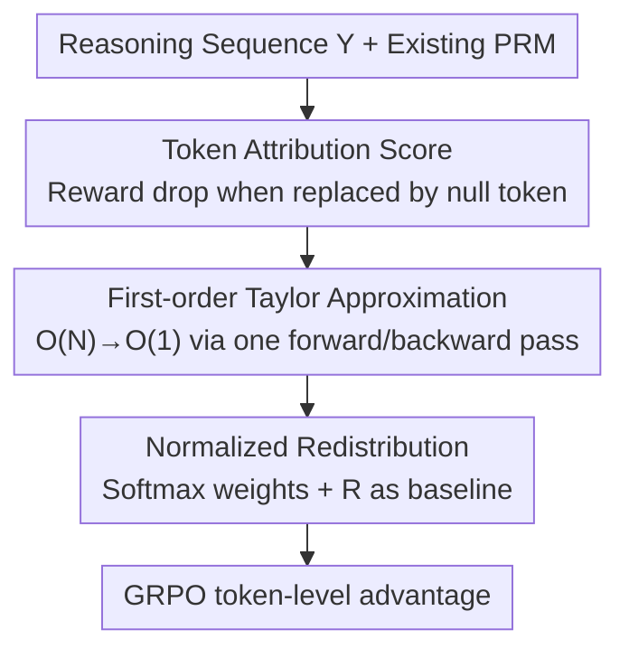

# Unlocking Token Rewards via Training-Free Reward Attribution

**Conference**: CVPR 2026  
**Paper**: [CVF Open Access](https://openaccess.thecvf.com/content/CVPR2026/html/Wu_Unlocking_Token_Rewards_via_Training-Free_Reward_Attribution_CVPR_2026_paper.html)  
**Code**: https://github.com/JIA-Lab-research/P2T  
**Area**: RLHF Alignment / LLM Reasoning / Multimodal VLM  
**Keywords**: token-level reward, reward attribution, training-free, credit assignment, GRPO

## TL;DR
P2T employs a first-order Taylor approximation to **training-freely** decompose "segment-level" rewards from existing Process Reward Models (PRMs) into individual tokens. With just a single forward and backward pass, it calculates token-level rewards for the entire sequence. Integrating this into GRPO accelerates math/multimodal reasoning RL convergence by approximately 4× and achieves a +11.5% improvement on AIME24 compared to outcome rewards.

## Background & Motivation
**Background**: Reinforcement Fine-Tuning (RFT) is currently the primary paradigm for enhancing the reasoning capabilities of large models. Supervision signals mainly consist of two types: **outcome reward**, which only checks the correctness of the final answer, and **process reward**, which involves training a Process Reward Model (PRM) to provide step-by-step scores.

**Limitations of Prior Work**: Both types of rewards are inherently "coarse-grained." Outcome rewards provide a single scalar at the end of the sequence, leading to **reward sparsity**: a reasoning chain that is mostly correct but contains one wrong step is penalized entirely, causing correct prefixes to be unfairly blamed. Conversely, early erroneous steps might be incorrectly reinforced if the final answer happens to be right. While process rewards narrow the focus to "steps," a single step can still contain hundreds of tokens, leaving the step-level score ambiguous for individual tokens.

**Key Challenge**: Achieving true token-level credit assignment currently faces two dead ends: ① Training specialized token-level reward models, which either rely on noisy pseudo-labels from weak/unsupervised sources or require expensive, large-scale human annotation, making it impractical; ② Using cheap heuristic proxies (such as token entropy) as rewards, which are computationally efficient but **lack semantic alignment with actual token quality**, serving only as loosely related heuristics rather than principled reward estimates. Thus, token-level supervision is stuck in a dilemma: either spend heavily on unreliable models or sacrifice optimization fidelity with inaccurate proxy signals.

**Core Idea**: The authors propose **process-to-token (P2T) reward attribution**. Instead of training any new models, it **directly decomposes** the knowledge already learned by "any differentiable coarse-grained reward model (e.g., a PRM)" into tokens. The reward for each token is defined as its "marginal contribution" to the segment reward. A first-order Taylor approximation is used to compress what would originally be an $O(N)$ forward-pass process into an $O(1)$ operation.

## Method

### Overall Architecture
The input to P2T is a generated reasoning sequence $Y=(y_1,\dots,y_N)$, its embeddings $E=[e_1,\dots,e_N]$, and an **existing, differentiable** reward model $R(\cdot)$ (in practice, a PRM providing process reward $R$). The output is a token-level reward $R^{\text{P2T}}_i$ for each token, which is then fed into GRPO for token-level advantage calculation. The pipeline consists of three steps: first, **defining** the "attribution score" $\mathcal{I}_i$ for each token (how much the segment reward drops when it is replaced by a null token); second, using **first-order Taylor approximation** to compress this attribution—which would otherwise require $N$ forward passes—into a single forward and backward pass to estimate values for all tokens; finally, applying softmax normalization to the attribution scores to **redistribute** the coarse reward $R$ back to tokens, while retaining $R$ as a baseline to prevent noise.

### Key Designs

**1. Token Attribution Score: Quantifying marginal importance by "reward drop when replaced by a null token"**

To address the issue of outcome/process rewards being too coarse, the authors define an attribution score $\mathcal{I}_i$ for each token $y_i$. By replacing its embedding $e_i$ with a specific null token embedding $e_\varnothing$ (keeping sequence length constant), the change in the segment reward is measured:

$$\mathcal{I}_i = R(E) - R(E_{i\leftarrow\varnothing})$$

$\mathcal{I}_i>0$ indicates the reward drops when the token is replaced, meaning $y_i$ is a positive contributor; $\mathcal{I}_i<0$ suggests it is detrimental; a value near 0 means its marginal contribution is negligible. This provides a **direct, local** measure of token importance that naturally inherits the credibility of the PRM. The choice of the null token is also deliberate: the authors select the existing **padding token [PAD]** from the vocabulary as $e_\varnothing$. Since the padding token is designed to be "semantically null" in Transformers and its attention is typically masked, it satisfies the requirements of a "null input" better than a random zero embedding (Ablation: [PAD] 53.8 > zero embedding 51.4 > mean of vocab 52.5).

**2. First-order Taylor Gradient Approximation: Compressing $O(N)$ forward passes into $O(1)$**

While the definition is simple, direct calculation requires $N$ forward passes for a sequence of length $N$, which is infeasible for large-scale RL training. The authors apply a first-order Taylor expansion of the reward at $e_i$:

$$\mathcal{I}^{\text{Grad}}_i \approx \nabla_{e_i} R(E)^\top (e_i - e_\varnothing)$$

This represents the inner product of the "gradient of the reward with respect to the token embedding" and the "difference between the original embedding and the null embedding." The key advantage is that a single backpropagation pass yields gradients for all token embeddings simultaneously. Consequently, **attribution scores for all tokens in the sequence are calculated in one forward and one backward pass**, reducing complexity from $O(N)$ to $O(1)$. This is the critical enabler for applying the method to large-scale training. In ablation studies, this approximation (53.8) slightly outperformed the exact vanilla token replacement algorithm (52.6), suggesting that the approximation not only saves computation but also helps smooth out noise.

**3. Normalized Redistribution + Coarse Reward Baseline: Converting jittery attribution scores into stable token rewards**

To address the concern that $\mathcal{I}_i$ derived from gradient approximation might be noisy, the authors do not use $\mathcal{I}_i$ directly as a reward. Instead, they use it as a weight after softmax normalization to **redistribute** the original coarse reward $R$:

$$R^{\text{P2T}}_i = R + \omega \cdot R \cdot \frac{\exp(\mathcal{I}_i)}{\sum_{j=1}^N \exp(\mathcal{I}_j)}$$

Two design points are crucial: First, softmax normalization ensures the sum of all token rewards equals the original reward $R$, allowing $R$ to be distributed fairly based on marginal contributions. Second, $R$ itself is kept as a **baseline term**. This provides a stable minimum reward signal for every token, using the $\omega$-weighted attribution term only for fine-tuning. Even if the attribution scores of some tokens are skewed by approximation errors, the perturbation is constrained by the baseline, preventing the policy from oscillating violently due to a few noisy token rewards. The default $\omega=0.6$, and ablation studies show results are stable for $\omega$ in the 0.25–1.0 range (53.2–53.8), indicating low sensitivity to this hyperparameter.

### Loss & Training
P2T rewards are integrated into GRPO by modifying the advantage calculation. Since GRPO is value-free, it estimates advantages using relative rewards within a group:

$$\hat{A}_n = \frac{R^{\text{out}}_n - \text{mean}(\{R^{\text{out}}\})}{\text{std}(\{R^{\text{out}}\})}$$

With P2T, the advantage for the $i$-th token of the $n$-th response becomes:

$$\widetilde{A}_{n,i} = \hat{A}_n + \alpha \cdot R^{\text{P2T}}_{n,i}$$

$\alpha$ balances the original outcome advantage with token-level guidance: $\alpha=0.1$ is used for short-CoT models (e.g., Qwen2.5 series), while $\alpha=1.0$ is used for long-CoT models (e.g., DeepSeek-R1-Distill). Multimodal experiments utilize VisualPRM, and text experiments utilize ReasonFlux-PRM, which supports LongCoT.

## Key Experimental Results

### Main Results
On text models, P2T consistently outperforms outcome rewards on mathematical reasoning benchmarks (values are the average pass@1 across 7 math benchmarks):

| Model | outcome reward | P2T token reward | Gain vs Outcome |
|------|---------------|------------------|-------------|
| Qwen2.5-Math-7B | 45.6 | 51.9 | +6.3 |
| LLaMA3.2-3B-Instruct | 23.9 | 33.9 | +10.0 |
| DeepSeek-R1-Distill-Qwen-1.5B | 46.5 | 54.5 | +8.0 |
| Qwen3-1.7B (thinking/non-thinking) | 65.7 / 46.0 | 68.5 / 52.7 | +2.8 / +6.7 |

Notable highlights: Qwen2.5-Math-7B improved from 28.8 to 40.3 on AIME24 (**+11.5**); DeepSeek-R1-Distill-1.5B improved from 27.2 to 41.4 on MinervaMath (**+14.2**). In the multimodal sector, Qwen2.5-VL-7B-Instruct improved from 70.1 to 75.0 on MathVista (a **+4.9** gain compared to the +2.0 gain from outcome rewards), with an average improvement across five benchmarks from 54.9 to 57.5.

Comparison with other token-level dense reward methods (Eurus-2-7B-SFT, average of 6 benchmarks):

| Method | Avg | Description |
|------|-----|------|
| GRPO (outcome) | 33.5 | Sparse baseline |
| PRIME | 36.0 | Requires co-training auxiliary network |
| SPRO | 38.4 | Heuristic proxy based on log-prob diff |
| GRPO (P2T) | **40.7** | Training-free, +2.3 vs SPRO, +4.7 vs PRIME |

### Ablation Study

| Configuration | Pass@1 | Description |
|------|--------|------|
| Full ([PAD] + Taylor approx.) | 53.8 | Complete model |
| null token as EOS | 51.4 | [PAD] is optimal, verifying "semantically null" hypothesis |
| null token as mean-of-vocab | 52.5 | Still inferior to [PAD] |
| vanilla per-token exact calculation | 52.6 | Approximation is slightly better and more efficient |
| outcome+process only (no token redistribution) | 50.6 | Token-level attribution independently contributes +3.2 |
| pure outcome | 48.0 | Cumulative contribution of token redistribution is +5.8 |

### Key Findings
- **Token-level attribution is the primary driver of gains**: Moving from "outcome+process" (50.6) to adding P2T token redistribution (53.8) shows an independent contribution of +3.2; compared to pure outcome (48.0), the cumulative gain is +5.8.
- **Stronger models and longer chains yield higher P2T benefits**: On the CoT-instruct LLaMA3.2-3B, P2T provides +10.0 over outcome rewards. On the LongCoT DeepSeek-R1-Distill-1.5B, outcome rewards stagnated (+1.5), while P2T achieved +8.0. The longer the sequence, the less effective a single terminal outcome signal becomes, making fine-grained credit assignment crucial.
- **Breaking outcome RL convergence bottlenecks**: Applying P2T fine-tuning to models that had already converged under outcome RL led to further gains (e.g., DeepScaleR-1.5B improved +12.1 on MinervaMath and +6.8 on AIME24), proving P2T provides a new dimension of supervision invisible to outcome rewards.
- **Training Efficiency**: Under GRPO, P2T achieves a convergence speed approximately **4×** faster than outcome rewards.

## Highlights & Insights
- **The "training-free reward decomposition" angle is ingenious**: While other token-level reward research focuses on "training another model," the authors realize that existing PRMs already encode knowledge of token quality. "Reading" this via gradients is cost-free and lacks pseudo-label noise.
- **Using [PAD] as the null token is both simple and self-consistent**: It avoids introducing new parameters or manually defined "zero vectors." Leveraging the padding token, which is inherently semantically empty and attention-masked, satisfies mathematical requirements for free, and ablation proves it to be optimal.
- **Retaining the coarse reward as a baseline is a key engineering stabilizer**: By constraining the noisy attribution term above a baseline, the method becomes insensitive to the hyperparameter $\omega$ and prevents training instability. This "fine-grained signal + stable fallback" combination can be transferred to any scenario using approximate gradients for reward shaping.
- **The $O(N)\to O(1)$ approximation is the critical bottleneck solver**: Exact attribution is too expensive for training; the first-order Taylor approximation turns it into a single forward/backward pass, bridging the gap between a "neat definition" and "large-scale RL deployment."

## Limitations & Future Work
- **Strong dependency on PRM quality**: P2T refines the knowledge of a PRM. It is limited by the PRM's reliability and domain coverage (Ablation: replacing the PRM with Qwen2.5-Math-PRM or Skywork-PRM dropped scores significantly: 53.8→52.4→50.0). P2T's ceiling is essentially dictated by the PRM.
- **Lack of theoretical characterization for Taylor approximation error**: While the approximation performed slightly better than exact replacement in experiments (likely due to noise smoothing), the paper does not define the error boundaries or conditions where the approximation might distort or conflict with true attribution.
- **Qualitative vs. Quantitative verification of token attribution**: The paper claims P2T can "surgically" locate erroneous tokens, but it lacks quantitative verification of attribution accuracy (e.g., measuring the overlap between human-annotated errors and low attribution scores).
- **Evaluation focus on Math/Reasoning**: While it covers text and multimodal tasks, they are primarily centered on verifiable mathematical reasoning. Whether PRM and token attribution are equally effective in open-ended generation (writing, dialogue) remains to be verified.

## Related Work & Insights
- **vs. PRIME**: PRIME co-trains an auxiliary network for token-level credit during RL. P2T is entirely training-free and introduces no networks to be jointly optimized, making it simpler, more stable, and +4.7 better on Eurus-2.
- **vs. SPRO**: SPRO uses the "log-prob difference between policy and reference models" as a heuristic proxy reward, which doesn't explicitly evaluate reasoning steps. P2T derives rewards from PRMs specifically trained to judge reasoning quality, making attribution more principled and interpretable (+2.3 over SPRO).
- **vs. OREAL / TVM**: These require training specialized token-level reward models (OREAL reuses the policy backbone with a scalar head; TVM adds a head to predict the probability of a token leading to a correct answer). P2T does not train any reward models and relies on gradients from existing PRMs.
- **vs. token-entropy proxies**: Heuristics like entropy are cheap but lack semantic alignment with token quality. P2T fills this gap by using a PRM to provide semantically principled rewards.

## Rating
- Novelty: ⭐⭐⭐⭐⭐ "Training-freely decomposing PRM rewards to tokens via gradients" is a clean and under-explored perspective. The $O(N)\to O(1)$ approximation makes it truly practical.
- Experimental Thoroughness: ⭐⭐⭐⭐⭐ Covers text/multimodal, base/CoT/LongCoT/hybrid models, benchmarking against PRIME/SPRO, 7 ablation studies, plus efficiency and bottleneck analyses.
- Writing Quality: ⭐⭐⭐⭐ Motivations and formulas are clear, though some "surgical error correction" claims are qualitative and lack quantitative attribution validation.
- Value: ⭐⭐⭐⭐⭐ Allows existing PRM-based RL pipelines to adopt token-level credit assignment at almost zero cost, accelerating convergence by 4× and breaking outcome RL bottlenecks. Highly practical.

<!-- RELATED:START -->

## Related Papers

- [\[ACL 2025\] T-REG: Preference Optimization with Token-Level Reward Regularization](../../ACL2025/llm_alignment/t-reg_preference_optimization_with_token-level_reward_regularization.md)
- [\[ICLR 2026\] Truthful or Fabricated? Using Causal Attribution to Mitigate Reward Hacking in Explanations](../../ICLR2026/llm_alignment/truthful_or_fabricated_using_causal_attribution_to_mitigate_reward_hacking_in_ex.md)
- [\[ICLR 2026\] Omni-Reward: Towards Generalist Omni-Modal Reward Modeling with Free-Form Preferences](../../ICLR2026/llm_alignment/omni-reward_towards_generalist_omni-modal_reward_modeling_with_free-form_prefere.md)
- [\[ACL 2026\] Teaching LLM to be Persuasive: Reward-Enhanced Policy Optimization for Alignment from Heterogeneous Rewards](../../ACL2026/llm_alignment/teaching_llm_to_be_persuasive_reward-enhanced_policy_optimization_for_alignment_.md)
- [\[AAAI 2026\] GRAM-R²: Self-Training Generative Foundation Reward Models for Reward Reasoning](../../AAAI2026/llm_alignment/gram-r2_self-training_generative_foundation_reward_models_for_reward_reasoning.md)

<!-- RELATED:END -->
