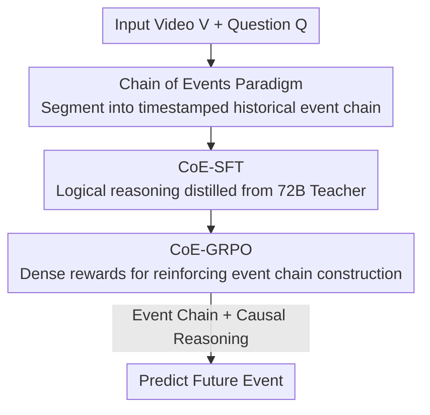

# Video-CoE: Reinforcing Video Event Prediction via Chain of Events

**Conference**: CVPR 2026  
**Paper**: [CVF Open Access](https://openaccess.thecvf.com/content/CVPR2026/html/Su_Video-CoE_Reinforcing_Video_Event_Prediction_via_Chain_of_Events_CVPR_2026_paper.html)  
**Keywords**: Video Event Prediction, Multi-modal Large Language Models, Chain of Events, GRPO, Temporal Modeling

## TL;DR
Addressing the issues where Multi-modal Large Language Models (MLLMs) lack logical reasoning and ignore visual content in Video Event Prediction (VEP), this paper proposes the Chain of Events (CoE) paradigm. It requires the model to segment videos into timestamped historical event chains and perform causal reasoning based on them. Through a two-stage training process (CoE-SFT for reasoning injection + CoE-GRPO for reinforcing event chain construction via dense rewards), Qwen2.5-VL-7B was improved from 52.9% to 75.0% on FutureBench, setting a new VEP SOTA.

## Background & Motivation
**Background**: MLLMs have demonstrated strong capabilities in video understanding, QA, and reasoning, but these tasks focus on "explaining observed content." Real-world scenarios like crisis early warning require predicting **future events that have not yet occurred** from observed videos (Video Event Prediction, VEP), an area that remains systematically under-researched.

**Limitations of Prior Work**: The authors evaluated various open-source and commercial MLLMs (GLM-4.1V, Kimi-VL, InternVL3, Qwen series, GPT-4o/5) on VEP and found they performed significantly worse than on standard vision tasks—even the strongest baseline, Qwen3-VL, achieved an average accuracy of only 66.9%. Further analysis identified **two root causes of failure**:

- **Lack of logical reasoning for future events**: VEP requires extrapolating from visual content to events not directly visible in the video. Existing models often take shortcuts: generating a video summary first, then analyzing text options to pick the "most relevant" one. This process lacks a logical chain deriving the future from video content. Furthermore, real-world VEP is an open-set problem where future events are not restricted to fixed options, making this option-dependency unusable.
- **Insufficient utilization of visual information**: Attention distribution visualization revealed that models allocate far less attention to visual tokens than text tokens during VEP, over-relying on "textual shortcuts" like option text. However, prior research indicates that fine-grained temporal modeling is key to predicting the future; this text-centric modal bias degrades prediction performance.

**Key Challenge**: Direct target-driven VEP pre-training requires large-scale annotation and computation, which is too costly. On the other hand, existing inference-time tricks like amplifying visual attention or prompting models to describe frames proved ineffective or even detrimental in VEP experiments.

**Goal**: Enable MLLMs to "comprehend visuals" and "deduce the future" without large-scale annotation or re-training.

**Core Idea**: Use an explicit **temporal Chain of Events** (CoE) as a scaffold: first force the model to decompose the video into timestamped historical events, then perform causal reasoning on this chain to predict the future, thereby addressing both visual neglect and the lack of reasoning.

## Method

### Overall Architecture
CoE reformulates VEP from "view video → guess option" into a two-step process: "view video → construct historical event chain → logical reasoning on the chain → predict future event."

Standard model reasoning is denoted as $R = \text{MLLM}_{\text{reason}}(V, Q)$, and the prediction process is $P = P(\hat{E}\mid V, Q, R)$. CoE defines an event as a tuple of a timestamp and description $E=(\mathcal{T}, \mathcal{D})$, ordered chronologically as an event chain $EC=[E_1, E_2, \dots, E_n]$. The model first performs fine-grained temporal modeling to construct the event chain $EC = \text{MLLM}_{\text{CoE}}(V)$, then reasons based on the video and the chain $R' = \text{MLLM}_{\text{reason}}(V, Q, EC)$, resulting in the final prediction:

$$P = P(\hat{E}\mid V, Q, R', EC).$$

Training involves two stages: **CoE-SFT** first injects the habit of "deducing the future from video content" using small-scale, high-quality data (acting as capability injection rather than pure cold-start), and **CoE-GRPO** uses reinforcement learning to unlock temporal localization capabilities and learn fine-grained event chain construction. The base models used are Qwen2.5-VL-3B/7B.

### Key Designs

**1. Chain of Events Paradigm: Use Event Chains as Visual Scaffolds to Force Visual Grounding and Causal Deduction**

Addressing the root causes—visual neglect and lack of reasoning—CoE introduces an explicit intermediate representation: chronologically ordered historical event chains. While previous works used chains/trees/graphs for video modeling, they were mostly action-centric for localization or understanding, and their complex structures imposed unnecessary learning burdens on MLLMs. CoE adopts a lightweight representation: each event consists of a "time interval + text description." This step decomposes the video into fine-grained historical events, forcing the model's attention back to visual content and mitigating visual-textual bias. Reasoning based on these chains provides a reliable visual basis for extrapolation rather than seeking shortcuts in the option text. The paradigm works through: (i) explicitly connecting video content to future events in the reasoning process; (ii) achieving fine-grained temporal modeling via event chain construction.

**2. CoE-SFT: Distilling "Logical Reasoning" instead of "Option Analysis" from 72B Models**

To predict the unobserved future, a logical link must be established between observed and unobserved events. Existing vanilla SFT data (e.g., NEP) analyzes options sequentially without a deduction process—explaining why previous fine-tuning with 30k+ samples yielded limited gains. CoE-SFT feeds the video, question, and the **correct future event** to Qwen2.5-VL-72B to reverse-engineer the logical reasoning process that leads from the video content to that specific future event, while explicitly forbidding analysis of other options. Small-scale high-quality data is obtained after human quality checks (90%+ pass rate). Notably, the author **does not** include the event chain $EC$ in the SFT data; because the quality of event chains generated by large models was substandard, it might interfere with training. However, experiments showed the model retained the ability to reason based on video content, which was later completed by event chain construction in the GRPO stage. CoE-SFT is thus positioned as "injecting reasoning habits."

**3. CoE-GRPO and Dense Event Chain Rewards: Unlocking Temporal Localization via RL**

Foundationally, event prediction relies on temporal modeling of historical events. CoE-GRPO tailors reward signals for VEP within the GRPO framework. It introduces special tags `<event>...</event>` to mark event boundaries, where each event contains start/end timestamps and fine-grained descriptions $E=$`<event>Time:`$t_{\text{start}}-t_{\text{end}}$`,Des:`$\mathcal{D}$`</event>`. The model incrementally constructs the event chain within the CoT. Since this representation is simple and requires no cold-start data, RL can be applied directly.

The reward is a weighted combination of three parts. The **Dense CoE Reward $r_e$** governs both "format correctness" and "appropriate length":

$$r_e^{(i)} = \lambda \mathbb{I}(o_i) + (1-\lambda)[L - |\text{len}(o_i) - L| + b],$$

where $\mathbb{I}(o_i)$ is 1 when the output contains all required tags, $\text{len}(o_i)$ is the number of events in the chain, $L$ is a hyperparameter for ideal length, and $b$ is a bias term making the maximum $r_e$ equal to 1. The length constraint is necessary as experiments showed that chains that are too long or too short hurt model performance. The **Similarity Reward $r_s$** prevents the model from hallucinating descriptions to farm rewards: the video is cropped into segments $[\text{clip}_1, \dots, \text{clip}_n]$ based on timestamps, and a similarity model calculates the average cross-modal cosine similarity between descriptions and their corresponding clips:

$$r_s = \frac{1}{n}\sum_{j=1}^{n} s_j,\quad s_j = \cos(v_j, t_j),$$

ensuring event chain descriptions match the video content. Combined with a verifiable **Accuracy Reward $r_a$** (1 for correct prediction), the total reward is $r_i = \alpha r_a^{(i)} + \beta r_e^{(i)} + (1-\alpha-\beta) r_s^{(i)}$. Advantages are normalized within groups $A_i = (r_i - \text{mean})/(\text{std} + \delta)$, and the policy update follows DeepSeek-R1’s clipped objective with KL-divergence constraint. This approach requires no additional annotation and unlocks temporal localization through the model's own capabilities.

### Loss & Training
Two stages: CoE-SFT micro-tuning with small-scale reasoning data, followed by CoE-GRPO training on RL data from various benchmarks. Implementation details: Qwen2.5-VL-3B/7B base, up to 16 H20 GPUs, max 32 video frames, resolution up to 128×28×28; GRPO group size $G=4$, KL coefficient $\beta=0.04$, clipping $\epsilon=0.2$, learning rate $1\text{e}{-6}$, trained for 150 steps.

## Key Experimental Results

### Main Results
Evaluated on FutureBench (split by 1/2/3-Hop and Interp.) and AVEP (evaluating Verb/Noun/Action F1), with Qwen2.5-VL as the base model.

| Model / Method | FutureBench AVG ↑ |
|------|------|
| Qwen2.5-VL-7B Instruct | 52.94 |
| GPT-4o | 59.04 |
| Qwen3-VL-30B-A3B (Strongest Baseline) | 66.86 |
| NEP-SFT (7B) | 64.39 |
| NEP-GRPO (7B) | 67.28 |
| **CoE-SFT (7B, Ours)** | 65.72 |
| **CoE-GRPO (7B, Ours)** | **75.00** |
| CoE-GRPO (3B, Ours) | 68.28 |

The CoE-GRPO 7B model increased the base score from 52.94 to 75.00 (+22 points), significantly outperforming the NEP-GRPO (67.28) of the same size, as well as the 30B Qwen3-VL and commercial GPT-4o/GPT-5. On AVEP, CoE-GRPO-7B's Action F1 (Test) of 8.29 surpassed Qwen2.5-VL-7B-GRPO's 6.48, with Verb accuracy rising from 9.64 to 12.24.

### Ablation Study

| Configuration | FutureBench AVG | Description |
|------|---------|------|
| CoE (Full) | 75.00 | Full method |
| Prompt-guided (Prompt visual amplification) | 45.74 | Existing tricks caused performance drops |
| Constant-Bias (Visual attn. bias during inference) | 52.57 | Also caused performance drops |
| Group size $G=2$ | 60.61 | Too few rollouts |
| Group size $G=4$ | 74.61 | Cost-performance trade-off (Recommended) |
| Group size $G=8$ | 77.20 | Higher performance but expensive |
| Event chain length $L=1$ | 73.90 | Too short, lacks detail |
| Event chain length $L=3$ | 74.61 | Optimal |
| Event chain length $L=5$ | 71.40 | Too long, redundancy interferes with reasoning |
| w/o Similarity reward $r_s$ | 72.00 | All metrics dropped after removal |

Note: The full CoE in the ablation table ($G=4, L=3$) is recorded as 74.61, which differs slightly from the 75.00 in the main table due to different settings; refer to the original text for exact values.

### Key Findings
- **Visual attention is effectively recovered**: CoE-GRPO's attention improvement Win Rate (WR) over the base model reached 0.77, while CoE-SFT reached 0.93. Conversely, vanilla SFT suppressed visual attention down to 0.32 (IR −3.33%), confirming that the event chain scaffold encourages the model to view the frames.
- **Common visual enhancement tricks fail on VEP**: Both Prompt-guided and Constant-Bias methods resulted in performance drops (45.74 / 52.57 vs 75.00), indicating that the bottleneck for VEP is the lack of logical reasoning structure rather than lack of attention magnitude.
- **Event chain length is non-monotonic**: Short chains lack visual detail, while long chains introduce redundancy that interferes with reasoning. $L=3$ was found to be optimal, justifying the length constraint in the reward function.
- **Interesting inversion in referee model evaluation**: In open-set referee evaluations, CoE-SFT's win rate (38.13%) was slightly higher than CoE-GRPO (32.42%). The authors suggest this is because the referee model is more familiar with SFT-style reasoning than the CoE paradigm itself; the closeness of the scores indicates that GRPO maintained reasoning capabilities.

## Highlights & Insights
- **Engineering "seeing" as an optimizable signal**: Instead of relying on prompts or hard-coded attention biases to address MLLMs' neglect of video content, this work utilizes "event chains + cross-modal similarity rewards" to transform visual grounding into an RL-optimizable dense reward, raising the attention win rate from 0.32 to 0.77.
- **Lightweight event representation is a critical trade-off**: The authors intentionally avoided complex structures like chains/trees/graphs in favor of "timestamps + descriptions." This decision reduced the learning burden on the MLLM and allowed the method to be applied directly to RL without requiring cold-start data for event chains.
- **Counter-intuitive detail in data construction**: The SFT stage deliberately omits event chains because the low-quality chains generated by large models would interfere with training. By deferring chain construction entirely to GRPO, the method leverages the strengths of each training phase.
- **Dense reward design to prevent reward hacking**: The combination of length and similarity constraints prevents the model from generating long, meaningless event chains for format rewards or hallucinating descriptions that do not match the video content.

## Limitations & Future Work
- **Strong dependency on similarity model quality**: $r_s$ relies on external models like VideoCLIP-XL for alignment. The authors noted that even for accurate descriptions, similarity scores stayed in the 0.2–0.3 range, indicating high signal noise. Performance varied depending on the similarity model used (73.01–74.61).
- **Unresolved bias in referee model evaluation**: Using Qwen2.5-VL-72B as a referee may favor SFT-style reasoning, potentially underestimating the win rate of CoE-GRPO. Objective measurement for open-set VEP remains an open question.
- **Scale and frame limitations**: Training was limited to 32 frames and restricted resolutions; generalization to long-sequence or high-resolution scenarios is unverified. Performance gains on models larger than 7B are also unknown.
- **Benchmark-specific event chain length**: The optimal $L$ depends on the dataset, implying that $L$ needs re-tuning for different benchmarks.

## Related Work & Insights
- **vs NEP / VidEvent / AVEP (Existing VEP methods)**: Prior works proposed and evaluated VEP but lacked a systematic analysis of why MLLMs fail. Their SFT data focused on option analysis without logical chains. This paper provides attribution (lack of reasoning + visual neglect) and solves it via the CoE paradigm, significantly outperforming NEP-GRPO (75.00 vs 67.28) at the same size.
- **vs Vanilla GRPO / DeepSeek-R1 style RL**: Standard GRPO focuses on accuracy rewards and frame-level or local perception. This paper adds event chain format rewards $r_e$ and cross-modal similarity rewards $r_s$ to the GRPO framework, explicitly optimizing for fine-grained temporal event chain construction.
- **vs Inference-time visual enhancement (Attention amplification / Prompt guidance)**: While useful in other tasks, these methods decreased performance in VEP, demonstrating that the primary obstacle is the absence of a reasoning structure rather than insufficient attention magnitude.

## Rating
- Novelty: ⭐⭐⭐⭐ First systematic attribution of MLLM failure in VEP; uses CoE + custom GRPO rewards effectively.
- Experimental Thoroughness: ⭐⭐⭐⭐ Two benchmarks, 3B/7B models, attention visualization, referee evaluation, and multi-dimensional ablations. However, limited to 7B and 32 frames.
- Writing Quality: ⭐⭐⭐⭐ Logical flow from motivation to method; clear reward design. Minor discrepancy between ablation and main table values.
- Value: ⭐⭐⭐⭐ VEP is an under-explored yet practical area; the paper establishes strong baselines and significantly pushes the SOTA.

<!-- RELATED:START -->

## Related Papers

- [\[CVPR 2026\] Thinking with Frames: Generative Video Distortion Evaluation via Frame Reward Model](thinking_with_frames_generative_video_distortion_evaluation_via_frame_reward_mod.md)
- [\[NeurIPS 2025\] DeepVideo-R1: Video Reinforcement Fine-Tuning via Difficulty-aware Regressive GRPO](../../NeurIPS2025/llm_alignment/deepvideor1_video_reinforcement_finetuning_via_difficultyawa.md)
- [\[ICCV 2025\] MagicID: Hybrid Preference Optimization for ID-Consistent and Dynamic-Preserved Video Customization](../../ICCV2025/llm_alignment/magicid_hybrid_preference_optimization_for_id-consistent_and_dynamic-preserved_v.md)
- [\[ACL 2025\] Fine-grained Video Dubbing Duration Alignment with Segment Supervised Preference Optimization](../../ACL2025/llm_alignment/fine-grained_video_dubbing_duration_alignment_with_segment_supervised_preference.md)
- [\[ACL 2025\] Chain-of-Jailbreak Attack for Image Generation Models via Editing Step by Step](../../ACL2025/llm_alignment/chain-of-jailbreak_attack_for_image_generation_models_via_editing_step_by_step.md)

<!-- RELATED:END -->
