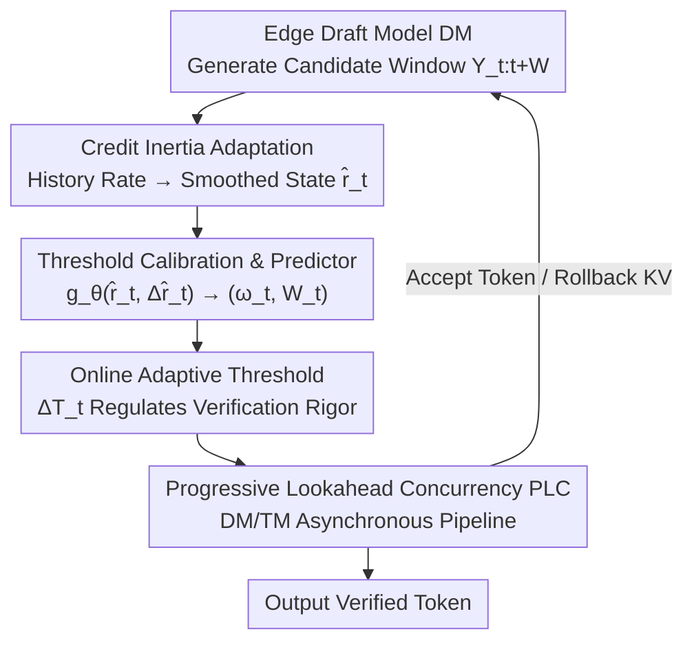

# E$^2$-SCI: Elastic Edge-Cloud Speculative Decoding via Credit Inertia

**Conference**: CVPR 2026  
**Paper**: [CVF Open Access](https://openaccess.thecvf.com/content/CVPR2026/html/Li_E2-SCI_Elastic_Edge-Cloud_Speculative_Decoding_via_Credit_Inertia_CVPR_2026_paper.html)  
**Code**: None  
**Area**: LLM Efficiency / Speculative Decoding  
**Keywords**: Speculative Decoding, Edge-Cloud Collaboration, Adaptive Threshold, Credit Inertia, Asynchronous Pipeline  

## TL;DR
This paper identifies strong temporal consistency in token acceptance rates across adjacent windows in edge-cloud speculative decoding (termed "Credit Inertia"). Based on this, it dynamically adjusts verification thresholds using historical acceptance rates. Combined with an Asynchronous Pipeline (PLC) that parallelizes draft generation and cloud verification, it achieves 9.4+ tokens/s on DeepSeek-R1-Distill-Qwen (1.5B/32B), representing an 88.5% speedup over the FSD baseline without compromising accuracy.

## Background & Motivation

**Background**: Speculative Decoding (SD) is a mainstream method for reducing LLM inference latency. A lightweight draft model (DM) on the edge device first predicts a batch of candidate tokens, which are then verified in parallel by a large target model (TM) in the cloud. Verified tokens are committed at once. Edge-cloud deployment places the DM at the edge and the TM in the cloud, reducing cloud energy consumption and user-perceived latency.

**Limitations of Prior Work**: Traditional SD uses a **fixed acceptance threshold** to judge token adoption—rejecting tokens if the divergence between the draft and target distributions exceeds the threshold. This "one-size-fits-all" approach has two flaws: first, it is rigid, rejecting high-quality tokens that would not harm generation quality just because their probability is slightly below a fixed threshold, triggering redundant regenerations; second, strong synchronization dependencies on the edge-cloud link (the draft waits for the verified prefix, the target waits for the draft sequence) cause latency to accumulate due to uplink transmission and mutual waiting.

**Key Challenge**: Fixed thresholds cannot adapt to dynamic network conditions and fluctuations in token consistency. More importantly, they **waste historical verification statistics**. The authors' analysis of edge-cloud SD requests reveals that acceptance rates in adjacent generation windows are highly consistent—requests performing well recently (e.g., $\alpha_t > 0.8$) continue to perform well, while those performing poorly (e.g., $\alpha_t < 0.4$) remain low. Empirically, sequences with $\text{mean}(H_t) > \tau_{high}$ have an average acceptance rate of $0.85\pm0.08$, while those with $\text{mean}(H_t) < \tau_{low}$ average only $0.32\pm0.12$. This temporal correlation stems from the smooth variation of inherent language difficulty—"easy windows stay easy, hard windows stay hard."

**Goal**: Under QoS constraints, dynamically adjust the "controllable tolerance" of edge-cloud draft verification based on context, jointly minimizing cloud energy consumption and client-side waiting latency while maintaining task quality. This is formalized as $\min_{g_\theta} \mathbb{E}[T_{\text{seg}}] + \gamma E_{\text{cloud}}$, where segment latency $T_{\text{seg}} = \max\{T_{\text{edge}}, T_{\text{cloud}}\} + T_{\text{re}}$ ($T_{\text{re}}$ is regeneration overhead), and $\gamma$ balances latency and energy.

**Core Idea**: Treat "Credit Inertia" as reliable evidence—use recent acceptance history to dynamically adjust thresholds (relaxing them when history is good, tightening when poor), and use an asynchronous pipeline to break the hard synchronization barrier between drafting and verification.

## Method

### Overall Architecture
E2-SCI is an **elastic edge-cloud speculative decoding framework**. Its core is upgrading the verification threshold from a "fixed constant" to an "adaptive quantity driven by historical acceptance rates." The system follows two orthogonal optimization paths: **Credit Inertia Adaptation** (adjusting thresholds along the time dimension), which compresses the last $k$ window acceptance rates into a smoothed state $\hat{r}_t$, mapped via offline calibration and a lightweight predictor to the optimal threshold $T_t$ and window size $W_t$; and **PLC Asynchronous Concurrency** (parallelizing along the spatial dimension), which allows the edge DM and cloud TM to execute as independent collaborative processes, hiding uplink transmission and verification latency within the draft generation time. These paths synergize: adaptive thresholds reduce false rejections and rollback frequency, while PLC eliminates idle waiting—one reduces "re-work," the other reduces "waiting."

### Key Designs

**1. Credit Inertia Mechanism: Converting "Recent History" into a Reliable Signal**

This is the observational foundation of the paper, addressing the pain point that fixed thresholds ignore historical statistics. The authors assume language difficulty varies smoothly across adjacent contexts, making acceptance rates of adjacent speculative windows naturally correlated. Given the recent $k$ window acceptance history $H_t = \{\alpha_{t-k}, \dots, \alpha_{t-1}\}$, the system determines if it is in a "high credit" or "low credit" region: good performance justifies relaxing verification to encourage aggressive speculation, while poor performance requires tightening to avoid cascading failures. The authors provide an existence proof (Theorem 4.1): assuming $\hat{r}_t$ varies boundedly and smoothly ($|\hat{r}_{t+1}-\hat{r}_t|\le\epsilon$), an optimal threshold $T^*(\hat{r}_t)$ exists for every $\hat{r}_t$ based on the joint cost $\mathcal{L}(T_t\mid\hat{r}_t) = \mathbb{E}[T_{\text{seg}}(T_t)\mid\hat{r}_t] - \gamma\,\mathbb{E}[L_{\text{acc}}(T_t)\mid\hat{r}_t]$ ($L_{\text{acc}}$ is the expected length of the accepted prefix). Compared to static thresholds, this anchors verification standards to temporal patterns, lowering rejection rates without sacrificing distribution fidelity.

**2. Threshold Calibration & Lightweight Predictor: Mapping States to Thresholds via Offline Tables + 5-layer MLP**

To avoid optimization overhead during online inference, the "state → optimal threshold" mapping is split into offline calibration and online prediction. During offline calibration, candidate thresholds $\{\theta_j\}$ are scanned for each smoothed acceptance rate $\hat{r}$, recording acceptance probability, accuracy, and latency. The threshold minimizing the joint cost $\mathcal{L}$ is labeled as the optimal target in a lookup table. A five-layer feedforward predictor $g_\theta$ is trained on this data, taking the current smoothed rate $\hat{r}_t$ and its momentum derivative $\Delta\hat{r}_t$ as input, outputting a strictly positive adaptive weight $\omega_t$ (controlling threshold shift) and optimal window size $W_t$: $g_\theta(\hat{r}_t, \Delta\hat{r}_t) = (\omega_t, W_t)$. The training objective is directly tied to latency reduction: $\min_\theta \mathbb{E}_{x\sim\mathcal{D}}\big[\sum_{t=1}^{M}(T_{\text{seg}}^{(t)}(\theta) - \lambda L_{\text{acc}}^{(t)}(\theta))\big]$, balancing latency penalties with accepted token rewards.

**3. Online Adaptive Verification: Bidirectional Adjustment with EWMA Smoothing and Credit Difference**

During online verification, the Jensen-Shannon divergence between draft and target distributions is compared against the adaptive threshold. The current window acceptance probability is calculated as the ratio of the expected acceptance length to the window size $p_{\text{acc}}^{(t)} = \mathbb{E}[L_{\text{acc}}] / W_t$, and the smoothed rate is updated via exponential decay:

$$\hat{r}_t = (1-\beta)\hat{r}_{t-1} + \beta\, p_{\text{acc}}^{(t)}, \quad \beta = 0.3$$

The threshold update is decomposed into a baseline and an adaptive adjustment:

$$\Delta T_t = \alpha\cdot\omega_t\cdot(\hat{r}_t - \tau_{\text{credit}}), \quad T_t = \max\{T_{\text{min}},\ \min\{T_{\text{base}} + \Delta T_t,\ T_{\text{max}}\}\}$$

The core mechanism is a symmetric bifurcation around the neutral expectation $\tau_{\text{credit}}$: when $\hat{r}_t > \tau_{\text{credit}}$ (history is better), $\Delta T_t > 0$, relaxing the threshold for aggressive acceptance; when $\hat{r}_t < \tau_{\text{credit}}$ (history is worse), $\Delta T_t < 0$, compressing the threshold below $T_{\text{base}}$ to strictly tighten verification and isolate low-confidence tokens. $T_{\text{min}}/T_{\text{max}}$ serve as hard security boundaries. To prevent oscillations, the system applies hysteresis control, sliding window updates, and minimum refresh intervals, with a safety check: if $\text{Acc}(T_{\text{pred}}) < \delta$, it reverts to a conservative threshold. The joint goal is maximizing "goodput" (accepted tokens per unit time): $G(T, W) = \mathbb{E}[L_{\text{acc}}(T,W)] / \mathbb{E}[T_{\text{seg}}(T,W)]$.

**4. Progressive Lookahead Concurrency (PLC): Asynchronous Pipelining to Hide Wait Latency**

To address the bottleneck of strong synchronization between drafting and verification, PLC decouples speculative decoding into asynchronous pre-hit and verification phases, allowing the DM and TM to run as parallel processes. In the pre-hit phase, the TM verifies only the **first token** of the speculative window $Y_{t:t+W_t}$: if rejected by the dynamic threshold, the entire window is discarded to save redundant computation; if the first token passes, the DM proceeds with generation without waiting for full TM feedback, while the TM asynchronously verifies the previous window under its distribution $p_t$, creating an overlapping pipeline. The concurrent window expands dynamically with feedback:

$$W_t^{\text{P}} = W_t \cdot \prod_{j=1}^{l_t}(1 + \eta_j)$$

Where $l_t$ is the number of asynchronous feedback signals received and $\eta_j$ is the dynamic expansion coefficient. Upon completion, the TM returns a compact feedback signal $s_t$, allowing the DM to commit accepted tokens or rollback the KV cache. This eliminates rigid synchronization barriers and hides uplink/verification latency.

### Loss & Training
The predictor $g_\theta$ is trained on "state → optimal threshold/window" supervised data from offline calibration. The objective $\min_\theta \mathbb{E}_{x\sim\mathcal{D}}[\sum_t(T_{\text{seg}}^{(t)} - \lambda L_{\text{acc}}^{(t)})]$ directly couples prediction parameters with latency reduction and token acceptance gains. EWMA decay $\beta=0.3$, default history window $k=5$, and hysteresis ensure online stability.

## Key Experimental Results

Testing used NVIDIA RTX 4090 + A6000 GPUs to simulate edge-cloud networks, covering Qwen2, Llama3.1, Gemma2, and DeepSeek-R1-Distill-Qwen models. Datasets included GSM8K (Math), CommonsenseQA (CS), MMLU (General), and HumanEval (Code), with batch size=1.

### Main Results: Edge-Cloud Speedup (Relative to SD=1.0×, Red ↑ denotes Gain over FSD)

| Method | GSM8K (DS-R1 1.5&32B) | CSQA (DS-R1) | MMLU (DS-R1) | HumanEval (DS-R1) |
|------|------|------|------|------|
| FSD (2024) | 1.43× | 1.39× | 1.38× | 1.17× |
| Medusa (2024) | 1.36× | 1.56× | 1.46× | 1.21× |
| FR-Spec (2025) | 1.95× | 2.02× | 1.79× | 2.04× |
| LR (2025) | 1.84× | 2.02× | 1.89× | 1.82× |
| AMUSD (2025) | 1.81× | 1.89× | 1.81× | 1.74× |
| **E2-SCI (ours)** | **1.98× (↑45%)** | **2.07× (↑49%)** | **1.98× (↑43%)** | **2.01× (↑72%)** |

E2-SCI achieved the highest or tied for highest speedup across all model pairs and datasets, with gains over the FSD baseline typically between +32% and +90% (most notably +72%~+90% on HumanEval).

### Throughput Comparison (tokens/sec, C-E for Edge-Cloud scenario)

| Scenario | Dataset | SD | Baseline | E2-SCI |
|------|------|------|------|------|
| Normal | GSM8K | 15.71 | 20.14 | **30.03** |
| Normal | HEval | 12.44 | 15.01 | **24.23** |
| C-E | GSM8K | 14.40 | 19.71 | **29.52** |
| C-E | MMLU | 11.24 | 15.51 | **22.20** |
| C-E | HEval | 11.84 | 13.80 | **23.71** |

E2-SCI achieves a 1.8×~2.4× throughput increase relative to vanilla SD. Credit inertia calibration reduces failure frequency and mitigates rollback penalties.

### Ablation Study (Fig 6, Speed Degradation after removing components, tokens/s)

| Configuration | Description | Impact |
|------|------|------|
| Full E2-SCI | Complete Model | Baseline (0 degradation) |
| w/o PLC | Remove Async Pipeline | Significant speed drop (PLC provides highest gain) |
| w/o Threshold | Remove Distribution Threshold | Speed decrease |
| w/o History | Remove Credit Inertia | Speed decrease |

Integration experiments (Table 3) show E2-SCI improves accuracy slightly when combined with Medusa/FSD/EAGLE3/PipeSpec (e.g., EAGLE3 on DS-R1 GSM8K 93.1→94.7), proving it can be overlaid on existing frameworks without loss of quality.

### Key Findings
- **History Window $k$ shows diminishing returns**: Accuracy improves significantly from $k=1\to5$, but $k=10$ only adds +0.2% accuracy while losing 9.2 tokens/s. $k=5$ is the default.
- **PLC and Adaptive Thresholding are Orthonormal**: Ablation shows PLC removal causes the greatest speed degradation (eliminating waiting is the main throughput driver), while removing history/threshold primarily impacts false rejection rates.
- **HumanEval (Code) benefits most**: Speedup over FSD reaches +72%~+90%, indicating code tasks with strong local consistency benefit most from credit inertia.

## Highlights & Insights
- **"Credit Inertia" is a simple but overlooked observation**: The temporal correlation of acceptance rates is an inherent property of language difficulty smoothness. Using it as a free supervisory signal for thresholds involves negligible inference cost.
- **Symmetric Bidirectional Thresholding is clever**: $\Delta T_t$ simultaneously handles "rewarding" and "penalizing" with a single difference term. Hard safety boundaries $T_{\text{min}}/T_{\text{max}}$ prevent distribution collapse.
- **PLC's "First Token Pre-hit" is a key trick for reducing redundancy**: Verifying only the first token allows for early window discarding, saving verification compute for doomed windows.

## Limitations & Future Work
- The method depends on **offline-calibrated lookup tables and predictors**. Generalization to unseen domains or network conditions requires further validation.
- Credit inertia assumes "smoothly varying difficulty," which may fail during **abrupt transitions** (e.g., drastic dialogue topic shifts or mixing code/natural language).
- ⚠️ Theorem 4.1 only proves existence; it does not provide convergence rates or suboptimality bounds.
- Experiments used 4090/A6000 simulators; performance on real mobile edge devices (power/memory limits) remains to be verified.

## Related Work & Insights
- **vs FSD**: FSD uses fixed controllable bias for SD relaxation; E2-SCI makes this bias **dynamic** based on history, accelerating FSD by +32%~+90% as an additive layer.
- **vs PipeSpec**: PipeSpec uses predictor-verification coordination for async SD; E2-SCI's PLC similarly pipelines but injects **dynamic thresholds** and a more aggressive pre-hit mechanism.
- **vs Medusa/EAGLE3**: These improve draft generation; E2-SCI's "verification rigor + async concurrency" is orthogonal, allowing for joint deployment as shown in Table 3.
- **vs History-agnostic methods**: The authors emphasize that prior SD methods ignore temporal dependencies across sequence requests, which E2-SCI exploits.

## Rating
- Novelty: ⭐⭐⭐⭐ Simple but powerful "Credit Inertia" observation combined with robust async pipelining.
- Experimental Thoroughness: ⭐⭐⭐⭐ Broad coverage across 4 model families and datasets.
- Writing Quality: ⭐⭐⭐ Mechanism is clear, though some formula/theorem notations in the CVF version require cross-referencing.
- Value: ⭐⭐⭐⭐ Highly practical for edge-cloud LLM inference and compatible with existing SD frameworks.

<!-- RELATED:START -->

## Related Papers

- [\[ICLR 2026\] Speculative Speculative Decoding](../../ICLR2026/llm_efficiency/speculative_speculative_decoding.md)
- [\[ICML 2025\] DSSD: Efficient Edge-Device LLM Deployment and Collaborative Inference via Distributed Split Speculative Decoding](../../ICML2025/llm_efficiency/dssd_efficient_edge-device_llm_deployment_and_collaborative_inference_via_distri.md)
- [\[CVPR 2026\] ParallelVLM: Lossless Video-LLM Acceleration with Visual Alignment Aware Parallel Speculative Decoding](parallelvlm_lossless_video-llm_acceleration_with_visual_alignment_aware_parallel.md)
- [\[ACL 2026\] Speculative Verification: Exploiting Information Gain to Refine Speculative Decoding](../../ACL2026/llm_efficiency/speculative_verification_exploiting_information_gain_to_refine_speculative_decod.md)
- [\[ACL 2026\] CreditDecoding: Accelerating Parallel Decoding in Diffusion Large Language Models with Trace Credit](../../ACL2026/llm_efficiency/creditdecoding_accelerating_parallel_decoding_in_diffusion_large_language_models.md)

<!-- RELATED:END -->
