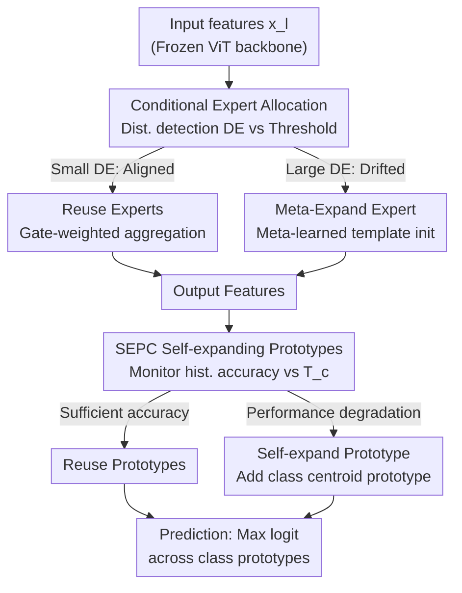

# Few-Shot Hybrid Incremental Learning: Continually Learning under Data Scarcity and Task Uncertainty

**Conference**: CVPR 2026  
**Paper**: [CVF Open Access](https://openaccess.thecvf.com/content/CVPR2026/html/Li_Few-Shot_Hybrid_Incremental_LearningContinually_Learning_under_Data_Scarcity_and_Task_CVPR_2026_paper.html)  
**Code**: Not public  
**Area**: Few-Shot Incremental Learning / Continual Learning  
**Keywords**: Few-Shot Incremental Learning, Stability-Plasticity, Mixture of Experts, Meta-learning Expansion, Self-expanding Prototypes

## TL;DR
This paper proposes "Few-Shot Hybrid Incremental Learning (FSHIL)," a realistic new paradigm where data is scarce and task types (new classes, new domains, or both) appear stochastically. By introducing "Conditional Meta-Expanding Mixture of Experts (CME-MoE)" to reconcile stability and plasticity at the feature level and "Self-Expanding Prototype Classifier (SEPC)" to model multi-distribution boundaries at the classification layer, the method outperforms existing FSIL and HIL approaches across five datasets and three incremental settings.

## Background & Motivation
**Background**: Few-Shot Incremental Learning (FSIL) enables models to continuously learn new knowledge using only K-shot (1/5/10) samples per class. Current research is divided into two branches: FSCIL (learning new classes in static domains) and FSDIL (adapting to new domains for fixed classes). Both assume a **predefined incremental dimension** (only classes or only domains). Conversely, Hybrid Incremental Learning (HIL, e.g., ICON) allows for uncertain incremental types but **assumes sufficient data**.

**Limitations of Prior Work**: Real-world agents encounter non-stationary data streams where the nature of the next step—new classes, new domains, or both—is **stochastic**. Meanwhile, new tasks often provide very few labeled samples. Existing methods struggle: FSIL methods **freeze feature extractors** to prevent few-shot overfitting, sacrificing cross-domain plasticity; HIL methods **expand architectures without constraints** to handle uncertainty, leading to severe overfitting of new modules in the few-shot regime.

**Key Challenge**: A simple superposition of FSIL "stability" and HIL "plasticity" is ineffective. FSIL requires frozen representations for robustness, while HIL requires modular expansion for plasticity. These mechanisms **conflict directly**, constituting the stability-plasticity paradox unique to FSHIL.

**Goal**: The problem is decomposed into two sub-problems: (1) At the feature layer, how to **conditionally** decide between "reusing existing capabilities (stability)" or "expanding new capabilities (plasticity)" without overfitting; (2) At the classification layer, how to break the "one-prototype-per-class" assumption when a single class presents multiple distribution clusters across different domains.

**Key Insight**: Stability and plasticity do not require a global binary choice but should be **conditionally triggered per-task and per-layer** based on whether the data distribution has shifted. Furthermore, if new experts are initialized from a "meta-learned general template," they can adapt quickly in few-shot scenarios without overfitting.

**Core Idea**: Use "distribution detection-driven conditional expert reuse/meta-expansion" to replace FSIL's total freezing and HIL's unconstrained expansion. Simultaneously, allow the classifier to self-expand prototypes on demand to model multi-domain distributions.

## Method

### Overall Architecture
The framework uses a **frozen ViT-B/16** as the backbone, placing learnable capabilities into two plug-and-play modules: **CME-MoE** is attached as a bypass to the MLP of selected Transformer layers, and **SEPC** is utilized at the classification head. Workflow: For each incremental task, CME-MoE uses a distribution detection module to quantify the "distribution shift between new data and existing expert knowledge." If the shift is small, relevant experts are **reused** (stability); if large, **meta-expansion** instantiates a new expert (plasticity). After merging expert outputs into the features, SEPC monitors the historical accuracy of each class. If performance degrades (indicating a new unrepresented domain pattern), it **adds a prototype on demand**, using multiple prototypes to characterize boundaries for the same class. During inference, the model outputs $C$ class logits, where each logit is the maximum similarity among all prototypes for that class.

### Key Designs

**1. CME-MoE Conditional Expert Allocation: Using distribution detection to decide between reuse and expansion**

Regarding the contradiction where "FSIL freezing lacks plasticity and HIL expansion causes overfitting," CME-MoE does not make a global choice but instead makes **per-layer, per-task conditional decisions**. Expert units use an adapter bottleneck structure $E_{l,k}(x_l)=\mathrm{ReLU}(x_l\cdot W^{down}_{l,k})\cdot W^{up}_{l,k}$, and the layer output is $o_l=\mathrm{MLP}(x_l)+E_{l,k}(x_l)$. Crucially, each expert is paired with a **distribution detection module** $D_{l,k}(\cdot)$, trained to reconstruct features seen by that expert with a loss $L_D=\sum_{l\in S_L}\sum_{k\in S^K_{l,new}}\lVert x_l - D_{l,k}(x_l)\rVert_2$.

For new data, all $D_{l,k}$ calculate reconstruction errors $E^D_{l,k}=\lVert x_l - D_{l,k}(x_l)\rVert_2$. These are converted to z-scores to quantify the divergence between the "new data and historical expert knowledge." High error → significant drift → **trigger expansion**; low error → alignment → **reuse**. During reuse, a gating network $m=\mathrm{Softmax}(G(x_l))$ weights the existing experts: $y_l=\sum_i m_i\cdot E_{l,i}(x_l)$. Thus, stability and plasticity are determined by evidence from the data distribution itself.

**2. Meta-Expanding Mechanism: Initializing new experts with meta-learned templates to suppress few-shot overfitting**

HIL-style random initialization of new modules leads to overfitting under K-shot constraints. This paper ensures expansion does not start from scratch. During pre-training, an initial expert $E_{l,0}$ and its detection module $D_{l,0}$ with parameters $\Theta_{l,0}=\{\Theta^e_{l,0},\Theta^d_{l,0}\}$ are optimized using MAML-style meta-learning:

$$\min_{\Theta_{l,0}}\ \mathbb{E}_{M_i\sim p(M)}\Big[L^{query}_{M_i}\big(\Theta_{l,0}-\alpha\nabla_{\Theta_{l,0}}L^{support}_{M_i}(\Theta_{l,0})\big)\Big]$$

This yields a task-agnostic prior template $E_{l,template}$. When expansion is triggered, the new expert loads these template weights $\Theta^e_{l,K_l+1}\leftarrow\Theta^e_{l,0},\ \Theta^d_{l,K_l+1}\leftarrow\Theta^d_{l,0}$. Since the template resides in a parameter space capable of rapid adaptation with minimal generalization error, the new expert starts from a well-behaved point, avoiding over-specialization and parameter drift commonly seen in HIL.

**3. SEPC Self-expanding Prototype Classifier: Adding prototypes per class to model multi-domain decision boundaries**

CME-MoE addresses the feature layer, but FSHIL multi-domain heterogeneity exposes another issue: a single class may form **multiple clusters** in the latent space. The "one-prototype-per-class" assumption lacks the capacity to characterize cross-domain boundaries. SEPC treats "classification capacity" as a dynamically allocatable resource, maintaining an adaptive threshold for each class $c$:

$$T_c=\max\big(\overline{Acc}(c,n)\cdot(1-\beta),\ \tau_{min}\big)$$

where $\overline{Acc}(c,n)$ is the historical average accuracy for the class after $n$ incremental visits, $\beta$ is the tolerance for performance decay, and $\tau_{min}$ is the minimum acceptable performance. If current performance drops below $T_c$, indicating existing prototypes cannot capture the new domain pattern, it triggers **on-demand expansion**: a new prototype $p_{c,j}=\frac{1}{|S_c|}\sum_{(\hat x,c)\in S_c}F(\hat x)$ is generated from the current class centroid and added to $S_{P_c}$. At inference, although the total number of prototypes $|S_P|\ge C$, the output remains constrained to $C$ classes by taking $Logit_c=\max_j \mathrm{sim}(f,p_{c,j})$.

### Loss & Training
The total loss is $L_{total}=L_D+\lambda_1 L_{CE}+\lambda_2 L_{PD}$, where $L_D$ is the reconstruction loss, $L_{CE}$ is the cross-entropy loss, and $L_{PD}$ is the prototype distillation loss which constrains new task samples to maintain consistency with old class knowledge. The optimal values are $\lambda_1=\lambda_2=1$. The backbone is a frozen ViT-B/16 pre-trained on ImageNet-21K, using Adam with CosineAnnealingLR.

## Key Experimental Results

### Main Results
Testing occurred across five datasets (Office-31, Office-Home, iDigits, CORe50, DomainNet) under three settings (FSCIL, FSDIL, FSHIL) at 5-shot. Comparisons were made against FSIL methods (ASP, App, SEC) and HIL (ICON). The table below shows the "average of three settings" for Average and Last accuracy (%):

| Dataset | Metric | Ours | Sub-optimal (SEC/App) | ICON (HIL) |
|---|---|---|---|---|
| Office-31 | Avg / Last | **93.65 / 91.49** | 92.39 / 89.85 | 59.51 / 46.67 |
| Office-Home | Avg / Last | **81.77 / 80.52** | 77.58 / 76.35 | 43.96 / 41.25 |
| iDigits | Avg / Last | **72.09 / 62.37** | 68.46 / 60.12 | 46.65 / 35.14 |
| CORe50 | Avg / Last | **82.37 / 80.55** | 80.00 / 76.56 | 47.34 / 40.72 |
| DomainNet | Avg / Last | **48.67 / 42.06** | 44.03 / 26.71 | 25.58 / 20.07 |

The method leads significantly in FSHIL settings, particularly on DomainNet where the Last accuracy of 40.97% far exceeds competitors. ICON collapses in all settings due to few-shot overfitting.

### Ablation Study
Component ablation (FSHIL, 5-shot, Avg/Last %). Baseline indicates no modules added:

| CME-MoE | SEPC | Office-31 | Office-Home | DomainNet |
|:---:|:---:|---|---|---|
| ✗ | ✗ | 64.51 / 47.33 | 35.87 / 44.11 | 24.08 / 21.29 |
| ✓ | ✗ | 84.80 / 86.36 | 70.18 / 71.94 | 39.98 / 32.23 |
| ✗ | ✓ | 88.81 / 85.39 | 77.80 / 78.31 | 40.65 / 34.41 |
| ✓ | ✓ | **96.97 / 95.10** | **81.64 / 80.00** | **47.20 / 40.97** |

### Key Findings
- **Synergy between modules**: Adding either CME-MoE or SEPC improves accuracy significantly, but their combination is optimal, indicating that stability-plasticity reconciliation is complementary across the feature and classification layers.
- **Robustness to extreme data scarcity**: Under 1-shot settings, the accuracy drop relative to 10-shot is only ~9%, compared to 19~30% for existing methods. Meta-expansion's well-behaved initialization is most advantageous when data is scarcest.
- **Hyperparameter insensitivity**: Results are stable across various $\lambda_1, \lambda_2$ and $T_c$ related thresholds.

## Highlights & Insights
- **Transformation of stability vs. plasticity**: Shifts the problem from a global binary choice to a data-driven, task-wise conditional decision. Using reconstruction z-scores as a switch for expansion is a novel and reusable concept.
- **Template-based meta-learning**: Rather than using meta-learning to learn tasks, it is used to learn an "initialization template for expansion." This directly addresses the root cause of HIL overfitting in few-shot regimes.
- **Demand-driven classification capacity**: SEPC uses historical accuracy as a diagnostic tool to determine if a class requires a new domain-specific representative, making prototype expansion adaptive rather than uniform.

## Limitations & Future Work
- The method depends on a **frozen large-scale pre-trained ViT-B/16** backbone. If the backbone's representations do not sufficiently cover the target domain, the effectiveness of adapter-based experts may be limited. ⚠️
- Drift detection relies on **reconstruction error and z-score thresholds**. In data streams with gradual rather than abrupt distribution shifts, the binary "reuse/expand" decision might lack sufficient granularity. ⚠️
- Both experts and prototypes **expand continuously**. The paper does not fully discuss the growth of parameters or the memory cost upper bound in long-sequence scenarios.
- The code is not public, requiring independent implementation of the meta-expansion and SEPC logic.

## Related Work & Insights
- **vs. FSIL (ASP/App/SEC)**: While FSIL methods freeze feature extractors for stability, this work injects conditional plasticity via CME-MoE. The superior results on DomainNet (40.97% vs 23.67% Last accuracy) demonstrate that "lack of plasticity" is a critical weakness for FSIL in hybrid settings.
- **vs. HIL (ICON)**: ICON achieves plasticity through unconstrained expansion but fails in few-shot scenarios (Avg accuracy of only 25~64%). This work fixes that by constraining expansion within a well-behaved parameter space via meta-learned templates.
- **Insight**: The primary contribution is the unification of FSCIL and FSDIL into the realistic FSHIL paradigm, providing a transferable design template: distribution detection for decisions, meta-templates for expansion, and self-expanding prototypes for multi-domain modeling.

## Rating
- Novelty: ⭐⭐⭐⭐⭐ (Proposed FSHIL paradigm with specialized feature/classifier dual-module solutions)
- Experimental Thoroughness: ⭐⭐⭐⭐ (Extensive results across datasets and shots, though lacks detailed memory/compute analysis)
- Writing Quality: ⭐⭐⭐⭐ (Clear motivation regarding the stability-plasticity paradox, though some threshold details are brief)
- Value: ⭐⭐⭐⭐ (Highly applicable to real-world non-stationary data streams)

<!-- RELATED:START -->

## Related Papers

- [\[CVPR 2026\] Semantic-Guided Global-Local Collaborative Prompt Learning for Few-Shot Class Incremental Learning](semantic-guided_global-local_collaborative_prompt_learning_for_few-shot_class_in.md)
- [\[CVPR 2026\] Quantized Residuals to Continuous Prompts for Few-Shot Class Incremental Learning in Vision-Language Models](quantized_residuals_to_continuous_prompts_for_few-shot_class_incremental_learning.md)
- [\[CVPR 2026\] HyCal: A Training-Free Prototype Calibration Method for Cross-Discipline Few-Shot Class-Incremental Learning](hycal_training_free_prototype_calibration_for_cross_discipline_fscil.md)
- [\[CVPR 2026\] From Few-way to Many-way: Rethinking Few-shot Fine-grained Image Classification](from_few-way_to_many-way_rethinking_few-shot_fine-grained_image_classification.md)
- [\[CVPR 2026\] Graph Attention Prototypical Network for Robust Few-Shot Classification](graph_attention_prototypical_network_for_robust_few-shot_classification.md)

<!-- RELATED:END -->
