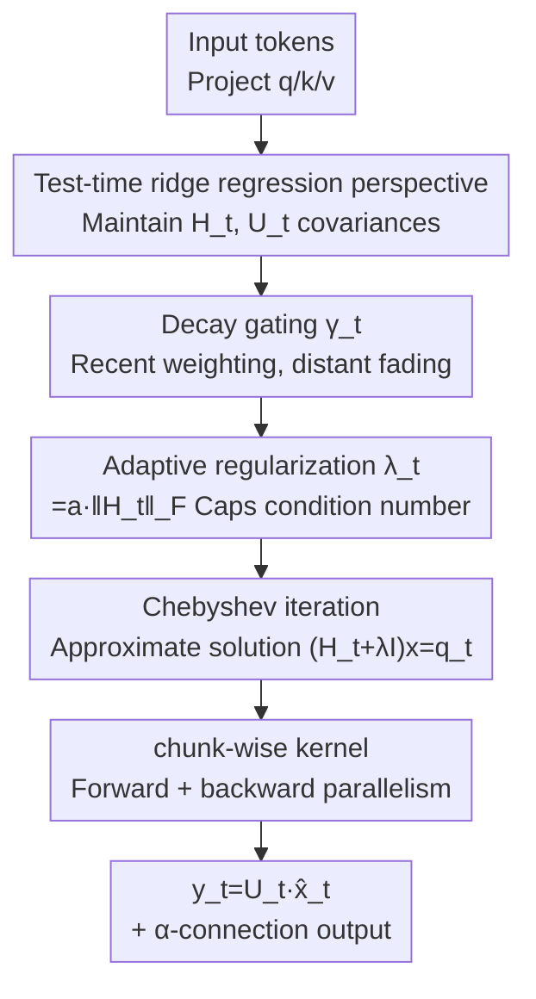

# Gated KalmaNet: A Fading Memory Layer Through Test-Time Ridge Regression

**Conference**: CVPR2026  
**arXiv**: [2511.21016](https://arxiv.org/abs/2511.21016)  
**Code**: https://github.com/awslabs/hybrid-model-factory (Yes)  
**Area**: LLM Efficiency / Sequence Modeling / State Space Models  
**Keywords**: Linear SSM, Kalman Filter, Test-time Ridge Regression, Chebyshev Iteration, Long Context

## TL;DR
This work reinterprets the state updates of Linear State Space Models (SSMs) as "performing test-time ridge regression on the entire history." By replacing the one-step gradient approximation in existing SSMs with the exact gain from Kalman filtering and overcoming the dual obstacles of low-precision numerical instability and parallel training via adaptive regularization and Chebyshev iterations, it outperforms linear SSMs like Mamba2 and Gated DeltaNet in short/long context tasks and ImageNet.

## Background & Motivation
**Background**: Softmax Attention enables precise associative retrieval over the entire context, but its time complexity grows quadratically with sequence length and its KV-cache expands linearly. Linear SSMs (Mamba2, (Gated) DeltaNet, GLA, etc.) compress the entire history into a fixed-dimensional state matrix $S_t$, achieving linear computation and constant storage, making them a promising replacement for Attention.

**Limitations of Prior Work**: The states of linear SSMs act as "fading lossy summaries," which are significantly inferior to Attention in recall-heavy tasks (associative retrieval, long-context QA). The authors attribute the root cause to the **optimization objective**: taking Gated DeltaNet as an example, its state update is equivalent to performing **one step** of gradient descent on $\min_S \|Sk_t - v_t\|_2^2$. This only considers the lossy state from the previous step and the current token, making it a "short-sighted" objective. In contrast, the Attention objective $y_t = \arg\min_v \sum_{i=1}^t c_i \|v - v_i\|_2^2$ utilizes the **entire** precise KV-cache.

**Key Challenge**: Ensuring the state "considers the entire history" usually implies storing the entire history (returning to the quadratic cost of Attention); maintaining constant storage requires discarding information. How can one ensure that every update is optimal based on the full history while staying within constant storage and linear computation?

**Key Insight**: The authors notice that the Kalman Filter (KF) provides exactly this "online, history-aware, optimal" update. KF optimally solves a weighted ridge regression in the MAP sense, and its recurrence also follows a "low-rank plus identity" form, isomorphic to existing SSMs. Furthermore, DeltaNet, Gated DeltaNet, and Kimi Delta Attention can all be viewed as approximations of KF recurrence under the crude assumption that the "error covariance is an identity matrix"—they discard the second-order information of how past keys/values should optimally influence state updates.

**Core Idea**: Retain the complete error covariance and compute the exact Kalman gain. Under the steady-state assumption, this degenerates into an **online ridge regression with constant storage and linear computation**. Engineering techniques are then used to make it numerically stable in bfloat16 and allow for chunk-wise parallel training on GPUs.

## Method

### Overall Architecture
GKA (Gated KalmaNet) is a memory layer that can directly replace Attention in Transformers. At each time step $t$, it maintains two weighted covariances $H_t = \sum_i \eta_{t,i} k_i k_i^\top$ (key auto-correlation) and $U_t = \sum_i \eta_{t,i} v_i k_i^\top$ (value-key cross-correlation). The output is obtained by solving a system of linear equations for ridge regression:

$$y_t = U_t\,(H_t + \lambda_t I)^{-1} q_t.$$

Directly using an exact solver (e.g., `torch.linalg.solve`) for each $t$ would be $O(D^3)$ and require explicit materialization of all $H_t$, causing massive I/O and preventing chunk-wise parallelism. KF's sequential recurrence is also unstable in low precision. GKA's approach is: use a decay gate $\gamma_t$ to express $H_t, U_t$ as parallelizable recurrences similar to linear SSMs; use adaptive regularization to cap the condition number of the system; use Chebyshev Iteration (CH) to solve $(H_t+\lambda_t I)x=q_t$ approximately using only matrix-vector multiplications; and finally, use a hardware-aware chunk-wise kernel to run both forward and backward passes. The overall data flow is as follows:

### Key Designs

**1. Rewriting SSM state updates as "test-time ridge regression on the entire history"**

The short-sightedness of existing linear SSMs stems from their implicit objectives containing only the "previous state + current token." GKA replaces the objective with a weighted ridge regression considering the entire history:
$$S_t = \arg\min_{S}\ \lambda \|S\|_F^2 + \sum_{i=1}^t \eta_i \|S k_i - v_i\|_2^2,$$
the solution of which is provided by the KF recurrence $S_t = S_{t-1} - \frac{(S_{t-1}k_t - v_t)k_t^\top \Phi_{t-1}}{1/\eta_t + k_t^\top \Phi_{t-1} k_t}$, where $\Phi_{t-1}$ is the inverse Hessian of the objective (updated online via the Woodbury identity). A key insight is that DeltaNet, Gated DeltaNet, and Kimi Delta Attention are all equivalent to approximating this $\Phi$ as an identity matrix—assuming isotropic error covariance and ignoring correlations between keys. GKA retains the full $\Phi$ (i.e., exact Kalman gain) to truly utilize second-order information. $\lambda$ has a clear semantic here: it controls how much information a constant-sized state can "remember"; exceeding capacity leads to "fuzzy recall," acting as a memory capacity knob. This design is effective because it elevates the question of "why SSMs are inferior to Attention" from an empirical phenomenon to a provably suboptimal approximation—restoring the discarded covariance leads to gains.

**2. Adaptive Regularization: Capping the condition number with the Frobenius norm**

In bfloat16, the worst-case numerical error for solving $(H_t+\lambda_t I)x=q_t$ is $\epsilon\cdot\kappa$, where machine epsilon $\epsilon\approx 0.007$ and $\kappa$ is the Hessian condition number. The authors point out that in existing test-time optimization work (e.g., setting a lower bound for $\lambda$ to 0.25), $\kappa$ can still reach 500, corresponding to a worst-case error of 3.5, causing training to NaN. GKA does not fix $\lambda$, but lets it follow the data: $\lambda_t = a\cdot\|H_t\|_F$. Since $\lambda_{\max}(H_t)\le\|H_t\|_F$, the condition number is analytically capped:
$$\kappa_t = \frac{\lambda_{\max}(H_t)+\lambda_t}{\lambda_{\min}(H_t)+\lambda_t} \le \frac{\|H_t\|_F + \lambda_t}{\lambda_t} = \frac{a+1}{a}.$$
A single hyperparameter $a$ locks in numerical stability, independent of the specific solver algorithm. The difficulty lies in calculating $\|H_t\|_F$ efficiently in chunk-wise training and making it differentiable—since $H_t$ is a nested recurrence. The authors derived parallel formulas using cumulative gating vectors $\zeta$, an upper triangular matrix $M$, and the Gram matrix $G_C=K_C^\top K_C$ (e.g., the third term is written as `column-sum(((G⊙G)M)⊙M)`), placing the entire norm calculation inside the kernel. This step is crucial for turning a "theoretically stable" idea into an "engineerable and trainable" method.

**3. Chebyshev Iteration (CH): A parallel solver more stable than CG in low precision**

Since exact solvers cannot be parallelized chunk-wise, first-order iterative methods are used. A common choice is Conjugate Gradient (CG), but experiments showed that when using implicit differentiation for the backward pass, CG is acceptable for a single layer (gradient error $\approx 10^{-3}$) but amplifies error to nearly 1 when stacked in a 5-layer LLaMA. GKA switches to the classic Chebyshev iteration: an accelerated gradient method with a specific weight schedule $\omega_i \leftarrow \frac{4}{4-\rho^2\omega_{i-1}}$, which uses the eigenvalue bounds $L=\|H_t\|_F+\lambda_t$ and $\mu=\lambda_t$ of $H_t+\lambda_t I$ for optimal acceleration. CH converges to a smaller residual in the forward pass than CG, and its backward gradient matches the exact solution within $10^{-6}$ regardless of whether implicit differentiation or autograd is used. The authors also provide Lemma 2 to prove that "the implicit derivative gradient of CH exactly equals its autograd exact gradient," allowing memory savings via implicit differentiation. This is likely the first time CH has been used for stable training of sequence modeling layers at scale. The backward pass also includes a $B_i k_i$ term (as $w_i H_i$ is not low-rank) which is harder than standard SSMs; the authors split it into intra-chunk and cross-chunk recurrences, with a full mask $M_w$ (unlike the triangular mask of standard SSMs), allowing all tokens to interact in the backward pass.

**4. Decay Gating and α-connection: Coding "recency bias" and residual paths into the layer**

To balance expressivity and linear time, GKA allows the residual weights $\eta_{t,i}=\prod_{j=i+1}^t \gamma_j$ to decay exponentially over time (learnable $\gamma_j\in[0,1]$). This encodes the prior that "recent tokens are more important" without explicitly calculating query-key inner products like Attention; this is also why $H_t, U_t$ can be written as $H_t=\gamma_t H_{t-1}+k_t k_t^\top$. Architecturally, an α-connection is added: using a sigmoid to get $\alpha_t\in[0,1]$, the output is a convex combination of the original query $q_t$ and the CH solution $\hat{x}_t$, functioning similarly to a residual connection to provide a direct path for gradients. (The main experiments fix the input gate $\beta_t\equiv 1$; the authors noted that adding a learnable $\beta_t$ write gate in subsequent work further improves long-context performance, and the version with $\beta_t$ is the default released implementation.)

## Key Experimental Results

### Main Results
Short context: 2.8B model pre-trained on 100B tokens from DCLM, zero-shot evaluation on 8 common sense reasoning tasks + 2 recall-heavy tasks (FDA/SWDE), average accuracy (abridged):

| Model | HellaSWAG | PIQA | SciQ | Winogrande | FDA | SWDE | Average |
|------|-----------|------|------|------------|-----|------|------|
| Transformer (Ref Upper Bound) | 60.96 | 73.56 | 79.50 | 61.72 | 58.53 | 72.28 | 63.92 |
| Mamba2 | 62.23 | 73.78 | 79.80 | 62.19 | 7.71 | 41.13 | 55.94 |
| Gated DeltaNet | 62.80 | 74.32 | 80.60 | 62.35 | 8.26 | 44.28 | 57.00 |
| **GKA (Ours)** | **63.84** | **74.81** | **83.20** | **64.17** | 12.89 | 50.95 | **58.89** |

GKA outperforms all linear SSM baselines on average and shows a $\approx 10\%$ gain over the strongest SSM in recall-heavy FDA/SWDE; however, a gap still exists compared to Attention (especially in recall) because Attention possesses "unforgettable" KV-cache.

Long context (2.8B model continued pre-training on 25B tokens with 128K context, RULER + HELMET): GKA achieves **at least a 10% relative improvement over all SSM baselines on RAG and LongQA**. It is the first SSM to be trained and evaluated at 128K context (prior works mostly stopped at 4K/8K). However, in Synthetic Recall, it is only competitive at 4K and falls behind thereafter; all models performed near random on ICL.

ImageNet classification (~31.8M parameters, GKAVision replaces the mixer blocks of MambaVision with GKA layers):

| Model | Top-1 (%) | Throughput (K img/s) |
|------|-----------|----------------|
| MambaVision-T | 81.18 | 16.25 |
| **GKAVision-T** | **81.27** | 13.72 |
| NextViT-S (ViT reference) | 81.99 | 10.32 |

Exceeds MambaVision without any vision-specific modifications and approaches Pure Vision Transformer accuracy with 33% higher training throughput.

### Ablation Study

| Configuration / Analysis Point | Key Result | Description |
|---------------|----------|------|
| MQAR Associative Retrieval | GKA outperforms all linear SSMs across all sequence lengths and model dimensions | Verifies that MAP estimation based on full history leads to stronger long-range information retention |
| Solver: CG vs CH (Forward) | CH achieves the smallest final residual; CG converges fast but has a lower accuracy ceiling | Fig.1a |
| Solver: CG vs CH (5-layer backward gradient) | CG(impl) error amplifies to $\approx 1$; CH matches exact solution within $10^{-6}$ | CH is stable in deep networks |
| Training Throughput (Single Layer) | GKA speed is comparable to GDN at the same state size | Chunk-wise parallelism offsets the more expensive state updates |

### Key Findings
- **The primary contribution is the "change of objective"**: Replacing the short-sighted single-step objective with a ridge regression considering the full history (Design 1) is the root of its lead in MQAR/recall tasks.
- **Numerical stability is a critical success factor, not just an engineering detail**: While CG seems fine for a single layer, it leads to gradient collapse in 5 layers; adaptive regularization (capping $\kappa$) + CH (Designs 2, 3) are both indispensable to prevent NaNs in bfloat16.
- **Scenario-dependent advantages**: GKA excels in RAG/LongQA (where pre-trained weights guide what to remember) which follow natural text distributions, but is less effective for synthetic "verbatim random token retrieval" tasks because it performs MAP estimation rather than verbatim storage.

## Highlights & Insights
- **The unified perspective is elegant**: Using the statement "existing SSMs = Kalman filtering approximations with identity error covariance" links the entire DeltaNet series together and points out that exactly what they discard is the second-order covariance information. This elevates the "why SSMs are weak" from an empirical observation to a provable suboptimality, providing a solid motivation.
- **Bringing numerical analysis back to deep learning**: The $\epsilon\cdot\kappa$ error bound + Frobenius norm capping of the condition number ($\kappa\le(a+1)/a$), where a single hyperparameter locks in stability, is a rare but correct rigorous approach in modern layer design.
- **The revival of CH**: Using the classic Chebyshev iteration as a differentiable layer solver and proving its implicit derivative gradient equals the autograd gradient is a generalizable trick for other "test-time optimization" layers.
- **Transferability**: The α-connection (learnable convex combination of query and solver results) is essentially adding a residual connection to any "solver-as-a-layer" module, a concept that can be directly applied elsewhere.

## Limitations & Future Work
- **Remaining gap with Attention**: In pure recall tasks (FDA/SWDE, synthetic retrieval), GKA still lags behind Transformers; the "fuzzy recall" of constant storage is a structural ceiling. The paper suggests Hybrid (SSM+Attention) as a mitigation, but that partially sacrifices pure linear advantages.
- **Lags in synthetic retrieval**: The performance drop after 4K in Synthetic Recall suggests MAP estimation is unfriendly to "verbatim random tokens"—if the task requires exact string retrieval, GKA is not the ideal choice.
- **High engineering complexity**: The differentiable chunk-wise backward pass for adaptive norms and the CH intra/cross-chunk $B_i k_i$ derivations are highly intricate, resulting in a high barrier to reproduction and kernel debugging.
- **Main experiments used $\beta_t\equiv 1$**: Gains from the recommended write-gate version ($\beta_t$) are mostly referenced from subsequent work; this paper does not systematically ablate it, so the attribution of long-context gains requires more independent verification (refer to the original text and subsequent work for details).

## Related Work & Insights
- **vs Gated DeltaNet / DeltaNet / Kimi Delta Attention**: Their state updates are equivalent to a one-step gradient on an instantaneous objective (error covariance $\approx I$). GKA retains the full covariance and solves the full history ridge regression. The difference lies in "using second-order information to see the entire past" at the cost of more expensive state updates (offset by chunk-wise parallelism).
- **vs Mamba2 / GLA / RetNet**: These use heuristic forgetting/input gates to construct fading states. GKA's gating $\gamma_t$ also fades, but it is a parameterization of the ridge regression weights $\eta_{t,i}$, and it is paired with a solver objective that has optimality guarantees.
- **vs softmax Attention (Ref Upper Bound)**: Attention solves non-parametric point estimation and stores the full cache (quadratic cost); GKA solves parametric linear estimation with constant storage (linear cost), trading "perfect but expensive verbatim retrieval" for "sufficiently good full-history MAP."
- **vs existing test-time optimization work**: Previous works either lacked regularization (leading to ill-conditioning in low precision) or used $\lambda$ lower bounds that were insufficient ($\kappa \sim 500$). GKA's contribution is in solidifying the overlooked issue of numerical stability.

## Rating
- Novelty: ⭐⭐⭐⭐⭐ Surpasses the DeltaNet series via Kalman filter unification; first use of Chebyshev iterations as a large-scale differentiable layer solver.
- Experimental Thoroughness: ⭐⭐⭐⭐ Covers synthetic/short context/long context/vision; 128K evaluation is solid, but the write gate gain is partly external.
- Writing Quality: ⭐⭐⭐⭐ Clear theoretical motivation and rigorous numerical analysis, but the chunk-wise derivations are dense and have a high entry barrier.
- Value: ⭐⭐⭐⭐⭐ Provides a provable answer to "why linear SSMs are weak" and offers a deployable, stable training solution with open-source kernels.

<!-- RELATED:START -->

## Related Papers

- [\[ICLR 2026\] Local Linear Attention: An Optimal Interpolation of Linear and Softmax Attention for Test-Time Regression](../../ICLR2026/llm_efficiency/local_linear_attention_an_optimal_interpolation_of_linear_and_softmax_attention_.md)
- [\[ICLR 2026\] In-Place Test-Time Training](../../ICLR2026/llm_efficiency/in-place_test-time_training.md)
- [\[ICLR 2026\] Test-Time Training Done Right](../../ICLR2026/llm_efficiency/test-time_training_done_right.md)
- [\[ICLR 2026\] RACE Attention: A Strictly Linear-Time Attention Layer for Training on Outrageously Large Contexts](../../ICLR2026/llm_efficiency/race_attention_a_strictly_linear-time_attention_layer_for_training_on_outrageous.md)
- [\[ICLR 2026\] Let's (not) just put things in Context: Test-time Training for Long-context LLMs](../../ICLR2026/llm_efficiency/lets_not_just_put_things_in_context_test-time_training_for_long-context_llms.md)

<!-- RELATED:END -->
