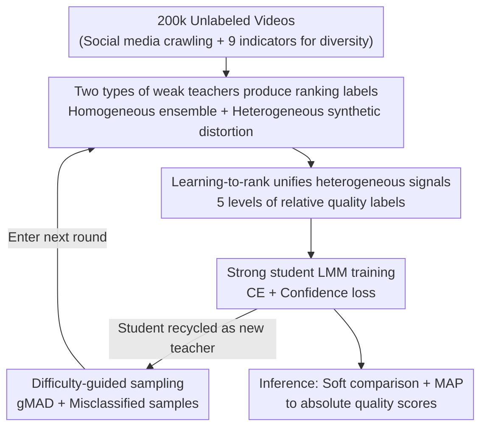

# Generalizable Video Quality Assessment via Weak-to-Strong Learning

**Conference**: CVPR2026  
**arXiv**: [2505.03631](https://arxiv.org/abs/2505.03631)  
**Code**: https://github.com/clh124/W2S-VQA (Available)  
**Area**: LLM Efficiency / Video Quality Assessment / Weak Supervision  
**Keywords**: Video Quality Assessment, weak-to-strong generalization, learning-to-rank, pseudo-labeling, OOD generalization

## TL;DR
Without relying on any human annotation labels, off-the-shelf VQA models are utilized as "weak teachers" to supervise a high-capacity Multimodal Large Language Model (MLLM) "strong student." The student is then recycled as the teacher for subsequent iterative rounds. The final model matches in-distribution performance and significantly surpasses all teachers in OOD scenarios, improving the overall OOD SRCC of VQA from 0.59 to 0.745.

## Background & Motivation
**Background**: The mainstream approach for No-Reference Video Quality Assessment (NR-VQA) is "human-annotated datasets + supervised regression," relying on datasets with Mean Opinion Score (MOS) labels like LSVQ and KoNViD to train models to predict perceived quality.

**Limitations of Prior Work**: The generalization of supervised learning is strictly constrained by the diversity of training data. Figure 1 shows that even top-tier models (DOVER, Q-Align, FAST-VQA) suffer a sharp performance drop when moving to OOD datasets—for instance, the SRCC of MinimalisticVQA(VII) on LIVE-YT-HFR is only 0.061, which is nearly random. Expanding data requires rigorous sample screening and subjective scoring experiments following ITU standards, which are extremely costly and difficult to scale.

**Key Challenge**: Generalization requires massive and diverse annotated data, but manual MOS labeling is expensive and slow, creating a fundamental contradiction. Existing self-supervised/unsupervised VQA methods (contrastive learning + distortion classification proxy tasks) can only model synthetic distortions and fail to capture non-linear degradations in the real world, resulting in performance far behind supervised methods.

**Goal**: Is it possible to train a VQA model with stronger generalization without relying on large-scale manual annotation?

**Key Insight**: The authors leverage the "weak-to-strong generalization" (W2S) phenomenon observed in LLM alignment—a high-capacity strong student, under the supervision of a weak teacher, can not only acquire the teacher's capabilities but also generalize to hard samples beyond the teacher's reach. Since VQA involves subjective perception rather than deterministic semantics, whether W2S holds remains an open question. Preliminary experiments verify that even with a single weak teacher providing pseudo-labels, the student matches the teacher in-distribution and gains 6.05% on average OOD, proving the W2S effect indeed exists in VQA.

**Core Idea**: By treating "off-the-shelf VQA models + synthetic distortion simulators" as weak teachers, their heterogeneous supervisory signals are unified via learning-to-rank to train a strong student. The student is then recycled as a teacher for iterations of increasing difficulty, snowballing the generalization capability and bypassing manual annotation.

## Method

### Overall Architecture
The method addresses the problem of training a generalizable VQA model without human labels. The process involves three steps: first, multiple off-the-shelf VQA models and synthetic distortion simulators are treated as weak teachers to generate **ranking labels** (rather than scores) for unlabeled video pairs; second, these ranking labels supervise a high-capacity MLLM (LLaVA-OneVision-7B backbone + dual-branch visual encoding + motion module) as a strong student to learn relative quality; finally, the trained student is promoted to be the new teacher, and "difficulty-guided sampling" is used to select hard samples where the teacher fails or where teacher-student disagreement is maximized for the next round of W2S training, cycling through three stages.

### Key Designs

**1. Validating W2S effects in VQA: Using off-the-shelf models as teachers instead of manual annotations**

Addressing the "expensive labeling" pain point, the authors discard MOS labeling and instead use five SOTA VQA models (MinimalisticVQA VII/IX, FAST-VQA, DOVER, Q-Align, all trained on LSVQ) as weak teachers $f_{\text{weak}}$. They generate pseudo-labels $\hat{y}_j = f_{\text{weak}}(x_j)$ on 200,000 unlabeled videos to train a strong student $f_{\text{w2s}}$ with much higher capacity. The key finding is that even with this naive approach, the student only drops 0.15% in-distribution but gains 6.05% on average OOD. For stronger teachers (e.g., MinimalisticVQA(IX), Q-Align), the student even directly outperforms the fully supervised baseline. This suggests the strong student's pre-trained knowledge "corrects" the weak teacher's systematic bias on OOD data rather than mechanically mimicking it.

**2. Learning-to-rank to unify heterogeneous supervisory signals: Changing regression to pairwise comparison**

Absolute quality scores from different teachers differ in scale (e.g., one model gives 60, another 0.8), leading to conflicts during direct regression. However, **relative ranking** (e.g., "A is better than B") is self-consistent within the same source. Thus, the authors reformulate quality prediction as a ranking task: given a video pair $(x^A, x^B)$, the student predicts their relative quality using 5 levels: {superior, better, similar, worse, inferior}. During inference, adaptive soft comparison is used: the test video is compared with anchor videos to calculate a soft probability matrix of ranking categories, and a calibrated absolute score is restored using MAP estimation under the Thurstone Case V model.

**3. Homogeneous ensemble + Heterogeneous synthetic distortion: Enriching teacher supervision from two orthogonal directions**

The ceiling of single-teacher supervision is the teacher itself. **Homogeneous Ensemble**: Predictions from 5 VQA models are averaged (after mapping scores to a unified scale using four-parameter logistic functions). Ranking labels for video pairs are generated using the ensemble mean $\overline{y}$ and variance $\sigma^2$—the quality difference $\Delta = \overline{y}^A - \overline{y}^B$ is assumed to follow $\mathcal{N}(\Delta; 0, \sigma_\Delta^2)$ (where $\sigma_\Delta = \sqrt{\sigma_A^2 + \sigma_B^2}$). Labels are categorized by statistical significance: $\Delta > 2\sigma_\Delta$ as superior, $\sigma_\Delta < \Delta \le 2\sigma_\Delta$ as better, etc. Larger variances result in more conservative labels, filtering noisy pairs. **Heterogeneous Ensemble**: Synthetic distortion simulators are introduced as "specialized VQA teachers"—spatial (resolution, Gaussian blur/noise, brightness), temporal (jitter, stalling), and streaming (H.264/H.265 compression). Distortion levels serve as pseudo-labels. These two directions complement each other by improving supervisory **reliability** and expanding supervisory **coverage**.

**4. Iterative W2S + Difficulty-guided sampling: Recycling the student to focus on hard samples**

Since students can surpass teachers, a trained student can serve as a new teacher for the next round. Crucially, each round must provide hard samples that exceed the current teacher's capability. For **synthetic distortion pairs**, where ground truth is known, the current student $f_{\text{w2s}}^{(i)}$ is used for inference, and only misclassified pairs are selected for the next round. For **real video pairs** without ground truth, the gMAD (group maximum differentiation) competition framework is used: videos are partitioned into $\xi$ equal-quality bins based on weak teacher predictions. Pairs are selected where the student identifies a large quality difference while the teacher sees no difference (Eq. 1: $\arg\max [f_{\text{w2s}}^{(i)}(x^A) - f_{\text{w2s}}^{(i)}(x^B)]$ s.t. $|f_{\text{weak}}^j(x^A) - f_{\text{weak}}^j(x^B)| \le \xi$), and vice versa. This systematically exploits decisions boundary mismatches, mining high-information hard samples.

### Loss & Training
The base objective is standard cross-entropy $\mathcal{L}_{\text{CE}}$. To mitigate overfitting to noisy weak labels, a confidence loss $\mathcal{L}_{\text{conf}}$ is added to encourage the student to reinforce its own judgment when it is confident and disagrees with the weak label. The total objective is:

$$\mathcal{L} = (1-\lambda)\,\mathcal{L}_{\text{CE}} + \lambda\,\mathcal{L}_{\text{conf}}$$

where $\lambda$ adaptively balances between "trusting weak labels" and "trusting student predictions." Optimization uses AdamW with an initial learning rate of $1\times10^{-4}$, cosine decay, weight decay of 0.05, batch size of 8, for 25k steps on 8×H200. The student backbone is LLaVA-OneVision-Chat-7B.

## Key Experimental Results

### Main Results
Evaluation across 10 benchmarks grouped into in-distribution and OOD sets using SRCC / PLCC. The table below shows overall weighted averages:

| Method | In-dist SRCC | In-dist PLCC | OOD SRCC | OOD PLCC |
|------|-----------|-----------|----------|----------|
| Strongest Weak Teacher (MinimalisticVQA IX) | 0.849 | 0.859 | 0.574 | 0.622 |
| VQA² (157k labels) | 0.847 | 0.854 | 0.583 | 0.623 |
| VQAThinker (RL + LMM) | — | — | 0.615 | 0.658 |
| Ours (I) Single teacher baseline | 0.849 | 0.859 | 0.591 | 0.639 |
| Ours (VI) Full Stage 3 | **0.865** | **0.872** | **0.745** | **0.789** |

With zero human labels, the full model achieves an in-distribution SRCC of 0.865 and an OOD SRCC of 0.745, outperforming teachers and methods using 157k labels or reinforcement learning.

### Ablation Study
Incremental component analysis (Table 2) and iterative strategy ablation (Table 4):

| Configuration | In-dist SRCC | OOD SRCC | Description |
|------|-----------|----------|------|
| (I) Single teacher supervision | 0.849 | 0.591 | baseline |
| (II) + Homogeneous ensemble | 0.856 | 0.602 | Improved reliability |
| (III) + Heterogeneous synthetic distortion | 0.858 | 0.650 | Large OOD jump, expanded coverage |
| (IV) + Confidence loss | 0.857 | 0.672 | Noise resistance |
| (V) + Iterative Stage 2 | 0.860 | 0.722 | Iteration + Hard samples |
| (VI) + Iterative Stage 3 | 0.865 | 0.745 | Full model |
| (V-a) Stage 2 w/o hard sample selection | 0.857 | 0.669 | Random sampling, OOD Gain drops 5.3% |

### Key Findings
- **OOD is the primary battlefield**: In-distribution benchmarks are nearly saturated; almost all gains are reflected in OOD (0.591 $\rightarrow$ 0.745, +26%). 
- **Hard sample selection is the lifeblood of iteration**: Removing hard sample selection (random sampling) drops OOD SRCC from 0.722 to 0.669, proving performance comes from the "difficulty-guided" strategy rather than just more data.
- **Heterogeneous synthetic distortion is vital for OOD**: Moving from (II) to (III) causes an OOD jump from 0.602 to 0.650, confirming synthetic distortions cover modes missed by real teachers.

## Highlights & Insights
- **Applying W2S paradigm to VQA**: The study validates that the W2S effect exists in subjective perception tasks before stacking engineering enhancements.
- **Learning-to-rank as a "universal socket"**: This approach allows heterogeneous signals (different models + simulators) to be fed into a single training objective by converting them into pairwise rankings.
- **Zero human labels outperforming 157k labels**: The "free" supervision from synthetic distortions and existing models proves that for OOD generalization, "supervisory diversity" is more important than "supervisory precision."

## Limitations & Future Work
- **Heavy student backbone**: The W2S effect relies on a high-capacity LMM; performance without such a strong student remains a question.
- **Synthetic distortion coverage**: Real-world distortions are more complex than simulated ones, potentially limiting the OOD ceiling.
- **Diminishing returns in iterations**: Gains between Stage 2 and Stage 3 are smaller; the criterion for stopping iterations was not fully explored.

## Related Work & Insights
- **vs Supervised VQA**: Previous methods rely on MOS for regression, failing in OOD. This work distills more generalizable students from those models.
- **vs LMM-based VQA (VQA² / VQAThinker)**: This approach surpasses methods using heavy human annotation or RL without any human labels by leveraging W2S.

## Rating
- Novelty: ⭐⭐⭐⭐⭐ 
- Experimental Thoroughness: ⭐⭐⭐⭐⭐ 
- Writing Quality: ⭐⭐⭐⭐ 
- Value: ⭐⭐⭐⭐⭐ 

<!-- RELATED:START -->

## Related Papers

- [\[CVPR 2026\] ParallelVLM: Lossless Video-LLM Acceleration with Visual Alignment Aware Parallel Speculative Decoding](parallelvlm_lossless_video-llm_acceleration_with_visual_alignment_aware_parallel.md)
- [\[ICML 2025\] Efficient Length-Generalizable Attention via Causal Retrieval for Long-Context Language Modeling](../../ICML2025/llm_efficiency/efficient_length-generalizable_attention_via_causal_retrieval_for_long-context_l.md)
- [\[ICLR 2026\] Expert Divergence Learning for MoE-based Language Models](../../ICLR2026/llm_efficiency/expert_divergence_learning_for_moe-based_language_models.md)
- [\[ICML 2026\] ProactiveLLM: Learning Active Interaction for Streaming Large Language Models](../../ICML2026/llm_efficiency/proactivellm_learning_active_interaction_for_streaming_large_language_models.md)
- [\[ICLR 2026\] Deep Hierarchical Learning with Nested Subspace Networks for Large Language Models](../../ICLR2026/llm_efficiency/deep_hierarchical_learning_with_nested_subspace_networks_for_large_language_mode.md)

<!-- RELATED:END -->
