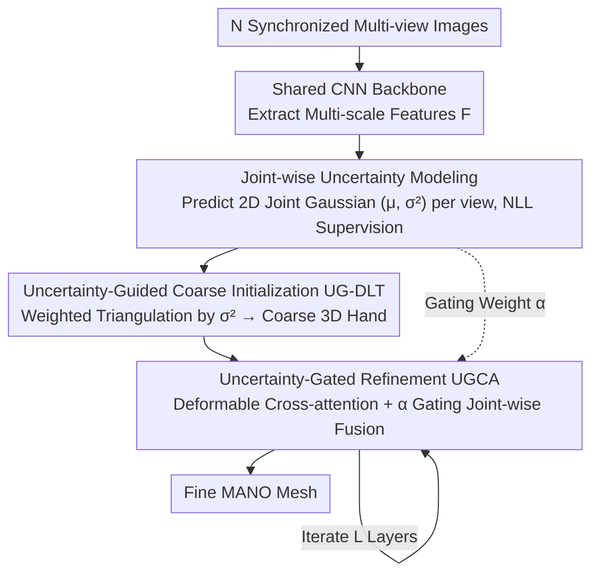

# JUMP-Hand: Learning Joint-wise Uncertainty to Gate Mixture of View Experts for Multi-View 3D Hand Reconstruction

**Conference**: CVPR 2026  
**Paper**: [CVF Open Access](https://openaccess.thecvf.com/content/CVPR2026/html/Kuang_JUMP-Hand_Learning_Joint-wise_Uncertainty_to_Gate_Mixture_of_View_Experts_CVPR_2026_paper.html)  
**Code**: https://github.com/HaohongKuang/JUMP-Hand  
**Area**: Human Understanding (Multi-View 3D Hand Reconstruction)  
**Keywords**: Multi-view hand reconstruction, uncertainty modeling, Mixture of Experts (MoE), view gating, triangulation  

## TL;DR
JUMP-Hand reformulates multi-view 3D hand reconstruction as a Mixture of Experts (MoE) problem where "each view is an expert," utilizing **joint-wise, view-wise probabilistic uncertainty** as an explicit gating signal. This signal drives both uncertainty-weighted triangulation in the coarse stage and uncertainty-gated cross-attention in the refinement stage, adaptively amplifying reliable views while suppressing noisy ones under severe occlusion, achieving SOTA results across three multi-view benchmarks.

## Background & Motivation
**Background**: Monocular 3D hand reconstruction is an ill-posed problem plagued by depth ambiguity and occlusion. Multi-view paradigms leverage cross-view geometry for stability. Recent SOTA methods (e.g., POEM, MLPHand) utilize advanced fusion strategies like Transformers or GCNs to integrate multi-view features.

**Limitations of Prior Work**: These methods tend to **aggregate all views indiscriminately**, either through implicit black-box attention or simple pooling, treating all views equally. However, the authors emphasize a core fact: observation reliability is **joint-wise and view-dependent**. For example, a thumb tip may be clearly visible in one view but completely occluded in another. Indiscriminate fusion allows noisy information from low-reliability views to pollute the features, degrading performance.

**Key Challenge**: Each camera provides **local but complementary** geometric cues based on a 2D projection of the 3D hand. While individual views may suffer from occlusion or blur, a proper combination of multiple views enables complete reconstruction. The challenge lies in how to aggregate these "expert opinions" **on a per-joint basis**, ensuring reliable views dominate and unreliable views are suppressed.

**Goal**: Identify a gating signal that quantifies "how reliable each view is for each joint," remains physically interpretable, and can be applied throughout the entire reconstruction pipeline.

**Key Insight**: The authors adopt the Mixture-of-Experts (MoE) paradigm with two modifications: treating **each camera view as an independent expert** (rather than different FFN networks as in traditional MoE) and using **probabilistic joint-wise uncertainty** as the gating signal (instead of a black-box learnable routing network). Predicted uncertainty is a naturally learnable confidence metric: low uncertainty corresponds to high-quality detection of clear observations, while high uncertainty arises from inferior conditions like occlusion or motion blur.

**Core Idea**: Utilize joint-wise uncertainty as an explicit, physically interpretable gating signal to route expert contributions throughout a coarse-to-fine pipeline consisting of "coarse triangulation initialization + refinement fusion."

## Method

### Overall Architecture
Given $N$ synchronized multi-view images $I=\{I_i\}_{i=1}^N$, the model outputs 3D hand joints $J^{3D}\in\mathbb R^{21\times3}$ and mesh vertices $V^{3D}\in\mathbb R^{778\times3}$ in MANO format. Each view first passes through a shared CNN backbone (ResNet-34) to extract multi-scale features. The process is a coarse-to-fine MoE: ① **Joint-wise Uncertainty Modeling**—each view independently predicts 2D joint positions and their Gaussian uncertainty, which is converted into explicit gating signals; ② **Uncertainty-Guided Coarse Initialization (UG-DLT)**—weighted triangulation is performed using gating weights to obtain a robust coarse 3D hand; ③ **Uncertainty-Gated Refinement (UGCA)**—uncertainty-gated deformable cross-attention adaptively fuses multi-view features joint-wise to iteratively refine the detailed mesh. This single uncertainty signal persists through both stages, ensuring architectural consistency.

### Key Designs

**1. Joint-wise Uncertainty Modeling: Quantifying Reliability per View and Joint as Learnable Gaussian Variance**

To address the limitation of indiscriminate fusion, 2D observations for the $j$-th joint in the $n$-th view are modeled as Gaussian variables $p_{j,n}^{2D}\sim\mathcal N(\mu_{j,n},\Sigma_{j,n})$, where $\mu_{j,n}$ is the predicted 2D mean position and $\Sigma_{j,n}=\mathrm{diag}((\sigma^x_{j,n})^2,(\sigma^y_{j,n})^2)$ is the diagonal covariance. Low variance indicates clear visibility, while high variance reflects ambiguity from occlusion or blur. An uncertainty estimation branch uses an FPN for multi-scale info, a heatmap head $\mathcal H$ for the mean, and a variance head $\mathcal V$ for variance: $\mu_{j,n}=\mathcal H(\mathrm{FPN}(F_n))$, $\Sigma_{j,n}=\mathcal V(\mathrm{FPN}(F_n))$. The variance head uses Softplus to ensure positivity, and the scalar uncertainty $\sigma^2_{j,n}$ is the average of x/y directions. Training uses Gaussian Negative Log-Likelihood (NLL) loss to minimize the NLL of ground truth 2D joints under the predicted Gaussian, ensuring well-calibrated variances. The learned $\sigma^2_{j,n}$ serves as an interpretable confidence metric and a soft gating signal, bridging 2D observation space and 3D reconstruction space.

**2. UG-DLT (Uncertainty-Guided Triangulation): Making Coarse Initialization Inherently Occlusion-Resistant**

Classic DLT triangulation assigns uniform confidence to all views, making it susceptible to pollution from occluded views. JUMP-Hand reconstructs triangulation from a probabilistic perspective, using $\sigma^2_{j,n}$ to gate the contribution of each view. Variance is converted into normalized weights where high-uncertainty views receive low weights:

$$\alpha_{j,n}=\frac{\exp(-\sigma^2_{j,n})}{\sum_{m=1}^{N}\exp(-\sigma^2_{j,m})},\quad j=1,\dots,21.$$

Standard DLT solves $A_j J^{3D}_j=0$. JUMP-Hand applies weight vectors $w_j$ derived from $\alpha_{j,n}$ to the constraint matrix $A_j$ via element-wise Hadamard product $(w_j\circ A_j)J^{3D,(0)}_j=0$, then solves it using SVD in a **differentiable** manner. By suppressing unreliable views per joint, the model produces a coarse 3D hand $\hat J^{3D,(0)}$ robust to noise, which is then upsampled to a coarse mesh $\hat V^{3D,(0)}$. Ablation studies show this step is a "major bottleneck"; removing the coarse stage degrades performance much more severely than removing the refinement stage.

**3. UGCA (Uncertainty-Gated Cross-Attention): Joint-wise Feature Fusion in the Refinement Stage**

Since coarse initialization lacks surface detail, the refinement stage fuses multi-scale visual features. Following the "view as expert" perspective, an $L$-layer iterative Transformer decoder uses coarse 3D joints/vertices as initial 3D queries. Each layer contains self-attention (modeling joint-vertex structural dependencies), UGCA, and FFNs. In UGCA, queries are projected to all $N$ views via camera parameters to obtain reference points. In each view, multi-scale deformable attention samples feature information $y_{j,n}=\sum_{s=1}^{S}\sum_{k=1}^{K}A_{nsk}\cdot\phi(F^s_n,p^{2D}_{j,n}+\Delta p_{nsk})$. The coarse stage's $\alpha_{j,n}$ is reused as a gate to determine the contribution of each view: $y_j=\sum_{n=1}^{N}\alpha_{j,n}\cdot y_{j,n}$. For vertex queries, joint uncertainty is propagated to vertices via MANO skinning weights $W\in\mathbb R^{778\times21}$ as $\sigma^2_{v,n}=\sum_{j=1}^{21}W_{v,j}\cdot\sigma^2_{j,n}$, allowing vertices to inherit uncertainty from their driving joints.

### Loss & Training
The total loss consists of four terms: ① Probabilistic 2D joint supervision using Gaussian NLL $\mathcal L_{NLL}=\frac1N\sum_n\sum_j\big(\log\sigma_{j,n}+\frac{(\bar J^{2D}_{j,n}-\mu_{j,n})^2}{2\sigma^2_{j,n}}\big)$, balancing accuracy and confidence; ② 3D supervision $\mathcal L_{3D}$ ($ \ell_1$ on joints/vertices); ③ 2D re-projection consistency $\mathcal L_{2D}$; ④ Intermediate supervision for the coarse stage $\mathcal L_{DLT}$. Total loss $\mathcal L=\lambda_1\mathcal L_{NLL}+\lambda_2\mathcal L_{3D}+\lambda_3\mathcal L_{2D}+\lambda_4\mathcal L_{DLT}$. Images are resized to $256\times256$ with center-cropping. A ResNet-34 backbone is used, trained for 100 epochs on two RTX 3090s using Adam with an initial learning rate of $1\times10^{-4}$ (decayed by 10x at epoch 60).

## Key Experimental Results

### Metrics
- **MPVPE / MPJPE (mm)**: Mean Per Vertex/Joint Position Error (lower is better).
- **RR** (Root-relative): Relative structure evaluation.
- **PA** (Procrustes-aligned): Shape accuracy after rigid alignment.
- **AUC**: Area Under the PCK Curve (higher is better).

### Main Results: SOTA Comparison across Three Benchmarks

| Dataset | Method | MPVPE↓ | PA-V↓ | MPJPE↓ | AUC-J↑ |
|--------|------|------|------|------|------|
| HO3D-MV | POEM | 17.20 | 9.97 | 17.28 | 0.63 |
| HO3D-MV | MLPHand | 18.69 | 10.54 | 18.70 | — |
| HO3D-MV | **Ours** | **13.39** | **8.78** | **13.10** | **0.72** |
| DexYCB-MV | POEM | 6.13 | 4.00 | 6.06 | 0.68 |
| DexYCB-MV | **Ours** | **5.45** | **3.77** | **5.31** | **0.72** |
| OakInk-MV | POEM | 6.20 | 4.21 | 6.01 | 0.69 |
| OakInk-MV | **Ours** | **5.94** | **4.13** | **5.72** | **0.71** |

On HO3D-MV, which features the most severe occlusion, MPVPE improved by 22.2% compared to POEM (17.20) and 28.4% compared to MLPHand (18.69). AUC also led across all datasets.

### Hard Subsets (Top 10% 2D Error for POEM)

| Subset | Method | MPVPE↓ | AUC-V↑ |
|------|------|------|------|
| HO3D | POEM | 35.52 | 0.04 |
| HO3D | **Ours** | **24.91** (↓10.61) | **0.13** |
| DexYCB | POEM | 13.88 | 0.38 |
| DexYCB | **Ours** | **10.37** | **0.52** |
| OakInk | POEM | 13.85 | 0.42 |
| OakInk | **Ours** | **11.75** | **0.50** |

On the HO3D hard subset, MPVPE improved by 29.9% and AUC-V increased from 0.04 to 0.13, validating the robustness of uncertainty modeling under severe degradation.

### Ablation Study: Gating Signal + Reconstruction Stage (HO3D-MV, MPJPE/mm)

| ID | Gating | Coarse | Refinement | MPJPE↓ |
|----|------|------|------|------|
| (a) | Average | ✔ | ✔ | 16.31 |
| (b) | Learnable | ✔ | ✔ | 15.54 |
| (c) | **Uncertainty (Full)** | ✔ | ✔ | **13.10** |
| (d) | Uncertainty | ✔ | ✗ | 16.61 |
| (e) | Uncertainty | ✗ | ✔ | 21.55 |

Uncertainty gating outperformed average and learnable gating by 3.21 and 2.44 mm respectively. Removing refinement (d) increased error to 16.61 (+3.51), while removing the coarse stage (e) caused a jump to 21.55 (+8.45)—**robust geometric initialization is more critical than subsequent refinement**.

### Hard vs. Soft Gating

| Dataset | Top-2 Hard | Top-3 Hard | Soft (Ours)|
|--------|------|------|------|
| HO3D-MV | 18.16 | 15.47 | **13.10** |
| DexYCB-MV | 6.23 | 5.70(Top-4) | **5.31** |
| OakInk-MV | 6.21 | 5.88 | **5.72** |

Soft gating significantly outperformed the best hard gating (by 5.06 mm on HO3D). Completely discarding low-reliability views irreversibly removes useful contextual cues.

### Key Findings
- **The harder the scenario, the greater the gain from explicit uncertainty gating**: In HO3D (heaviest occlusion), soft gating improved over POEM by 24.2%, compared to 12.4% in DexYCB and 4.8% in OakInk.
- **Coarse initialization is the primary bottleneck**: Removing the coarse stage dropped performance by 4.94 mm more than removing refinement.
- **Soft gating is superior to hard gating**: Weight reduction is better than hard discarding to preserve complementary geometric information from partial observations.

## Highlights & Insights
- **Reformulating MoE with views as experts and uncertainty as gates**: By treating camera views as independent experts and using physically interpretable Gaussian variance as the gate, the model replaces black-box routing with adaptive joint-wise routing.
- **Unified uncertainty signal across stages**: UG-DLT and UGCA reuse the same $\alpha_{j,n}$, providing architectural consistency and avoiding redundant gating mechanisms.
- **Vertex gating via skinning weight propagation**: Propagating joint uncertainty to 778 vertices based on kinematic influence allows the joints and the whole mesh to share a unified gating strategy.
- **Differentiable UG-DLT**: Integrating weighted constraints and SVD into a differentiable block allows geometric initialization to be learned alongside deep features.

## Limitations & Future Work
- The authors acknowledge that **single-mode Gaussian uncertainty modeling** cannot characterize complex **multi-modal ambiguities** (multiple possible joint locations) in extreme occlusion.
- The method relies on calibrated synchronized multi-view cameras and known parameters; robustness to pose errors has not been deeply analyzed.
- Views are treated as independent experts, without explicitly modeling view correlations or redundancies (e.g., two cameras from nearly the same angle).
- Evaluation focuses on hand-object interaction; scalability to sparse views (e.g., only 2) or massive camera arrays requires further verification.

## Related Work & Insights
- **vs POEM**: POEM uses cross-set point attention for implicit fusion, treating views equally. JUMP-Hand uses explicit joint-wise uncertainty gating, showing increasing advantages as occlusion worsens.
- **vs MLPHand**: MLPHand uses MLP-based geometric fusion without modeling observation reliability.
- **vs MVP / Traditional Triangulation (DLT)**: Classic DLT uses uniform confidence across views and is easily biased by noise; UG-DLT is weighted and differentiable.
- **vs UPose3D**: While UPose3D uses uncertainty for MLE optimization as a posterior confidence metric, JUMP-Hand uses uncertainty as an **active, explicit routing signal** throughout the entire fusion process.

## Rating
- Novelty: ⭐⭐⭐⭐⭐ First to use probabilistic joint-wise uncertainty as an explicit gating signal throughout multi-view hand reconstruction.
- Experimental Thoroughness: ⭐⭐⭐⭐⭐ Comprehensive evaluation across three benchmarks, hard subsets, and multiple ablation groups.
- Writing Quality: ⭐⭐⭐⭐ Clear logic across motivation, method, and experiments.
- Value: ⭐⭐⭐⭐ Significant value for reliable hand reconstruction in AR/VR, hand-object interaction, and robotic grasping.

<!-- RELATED:START -->

## Related Papers

- [\[CVPR 2026\] Few-Shot Hybrid Incremental Learning: Continually Learning under Data Scarcity and Task Uncertainty](few-shot_hybrid_incremental_learningcontinually_learning_under_data_scarcity_and.md)
- [\[ACL 2025\] FUEL: Unveiling Environmental Impacts of Large Language Model Serving: A Functional Unit View](../../ACL2025/llm_efficiency/fuel_unveiling_environmental_impacts_of_llm_serving.md)
- [\[ICLR 2026\] ReST-KV: Robust KV Cache Eviction with Layer-wise Output Reconstruction and Spatial-Temporal Smoothing](../../ICLR2026/llm_efficiency/rest-kv_robust_kv_cache_eviction_with_layer-wise_output_reconstruction_and_spati.md)
- [\[ACL 2025\] DIVE into MoE: Diversity-Enhanced Reconstruction of Large Language Models from Dense into Mixture-of-Experts](../../ACL2025/llm_efficiency/dive_moe_reconstruction.md)
- [\[ICLR 2026\] One-Prompt Strikes Back: Sparse Mixture of Experts for Prompt-based Continual Learning](../../ICLR2026/llm_efficiency/one-prompt_strikes_back_sparse_mixture_of_experts_for_prompt-based_continual_lea.md)

<!-- RELATED:END -->
