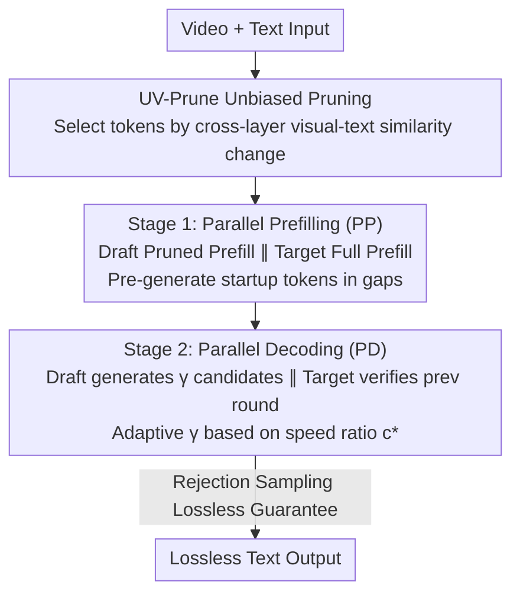

# ParallelVLM: Lossless Video-LLM Acceleration with Visual Alignment Aware Parallel Speculative Decoding

**Conference**: CVPR 2026  
**Paper**: [CVF Open Access](https://openaccess.thecvf.com/content/CVPR2026/html/Kong_ParallelVLM_Lossless_Video-LLM_Acceleration_with_Visual_Alignment_Aware_Parallel_Speculative_CVPR_2026_paper.html)  
**Code**: https://github.com/imKQv/ParallelVLM  
**Area**: LLM Efficiency / Video Multimodal Inference Acceleration  
**Keywords**: Speculative Decoding, Video-LLM, Visual Token Pruning, Parallel Pipeline, Lossless Acceleration

## TL;DR
Addressing two major bottlenecks in Video-LLM speculative decoding—"draft and target models waiting for each other" and "trade-off between speedup ratio and model alignment"—ParallelVLM implements both prefilling and decoding as draft/target parallel pipelines. It employs UV-Prune, an unbiased pruning method based on visual-text similarity variations (rather than attention scores), to expand the draft window. This achieves $3.36\times$ and $2.42\times$ lossless acceleration on LLaVA-OneVision-72B and Qwen2.5-VL-32B, respectively, while being training-free and plug-and-play.

## Background & Motivation
**Background**: Video-LLMs encode videos into thousands or even tens of thousands of visual tokens. Autoregressive decoding faces severe bottlenecks in both prefilling (KV cache computation) and decoding due to the quadratic complexity of self-attention. Two main acceleration routes exist: (1) Visual token pruning (e.g., FastV, SparseVLM), which directly reduces video tokens; (2) Speculative Decoding (SD), which uses a lightweight draft model to generate $\gamma$ candidates for the target model to verify in parallel. The theoretical speedup is proportional to the draft/target speed ratio $c=T_p/T_q$, and lossless distribution is guaranteed via rejection sampling. SpecVLM was the first to apply SD to Video-LLMs.

**Limitations of Prior Work**: Pruning methods are "unverified," introducing distribution shifts that lead to performance degradation (especially in fine-grained understanding). SD routes for Video-LLMs encounter new issues:

**Key Challenge**:
- **(Challenge 1) Sequential Execution Bottleneck**: Vanilla SD forces the draft and target models to perform prefilling and decoding **sequentially** over the entire video sequence. Empirically, for 24K video tokens, target prefilling takes 44.23s plus 7.92s for the draft. In decoding, with $T_q=78$ms and $T_p=420$ms and a typical window $\gamma=5$, a single cycle takes $\approx 2T_p$. Hardware remains idle for ~20% of prefilling and ~50% of decoding time. As Video-LLMs grow stronger, draft models become heavier, making this "waiting tax" increasingly expensive.
- **(Challenge 2) Entanglement of Speedup and Alignment**: Speedup is determined by both $c$ and draft/target alignment (which dictates acceptance rate). While video tokens are redundant and pruning draft visual tokens can reduce $T_q$ to raise $c$, pruned drafts often lose critical visual details and textual grounding. This leads to misalignment with the target’s full-context distribution, causing the acceptance rate to plummet. SpecVLM uses target **attention scores** for pruning but suffers from "locality bias": at a 10% retention rate, only 4% of positional width absorbs 21% of tokens because they are attention sinks or near textual queries, not necessarily semantically important. Moreover, attention pruning is incompatible with FlashAttention.

**Goal / Core Idea**: Resolve "sequential waiting" and "pruning-alignment conflict" simultaneously—using a **parallel pipeline** for draft/target to eliminate idling, and **unbiased pruning** based on cross-layer semantic alignment changes to expand the draft window without sacrificing alignment.

## Method

### Overall Architecture
ParallelVLM is a training-free draft-then-verify framework consisting of two fully parallel stages. Stage 1: Parallel Prefilling (PP), where the draft model performs pruned prefilling concurrently with the target model's full prefilling. Pruning is guided by early-layer target semantics (UV-Prune), and "startup tokens" are pre-generated during idling gaps. Stage 2: Parallel Decoding (PD), where the draft continuously generates $\gamma$ candidates while the target verifies the previous round's candidates, advancing in overlapping windows. The window size $\gamma$ is adaptively selected based on the expanded speed ratio $c^*$ from pruning. The key design is to "hide" all draft-side overhead (pruning/prefilling/startup) under the target model's long latency.

### Key Designs

**1. UV-Prune (Unbiased Verifier-guided Pruning): Replacing Attention Scores with "Cross-layer Alignment Change"**

Attention-based pruning focuses on video ends or tokens near text due to positional bias, which is fatal for temporal coherence. UV-Prune asks instead: "Which tokens become increasingly aligned with text queries as information flows through the target layers?" It calculates cosine similarity $S_{ij}=\frac{V_i\cdot X_j}{\|V_i\|\|X_j\|}$ between video tokens $V_i$ and text tokens $X_j$ at early target layers $l\in\{1,...,L\}$, then sums the differences between adjacent layers: $\Delta S_i=\sum_{j}\sum_{l}(S^l_{ij}-S^{l-1}_{ij})$. High $\Delta S_i$ indicates the token has "gained cross-modal relevance," and the Top-K tokens are retained based on ratio $\alpha$: $V^*=\text{TopK}(\Delta S_1,...,\Delta S_m)$.

Since these signals are measured during the target's prefilling, they "transfer knowledge" from the target to the draft, ensuring stable alignment and high acceptance rates. It also naturally preserves mid-stream frames relevant to the query. Note: It uses representations (not attention matrices) and is thus compatible with FlashAttention.

**2. Parallel Prefilling (PP): Hiding Draft Overhead within Target Prefilling Latency**

In vanilla SD, draft prefilling adds purely idle time. PP runs two independent processes: the target process prefills the full $V_{1:m}$, while the draft process prefills only the pruned $V^*$. Because target prefilling latency is high, all draft operations—target-guided pruning, draft prefilling, and startup token generation—can be completed within this window. Specifically, the target broadcasts intermediate results from early layers to the draft, which executes $\text{UV-Prune}$ to prune tokens. The draft then pre-generates an initial window of $\gamma$ tokens (startup tokens) so Stage 2 can begin immediately without warm-up.

**3. Parallel Decoding (PD): Overlapping Draft Generation and Target Verification**

PD allows draft and target models to work in a pipeline: in round $i$, the draft uses pruned context $V^*$ to generate window $\hat X_{k+\gamma+1:k+2\gamma}$, while the target concurrently uses full context $V_{1:m}$ to verify the $\gamma$ candidates from round $i-1$. Window size is set to the pruned speed ratio $\gamma=c^*=T_p/T_q(\alpha)$. For example, if $T_q=78$ms and $T_p=420$ms, $\gamma=5$. With pruning ratio $\alpha=0.9$, $T_q$ drops to 47ms, $c \approx 9$, and $\gamma$ expands to 9 ($1.8\times$ enlargement). Theoretical speedup is given by $V_{ViP}=\hat\tau(P,\alpha)\cdot\gamma\cdot T_p/(\gamma\cdot T_q(\alpha))=\hat\tau\cdot c^*(\alpha)$.

### Loss & Training
The framework is entirely **training-free**. UV-Prune, PP, and PD are plug-and-play inference mechanisms requiring no parameter updates.

## Key Experimental Results

> Metrics: **Speedup** (end-to-end relative to AR baseline), **M** (mean accepted length), **A** (token-wise acceptance ratio relative to target distribution; ~100% indicates lossless).

### Main Results
Compared against lossless SD methods (baselines use $\gamma=5$, STD uses $\gamma=9$; Ours uses adaptive $\gamma$):

| Draft/Target Pair | Method | Avg. Speedup | Avg. M |
|------|------|------|------|
| LLaVA-OV 0.5B&7B ($c=2$) | SpecVLM | 1.81× | ~4.8 |
| | **ParallelVLM** | **2.11×** | ~8.3 |
| LLaVA-OV 7B&72B ($c=5$) | SpecVLM | 2.74× | ~4.4 |
| | **ParallelVLM** | **3.36×** | ~6.8 |
| Qwen2.5-VL 7B&32B ($c=3$) | SpecVLM | 2.11× | ~4.2 |
| | **ParallelVLM** | **2.42×** | ~4.3 |
| LLaVA-OV 7B&7B ($c=1$, Self-SD) | STD | 1.24× | ~8.0 |
| | **ParallelVLM** | **1.55×** | >14 |

ParallelVLM consistently outperforms SpecVLM by 0.30–0.64×. In Self-SD scenarios ($c=1$), it pushes the average accepted length over 14 via overlapping, achieving ~1.55× speedup.

### Ablation Study
Lossy pruning (10% retention) degrades performance by 9.1%–17.7% and only yields 1.44–1.64× speedup. ParallelVLM is lossless (A ≈ 99%) and achieves 3.36×/2.42×:

| Method (LLaVA-OV-72B, 10% retention) | Avg. A | Avg. Speedup | Lossless? |
|------|------|------|------|
| FastV | 84.6% | 1.63× | No (Drops accuracy) |
| SparseVLM | 87.1% | 1.60× | No |
| **ParallelVLM** | **99.1%** | **3.36×** | Yes |

## Highlights & Insights
- **Engineering "Waiting" Away**: The core insight is identifying that Video-LLM SD's main bottleneck is sequential idling (20% prefill, 50% decode). The parallel pipeline "hides" the draft's speed within the target's latency—a scheduling logic applicable to any asymmetric draft/target system.
- **From "Attention" to "Cross-layer Alignment Change"**: UV-Prune identifies the locality bias of attention pruning (sink/query proximity) and switches to an unbiased semantic signal. This is compatible with FlashAttention and preserves temporal continuity.
- **Decoupling Speedup and Alignment**: By defining $\gamma=c^*$, the pruning ratio becomes a controllable knob where more aggressive pruning expands the window size and speedup ratio, provided alignment remains high.

## Limitations & Future Work
- Evaluation relies on **target full-context output as ground truth** to calculate M/A, rather than human annotation; "lossless" is relative to the target's autoregressive output. ⚠️
- Assumes draft and target can run as independent concurrent processes on multi-GPU setups (e.g., 8× L40S); benefits for single-GPU or memory-constrained scenarios are less explored.
- Speedup depends heavily on $c$: gains in Self-SD ($c=1$) are significantly lower than for $c=5$ pairs.

## Related Work & Insights
- **vs. SpecVLM**: Both use SD for Video-LLMs, but SpecVLM is sequential and uses attention-score pruning. ParallelVLM is fully parallel and uses cross-layer alignment, outperforming it by 0.30–0.64×.
- **vs. Visual Pruning (FastV/SparseVLM)**: Those methods are lossy (9–18% drop) and achieve only ~1.5× speedup. ParallelVLM is theoretically lossless (A≈99%) and yields ~3× speedup.

## Rating
- Novelty: ⭐⭐⭐⭐ "Parallel pipeline + Cross-layer alignment change" addresses the specific bottlenecks of Video-LLMs.
- Experimental Thoroughness: ⭐⭐⭐⭐⭐ Comprehensive coverage across 5 baseline pairs and multiple benchmarks.
- Writing Quality: ⭐⭐⭐⭐ Clear identification of challenges and corresponding solutions.
- Value: ⭐⭐⭐⭐⭐ Training-free, lossless, and ~3× speedup provides direct value for large-scale Video-LLM deployment.

<!-- RELATED:START -->

<!-- RELATED:END -->

## Related Papers

- [\[ICML 2026\] MineDraft: A Framework for Batch Parallel Speculative Decoding](../../ICML2026/llm_efficiency/minedraft_a_framework_for_batch_parallel_speculative_decoding.md)
- [\[ACL 2026\] Multi-Drafter Speculative Decoding with Alignment Feedback](../../ACL2026/llm_efficiency/multi-drafter_speculative_decoding_with_alignment_feedback.md)
- [\[ACL 2026\] TokenTiming: A Dynamic Alignment Method for Universal Speculative Decoding Model Pairs](../../ACL2026/llm_efficiency/tokentiming_a_dynamic_alignment_method_for_universal_speculative_decoding_model_.md)
- [\[CVPR 2026\] E$^2$-SCI: Elastic Edge-Cloud Speculative Decoding via Credit Inertia](e2-sci_elastic_edge-cloud_speculative_decoding_via_credit_inertia.md)
- [\[CVPR 2026\] Generalizable Video Quality Assessment via Weak-to-Strong Learning](generalizable_video_quality_assessment_via_weak-to-strong_learning.md)

<!-- RELATED:END -->
