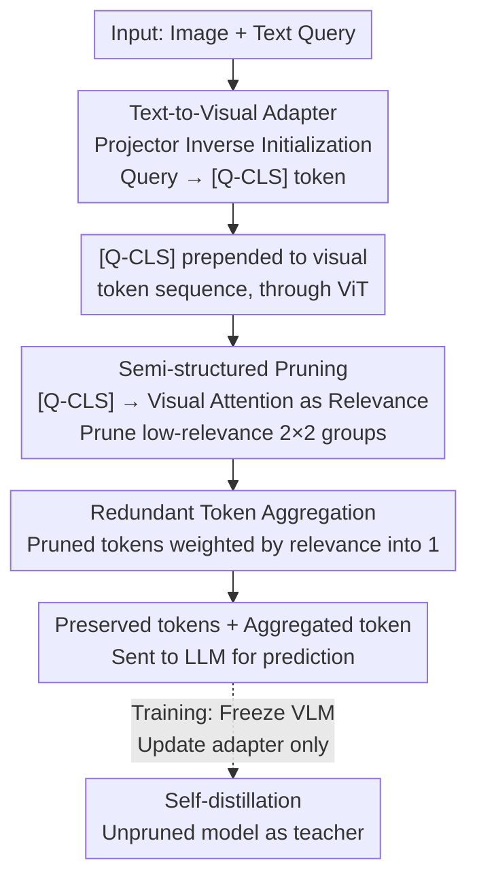

# QuietPrune: Query-Guided Early Token Pruning for Vision-Language Models

**Conference**: CVPR 2026  
**Paper**: [CVF Open Access](https://openaccess.thecvf.com/content/CVPR2026/html/Gao_QuietPrune_Query-Guided_Early_Token_Pruning_for_Vision-Language_Models_CVPR_2026_paper.html)  
**Code**: None  
**Area**: LLM Efficiency  
**Keywords**: Visual token pruning, VLM acceleration, early pruning, query-guided, projector inverse transformation

## TL;DR
QuietPrune proposes **query-guided early pruning**: visual tokens unrelated to the text query are pruned during the ViT forward process rather than after it. By utilizing a lightweight adapter initialized through an **inverse transformation** of the VLM projector, the text query is converted into a visual-domain `[Q-CLS]` token to provide guidance. Pruning is performed in a 2×2 semi-structured manner with redundant token aggregation. On Qwen3-VL and InternVL3, it reduces prefill latency by up to 19.0% while achieving 4.2% higher accuracy than existing late-pruning methods.

## Background & Motivation

**Background**: Mainstream VLMs consist of a ViT, a projector, and an LLM. High-resolution inputs cause the number of visual tokens produced by the ViT to grow **quadratically**, leading to high deployment costs. Consequently, visual token pruning has been proposed to remove redundant tokens in real-time.

**Limitations of Prior Work**: Existing methods are almost entirely **late pruning**—pruning occurs only after the ViT has processed all visual tokens (at the ViT-LLM interface or within LLM layers). This presents two issues: ① It completely ignores the computational redundancy in the **ViT token generation stage itself**. Profiling on Qwen3-VL and InternVL3 reveals that the ViT accounts for >50% of prefill latency, and even >75% for small models at high resolutions. ② The overhead of the pruning decision mechanism is often overlooked; the time taken to select tokens can exceed the time saved, leading to a "pruning makes it slower" paradox (as observed in DivPrune and AIM).

**Key Challenge**: Early pruning must happen inside the ViT to capture significant gains, but it faces two unique difficulties. First is **semantic misalignment**: early pruning occurs before text-visual interaction; without query guidance, traditional ViT pruning relies only on visual saliency, which may preserve large foreground objects while pruning "visually subtle but semantically critical" tokens (e.g., small text for house numbers), causing irreversible information loss. Second is **spatial structure**: latest VLMs typically merge adjacent 2×2 patches into one visual token (4× reduction); arbitrary unstructured pruning breaks the spatial continuity of these groups, introducing prediction bias.

**Goal**: Implement pruning inside the ViT while (a) incorporating text query guidance, (b) maintaining spatial continuity compatible with 2×2 token merging, and (c) avoiding additional latency overhead.

**Core Idea**: **Invert** the projector (visual-to-text) to obtain a text-to-visual adapter. This adapter transforms the query into a ViT-readable `[Q-CLS]` token injected into the ViT. Attention scores between `[Q-CLS]` and visual tokens serve as relevance metrics for 2×2 semi-structured pruning, where pruned tokens are aggregated into a single token to preserve context.

## Method

### Overall Architecture
QuietPrune is a query-guided early pruning framework operating within the ViT, consisting of three components and a training strategy: ① A lightweight **text-to-visual adapter** (initialized by projector inverse transformation) that projects query tokens into the visual space and pools them into a `[Q-CLS]` token, which is prepended to the visual sequence. ② A **semi-structured pruning** mechanism that uses the attention scores from `[Q-CLS]` to visual tokens as "visual-text relevance" to prune low-relevance 2×2 blocks. ③ A **redundant token aggregation** module that weights pruned tokens by relevance into a single token to maintain context. During training, the **entire VLM is frozen and only the adapter is updated** using self-distillation. Pruning is executed at fixed depths: 1/4, 1/2, and 3/4 of the ViT.

### Key Designs

**1. Text-to-Visual Adapter via Projector Inverse: Injecting Query Guidance into Early Pruning**

Early pruning lacks signals regarding which regions are relevant to the query. A typical VLM visual-to-text projector is a stack of LayerNorm $\to$ GELU $\to$ two Linear layers. The authors **rearrange this architecture in reverse** to construct a text-to-visual adapter. The critical aspect is **initialization**: instead of random initialization, the adapter uses the inverse of the projector parameters, granting it inherent text-to-visual mapping capabilities with minimal training. For a linear layer $Y=WX+b$, if $W$ is invertible, $W^*=W^{-1}$ and $b^*=-W^{-1}b$; otherwise, the Moore-Penrose pseudoinverse $W^*=\lim_{\alpha\to 0^+}(W^TW+\alpha I)^{-1}W^T$ is used. LayerNorm is inverted by assuming a standard normal output distribution, approximating indices as $\gamma^*=1/\gamma$ and $\beta^*=-\beta/\gamma$. GELU is treated as an identity mapping in the positive input region.

**2. Semi-structured Pruning based on Visual-Text Relevance: Query-based Selection without Breaking 2×2 Structure**

After `[Q-CLS]` injection, each ViT attention layer calculates $A=\mathrm{softmax}(QK^T/\sqrt{d})$. The attention scores from `[Q-CLS]` to visual tokens **naturally reflect the relevance of each token to the query**, serving as a relevance metric **without additional computation**. To maintain compatibility with VLM operators that merge 2×2 adjacent tokens, **semi-structured pruning** is employed: each 2×2 block is treated as a group, and the group relevance is the mean of its constituent tokens. Pruning removes low-relevance groups as **indivisible units**, preserving spatial consistency.

**3. Redundant Token Aggregation: Compressing instead of Discarding**

Rather than completely discarding pruned tokens, they are aggregated into a compact representation: the aggregated token $x_m$ is the sum of pruned tokens $x_i$ weighted by their relevance scores $a_i$, $x_m=\sum_i a_i x_i$. This single aggregated token is appended to the preserved tokens, adding negligible latency.

**4. Self-distillation Training: Tuning the Adapter while Freezing the VLM**

Only the adapter parameters are updated while the VLM remains frozen. The **pruned model acts as the student and the unpruned model as the teacher** for self-distillation. The loss $L_{distill}$ is the KL divergence between teacher logits $Y_t$ and student logits $Y_s$, combined with cross-entropy $L_{ce}$:

$$L_{total}=L_{distill}(Y_s,Y_t)+L_{ce}(Y_s,Y_{gt}).$$

The adapter is trained on 10K samples (approx. 0.8% of typical mixtures) for 40 minutes on an A100.

## Key Experimental Results

### Main Results
Evaluated on InternVL3 and Qwen3-VL series, controlling for a 50% average pruning rate in the LLM. Relative Accuracy $RA=\mathrm{acc}_p/\mathrm{acc}_{np}$ and Latency Reduction $LR=(\mathrm{lat}_{np}-\mathrm{lat}_p)/\mathrm{lat}_{np}$ are reported (InternVL3-1B example):

| Method | Avg. Acc | Avg. Lat(ms) | RA% | LR% |
|------|---------|-------------|-----|-----|
| No prune | 58.1 | 125 | – | – |
| FastV (ECCV'24) | 54.8 | 104 | 94.3 | 16.8 |
| PACT (CVPR'25) | 54.6 | 100 | 94.0 | 20.0 |
| DivPrune (CVPR'25) | 54.6 | 156 | 94.0 | **-24.8** |
| **QuietPrune (Ours)** | — | — | **Higher** | **Higher** |

QuietPrune consistently outperforms PACT, SAINT, DivPrune, AIM, FastV, and VisPruner across different VLM families and scales. It reduces prefill latency by up to **19.0%** with **4.2%** higher accuracy than late-pruning baselines.

### Key Findings
- **Early pruning benefits small models most**: ViT accounts for a higher proportion of total computation in smaller VLMs (>75% at high resolution), making the latency advantage of early pruning more pronounced.
- **Late pruning can suffer from negative gains**: The computation for pruning decisions in DivPrune and AIM is expensive, causing total prefill latency to exceed the unpruned baseline. 
- **Query guidance + semi-structure is vital for high pruning rates**: SAINT-early, which uses unstructured visual saliency pruning, drops below 90% accuracy at a 20% pruning rate. QuietPrune maintains >88% accuracy even at an 80% pruning rate.

## Highlights & Insights
- **"Inverse Projector" Initialization**: Utilizing the existing vision-to-text mapping to initialize the text-to-vision adapter is an efficient engineering insight that requires very little data and time.
- **Reuse of ViT Attention**: Using the scores already calculated during ViT inference for pruning ensures **zero extra overhead**, bypassing the selection-latency paradox.
- **Semi-structured 2×2 Grouping**: Aligning pruning granularity with the downstream token merging structure makes the acceleration method compatible with mainstream architectures.
- **Weighted Aggregation**: Recovering information loss from "hard pruning" by adding a single aggregated token is a cost-effective way to boost robustness.

## Limitations & Future Work
- **Dependency on 2×2 merging**: The strategy is tailored to the pixel-shuffle/MLP merging common in current VLMs; different merging architectures would require strategy adjustments.
- **VLM-specific training**: Although the adapter is lightweight, a new base model requires a new inverse transformation and distillation.
- **Image-centric evaluation**: Experiments focused on image benchmarks; the gains in long-video scenarios with extreme token counts require further validation.

## Related Work & Insights
- **vs SAINT (Early Pruning)**: SAINT uses bipartite graph matching based purely on visual saliency, ignoring text cues and causing significant drops in multimodal tasks.
- **vs FastV / PACT / DivPrune (Late Pruning)**: These prune at the LLM interface and miss the >50% latency bottleneck in the ViT.
- **vs EViT / DynamicViT (Pure Vision Pruning)**: These use `[CLS]` or auxiliary predictors but lack text conditioning, often pruning tokens critical to the query.

## Rating
- Novelty: ⭐⭐⭐⭐⭐ First query-guided early pruning for VLMs with an elegant inverse-projector initialization.
- Experimental Thoroughness: ⭐⭐⭐⭐ Covers multiple VLM families/scales across six benchmarks.
- Writing Quality: ⭐⭐⭐⭐ Clear motivation regarding ViT latency and early pruning challenges.
- Value: ⭐⭐⭐⭐⭐ Shifts acceleration focus to the neglected ViT internal process; highly practical for VLM deployment.

<!-- RELATED:START -->

## Related Papers

- [\[ICLR 2026\] KnowProxy: Adapting Large Language Models by Knowledge-guided Proxy](../../ICLR2026/llm_efficiency/knowproxy_adapting_large_language_models_by_knowledge-guided_proxy.md)
- [\[ACL 2025\] Boosting Long-Context Information Seeking via Query-Guided Activation Refilling](../../ACL2025/llm_efficiency/boosting_long-context_information_seeking_via_query-guided_activation_refilling.md)
- [\[ICLR 2026\] Scaling Large Vision-Language Model RL Training via Efficient Load Balancing](../../ICLR2026/llm_efficiency/scaling_large_vision-language_model_rl_training_via_efficient_load_balancing.md)
- [\[ICLR 2026\] Distilling to Hybrid Attention Models via KL-Guided Layer Selection](../../ICLR2026/llm_efficiency/distilling_to_hybrid_attention_models_via_kl-guided_layer_selection.md)
- [\[NeurIPS 2025\] L-MTP: Leap Multi-Token Prediction Beyond Adjacent Context for Large Language Models](../../NeurIPS2025/llm_efficiency/l-mtp_leap_multi-token_prediction_beyond_adjacent_context_for_large_language_mod.md)

<!-- RELATED:END -->
