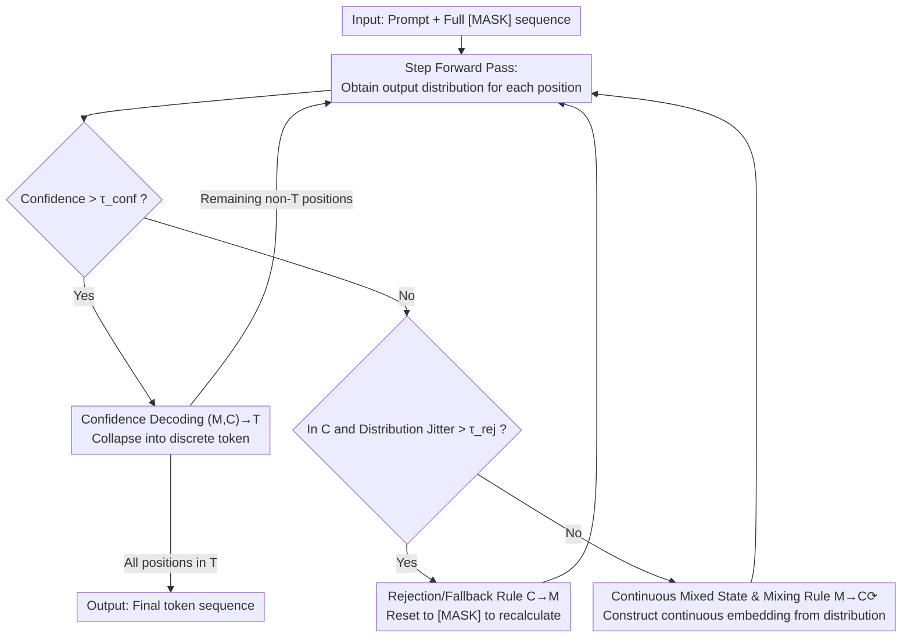

# Rejection Mixing: Fast Semantic Propagation of Mask Tokens for Efficient DLLM Inference

**Conference**: CVPR 2026  
**Paper**: [CVF Open Access](https://openaccess.thecvf.com/content/CVPR2026/html/Ye_Rejection_Mixing_Fast_Semantic_Propagation_of_Mask_Tokens_for_Efficient_CVPR_2026_paper.html)  
**Code**: https://github.com/Serpientw/ReMix-DLLM  
**Area**: LLM Efficiency / Diffusion Language Models / Inference Acceleration  
**Keywords**: Diffusion Language Models, Parallel Decoding, Combinatorial Contradiction, Continuous Intermediate States, Training-free Acceleration

## TL;DR
ReMix inserts an iteratively refreshed "continuous mixed state" between the discrete "mask state $\rightarrow$ token state" transitions in Diffusion Language Models (DLLMs). This allows multiple positions in parallel decoding to coordinate in continuous space before finalizing tokens. By applying a rejection rule to reset unstable positions to masks, the method achieves a 2–8$\times$ inference speedup without training or performance degradation, frequently even improving accuracy.

## Background & Motivation
**Background**: Autoregressive (AR) LLMs generate one token at a time, limiting speed. Diffusion Language Models (DLLMs, such as LLaDA, Dream, and multimodal MMaDA) treat sequences as sets of `[MASK]` tokens for parallel denoising, offering significantly higher throughput potential than AR models.

**Limitations of Prior Work**: DLLMs face an awkward "quality-speed trade-off"—quality is highest when decoding one token per step, but significantly drops when seeking higher parallelism. The authors attribute this to "combinatorial contradiction": multiple positions sampled simultaneously in one decoding step are **unaware of each other**, leading to independent choices that may be semantically inconsistent when combined. The paper illustrates this with a poker example: positions 11 and 12 individually predict "Full" and "Pair," resulting in "Full Pair" instead of the correct "Full House."

**Key Challenge**: The root cause is the **purely discrete** nature of the decoding process. A position is either a `[MASK]` or has collapsed into a specific token, with no intermediate state to "partially solidify" and reveal intentions to its neighbors. Existing improvements either rely on sophisticated parallel scheduling, add revocable mechanisms with extra verification blocks (e.g., WINO), or utilize a small AR model for joint probability (e.g., APD), all of which incur additional computational costs or sacrifice parallelism.

**Goal**: To mitigate combinatorial contradictions without training, auxiliary models, or breaking parallelism, solely by modifying decoding rules.

**Key Insight**: Continuous representations naturally preserve dependencies across positions and carry richer information than single discrete tokens. Instead of immediately remasking uncertain positions into information-less `[MASK]` tokens, they should remain in a continuous space for several steps, iteratively refreshing and coordinating until they collapse into discrete tokens.

**Core Idea**: Insert a continuous intermediate state $C$ between the discrete $M$ (Mask) $\rightarrow$ $T$ (Token) transition. A "mixing rule" allows positions to iteratively converge and align intentions in $C$, while a "rejection rule" resets highly unstable positions to $M$. This entire mechanism is a training-free inference-time modification.

## Method

### Overall Architecture
ReMix models DLLM decoding as a three-state machine: each position transitions between **M (Mask State) / C (Continuous Mixed State) / T (Token State)**. Standard DLLMs only have an $M \rightarrow T$ path: positions exceeding a confidence threshold collapse into tokens, while others remain as `[MASK]`. ReMix adds state $C$ and a feedback loop: in each decoding step, if a position's confidence exceeds a threshold $\tau_{conf}$, it transitions via $(M,C) \rightarrow T$ to finalize a token. Otherwise, it is pushed/kept in continuous state $C$ using a mixing rule (constructing a continuous embedding from the previous output distribution) to participate in the next forward pass. If the distribution fluctuates too much between steps (instability), the rejection rule $C \rightarrow M$ resets it to a mask. This loop continues until all positions reach $T$. The process requires no changes to model weights.

### Key Designs

**1. Continuous Mixed State C and Mixing Rule ($M \rightarrow C \circlearrowright$): Allowing "Partially Formed" Coordination**

To address the lack of coordination in discrete decoding, ReMix keeps sub-threshold positions in a continuous state $C$. Instead of a discrete token, it stores a continuous embedding $y^{emb}_i$, updated using the output distribution from the previous step:
$$y^{emb}_i \leftarrow \beta\, W^{\top} p_\theta(\hat{y}_i \mid X, Y) + (1-\beta)\,\mathrm{Emb}[\text{MASK}]$$
Where $W \in \mathbb{R}^{|V| \times d}$ is the word embedding matrix. $W^{\top}p_\theta(\cdot)$ represents a "soft token" embedding weighted by the output distribution, and $\beta \in (0, 1)$ controls the ratio between this soft embedding and the original `[MASK]` embedding. This allows neighbors to "read" tentative intentions (termed "soft lookahead"), enabling global consistency before hard decisions are made. This is the primary source of acceleration: as information propagates earlier, the required number of decoding steps decreases significantly.

**2. Rejection Rule ($C \rightarrow M$): A Stability Valve to Prevent Error Cascading**

Injecting continuous soft embeddings into a model trained on discrete tokens can introduce training-inference discrepancy and distribution drift. The rejection rule acts as a "brake": if a position's output distribution changes drastically between two consecutive steps (signaling instability), it is reset to `[MASK]`:
$$y_i \leftarrow [\text{MASK}],\quad \text{if } D_{JS}\big(p_\theta(\hat{y}_i\mid X,Y)\,\|\,p_\theta(\hat{y}_i\mid X,Y_{old})\big) > \tau_{rej}$$
Where $D_{JS}$ is the Jensen–Shannon divergence and $\tau_{rej}$ is a threshold (typically 0.1–0.4). This acts as an implicit regularizer, ensuring only stable positions benefit from continuous refreshing while unstable ones are recalculated.

**3. Confidence Decoding $(M,C) \rightarrow T$ and Adaptive Top-p: Finalization and Stability**

This rule handles the "finalization": if the maximum probability of an output distribution exceeds $\tau_{conf}$ (e.g., 0.8), it collapses into a specific token:
$$y_i \leftarrow \arg\max_{v\in V} p_\theta(\hat{y}_i=v\mid X,Y),\quad \text{if } \max_{v\in V} p_\theta(\hat{y}_i=v\mid X,Y) > \tau_{conf}$$
Additionally, **adaptive top-p sampling** is used when converting distributions to embeddings to filter noise, redirecting truncated probability mass back to the `[MASK]` embedding for stability.

## Loss & Training
Ours is a pure inference-time method with no training. It is evaluated directly on LLaDA-8B-Instruct and MMaDA-8B-MixCoT. Hyperparameters include output length 256, block length 128 (semi-autoregressive), $\tau_{conf}=0.8$, $\beta \in \{0.4, 0.5, 0.6\}$, and $\tau_{rej} \in [0.1, 0.4]$.

## Key Experimental Results

### Main Results
**Language Domain**: Based on LLaDA-8B-Instruct across 8 benchmarks. ReMix improves accuracy and reduces steps across **every** benchmark.

| Benchmark | Type | LLaDA Acc | ReMix Acc | Speedup (Steps) | E2E Speedup |
| :--- | :--- | :--- | :--- | :--- | :--- |
| ARC-C | Common Sense | 52.17 | 66.22 (+14.05) | 4.18$\times$ | 3.92$\times$ |
| ARC-E | Common Sense | 59.68 | 70.54 (+10.86) | 5.05$\times$ | 4.60$\times$ |
| Sudoku | Logic | 14.25 | 18.55 (+4.30) | 3.05$\times$ | 2.86$\times$ |
| MATH-500 | Math | 32.20 | 35.00 (+2.80) | 3.86$\times$ | 3.55$\times$ |
| GSM8K | Math | 73.01 | 75.66 (+2.65) | 4.97$\times$ | 4.63$\times$ |

**Multimodal Domain**: Based on MMaDA-8B-MixCoT. Acceleration is even more significant (4.4–8.5$\times$ step reduction, 3.75–7.52$\times$ end-to-end), with performance gains across almost all tasks.

### Ablation Study

| Configuration | Key Observations |
| :--- | :--- |
| Full ReMix | 2–8$\times$ speedup with universal accuracy gains. |
| $\beta=0$ (No State C) | Performance drops significantly, proving state C is the main driver of accuracy. |
| Full Diffusion | While standard LLaDA degrades at Len=256, ReMix remains robust with fewer steps. |
| Var. Length/Block | Robust performance gains and speedups across various lengths (32 to 512). |

### Key Findings
- **Continuous State C is Central**: Setting $\beta=0$ reduces ReMix to standard confidence-based parallel decoding, which yields lower accuracy, confirming that continuous refreshing improves coordination and quality.
- **Combinatorial Contradiction Mitigated**: Evaluation by GPT-4o-mini on GSM8K shows ReMix quality (4.32/5) significantly exceeds the baseline (3.23/5), approaching standard single-step decoding (4.33/5).
- **Difficulty-Dependent Benefits**: The largest gains appear in tasks where the baseline is weak (e.g., ARC-C +14.05) or logic-intensive.

## Highlights & Insights
- **Effective Continuous Intermediate State**: ReMix cleverly targets the discrete nature of original DLLMs. By adding a continuous buffer, it enables "coordinate then collapse," bridging continuous and discrete representations.
- **Soft Lookahead Intuition**: Using output distributions as embeddings allows positions to communicate through a "probability cloud" rather than gambling on a specific token prematurely.
- **Simple, Pointed Safeguard**: Using JS divergence as a stability detector to reset positions to `[MASK]` effectively prevents error cascading with near-zero cost.
- **Speed-Quality Synergy**: Achieving 2.5–8.5$\times$ step reduction while increasing accuracy challenges the conventional "speed vs. quality" trade-off.

## Limitations & Future Work
- **Hyperparameter Sensitivity**: $\beta$ and $\tau_{rej}$ have optimal "sweet spots" that might vary by task; an automated selection scheme is not yet provided.
- **Computation per Step**: Positions in state $C$ still require forward pass computation; speedup comes entirely from reducing the *number* of steps, rather than FLOPs per step.
- **Training-Inference Mismatch**: While mitigated by the rejection rule, continuous embeddings remain OOD (out-of-distribution) for the discrete-trained model.
- **Heuristic Thresholds**: Reliance on $\tau_{conf}$ and JS divergence might benefit from more rigorous, non-heuristic criteria in open-ended generation.

## Related Work & Insights
- **vs. WINO**: WINO requires extra verification blocks to revoke tokens; ReMix consumes less overhead by coordinating in the continuous state before finalization.
- **vs. APD**: APD utilizes an external AR model and forces left-to-right generation; ReMix is self-contained and order-agnostic.
- **vs. Fast-dLLM / dKV-Cache**: These focus on KV cache optimization, which is orthogonal to ReMix's approach of reducing decoding steps.

## Rating
- Novelty: ⭐⭐⭐⭐⭐ An elegant solution to the discrete bottleneck of DLLM parallel decoding.
- Experimental Thoroughness: ⭐⭐⭐⭐ Broad coverage across 14 tasks and multiple dimensions, though further scaling tests on larger models would be beneficial.
- Writing Quality: ⭐⭐⭐⭐ Clear intuition provided by the poker example; state machine transitions are well-defined.
- Value: ⭐⭐⭐⭐⭐ Training-free, plug-and-play 2–8$\times$ speedup with quality gains is highly practical for DLLM deployment.

<!-- RELATED:START -->

## Related Papers

- [\[ICLR 2026\] ES-dLLM: Efficient Inference for Diffusion Large Language Models by Early-Skipping](../../ICLR2026/model_compression/es-dllm_efficient_inference_for_diffusion_large_language_models_by_early-skippin.md)
- [\[CVPR 2026\] LiDeRe: A Lightweight Readout for Fast and Data-Efficient Dense Prediction](lidere_a_lightweight_readout_for_fast_and_data-efficient_dense_prediction.md)
- [\[CVPR 2026\] Ultra-Fast Neural Video Compression](ultra-fast_neural_video_compression.md)
- [\[CVPR 2026\] Test-time Sparsity for Extreme Fast Action Diffusion](test-time_sparsity_for_extreme_fast_action_diffusion.md)
- [\[CVPR 2026\] SG-LoRA: Semantic-guided LoRA Parameters Generation](sg-lora_semantic-guided_lora_parameters_generation.md)

<!-- RELATED:END -->
