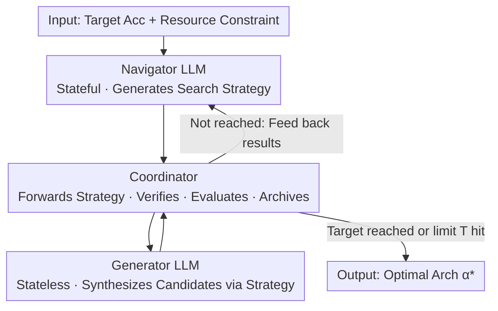

# CoLLM-NAS: Collaborative Large Language Models for Efficient Knowledge-Guided Neural Architecture Search

**Conference**: CVPR 2026  
**arXiv**: [2509.26037](https://arxiv.org/abs/2509.26037)  
**Code**: None (Paper not public)  
**Area**: LLM Applications / Neural Architecture Search (NAS) / AutoML  
**Keywords**: Neural Architecture Search, LLM as Optimizer, Dual-LLM Collaboration, Two-stage NAS, Knowledge-Guided Search

## TL;DR
Two complementary LLMs (a stateful Navigator for strategy and a stateless Generator for candidate architectures) replace the evolutionary algorithm in the second stage of two-stage NAS. This transforms architecture search into a directed "trajectory → strategy → solution" optimization, refreshing SOTA on ImageNet and NAS-Bench-201 while reducing search costs by 4–10×.

## Background & Motivation
**Background**: Two-stage NAS (e.g., SPOS, OFA, AutoFormer) is the current mainstream—first training a weight-sharing supernet, then sampling subnets from the supernet in the second stage for evaluation via inherited weights, avoiding the cost of training from scratch. The search in the second stage is usually handled by evolutionary algorithms (EA), random search, or reinforcement learning.

**Limitations of Prior Work**: Evolutionary algorithms in the second stage rely on **local, undirected** random perturbations like mutation and crossover. They lack a global understanding of the performance surface, often requiring the sampling and evaluation of **thousands** of candidates to approach optimality, making them slow and prone to local optima. Another route—letting LLMs modify architectures directly in the code token space (e.g., EvoPrompting, LLMatic)—often generates **invalid architectures**, lacks robustness, and requires independent training for each candidate, resulting in worse performance than traditional NAS on standard benchmarks while consuming massive compute.

**Key Challenge**: The architecture design priors inherent in LLMs are valuable, but they spin out of control in an "unconstrained code token space" (invalid architectures, independent training needed). Conversely, the supernet evaluation in traditional two-stage NAS is highly efficient, but its search engine (EA) is too "blind." The advantages of both have not been integrated.

**Goal**: While retaining the efficient evaluation of two-stage NAS (supernet weight-sharing), replace the stage-two EA with LLM-guided knowledge reasoning to enable the search to converge "directionally" to high-performance regions without introducing invalid architecture issues.

**Key Insight**: The authors conducted a proof-of-concept on NAS-Bench-201, asking an LLM (Qwen3-30B-A3B) to rank 10 architectures based solely on its understanding of network design principles without seeing actual accuracy. The Kendall's $\tau$ reached 0.89/0.90 on CIFAR-10/100, and it picked the optimal architecture in most trials. This demonstrates that LLMs have "internalized" architecture design knowledge and can serve as a warm start for search.

**Core Idea**: Utilize a "Stateful Navigator + Stateless Generator" dual-LLM collaboration to rewrite architecture search as a directed "trajectory → strategy → candidate" optimization. By searching within the legal search space of a pre-trained supernet, the method achieves both LLM priors and progressive feedback knowledge.

## Method

### Overall Architecture
CoLLM-NAS modifies only the **second stage** of two-stage NAS: the supernet uses pre-trained weights from existing baselines, while the search engine is replaced by a cycle involving two LLMs and a Coordinator. A search iteration works as follows: The Navigator first provides an initial exploration strategy based on the target accuracy $P_{target}$ and resource constraints $\Lambda$ (FLOPs/parameters). The Coordinator passes the strategy to the Generator, which synthesizes a batch of candidates satisfying search space constraints. The Coordinator verifies legality, evaluates each candidate's accuracy and cost using supernet weights, and archives visited architectures for deduplication. Evaluation results are fed back to the Navigator to refine the next round's strategy. This iterates until the target accuracy or the iteration limit $T$ is reached. Throughout the process, the Navigator accumulates the history trajectory $\mathcal{H}$, while the Generator "forgets" the previous round and only considers the current strategy.

### Key Designs

**1. Stateful Navigator LLM: Abstracting Optimization Trajectories into Natural Language Strategies**

EA search consists of "undirected local perturbations" and lacks a global view. The Navigator acts as the global brain: it possesses **persistent memory**, analyzes performance patterns from evaluated architectures each round, and dynamically formulates and refines search strategies to focus on high-potential regions. Initially, it is prompted to establish an exploration strategy that "promotes architecture diversity" (leveraging LLM's implicit understanding to improve initial population quality). As feedback accumulates, it transitions from "broad exploration" to "precise exploitation of discovered high-performance regions," i.e., $\mathcal{S}_t \leftarrow \textsc{NavigatorLLM}(\mathcal{H}_t)$. Crucially, it outputs **abstract natural language strategies** rather than specific architectures—keeping reasoning at a higher abstraction level to avoid overfitting specific architectural syntax.

**2. Stateless Generator LLM: Focusing on Candidate Synthesis via Current Strategy**

If a single LLM handles both reflection and generation, memory noise tends to accumulate. Thus, the Generator is designed as a **stateless**, specialized architecture synthesizer. Each round, it only sees the current strategy $\mathcal{S}_{t-1}$ provided by the Navigator and translates abstract strategies into specific candidate architectures $\mathcal{C}_t \leftarrow \textsc{GeneratorLLM}(\mathcal{S}_{t-1})$. These candidates naturally satisfy search space constraints while reflecting the architectural patterns emphasized by the strategy. Compared to OPRO, which maps trajectories directly to solutions with a single LLM, this paper uses a two-step generative flow: $\mathcal{S}_t \leftarrow \textsc{NavigatorLLM}(\mathcal{H}_t)$ and $\mathcal{C}_{t+1} \leftarrow \textsc{GeneratorLLM}(\mathcal{S}_t)$. This pairing of "Stateful Navigator + Stateless Generator" essentially **decouples exploration (memory-driven strategy evolution) and exploitation (stateless precision synthesis)**. Authors found that retaining the Generator's memory actually leads to noise accumulation and performance degradation.

**3. Coordinator: Efficient Evaluation and Deduplication in Legal Search Space**

Modifying architectures in code token space leads to invalid structures and expensive training. The Coordinator addresses both: it orchestrates communication between the two LLMs, uses `isLegal` to verify the legality of each candidate (inherited from the supernet's legal space, avoiding invalid architectures), and uses a **weight-sharing mechanism to inherit weights from the supernet** for fast evaluation (no retraining). It also maintains an archive $\mathcal{V}$ of visited architectures to eliminate redundant evaluations. Searching within established legal spaces and using supernet evaluation allows CoLLM-NAS to scale to ImageNet-sized datasets, which code-level LLM-NAS methods cannot achieve.

> ⚠️ **Unification of Three Knowledge Sources**: The Navigator, Generator, and Coordinator correspond to the three design points above. Two types of knowledge—LLM's internal architecture priors (warm start) and progressive knowledge from trajectories (implicit performance surface model learned by the Navigator)—are merged through the collaboration of the Navigator and Generator.

### Loss & Training
No models are trained in this paper; the LLMs remain **frozen and zero-shot** throughout. The base LLM is Qwen3-30B-A3B, deployed via vLLM locally with a temperature of 0.6 and chain-of-thought reasoning enabled. To prevent "knowledge leakage," prompts avoid explicit search space or benchmark information; roles and workflows are assigned via system prompts. The search budget is fixed: a maximum of 250 architectures for macro search spaces and 100 for NAS-Bench-201.

## Key Experimental Results

### Main Results
Macro search space (ImageNet), integrating CoLLM-NAS into three two-stage NAS baselines. GPU Days accounts only for the search phase:

| Search Space | Method | Top-1 (%) | FLOPs (M) | GPU Days | Arch. Budget |
|--------|------|------|------|------|------|
| MobileNet | OFA-L | 78.7 | 499 | 0.42 | 1000 |
| MobileNet | OFA-L + Ours | **79.0** | 498 | **0.09** (↓4.7×) | **250** (↓4×) |
| ShuffleNet | SPOS | 73.7 | 323 | 0.32 | 1000 |
| ShuffleNet | SPOS + Ours | **74.4** | 325 | **0.07** (↓4.6×) | **250** (↓4×) |
| AutoFormer | AutoFormer-B | 82.1 | 11305 | 1.0 | 1000 |
| AutoFormer | AutoFormer-B + Ours | **82.3** | 11074 | **0.1** (↓10×) | **250** (↓4×) |

Consistently across three search spaces: accuracy increases by up to 0.7%, search costs drop by 4–10×, and the number of explored architectures decreases from 1000 to 250.

Horizontal comparison with SOTA NAS methods (ImageNet, ~320M FLOPs range):

| Method | Type | Top-1 (%) | Top-5 (%) | FLOPs (M) |
|------|------|------|------|------|
| OFA | Two-stage NAS | 77.5 | 93.5 | 330 |
| SUMNAS | Two-stage NAS | 77.6 | - | 349 |
| GENIUS | LLM-NAS | 74.9 | - | - |
| LM-Searcher | LLM-NAS | 75.1 | - | - |
| **Ours** | LLM-NAS | **77.9** | **93.8** | **320** |

CoLLM-NAS achieves 77.9% Top-1 at 320M FLOPs, surpassing all listed manual, differentiable, two-stage, and LLM-NAS methods.

NAS-Bench-201 (Test accuracy, average of 10 independent runs):

| Method | CIFAR-10 | CIFAR-100 | ImageNet-16-120 |
|------|------|------|------|
| Evolutionary Algorithm | 94.23±0.25 | 72.82±0.87 | 46.49±0.60 |
| RZ-NAS† | 94.24±0.12 | 73.30±0.21 | 46.24±0.23 |
| LM-Searcher | 94.20 | 72.96 | 46.51 |
| **Ours** | **94.37±0.01** | **73.44±0.15** | **46.79±0.28** |
| Optimal (Upper Bound) | 94.37 | 73.51 | 47.31 |

Ours **approaches the theoretical optimal of 94.37** on CIFAR-10, with a much smaller standard deviation than EA/RL, indicating better robustness while exploring at most 100 architectures.

### Ablation Study
| Dimension | Configuration | Conclusion |
|------|------|------|
| Collaboration | SiLLM-NAS (Single LLM handles reflection + generation) | Consistently outperformed by CoLLM-NAS across datasets; CoLLM-NAS yields a **better initial population**. |
| Memory | Low Complexity (CIFAR-10/100) | Optimal when **neither LLM retains memory**; iterative feedback is sufficient. |
| Memory | High Complexity (ImageNet-16-120/ImageNet) | Optimal when **Navigator retains memory but Generator serves as stateless**; Generator memory causes noise. |
| Prompting | Prompts rewritten by Claude 4 / GPT-5 / DeepSeek-R1 | Similar performance across variants (Variant 2 reached 46.89 on ImageNet-16-120), showing gains stem from the framework. |
| Different LLMs | Qwen3-32B / DeepSeek-R1-Distill-Qwen-32B / -Llama-70B | All LLMs maintain strong performance; method is not tied to a specific LLM. |

### Key Findings
- **Navigator memory is crucial for difficult tasks**: The harder the dataset, the more important historical trajectories become; however, the Generator must remain stateless to prevent noise accumulation.
- **Collaboration > Monolith**: Merging roles into a single LLM (SiLLM-NAS) degrades performance and initial population quality, proving the benefit of the "strategy vs. candidate" division.
- **Gains are independent of phrasing/LLM**: Consistent performance across different prompts and open-source LLMs demonstrates the framework's robustness and reproducibility.
- **Downstream Transfer**: Architectures found in the MobileNet search space perform well when used as backbones for FCOS detectors on the COCO 1x schedule.

## Highlights & Insights
- **Asymmetric memory design is ingenious**: The "Stateful Navigator + Stateless Generator" setup encodes the exploration-exploitation balance into the structural choice of memory, supported by empirical evidence that Generator memory accumulates noise.
- **Legal space search via Supernets**: By searching within two-stage NAS legal spaces rather than code spaces, it bypasses "invalid architectures" and "individual retraining," enabling scaling to ImageNet.
- **Trajectory → Strategy → Solution**: Abstracting strategies into natural language before generating specific candidates prevents overfitting specific architecture syntax—a decoupling useful for other LLM-as-optimizer tasks like prompt or hyperparameter search.
- **Proof-of-concept validation**: Quantifying that "LLMs truly understand architecture ranking" (Kendall's $\tau$=0.89/0.90) provides a credible foundation for the entire methodology.

## Limitations & Future Work
- **Dependency on Two-stage NAS**: Efficiency is entirely dependent on having a pre-trained supernet; it is not applicable to search spaces requiring from-scratch evaluation.
- **LLM Inference Overhead**: LLM reasoning introduces additional costs, though these are offset by the significant reduction in the number of evaluations.
- **Limited Accuracy Gains**: Gains in macro spaces are at most +0.7%; the primary selling point is the 4–10× cost reduction rather than a leap in accuracy.
- **Lack of Open Source**: No code is available; reproducibility of prompt engineering and coordination details awaits code release.
- **Generalization beyond NAS**: While the framework is suggested to be extensible, no empirical evidence is provided for tasks beyond NAS.

## Related Work & Insights
- **vs. Traditional Two-stage NAS (SPOS / OFA / AutoFormer)**: These use EA for stage two, requiring thousands of evaluations. This work replaces the search engine with dual-LLM knowledge-guided search, reducing evaluations to 250 with higher accuracy—serving as a "plug-and-play enhancement."
- **vs. Code-level LLM-NAS (EvoPrompting / LLMatic / GENIUS)**: These suffer from invalid architectures and cannot scale to ImageNet. This work scales successfully by using legal spaces and supernet evaluation (77.9% vs. GENIUS 74.9%).
- **vs. OPRO**: OPRO uses a single LLM to map trajectories to solutions. This work uses a two-step "Navigator (Strategy) + Generator (Candidate)" process with asymmetric memory to encourage structured exploration.
- **vs. NADER**: NADER's open search space and full training requirements limit its scaling to ImageNet; this work circumvents this via supernet weight-sharing.

## Rating
- Novelty: ⭐⭐⭐⭐ First work to combine LLMs with two-stage NAS; asymmetric memory design is creative, though it falls under the "LLM as optimizer" paradigm.
- Experimental Thoroughness: ⭐⭐⭐⭐⭐ Covers 3 macro spaces + NAS-Bench-201, with multi-dimensional ablations on collaboration, memory, prompts, and downstream tasks.
- Writing Quality: ⭐⭐⭐⭐ Clear motivation, strong proof-of-concept, well-defined pipeline.
- Value: ⭐⭐⭐⭐ 4–10× cost reduction + SOTA; high engineering value for NAS/AutoML practitioners.

<!-- RELATED:START -->

## Related Papers

- [\[CVPR 2026\] LLM-Guided Probabilistic Fusion for Label-Efficient Document Layout Analysis](llm-guided_probabilistic_fusion_for_label-efficient_document_layout_analysis.md)
- [\[ACL 2025\] Collaborative Performance Prediction for Large Language Models](../../ACL2025/llm_nlp/collaborative_performance_prediction_for_large_language_models.md)
- [\[ACL 2025\] Neural Topic Modeling with Large Language Models in the Loop](../../ACL2025/llm_nlp/neural_topic_modeling_with_large_language_models_in_the_loop.md)
- [\[AAAI 2026\] LoKI: Low-damage Knowledge Implanting of Large Language Models](../../AAAI2026/llm_nlp/loki_low-damage_knowledge_implanting_of_large_language_models.md)
- [\[ICLR 2026\] Neural Synchrony Between Socially Interacting Language Models](../../ICLR2026/llm_nlp/neural_synchrony_between_socially_interacting_language_models.md)

<!-- RELATED:END -->
