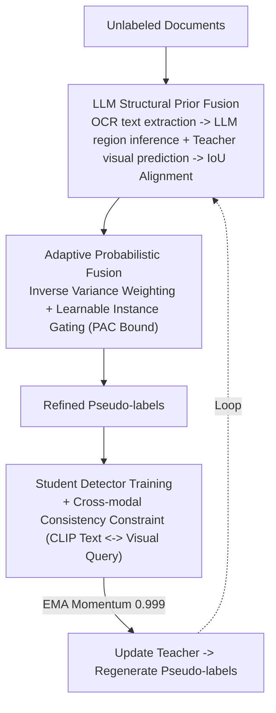

# LLM-Guided Probabilistic Fusion for Label-Efficient Document Layout Analysis

**Conference**: CVPR 2026  
**Paper**: [CVF Open Access](https://openaccess.thecvf.com/content/CVPR2026/html/Shihab_LLM-Guided_Probabilistic_Fusion_for_Label-Efficient_Document_Layout_Analysis_CVPR_2026_paper.html)  
**Code**: To be confirmed  
**Area**: Document Intelligence / Semi-supervised Object Detection  
**Keywords**: Document Layout Analysis, Semi-supervised Detection, LLM Structural Prior, Inverse Variance Fusion, Pseudo-labeling

## TL;DR
This paper integrates text-pretrained LLMs as "structural prior generators" into the pseudo-label refinement stage of semi-supervised layout detection. By using OCR+LLM to infer document hierarchical regions and performing inverse variance probabilistic fusion (including learnable instance-adaptive gating) with teacher detector outputs, the method achieves 88.2 AP (lightweight backbone) and 89.7 AP (LayoutLMv3) on PubLayNet using only 5% labels, with the most significant gains observed in rare layout elements such as titles and headers.

## Background & Motivation
**Background**: Document layout analysis serves as the foundation for digital libraries, form processing, and document QA. Modern Transformer-based detectors offer high precision but rely heavily on large-scale annotations; semi-supervised learning (teacher-student, pseudo-labeling, consistency regularization) is the mainstream approach to reducing annotation costs.

**Limitations of Prior Work**: Semi-supervised detectors often inherit systematic biases from teacher models, struggling specifically with rare layout elements (caption, footer) and fine-grained distinctions (caption vs. footer, header vs. title)—categories that are inherently sparse and visually similar. Perception-only pseudo-labels lack "semantic structural" information.

**Key Challenge**: Humans interpret document structure based on **textual semantics**—"Figure 3:" suggests a caption, bold text at the page top suggests a header, and tabular alignment suggests a data table. Existing semi-supervised detection relies solely on visual cues, wasting this free linguistic prior. Conversely, directly replacing detectors with LLM/VLMs is ineffective (GPT-4V zero-shot only achieves 74.3 AP in experiments) due to their weak spatial localization capabilities.

**Goal**: To inject the structural reasoning capabilities of LLMs into pseudo-label refinement without discarding mature detection architectures or introducing large-scale annotations. This is decomposed into two sub-problems: (i) how to fused "LLM-provided structural regions" with "teacher-provided visual boxes" in a principled manner rather than simple concatenation; (ii) how to make fusion weights adaptive and theoretically guaranteed.

**Key Insight**: Positioning the LLM as a "structural prior generator" rather than a detector replacement—providing it with OCR-extracted text blocks and their coordinates allows it to infer hierarchies, distinguish semantic regions, and even correct OCR errors. This knowledge is **complementary** to visual pattern recognition.

**Core Idea**: Combining LLM structural priors with teacher visual predictions via "inverse variance probabilistic fusion + learnable instance gating" to generate refined pseudo-labels. Higher weights are assigned to more certain sources, with the cross-modal fusion efficiency explained through data-dependent PAC bounds.

## Method

### Overall Architecture
The pipeline is built upon a lightweight DETR-style detector (SwiftFormer-Tiny backbone, 3-layer encoder/decoder, 100 object queries). For unlabeled documents: one path uses Tesseract OCR to extract text blocks $B=\{(b^{ocr}_j,t_j)\}$, which are fed to the LLM to return structural regions with boxes, categories, and confidence $r_k=(b^{llm}_k,c_k,s_k)$; the other path generates visual predictions $T$ via the teacher detector. The two paths are aligned through IoU matching and combined via **probabilistic fusion** to generate refined pseudo-labels. The student detector is trained on these labels while aligning visual queries with OCR text embeddings through cross-modal consistency; the student updates the teacher via EMA.

### Key Designs

**1. LLM Structural Prior Fusion: Injecting Linguistic Hierarchy into Visual Pseudo-labels**

Addressing the pain point where purely visual pseudo-labels lack semantic structure. OCR decomposes unlabeled documents into text blocks, and the LLM is prompted to identify structural regions, returning $r_k=(b^{llm}_k,c_k,s_k)$. LLM regions $L$ and teacher predictions $T$ are aligned via IoU matching: when $\mathrm{IoU}(b^t_i,b^{llm}_k)\ge\tau$ and categories are compatible, a fused prediction is generated—box $b_f=\alpha b^t_i+(1-\alpha)b^{llm}_k$ and confidence $p_f=\sigma(w_t\cdot\mathrm{logit}(p^t_i)+w_l\cdot\mathrm{logit}(s_k))$ (with fixed settings $\alpha=0.6,w_t=0.7,w_l=0.3$). Unmatched high-confidence LLM regions are added as soft pseudo-labels (label smoothing $\epsilon=0.2$) to assist rare classes. LLM regions are cached offline to amortize inference costs.

**2. Adaptive Probabilistic Fusion: Using Uncertainty to Determine Trust with PAC Guarantees**

Fixed weights are suboptimal heuristics. This design starts from uncertainty quantification: teacher uncertainty is estimated via prediction variance $\sigma^2_t=\mathrm{Var}(p^{t,1}_i,\dots)$, while LLM uncertainty depends on text evidence quality $\sigma^2_l=1/(Q_{text}(t_k)\cdot Q_{spatial}(b^{llm}_k))$, where $Q_{text}$ measures text clarity and $Q_{spatial}$ measures spatial consistency. The minimum-variance unbiased estimator provides inverse variance weighted localization:

$$b_f=\frac{b^t_i/\sigma^2_t+b^{llm}_k/\sigma^2_l}{1/\sigma^2_t+1/\sigma^2_l}$$

Weights are assigned by precision $1/\sigma^2$; more certain sources receive higher weights. Confidence is calculated as the geometric mean in logit space after temperature scaling. Since real predictions violate Gaussian assumptions, a **learnable gating** MLP is added to predict instance-level weights $\alpha_{adapt}$ from $[h^t_i;h^l_k;\mathrm{IoU};p^t_i;s_k;Q_{text};Q_{spatial}]$. This adds only 64K parameters (0.24% overhead) yet yields $+0.9$ AP. Theoretically, Theorem 1 establishes the variance optimality of inverse variance fusion, while Theorem 2 provides a data-dependent generalization bound, defining a complementarity dimension $k=\dim(\xi)\cdot \log(1+LB_\theta\sqrt{n})$. With $\dim(\xi)=3$ and $n=26\mathrm{K}$, $k\approx 22$, much smaller than $d=64\mathrm{K}$, predicting a convergence rate of $O(\sqrt{k/n})$.

**3. Cross-modal Consistency: Stabilizing Training with Textual Semantics**

Noisy pseudo-labels can bias the student. For each predicted box $\hat{b}_i$, OCR blocks with IoU > 0.5 are aggregated to obtain text $t_i$, encoded into $f_t(t_i)$ using a frozen CLIP text tower. Simultaneously, the decoder query $q_i$ is mapped to visual features $f_v(q_i)$ via a projection head. A consistency loss encourages alignment: $L_{cons}=\frac{1}{N}\sum_i \mathbb{1}_{\{t_i\neq\varnothing\}}\big(1-\frac{f_v(q_i)\cdot f_t(t_i)}{\lVert f_v(q_i)\rVert\lVert f_t(t_i)\rVert}\big)$. Freezing the text encoder during training prevents overfitting to OCR errors and ensures the detector learns representations robust to pseudo-label noise.

### Loss & Training
The total objective is $L=L_{sup}(D_{labeled})+\lambda_{pseudo}L_{pseudo}(D_{unlabeled})+\lambda_{cons}L_{cons}(D_{unlabeled})$, where $L_{sup}$ is the standard DETR loss (focal classification + L1 + GIoU, $\lambda_{box}=5.0,\lambda_{giou}=2.0$), $\lambda_{pseudo}=1.0$, and $\lambda_{cons}=0.2$. A curriculum training strategy is employed: epochs 1–2 use high-confidence teacher pseudo-labels ($p^t_i\ge 0.7$); epochs 3–5 introduce teacher-LLM fused predictions; from epoch 6, LLM-only soft pseudo-labels are added for rare classes. The teacher is updated via EMA (0.999 momentum), and pseudo-labels are regenerated every 2 epochs.

## Key Experimental Results

> Metrics: COCO-style **AP / AP75 / APS**. Low-data settings randomly sample 5% or 10% labels.

### Main Results
PubLayNet (5 classes, 5% labels) main results:

| Category | Method | Labels | AP | Description |
|------|------|------|----|------|
| Supervised Upper Bound | Supervised (100%) | 100% | 91.4 | Performance ceiling |
| Semi-supervised Baseline | Dense Teacher | 5%+U | 85.3 | Strong semi-supervised baseline |
| Semi-supervised Baseline | STEP-DETR | 5%+U | 84.8 | Transformer extension |
| Ours-Lightweight | Ours (SwiftFormer 26M, adaptive) | 5%+U | **88.2** | +2.9 over Dense Teacher |
| Document Pre-trained | LayoutLMv3 + Semi-supervised | 5%+U | 89.1 | Multimodal backbone |
| Document Pre-trained | UDOP | 5%+U | 89.8 | Requires 100M+ page pre-training |
| Ours-Pre-trained | Ours + LayoutLMv3 (adaptive) | 5%+U | **89.7** | Outperforms LayoutLMv3+SSL, matches UDOP |
| Zero-shot Control | GPT-4V (zero-shot) | 0% | 74.3 | LLM cannot serve as direct detector |

The lightweight backbone (26M parameters, no multimodal pre-training) matches LayoutLMv3 fine-tuned on 5% labels (87.6 AP). By using LayoutLMv3 as a teacher, Ours reaches 89.7 AP, matching UDOP (which requires massive multimodal pre-training) using only a text-pretrained LLM.

### Ablation Study
PubLayNet (5% labels) component-wise analysis:

| Configuration | AP | Δ | Description |
|------|----|----|------|
| Baseline | 82.3 | - | Detector only |
| + Teacher | 84.1 | +1.8 | Teacher pseudo-labels |
| + LLM only | 85.6 | +3.3 | LLM structural regions only |
| + Fusion | 86.7 | +4.4 | Inverse variance fusion |
| + Cross-modal (Full) | 87.3 | +5.0 | Complete model |
| w/o LLM | 84.3 | −3.0 | Removing LLM causes largest drop |
| w/o Fusion | 86.1 | −1.2 | Reverting to simple concatenation |
| w/o $L_{cons}$ | 86.7 | −0.6 | Removing consistency loss |

### Key Findings
- The LLM structural prior provides the most significant gain: removing it drops performance by 3.0 AP, confirming that semantic structure provides information unattainable through vision alone.
- LLM gains are concentrated in rare classes (DocLayNet): Caption +8.4, Header +7.2, and Title +6.8 relative to baseline, whereas common elements like Text/Paragraph only improve by +2~3.
- Learnable adaptive gating consistently outperforms fixed weights: +0.9 AP for lightweight models and +0.3 AP for pre-trained models, with PAC bounds correctly predicting $O(\sqrt{k/n})$ convergence.
- Inexpensive/open-source LLMs are viable: GPT-4o-mini costs only \$12 per 50K pages, and Llama-3-70B provides nearly identical performance, supporting privacy-sensitive scenarios.

## Highlights & Insights
- The positioning of "LLM as prior generator, not detector" is critical—it bypasses the weak spatial localization of VLMs (GPT-4V zero-shot 74.3 AP) while utilizing their strength in textual reasoning. 
- Inverse variance fusion provides a principled answer to "whom to trust," while the learnable gate handles cases where Gaussian assumptions fail. The 64K parameter gate and the data-dependent PAC bound ($k\approx22\ll d$) explain successful learning under low-data regimes.
- The concentration of LLM gains in rare layout classes suggests a generalizable strategy for long-tail detection: using textual/attribute descriptions to supplement pseudo-labels for sparse categories.

## Limitations & Future Work
- Strong dependency on OCR quality: The LLM path relies on Tesseract blocks; poor scan quality or complex layouts may contaminate structural inference.
- Heuristic uncertainty estimation: The definitions for $Q_{text}$ and $Q_{spatial}$ in $\sigma^2_l$ are relatively coarse. The PAC bounds are also noted to be somewhat loose (predicting a 2.3 mAP gap vs. 0.7 mAP observed).
- Limited evaluation scope: Experiments are restricted to PubLayNet/DocLayNet (5/11 classes). Generalization to table structure recognition or handwritten documents remains to be tested.
- Complexity: The introduction of OCR+LLM adds an external dependency chain, increasing deployment complexity compared to vision-only semi-supervised methods.

## Related Work & Insights
- **vs. Dense Teacher / STEP-DETR (Visual Semi-supervised)**: These methods rely solely on visual cues and suffer from teacher bias in rare classes; Ours injects LLM semantic priors, yielding a +2.9 AP gain over Dense Teacher at 5% labels.
- **vs. UDOP / DocLLM (Unified Pre-training)**: These require massive multimodal corpora and compute; Ours uses text-only LLMs as plug-and-play priors, matching UDOP's performance with only 5% labels.
- **vs. GPT-4V Zero-shot**: Direct VLM detection is far inferior to supervised baselines; this work proves that "collaboration" (LLM prior + specialized detector) is superior to "replacement."

## Rating
- Novelty: ⭐⭐⭐⭐ The combination of LLM structural priors with inverse variance/gated fusion and PAC validation is a fresh entry into semi-supervised layout analysis.
- Experimental Thoroughness: ⭐⭐⭐⭐⭐ Includes dual benchmarks, multiple backbones, per-class analysis, and extensive statistical/theoretical validation.
- Writing Quality: ⭐⭐⭐⭐ Motivations are clear, though the theoretical sections are notation-heavy.
- Value: ⭐⭐⭐⭐ Provides a practical "low-label + language prior" route that is cost-effective and friendly to rare classes.

<!-- RELATED:START -->

## Related Papers

- [\[CVPR 2026\] OmniDocLayout: Towards Diverse Document Layout Generation via Coarse-to-Fine LLM Learning](omnidoclayout_towards_diverse_document_layout_generation_via_coarse-to-fine_llm_.md)
- [\[ACL 2026\] CAST: Achieving Stable LLM-based Text Analysis for Data Analytics](../../ACL2026/llm_nlp/cast_achieving_stable_llm-based_text_analysis_for_data_analytics.md)
- [\[ICML 2026\] Token-Efficient Change Detection in LLM APIs](../../ICML2026/llm_nlp/token-efficient_change_detection_in_llm_apis.md)
- [\[ACL 2025\] Efficient Universal Goal Hijacking with Semantics-guided Prompt Organization](../../ACL2025/llm_nlp/goal_hijacking_attack.md)
- [\[ACL 2025\] Efficient and Accurate Prompt Optimization: the Benefit of Memory in Exemplar-Guided Reflection](../../ACL2025/llm_nlp/erm_prompt_optimization_memory.md)

<!-- RELATED:END -->
