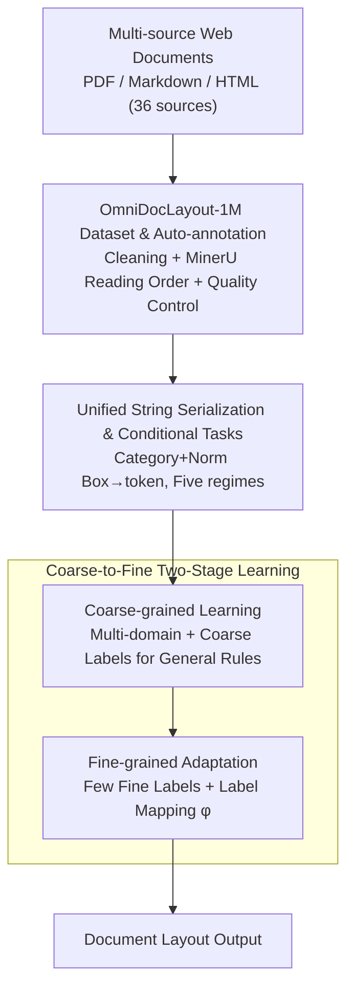

# OmniDocLayout: Towards Diverse Document Layout Generation via Coarse-to-Fine LLM Learning

**Conference**: CVPR 2026  
**Paper**: [CVF Open Access](https://openaccess.thecvf.com/content/CVPR2026/html/Kang_OmniDocLayout_Towards_Diverse_Document_Layout_Generation_via_Coarse-to-Fine_LLM_Learning_CVPR_2026_paper.html)  
**Code**: https://github.com/opendatalab/OmniDocLayout  
**Area**: NLP / LLM Applications (Document Layout Generation)  
**Keywords**: Document Layout Generation, Coarse-to-Fine Learning, Million-scale Layout Dataset, Lightweight LLM, Sequence Modeling

## TL;DR
Addressing the limitation that existing document layout generation data are "academic-only with single styles," the authors first create OmniDocLayout-1M, the first million-scale diverse layout dataset covering six document categories. They then employ a 0.5B small LLM using a "coarse-to-fine" paradigm—learning general layout rules on multi-domain coarse labels followed by adapting to specific domains with few fine labels. This approach outperforms both specialized layout models and general large models such as GPT-4o/Gemini/Claude on M6Doc.

## Background & Motivation
**Background**: Document AI has progressed rapidly, but efforts have focused on "Document Layout Analysis (DLA)" (extracting structure). Its dual task, "Layout Generation"—arranging elements like text blocks, tables, and images—has long been neglected. Compared to graphic design or room layout planning, document layout generation is more difficult due to the higher number of elements per page and extreme structural differences across document types.

**Limitations of Prior Work**: The authors identify two bottlenecks. First, **data scarcity and bias**: Large datasets like PubLayNet and DocBank consist almost exclusively of simple Manhattan-style (single/double column) academic papers. Diverse sources like M6Doc and OmniDocBench cover modern types like newspapers but have $<10K$ samples, insufficient for large-scale training. Second, **poor performance in complex long-sequence scenarios**: Diffusion-based models (LayoutDM, LACE) are data-hungry and struggle to converge in complex domains; LLM-based methods (LayoutPrompter, LayoutCoT) face high learning difficulty and frequent failures during direct fine-tuning or in-context learning.

**Key Challenge**: Learning complex and diverse layouts requires large-scale, fine-grained multi-domain data. However, fine-grained labels are expensive and scarce, and direct learning on limited complex data leads to overfitting and poor transferability—creating a sharp trade-off between "data diversity" and "annotation cost/learning difficulty."

**Goal**: (1) Provide a large-scale, diverse, and automatically annotated layout dataset; (2) Design a training paradigm that learns complex layouts effectively even when fine-grained labels are scarce.

**Key Insight**: Although layout styles vary across document types, they **share a basic set of aesthetic rules** (alignment, overlap avoidance, spatial organization). Therefore, one can learn these universal rules using massive multi-domain data with **coarse labels**, then adapt to specific domains with minimal fine labels.

**Core Idea**: Use a "Coarse-to-Fine" two-stage learning paradigm to enable a lightweight LLM to learn general layout rules first and then perform few-shot adaptation to specific domains, bypassing the dual obstacles of "scarce fine-grained labels" and "difficulty in direct complex layout learning."

## Method

### Overall Architecture
OmniDocLayout consists of two parts: the **OmniDocLayout-1M** dataset (million-scale diverse layouts + automated pipeline) and the **OmniDocLayout-LLM** (0.5B model + coarse-to-fine training). The pipepline is: Crawling PDF/Markdown/HTML from multi-source web data $\rightarrow$ Pre-processing, auto-annotation, and QC to obtain 1M layouts $\rightarrow$ Serializing each element $(c,x,y,w,h)$ into a unified string token with conditional prompts $\rightarrow$ Coarse-grained learning on multi-domain coarse data $\rightarrow$ Fine-grained adaptation with few fine labels $\rightarrow$ Outputting document layouts compliant with aesthetics and user constraints.

### Key Designs

**1. OmniDocLayout-1M Dataset & Auto-annotation: Trading "Automation" for "Scale × Diversity"**

To address defects in existing data (bias, small scale, outdated sources, and scaling difficulties), the authors collected data from 36 public sources across textbooks, newspapers, magazines, exam papers, academic papers, and slides. Post-collection includes format standardization, deduplication, and quality filtering. Annotation uses MinerU to convert layouts into element sequences—crucially, MinerU's output **aligns with natural reading order**, an attribute critical for coherent layout generation. For newspapers where MinerU struggles, a DocLayout-YOLO was fine-tuned on 1,000 manual labels. The resulting ~1M samples (~48M instances) were validated via blind human evaluation, with $\geq 92\%$ of samples rated as "perceptually equivalent" to manual annotation quality.

**2. Unified Serialization & Five Conditional Tasks: Document Layout as Sequence Modeling**

Each element is a five-tuple $e_i=(c,x,y,w,h)$, where $c$ is the category and $(x,y,w,h)$ are normalized coordinates quantized to $[0,999]$. Instead of HTML-style prompts—which can be redundant as shown in LGGPT—the authors use **pure string prefix encoding**: `<|cat_start|>c<|cat_end|><|box_start|>x y w h<|box_end|>`. Page-level prompts contain Base Prompt (type, size, count), Condition Prompt (task-specific), and Task Prompt (instruction). **Five regimes** are defined: U-Cond (unconditional), C→S+P (predict size+pos given category), C+S→P (predict pos given category+size), Completion (fill remaining 80-100% elements), and Refinement (restore attributes from Gaussian noise $\mathcal{N}(0,10^{-2})$).

**3. Coarse-to-Fine Learning Paradigm: Bypassing Scarcity via "General-to-Specific"**

The core mechanism splits training into $(\mathbb{D}_{\mathrm{coar}},\mathbb{C}_{\mathrm{coar}})\xRightarrow{\text{Transfer}}(\mathbb{D}_{\mathrm{fine}},\mathbb{C}_{\mathrm{fine}})$. **Coarse-grained learning** uses a set of core labels $\mathbb{C}_{\mathrm{coar}}$ (text, table, image, etc.) across 1M samples to acquire transferable spatial priors. **Fine-grained adaptation** fine-tunes on the target domain $\mathbb{D}_{\mathrm{fine}}$ using a **label mapping** $\phi:\mathbb{C}_{\mathrm{coar}}\to\mathbb{C}_{\mathrm{fine}}$ (e.g., "text" $\mapsto$ {"paragraph", "lead", "list"}). This allows the model to adapt to complex domains using only **hundreds** of fine-labeled samples by leveraging the pre-learned aesthetic priors.

### Loss & Training
The base model is Qwen2.5-0.5B-Instruct. Training aims to maximize conditional log-likelihood of the serialized tokens $T=(t_1,\dots,t_K)$. The coarse stage utilizes ~9M constructed samples (1 epoch on 40 A100s, 20h, lr 1e-4). The fine stage uses 5 epochs (8 A100s, 2h, lr 5e-5).

## Key Experimental Results

### Main Results
Evaluated on M6Doc across five document types using **FID** (lower is better), **mIoU** (higher is better), **Alignment (Ali.)**, and **Overlap (Ove.)**. FID results for U-Cond:

| Document Type | LayoutDM | LGGPT | OmniDocLayout (Ours) |
|----------|----------|-------|----------------------|
| Textbook | 180.25 | 197.81 | **40.28** |
| Newspaper | 281.56 | 154.20 | **39.73** |
| Magazine | 281.91 | 162.94 | **41.82** |
| Exam | 287.58 | 157.11 | **40.32** |
| Academic | 153.66 | 236.72 | **36.48** |

Comparison with zero-shot general LLMs (U-Cond FID):

| Document Type | GPT-4o | Gemini-2.5-Flash | Claude-3.7-Sonnet | Ours |
|----------|--------|------------------|-------------------|------|
| Textbook | 135.32 | 147.88 | 96.23 | **40.28** |
| Newspaper | 193.13 | 194.77 | 171.01 | **39.73** |
| Academic | 135.60 | 57.36 | 106.98 | **36.48** |

Diffusion models collapse in low-resource complex domains. LGGPT produces incoherent results on long prompts. Zero-shot LLMs exhibit high randomness despite decent alignment. Ours shows significant gains, particularly in mIoU.

### Ablation Study
Ablation on the Newspaper domain (F.=Fine-only, C.=Coarse-only, Both=Full):

| Task | Config | FID↓ | Ali.→ | Ove.→ | mIoU↑ |
|------|------|------|-------|-------|-------|
| U-Cond | F. | 42.98 | 0.017 | 8.308 | 0.000 |
| U-Cond | C. | 249.1 | 0.016 | 0.388 | 0.000 |
| U-Cond | **Both** | **39.73** | 0.015 | **0.084** | 0.000 |

Scaling ablation (0.5B vs 1.5B vs 3B) shows minimal differences, suggesting layout generation does not strictly follow standard scaling laws. 0.5B is chosen for efficiency.

### Key Findings
- **Two stages are indispensable**: Coarse-only (C.) has poor FID due to domain mismatch but much lower Overlap, proving it injects aesthetic rules. Fine-only (F.) lacks robust spatial priors.
- **Small models are sufficient**: 0.5B is optimal for cost-performance; 3B models risk overfitting or insufficient optimization on these structured tasks.
- **mIoU Zeros**: Due to strict label matching in complex layouts (U-Cond/Completion), mIoU often hits zero. This highlights the inadequacy of current metrics for few-shot complex layout evaluation.

## Highlights & Insights
- **The "Shared Aesthetic Rules" observation is the pivot**: This intuition transforms a problem requiring massive fine labels into one solvable with automated coarse labels and minimal fine-tuning.
- **Reciprocal utility of parsing for generation**: Leveraging mature parsing tools (MinerU) to generate high-quality, reading-order-aware training data is a clever reuse of technology.
- **0.5B vs GPT-4o**: Targeted data and paradigms can outperform zero-shot general LLMs in structured, rule-bound niche tasks.
- The paradigm is transferable to other structured generation tasks like UI layouts or poster design which share "underlying rules + domain-specific sub-categories."

## Limitations & Future Work
- **Unreliable Metrics**: FID fluctuates on small test sets, and mIoU is zero-heavy. New metrics for complex layouts are needed.
- **Dependency on Fine Labels**: The fine-tuning stage still requires some target-domain fine labels; zero-shot transfer remains a challenge.
- **Generalization**: Generalization to diverse forms or handwritten mixed pages remains to be validated.

## Related Work & Insights
- **vs LGGPT/LayoutNUWA**: Ours uses similar encoding but specifically targets complex/diverse layouts via the coarse-to-fine paradigm and 1M samples.
- **vs LayoutPrompter/LayoutCoT**: These rely on ICL and prompt engineering, making them domain-sensitive. Ours is a more robust training-based improvement.
- **vs Diffusion Models**: Ours avoids the data-hunger and convergence issues of diffusion approaches in complex low-resource domains.

## Rating
- Novelty: ⭐⭐⭐⭐ Solid dataset contribution and intuitive paradigm, though curriculum-style ideas are not entirely new.
- Experimental Thoroughness: ⭐⭐⭐⭐⭐ Extensive comparison across 5 types, 5 tasks, and expert/general LLMs.
- Writing Quality: ⭐⭐⭐⭐ Clear logic chain; however, some metric interpretations (mIoU) require reader intuition.
- Value: ⭐⭐⭐⭐⭐ The first million-scale diverse layout dataset and open-sourced 0.5B model provide strong infrastructure for Document AI.

<!-- RELATED:START -->

## Related Papers

- [\[CVPR 2026\] LLM-Guided Probabilistic Fusion for Label-Efficient Document Layout Analysis](llm-guided_probabilistic_fusion_for_label-efficient_document_layout_analysis.md)
- [\[ACL 2025\] EdiText: Controllable Coarse-to-Fine Text Editing with Diffusion Language Models](../../ACL2025/llm_nlp/editext_diffusion_text_editing.md)
- [\[ACL 2025\] From Selection to Generation: A Survey of LLM-based Active Learning](../../ACL2025/llm_nlp/from_selection_to_generation_a_survey.md)
- [\[ICML 2025\] Safe Delta: Consistently Preserving Safety when Fine-Tuning LLMs on Diverse Datasets](../../ICML2025/llm_nlp/safe_delta_consistently_preserving_safety_when_fine-tuning_llms_on_diverse_datas.md)
- [\[AAAI 2026\] VSPO: Validating Semantic Pitfalls in Ontology via LLM-Based CQ Generation](../../AAAI2026/llm_nlp/vspo_validating_semantic_pitfalls_in_ontology_via_llm-based_cq_generation.md)

<!-- RELATED:END -->
