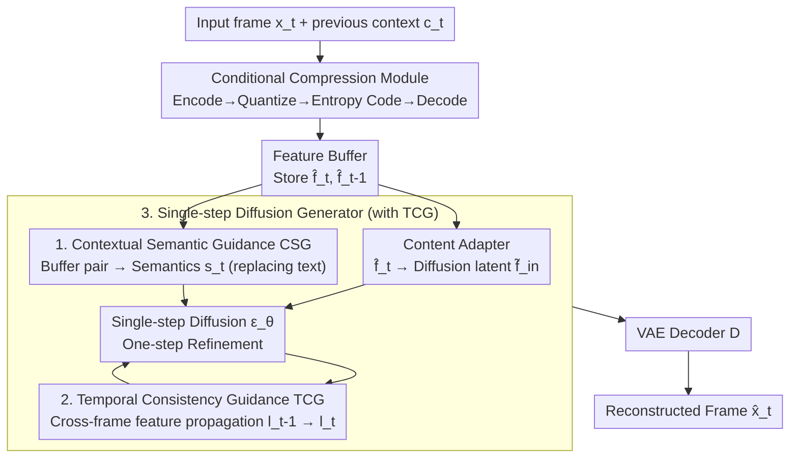

# Single-step Diffusion-based Video Coding with Semantic-Temporal Guidance

**Conference**: CVPR 2026  
**Paper**: [CVF Open Access](https://openaccess.thecvf.com/content/CVPR2026/html/Xue_Single-step_Diffusion-based_Video_Coding_with_Semantic-Temporal_Guidance_CVPR_2026_paper.html)  
**Code**: [Project Page](https://onedc-codec.github.io/s2vc/) (Code not yet confirmed)  
**Area**: Neural Video Compression / Diffusion Models / Low-Level Vision  
**Keywords**: Neural Video Coding, Single-step Diffusion, Perceptual Compression, Semantic Guidance, Temporal Consistency

## TL;DR
S2VC integrates a **single-step diffusion generator** into a conditional video coding framework. It replaces the text prompt with "Contextual Semantic Guidance (CSG)" extracted from the decoded feature buffer and utilizes "Temporal Consistency Guidance (TCG)" inserted into the U-Net for cross-frame alignment. It achieves SOTA perceptual quality at extremely low bitrates below 0.02 bpp, saving 51.62% bitrate on average (DISTS BD-Rate) compared to the previous generation of perceptual codecs.

## Background & Motivation

**Background**: Neural video codecs (NVC, represented by the DCVC series) have surpassed VVC in rate-distortion (RD) performance. However, most of them optimize for objective distortion such as MSE / MS-SSIM, which leads to visibly blurry and over-smoothed outputs at extremely low bitrates. To improve visual appearance, one line of work introduces perceptual loss + GANs (e.g., PLVC), while another directly uses pre-trained image diffusion models as frame reconstructors (e.g., I2VC, DiffVC).

**Limitations of Prior Work**: The GAN-based approach is limited by model capacity and training scale, still exhibiting visible artifacts at low bitrates. The diffusion-based approach provides high image quality but suffers from two bottleneck problems: (1) **Multi-step sampling is too expensive**, which is slow even for a single image and becomes prohibitively costly when scaled to frame-by-frame video; (2) Existing diffusion codecs are still confined to **relatively high bitrate** ranges where traditional/neural methods are already sufficient, failing to demonstrate the value of the diffusion prior.

**Key Challenge**: The diffusion prior can bring realistic details, but the high complexity of multi-step sampling inherently conflicts with the frame-by-frame nature of video coding. Furthermore, diffusion models rely on text prompt guidance, whereas **fixed prompts cannot adapt to the content, and generated captions cannot express fine-grained spatial semantics**—leaving no stable and detailed semantic conditions readily available in video coding scenarios.

**Goal**: To push diffusion video codecs toward both "lower bitrates" and "fewer sampling steps" simultaneously, while resolving two resulting sub-problems: (a) how to feed accurate, content-adaptive semantic conditions to the generator under single-step diffusion; and (b) how to ensure no flickering or jittering across frames during frame-by-frame causal generation.

**Key Insight**: Borrowing from the success of single-step image diffusion (one-step generators distilled via DMD), the authors believe that a **single step** elegantly resolves both the sampling cost and the ability to perform direct end-to-end optimization in the pixel domain. They also observe that the **decoded feature buffer** in the conditional coding framework inherently contains rich frame-by-frame representations, which can be leveraged as a semantic source, eliminating the need for extra caption or embedding networks.

**Core Idea**: Redesigning conditional video coding with a **single-step diffusion generator + dual-path semantic-temporal guidance**. CSG distills frame-adaptive semantics from the feature buffer to replace text, and TCG propagates cross-frame features inside the U-Net to preserve temporal consistency.

## Method

### Overall Architecture
The input of S2VC is a sequence of video frames, and the output is the reconstructed video with high perceptual quality at extremely low bitrates. The entire pipeline consists of two main parts: the first half is the **conditional compression module** (following the simplified design of DCVC-RT, which removes explicit optical flow compression to let the network implicitly learn inter-frame redundancy), responsible for encoding the current frame into a bitstream and decoding the features; the second half is the **single-step diffusion generator**, which treats the decoded features as conditions to reconstruct realistic details in a single step.

Specifically, for the current image $x_t$: the conditional encoder first extracts temporal context $c_t$ from the previous frame, and encodes the current frame into latent variables under contextual conditions $y_t = E_c(x_t, c_t)$. The quantized and spatial-temporal entropy-coded latent variables $\hat{y}_t$ (the part actually written into the bitstream) are obtained. On the decoder side, $\hat{f}_t = D_c(\hat{y}_t, c_t)$ reconstructs the features, which are stored in the **feature buffer**. Next, two adapters run in parallel: the **content adapter** maps $\hat{f}_t$ to the diffusion latent space to obtain $\tilde{f}_t^{in}$ (managing pixel-level details); the **semantic adapter (CSG)** extracts semantic guidance $s_t$ (replacing text embedding, managing high-level content) from the buffer pair $\{\hat{f}_t, \hat{f}_{t-1}\}$. Finally, the single-step diffusion generator refines the features in one step via $\{\tilde{f}_t^{out}, l_t\} = \epsilon_\theta(\tilde{f}_t^{in}, s_t, l_{t-1})$, where $l_t$ represents the intermediate features propagated across frames via the **TCG** blocks inside the U-Net. The reconstructed frame is then reconstructed by the pre-trained VAE decoder as $\hat{x}_t = D(\tilde{f}_t^{out})$. The diffusion model is fine-tuned using LoRA to achieve fast convergence while retaining the generative prior.

### Key Designs

**1. Single-step Diffusion Embedded in the Conditional Coding Framework: One-step sampling yields both low cost and pixel-domain optimization**

Prior dilemmas in the diffusion pipeline were "expensive multi-step sampling" and "insufficient GAN capacity". S2VC directly integrates a **single-step** diffusion generator (initialized from DMD2-distilled SD1.5 parameters) after a DCVC-RT style conditional compression module, serving as a frame reconstructor for low bitrates. Relying on a single step brings two benefits beyond "saving time": first, the sampling cost in frame-by-frame video is no longer amplified by the number of frames, making video-level applications feasible (which is barely possible with multi-step pipelines); second, **the single forward pass enables the entire pipeline to be directly optimized end-to-end in the pixel domain** (in multi-step sampling, backpropagating gradients through dozens of denoising steps to supervise final pixels is practically impossible). Thus, rate, distortion, semantics, and temporal consistency can be jointly optimized in a single loss. The generator core is frozen and fine-tuned only with LoRA layers, retaining the large-scale generative prior while adapting quickly to the compression task. This step is a prerequisite for moving "diffusion video coding" from "good quality but slow and high bitrate" to "fast and compressible to below 0.02 bpp."

**2. Contextual Semantic Guidance (CSG): Replacing Text Conditions with Frame-Adaptive Semantics Distilled from the Feature Buffer**

Pre-trained diffusion relies on text embeddings as conditions, but in compression scenarios, fixed prompts do not adapt to content, and generated captions lose fine-grained spatial semantics. A natural alternative is the approach of OneDC—using hyperprior features as semantics. However, in **conditional video coding**, hyperpriors primarily depict the distribution of inter-frame residuals rather than the actual image content, making them unsuitable as semantic guides, especially when video requires semantics to represent temporal dynamics while staying stable across frames. CSG's solution is: since the decoded **feature buffer** already contains frame-by-frame representations, a **Semantic Adapter** is fed with the buffer pair $\{\hat{f}_t, \hat{f}_{t-1}\}$ to perform spatial-temporal aggregation via strided convolutions, residual blocks, and attention layers, outputting semantic guidance $s_t$. This acts as the key/value in each cross-attention layer of the U-Net (with queries coming from the diffusion features):

$$f'_{out} = \mathrm{Softmax}\!\left(\frac{QK^\top}{\sqrt{d_k}}\right)V,\quad Q = W_Q f'_{in},\ K = W_K s,\ V = W_V s$$

It plays a complementary role to the content adapter: the semantic adapter outputs low-resolution, temporally aggregated high-level abstractions (utilizing both $\hat{f}_{t-1}$ and $\hat{f}_t$), while the content adapter only maps the current $\hat{f}_t$ to diffusion latent variables for pixel-level reconstruction. This decoupling ensures both stable semantics and detail fidelity. To make the extracted semantics both stable and expressive, CSG also introduces **semantic distillation**: using DINOv3, which has strong feature consistency across video, as the teacher, an auxiliary predictor $P_{aux}$ maps $s_t$ to the DINOv3 feature space to perform L1 alignment:

$$L_{sem} = \| E_{DINO}(x_t) - P_{aux}(s_t) \|_1$$

$P_{aux}$ and $E_{DINO}$ are only used during training, introducing zero inference overhead. Ablations indicate that the presence or absence of semantic guidance determines the majority of the generation quality, and adding distillation yields further improvements.

**3. Temporal Consistency Guidance (TCG) + Cascaded Training: Suppressing Flickering in Frame-by-Frame Causal Generation**

When using image diffusion for frame-by-frame causal coding, the biggest risk is that the synthesized details of the same object are unstable across successive frames, generating flicker or jitter. TCG is a set of **plug-and-play blocks** inserted into the U-Net encoder at different spatial scales. The TCG at the $i$-th scale retrieves the corresponding intermediate features $l_{t-1}^i$ of the previous frame from the **diffusion buffer**, concatenates and fuses them with the current frame features, and writes them back to the buffer for subsequent frames. This propagates synthesized textures across frames while blending new content into the current frame. Each TCG is initialized with **zero-convolution**, ensuring that the insertion does not destroy the original pre-trained generative prior (acting as an identity mapping at the beginning of training, and gradually learning temporal modeling capabilities). However, the propagation structure alone is insufficient—it must actually leverage temporal correlation. Therefore, the authors migrate the **cascaded training** from the DCVC series into the single-step diffusion framework: backpropagating the gradients of the current intermediate features to several preceding frames to form a temporal optimization chain (gradients of $\frac{1}{T}\sum_t L_D(x_t, \hat{x}_t)$ flow back over time), forcing the latent representations to coordinate across multiple frames. In ablations, FloLPIPS (a motion-aware metric) is the most sensitive to removing TCG, showing visible jitter and deformation at boundaries like the digit "8" when removed.

### Loss & Training
End-to-end perceptual RD loss (averaged frame-by-frame):

$$L = \frac{1}{T}\sum_{t=1}^{T}\big(\lambda R + L_D + \alpha L_{sem} + \beta L_{motion}\big)$$

where $R$ is the bitrate estimated by the spatial-temporal entropy model, and $\lambda$ controls the RD trade-off. The distortion term $L_D = \|x_t - \hat{x}_t\|_1 + L_{LPIPS}(x_t, \hat{x}_t)$ regulates both pixel-level and perceptual fidelity; $L_{sem}$ is the aforementioned DINOv3 semantic distillation; $L_{motion} = \|O(x_{t-1}, x_t) - O(\hat{x}_{t-1}, \hat{x}_t)\|_1$ uses pre-trained RAFT to calculate the consistency of optical flows between original and reconstructed frames, further reinforcing temporal stability. The optimizer used is AdamW, with learning rate and sequence length following a multi-stage scheduler. The diffusion backbone is fine-tuned with LoRA, and I-frames are compressed using the OneDC image codec.

## Key Experimental Results

### Main Results
Evaluation is conducted on HEVC-B / UVG / MCL-JCV (all at 1920×1080) under a low-latency configuration for the first 96 frames of each sequence (1 I-frame + subsequent P-frames). Metrics include frame-level LPIPS, DISTS, motion-aware FloLPIPS, and realism-oriented FID. Baselines include traditional software (HM/VTM/ECM), distortion-oriented neural codecs (DCVC-FM/DCVC-RT), perceptual-oriented PLVC, and the diffusion-based codec DiffVC.

| Comparison Dimension | Metric | S2VC Performance | Baselines |
|--------|------|------|----------|
| vs Previous Gen Perceptual Codec PLVC | Average DISTS BD-Rate Saving | **−51.62%** | PLVC (IJCAI 2022) |
| HEVC-B (Large Motion) | DISTS BD-Rate Saving | **−57.69%** | PLVC |
| UVG | DISTS BD-Rate Saving | **−32.69%** | PLVC |
| MCL-JCV (Large Motion) | DISTS BD-Rate Saving | **−64.49%** | PLVC |
| All Datasets | FID | **Best** | All Baselines |
| All Datasets | FloLPIPS | Best on HEVC-B / MCL-JCV | All Baselines |

Qualitatively (Fig. 7-8): VTM/ECM exhibit blocking and ringing artifacts, with blurry motion edges; DCVC-FM shows no blocking but is over-smoothed; PLVC is sharp but presents mottled/jittery artifacts; S2VC preserves details and maintains cross-frame stability across all three scenarios: complex motion, panning backgrounds, and minor motion.

### Ablation Study
Table 1 uses "Ours" as the anchor (BD-Rate 0.00%); larger values indicate worse performance relative to Ours (representing the additional percentage of bitrate required). The table below is evaluated on HEVC-B:

| Configuration | LPIPS | DISTS | FloLPIPS | FID | Description |
|------|-------|-------|----------|-----|------|
| w/o CSG | 27.46 | 22.08 | 25.65 | 28.05 | Without semantic guidance, all metrics deteriorate severely |
| w/ CSG only | 13.30 | 14.06 | 14.10 | 7.28 | Contextual semantics only, without distillation |
| w/ CSG + distill → Ours | 0.00 | 0.00 | 0.00 | 0.00 | With DINOv3 distillation added (Full Ours) |
| w/o TCG | 20.41 | 23.67 | 28.13 | 9.54 | Without temporal guidance, FloLPIPS drops the most |
| w/ TCG only | 11.74 | 11.25 | 14.66 | 6.32 | With TCG block, without cascaded training |
| w/ TCG + cascade → Ours | 0.00 | 0.00 | 0.00 | 0.00 | With cascaded training added (Full Ours) |

### Key Findings
- **Semantic guidance dictates the majority of visual quality**: Removing CSG incurs an extra 22.08% DISTS BD-Rate, making it the most detrimental degradation among single components. This indicates that "which semantic condition is fed" directly determines the generation quality in single-step diffusion. Distillation provides a further boost on top of this (14.06 -> 0).
- **TCG is crucial for temporal consistency**: Removing TCG degrades FloLPIPS (motion-aware) by 28.13%, which is the largest decline for this metric, and causes visible jitter and deformation at boundaries like the digit "8". Cascaded training further compresses the 14.66 of TCG-only to 0, proving that both the propagation structure and the cross-frame gradient chain are indispensable.
- **More pronounced advantages in large-motion scenarios**: Bitrate savings on large-motion datasets like HEVC-B and MCL-JCV (57.69% / 64.49%) are much higher than on UVG (32.69%), indicating that dual semantic-temporal guidance is highly valuable in challenging scenarios.

## Highlights & Insights
- **Treating the decoded feature buffer as a free semantic source**: Conditional coding inherently caches frame-by-frame reconstructed features. The authors directly leverage them to extract semantics instead of text prompts, avoiding the extra overhead of caption/embedding networks while obtaining fine-grained guidance that matches the content much better than hyperpriors. This insight of "the data is already in the pipeline, it's just never been utilized" is highly elegant.
- **Single-step is not just for speed, but also for enabling end-to-end optimization in the pixel domain**: Multi-step sampling prevents gradients from directly backpropagating to the final pixels. Single-step opens up this path, allowing joint optimization of rate, distortion, semantics, and temporal consistency within a single loss function—a point that is often overlooked.
- **Zero-conv plug-and-play + LoRA fine-tuning** preserves pre-trained generative priors: Initializing TCG with zero-convolution achieves "adding temporal capabilities without breaking the priors". This paradigm of freezing the backbone and only tuning LoRA serves as a reusable template for introducing large generative models to coding tasks.
- Utilizing DINOv3 as a teacher to distill semantics solely during training is a practical approach to "leverage the stability of strong visual representations without increasing inference overhead." This method is highly transferable to other generative tasks demanding stable semantic conditions.

## Limitations & Future Work
- The authors acknowledge that the current **operational bitrate range is narrow** (focusing on extremely low bitrates below 0.02 bpp). Future work will involve architectural improvements to cover a broader range of compression ratios.
- Perceived limitations: The system relies on multiple pre-trained heavy components (DMD2 SD1.5, DINOv3, RAFT, OneDC I-frame codec), making it computationally heavy and costly to reproduce. Furthermore, the paper uses BD-Rate relative to its own variants as ablation anchors and lacks absolute sampling time/complexity comparison figures for single-step vs. multi-step; quantitative evidence of "speed" is mostly discussed qualitatively rather than tabulated.
- Although the causal low-latency structure is well-suited for encoding, unlike video super-resolution, it cannot utilize bi-directional information. Whether error accumulation in cross-frame propagation drifts over long temporal sequences is not thoroughly explored in the paper.

## Related Work & Insights
- **vs OneDC**: Both enhance semantic guidance for single-step diffusion, but OneDC is used for **single-image** compression and relies on vector-quantized hyperpriors that preserve only coarse semantics. S2VC is designed for video, requiring temporally coherent semantics. Thus, it extracts fine-grained semantics from sequential buffered features, distills them with DINOv3, and works alongside TCG to regulate the diffusion process.
- **vs DCVC series (DCVC-FM/RT)**: The DCVC series targets objective distortion, resulting in blurry outputs at low bitrates. S2VC reuses its conditional coding and cascaded training framework but replaces the reconstructor with a single-step diffusion generator and shifts the optimization target to perception, significantly leading in visual quality at extremely low bitrates.
- **vs PLVC / DiffVC**: PLVC uses a recurrent autoencoder with a discriminator, which is constrained by capacity and suffers from artifacts at low bitrates; DiffVC utilizes multi-step diffusion, resulting in high visual quality but at a massive computational cost and relatively high bitrates. S2VC utilizes single-step diffusion to simultaneously curb the sampling cost and high bitrates, saving 51.62% BD-rate on average compared to PLVC.

## Rating
- Novelty: ⭐⭐⭐⭐ Combining "single-step diffusion + buffered feature semantics + cross-frame TCG" into video coding presents a clear incremental innovation. Leveraging the decoded buffer as a semantic source is a novel perspective.
- Experimental Thoroughness: ⭐⭐⭐⭐ Robust evaluations across three standard datasets, four perceptual metrics, and two-level ablations for both CSG and TCG; the omission of absolute sampling overhead comparison is slightly regrettable.
- Writing Quality: ⭐⭐⭐⭐ Highly clear motivation chain and diagrams (Fig. 1/3/5), with well-articulated methodologies.
- Value: ⭐⭐⭐⭐ Pushing diffusion video codecs to extreme low bitrates below 0.02 bpp with single-step feasibility holds practical significance for low-bitrate perceptual compression.

<!-- RELATED:START -->

## Related Papers

- [\[ACL 2026\] FastDiSS: Few-step Match Many-step Diffusion Language Model on Sequence-to-Sequence Generation](../../ACL2026/llm_nlp/fastdiss_few-step_match_many-step_diffusion_language_model_on_sequence-to-sequen.md)
- [\[AAAI 2026\] TEMPLE: Incentivizing Temporal Understanding of Video LLMs via Progressive Pre-SFT Alignment](../../AAAI2026/llm_nlp/temple_incentivizing_temporal_understanding_of_video_large_language_models_via_p.md)
- [\[ICML 2026\] Automated Formal Proofs of Combinatorial Identities via Wilf–Zeilberger Guidance and LLMs](../../ICML2026/llm_nlp/automated_formal_proofs_of_combinatorial_identities_via_wilf-zeilberger_guidance.md)
- [\[ICML 2026\] Differential Syntactic and Semantic Encoding in LLMs](../../ICML2026/llm_nlp/differential_syntactic_and_semantic_encoding_in_llms.md)
- [\[ICLR 2026\] Statistical Advantage of Softmax Attention: Insights from Single-Location Regression](../../ICLR2026/llm_nlp/statistical_advantage_of_softmax_attention_insights_from_single-location_regress.md)

<!-- RELATED:END -->
