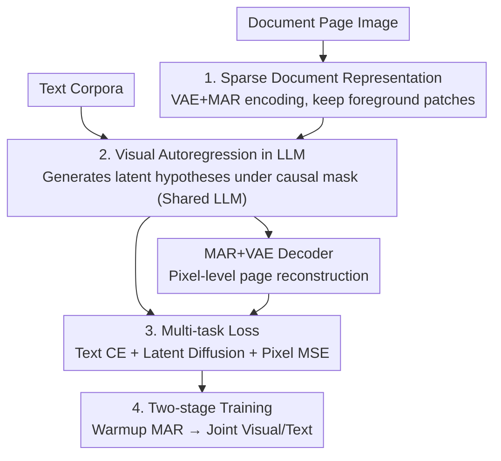

# Exploring Visual Pretraining for Learning Language Intelligence

**Conference**: CVPR 2026  
**Paper**: [CVF Open Access](https://openaccess.thecvf.com/content/CVPR2026/html/Zhao_Exploring_Visual_Pretraining_for_Learning_Language_Intelligence_CVPR_2026_paper.html)  
**Code**: TBD  
**Area**: Self-supervised representation learning / Multimodal pretraining  
**Keywords**: Visual pretraining, Masked Autoregression, LLM, Document images, Mathematical reasoning  

## TL;DR
This paper proposes MAPLE: instead of extracting text from PDFs to feed into LLMs, it directly performs masked autoregressive pretraining on **document page images**. By allowing the LLM to learn language intelligence through "generating latent hypotheses for occluded regions," it achieves an average improvement of up to 40.2% over pure text pretraining across four mathematical reasoning benchmarks.

## Background & Motivation
**Background**: The mainstream paradigm for unsupervised pretraining is "modal-specific"—language models train on text (text pretraining), while visual large models train on images (visual pretraining). To build an LLM strong in mathematics, researchers typically perform Continued Pretraining (CPT) using text corpora scraped from arXiv, textbooks, and math websites.

**Limitations of Prior Work**: To enable pure-text LLMs to digest high-quality PDFs, these pipelines must first run OCR/LaTeX extraction and then **discard the original page images**. This step is costly: (1) extraction inevitably involves information loss, losing clues like geometric figures, layout, 2D structures, and font/size; (2) annotation costs are high; (3) pages that cannot be cleanly parsed are unusable, creating a ceiling for text corpus scale.

**Key Challenge**: A vast amount of information in documents is inherently presented as "visual objects" for human readability—diagrams, layouts, and saliency cues are crucial, especially in scientific papers and textbooks. Compressing these into pure-text strings discards signals that humans actually rely on when reading papers.

**Key Insight**: The authors start from the **Platonic Representation Hypothesis**—as data scale, task diversity, and model capacity grow, representations and knowledge from different modalities (language vs. vision) eventually converge into the same underlying object. If this hypothesis holds, an LLM pretrained to "look at images" should achieve equivalent language intelligence to one pretrained to "read text," given the **same document corpora**.

**Goal**: To empirically verify for the first time whether "using visual pretraining to teach LLMs language intelligence" can match or even exceed text pretraining under equivalent corpora.

**Core Idea**: Use **Masked Autoregressive (MAR) modeling of document page images** to replace the OCR-extract-text-then-train pipeline. This allows the same LLM to generate latent hypotheses for unseen image patches under causal masking, sharing parameters with text pretraining to absorb "beyond-text" information from images into language capabilities.

## Method

### Overall Architecture
MAPLE adds an additional autoregressive visual stream of "document foreground patch latent variables" on top of a standard LLM. Specifically: document pages are first encoded into a latent grid by a VAE; blank backgrounds are discarded, leaving only foreground patches arranged in raster scan order to be fed into the LLM. Under a **causal mask for image positions only**, the LLM predicts "latent hypotheses" for subsequent patches, which are then reconstructed into pixels by a Masked Autoregressive (MAR) decoder to restore the full page. Meanwhile, the **same LLM** undergoes regular next-token pretraining on ordinary text. The two streams share LLM parameters but **do not require any image-text pairs**—the document pages provide pure visual supervision, while text corpora provide pure token sequences, implicitly bridging the two modalities through shared parameters.

The complete visual path can be expressed as a chain of operators:

$$\mathcal{I} \xrightarrow{\phi_{\text{VAE}}} \mathcal{Z} \xrightarrow{\phi_{\text{Enc}}} \mathcal{U} \xrightarrow{\Phi_{\text{LLM}}} \mathcal{H} \xrightarrow{\phi_{\text{Dec}}} \hat{\mathcal{I}}$$

Where $\phi_{\text{VAE}}$ is the VAE encoder, $\phi_{\text{Enc}}$ is the MAR encoder, $\Phi_{\text{LLM}}$ is the causal autoregressive LLM, and $\phi_{\text{Dec}}$ is the MAR+VAE decoder with a prediction head.

### Key Designs

**1. Sparse Document Representation: Retaining only information-bearing foreground patches with explicit 2D layout coordinates**

Addressing the issue of lost layout/structure in text extraction, MAPLE models directly on original pages but avoids feeding the entire latent grid (which would result in excessive sequence lengths). The process involves: bucketing pages to the nearest standard resolution, rasterizing them into RGB tensors $I \in \mathbb{R}^{H\times W\times 3}$, splitting them into $n\times m$ non-overlapping $256\times256$ crops, and passing them through a **frozen VAE encoder** to obtain a latent grid $Z\in\mathbb{R}^{n\times m\times C_v}$. A MAR encoder with a raster mask then consumes $Z$ and **uses a binary foreground mask to discard pure background regions (e.g., margins)**, leaving only patches containing text/graphics/formulas to form a sparse sequence $U=\{u_i\}_{i=1}^{L_{\text{img}}}$. This preserves page structure while shortening the context.

To account for the 2D nature of layouts, each patch is assigned both a global 1D index $t_i$ based on raster scanning (left-to-right, top-to-bottom) and its normalized 2D coordinates $(x_i/W,\,y_i/H)$. Position embeddings fuse both:

$$e^{\text{pos}}_i = \mathrm{PE}_{\text{1D}}(t_i) + \mathrm{PE}_{\text{2D}}\!\bigl(x_i/W,\,y_i/H\bigr)$$

Finally, a learnable linear mapping $W_{\text{in}}\in\mathbb{R}^{d\times d_v}$ projects each latent variable into the LLM latent space: $\tilde u_i = W_{\text{in}} u_i + e^{\text{pos}}_i \in \mathbb{R}^{d}$.

**2. Visual Autoregression within LLM: Generating "latent hypotheses" for unseen patches**

This is the core of how MAPLE treats vision as "language-style pretraining." The projected foreground sequence $\tilde U\in\mathbb{R}^{L_{\text{img}}\times d}$ is fed into the LLM, but a **causal attention mask is applied only at image positions**: each position can only see preceding visual tokens in the raster order. The LLM outputs hidden states $H=\{h_i\}$, which the authors interpret as "latent hypotheses" for future patches—meaning the LLM "speculates" what occluded regions look like based on observed areas, a visual analogy to next-token prediction.

A linear layer $W_{\text{out}}\in\mathbb{R}^{d_v\times d}$ projects these hypotheses back to the MAR decoder dimension: $\tilde h_i = W_{\text{out}} h_i$. The MAR decoder reconstructs the latent grid $\hat Z$, and the frozen VAE decoder restores pixels $\hat I$. Crucially, **reconstruction is conditioned on the latent hypotheses generated by the LLM**. Qualitative experiments (Fig. 7) support this: bypassing the LLM results in blurry, unreadable reconstructions, while passing latents through the LLM significantly sharpens characters and formulas. This indicates the language backbone provides strong priors for document structures.

**3. Multi-task Loss + Shared Backbone: Aligning modalities without paired data**

MAPLE jointy optimizes a multi-task objective:

$$\mathcal{L} = \lambda_{\text{text}}\,\underbrace{\mathcal{L}_{\text{CE}}(\mathcal{T})}_{\text{Text CPT}} + \lambda_{\text{diff}}\,\underbrace{\mathcal{L}_{\text{diff}}(\mathcal{U})}_{\text{Latent Diffusion}} + \lambda_{\text{pix}}\,\underbrace{\mathcal{L}_{\text{MSE}}(\mathcal{I},\hat{\mathcal{I}})}_{\text{Pixel Reconstruction}}$$

Where $\mathcal{L}_{\text{CE}}$ is the autoregressive cross-entropy on text tokens, $\mathcal{L}_{\text{diff}}$ is a diffusion/denoising-style loss on foreground latents $U$ (equivalent to masked AR regression), and $\mathcal{L}_{\text{MSE}}$ is the reconstruction loss. A batch mixes image and text samples with ratio $\rho=\frac{N}{N+M}$; experiments default to $\lambda_{\text{text}}:\lambda_{\text{diff}}:\lambda_{\text{pix}}=1:1:0.2$.

The key is that **LLM parameters are fully shared between the visual AR stream and text pretraining, yet no paired data is used**. Documents use pure visual supervision, and text uses pure token sequences. The two streams are separated by block-diagonal causal masks, implicitly bridging through the shared LLM. CKA analysis shows that while text and image streams are initially unaligned, MAPLE training induces a near-diagonal similarity band, where matched text/image layers show significantly higher similarity—a **spontaneous semantic coupling** induced solely by joint autoregression.

**4. Two-stage Training: Stabilizing visual latent alignment before joint training**

To avoid instability, the training is split into two stages. **Stage 1 Warmup**: LLM and VAE are frozen; only the MAR encoder-decoder stack is trained with $\mathcal{L}_{\text{warmup}}=\lambda_{\text{diff}}\mathcal{L}_{\text{diff}}(\mathcal{U})+\lambda_{\text{pix}}\mathcal{L}_{\text{MSE}}(\mathcal{I},\hat{\mathcal{I}})$ to align the MAR latent space with stable pixel reconstruction. **Stage 2 Joint Pretraining**: Switching to mixed batches, the MAR components, linear projections, and LLM parameters are trained together (VAE remains frozen). The image branch follows the raster causal mask + diffusion + pixel objectives, while the text branch follows standard CPT.

## Key Experimental Results

### Main Results
Evaluated on GSM8K, MATH-500, OlympiadBench, MMLU-Pro-Math, and AIME-24 using InternLM2-1.8B, Qwen2.5-1.5B, and LLaMA3.1-8B backbones, comparing Base, Text Pretraining (TP), and MAPLE. MAPLE used 128 A100 GPUs for ~100K steps (~40B equivalent text tokens).

| Backbone / Method | MATH-500 | Olympiad | GSM8K | MMLU-Pro-Math |
|------|------|------|------|------|
| InternLM2-1.8B Base | 6.33 | 1.81 | 31.24 | 9.84 |
| InternLM2-1.8B TP | 8.30 | 1.90 | 18.20 | 10.73 |
| **InternLM2-1.8B MAPLE** | **10.84** | **2.20** | **36.23** | **12.36** |
| Qwen2.5-1.5B Base | 30.32 | 11.90 | 61.88 | **13.03** |
| Qwen2.5-1.5B TP | 22.94 | 10.09 | 45.64 | 13.55 |
| **Qwen2.5-1.5B MAPLE** | **31.48** | **16.67** | **66.26** | 13.03 |
| LLaMA3.1-8B Base | 20.34 | 14.51 | 56.25 | 23.76 |
| LLaMA3.1-8B TP | 24.24 | 13.91 | 59.92 | 21.46 |
| **LLaMA3.1-8B MAPLE** | **34.82** | **15.73** | **66.03** | 23.76 |

In the Base setting, MAPLE **wins 10, ties 1, and takes a close 2nd in 1** out of 12 comparisons. Gains persist after SFT (0-shot). Notably, on LLaMA3.1-8B MATH-500, MAPLE reached 34.82 vs Base 20.34 and TP 24.24, whereas TP often performed worse than Base—suggesting text extraction can be detrimental.

### Ablation Study

| Config | Key Metric | Description |
|------|---------|------|
| Stage 1 = 25K steps | MATH-500 14.60 / PSNR 10.37 | Insufficient warmup, poor reconstruction & reasoning |
| Stage 1 = 100K steps | MATH-500 31.48 / PSNR 22.60 | Default; visual fidelity correlates with math reasoning |
| Mask ratio 0.7 (InternLM2) | MATH-500 10.84 / Olympiad 2.20 | Default; strong masking provides better regularization |
| Mask ratio 0.3 (InternLM2) | MATH-500 7.20 / Olympiad 1.47 | Weak masking leads to performance drop |
| w/o LLM (Direct MAR Dec) | Blurry reconstruction (Qualitative) | Proves LLM provides strong doc structure priors |

### Key Findings
- **Visual loss as a scaling predictor**: The image-side loss $L_{\text{img}}$ shows a strong monotonic correlation with MATH-500 scores ($|r|\approx0.9$), suggesting scaling laws for text pretraining may apply to visual pretraining.
- **Optimal TXT:IMG ratio of 1:2**: Across tested ratios, 1:2 represented the Pareto balance; increasing image proportions further (1:4, 1:8) eventually eroded language priors.
- **Blank control experiment isolates gain sources**: Training on lossless LaTeX-to-PDF renders compared to text-to-text (MAPLE-blank vs TP-blank) showed identical curves, proving the advantage comes specifically from the extra info in real-world PDFs that text pipelines discard.
- **Mask ratio trade-off**: 0.7 is more stable for difficult tasks (Olympiad), while 0.3 occasionally helps on simpler tasks.

## Highlights & Insights
- **Redefining visual pretraining as a way to learn language intelligence**: Unlike MLLMs that treat vision as auxiliary input for VL tasks, MAPLE shows that label-free document mask modeling directly improves **pure-text mathematical reasoning**.
- **The "blurriness without LLM" evidence**: This transforms the abstract question of "whether LLMs learn document knowledge" into visible differences in image clarity.
- **Spontaneous alignment (CKA diagonal)**: The emergence of modal alignment without explicit alignment losses or cross-attention is a beautiful empirical validation of the Platonic Representation Hypothesis.

## Limitations & Future Work
- **Domain limitation**: Evaluated only on mathematical reasoning; generalization to general knowledge, coding, or multi-language intelligence remains unverified.
- **Computational Cost**: High resource requirements for VAE+MAR stacks and joint training compared to pure text CPT.
- **Backbone dependency**: Optimal hyperparameters (mask ratio, mix ratio) vary between backbones, requiring per-model tuning.
- **Future directions**: Extending to multi-page structure modeling and verifying scaling on larger backbones (>8B).

## Related Work & Insights
- **Vs. Math Continued Pretraining (CPT)**: Traditional pipelines discard page images; MAPLE treats them as first-class signals and outperforms text CPT on math benchmarks.
- **Vs. Optical Language Modeling / MLLM**: While MLLMs use vision for VL/OCR tasks, MAPLE uses label-free masked modeling to enhance document-level language intelligence.
- **Vs. Harmon**: MAPLE draws from Harmon's use of MAR encoders and wrappers but pivots the goal toward "learning language intelligence" rather than general image understanding/generation.

## Rating
- Novelty: ⭐⭐⭐⭐⭐ First to prove OCR-free visual pretraining can directly boost LLM text-based intelligence.
- Experimental Thoroughness: ⭐⭐⭐⭐ Extensive multi-angle analysis, though limited to the math domain.
- Writing Quality: ⭐⭐⭐⭐⭐ Clear logical chain; qualitative reconstruction and CKA plots are very persuasive.
- Value: ⭐⭐⭐⭐ Opens a new direction for scaling LLMs along the multimodal axis.

<!-- RELATED:START -->

## Related Papers

- [\[ICLR 2026\] Pretraining Scaling Laws for Generative Evaluations of Language Models](../../ICLR2026/llm_pretraining/pretraining_scaling_laws_for_generative_evaluations_of_language_models.md)
- [\[ACL 2026\] Fine-tuning vs. In-context Learning in Large Language Models: A Formal Language Learning Perspective](../../ACL2026/llm_pretraining/fine-tuning_vs_in-context_learning_in_large_language_models_a_formal_language_le.md)
- [\[NeurIPS 2025\] Differentiable Hierarchical Visual Tokenization](../../NeurIPS2025/llm_pretraining/differentiable_hierarchical_visual_tokenization.md)
- [\[CVPR 2025\] ScaMo: Exploring the Scaling Law in Autoregressive Motion Generation Model](../../CVPR2025/llm_pretraining/scamo_exploring_the_scaling_law_in_autoregressive_motion_generation_model.md)
- [\[ICLR 2026\] Distilled Pretraining: A modern lens of Data, In-Context Learning and Test-Time Scaling](../../ICLR2026/llm_pretraining/distilled_pretraining_a_modern_lens_of_data_in-context_learning_and_test-time_sc.md)

<!-- RELATED:END -->
