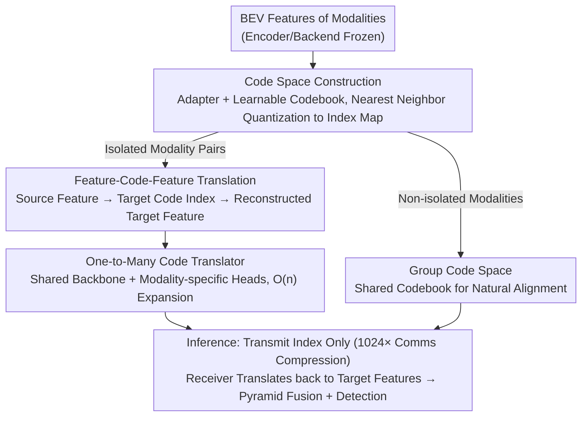

# Linking Modality Isolation in Heterogeneous Collaborative Perception

**Conference**: CVPR2026  
**arXiv**: [2603.00609](https://arxiv.org/abs/2603.00609)  
**Code**: [cxliu0314/CodeAlign](https://github.com/cxliu0314/CodeAlign)  
**Area**: LLM Pre-training  
**Keywords**: Collaborative Perception, Heterogeneous Alignment, Modality Isolation, Codebook, Cross-modality Translation

## TL;DR

The CodeAlign framework is proposed to address the "modality isolation" problem in heterogeneous collaborative perception, where different modalities never co-occur in training data. By constructing discrete code spaces via codebooks and performing cross-modal Feature-Code-Feature (FCF) translation, it achieves SOTA perception performance with only 8% of HEAL's training parameters and a $1024\times$ reduction in communication volume.

## Background & Motivation

1.  **Value of Collaborative Perception**: Multi-agent systems (e.g., connected autonomous vehicles) can construct a more comprehensive environmental understanding through shared perception information, compensating for single-vehicle blind spots and occlusions.
2.  **Heterogeneity Issues**: In practice, vehicles from different manufacturers are equipped with diverse sensor types (LiDAR/Camera), different specifications (64-beam/32-beam), and varied perception models. Feature-level fusion faces significant domain gaps.
3.  **Prevalence of Modality Isolation**: Data collected by different institutions at different locations and times results in many modality pairs never co-occurring in the same scene—for instance, Institution A may only have LiDAR data while Institution B only has Camera data, with zero spatial overlap in their observations.
4.  **Limitations of Prior Work**: HEAL requires expensive encoder retraining; STAMP/GT-Space rely on spatial correspondence supervision from co-occurring data or shared fields of view; HMViT and Pyramid Fusion require joint training, leading to severe performance degradation under modality isolation (AP70 drops by 15.21%).
5.  **Efficiency Bottleneck**: Intermediate fusion methods transmit dense feature maps, incurring massive communication overhead (~32MB per transmission), which constrains real-world deployment.
6.  **Privacy Constraints**: Data from different institutions are subject to privacy regulations, preventing direct raw data sharing and further complicating cross-modality alignment.

## Method

### Overall Architecture

CodeAlign addresses "modality isolation"—where modalities like LiDAR and Camera from different institutions never co-occur in training data—making feature-level alignment impossible. The key insight is to bypass spatial correspondence by establishing a discrete "code space" for each modality. Features representing the same object are mapped to the same codebook, transforming the alignment problem into a "translation" problem. The framework consists of two training stages and one inference pipeline: Stage 1 constructs codebooks and adapters (code space construction) for each modality, where non-isolated modalities (with existing co-occurrence data) share a single codebook (Group Code Space) for natural alignment; Stage 2 trains cross-modality Feature-Code-Feature (FCF) translators specifically for isolated pairs. A "one-to-many code translator" with a shared backbone and modality-specific heads reduces the cost of adding new modalities to linear complexity. During inference, agents transmit only codebook indices, which are translated back to target modality features at the receiver before pyramid fusion detection.

### Key Designs

**1. Code Space Construction: Discretizing Dense Features via Codebooks to Compress Communication**

To align different modalities while saving bandwidth, CodeAlign inserts a lightweight adapter (4-layer ResNet block, $3\times3$ convolution) and a learnable codebook (size $D=16$) between the encoder and backend of each modality. During training, the encoder and backend are frozen, and only the adapter and codebook are updated. Each spatial position of the BEV feature map is mapped to a codebook index via nearest neighbor quantization:

$$I_{[h,w]} = \arg\min_\ell \big\| (\mathcal{P}(F))_{[h,w]} - C[\ell] \big\|_2^2$$

During communication, only the index map ($H \times W \times \log_2 D$) is transmitted instead of the raw features ($H \times W \times C$), achieving approximately $1024\times$ compression. For modalities with co-occurrence data, they share a single codebook (Group Code Space), ensuring that features representing the same object across different modalities are naturally mapped to the same embedding, achieving alignment while eliminating the need for specific translators.

**2. Feature-Code-Feature Translation: Bridging Modality Isolation via Target Codebooks**

Since isolated modalities lack co-occurrence supervision, CodeAlign uses the target modality's codebook as an intermediary bridge. The cross-modality translator $T_{m_i \to m_j}$ translates source dense features into index maps within the target codebook (Feature→Code), and the target modality's reconstructor $R_{m_j}$ decodes these indices back into dense features (Code→Feature). The output naturally resides in the target modality's feature space. Dense-to-code translation is chosen over dense-to-dense or code-to-code as it provides the optimal balance between reconstruction accuracy and communication efficiency—preserving dense detail while reusing discrete codebook compression.

**3. One-to-Many Code Translator: Linearizing the Cost of New Modality Integration**

Training a unique translator for every modality pair results in quadratic parameter growth. CodeAlign utilizes a shared backbone (stacked ConvNeXt blocks) with modality-specific output heads, making parameter growth linear relative to the number of modalities (approx. $0.5\text{M} \cdot n$). This reduces the integration cost from $O(n^2)$ to $O(n)$. A data balancing strategy, which dynamically adjusts training ratios based on the loss variation of each target, prevents underfitting in specific translation directions.

### Loss & Training

Training utilizes only local data of the source modality (Source Encoder → Translator → Target Backend Detection Loss). No raw data needs to be transmitted between institutions, satisfying privacy constraints. The total loss is defined as:

$$L = L_{\text{det}}(\hat{\mathcal{O}}_i, \mathcal{O}_i^0) + L_{\text{pyramid}} + \lambda \sum_{k,j \in \mathcal{G}_s, m_k \neq m_j} L_{\text{sim}}(F_{k \to i}, F_{j \to i})$$

where $L_{\text{det}}$ is the detection loss, $L_{\text{pyramid}}$ is the pyramid fusion loss from HEAL, and $L_{\text{sim}}$ is the Smooth L1 feature similarity loss ($\lambda=0.1$) used to align features translated from different sources to the same target, strengthening cross-modal alignment.

## Key Experimental Results

### OPV2V Dataset (Simulation, Multi-vehicle V2V)

| Method | m1+m7+m2 AP30 | m1+m7+m2 AP50 | m1+m7+m2 AP70 | Training Params (M) | Comms Volume |
|------|:---:|:---:|:---:|:---:|:---:|
| No Collaboration | 81.18 | 79.44 | 68.26 | 0 | 0 |
| Late Fusion | 88.24 | 85.02 | 68.45 | 0 | 0.5KB |
| Pyramid Fusion | 83.95 | 82.93 | 68.91 | 21.4 | 32MB |
| HEAL | 87.80 | 86.98 | 79.89 | 16.0 | 32MB |
| **CodeAlign** | **89.77** | **88.59** | **77.73** | **1.3** | **0.03MB** |

- CodeAlign outperforms HEAL by 1.97 and 1.61 percentage points in AP30 and AP50 respectively in three-modality scenarios.
- Training parameters are only 8% of HEAL's (1.3M vs 16.0M).
- Communication volume is reduced by $1024\times$ (0.03MB vs 32MB).

### DAIR-V2X Dataset (Real-world)

| Method | m1+m2 AP30 | m1+m2 AP50 | m1+m2 AP70 |
|------|:---:|:---:|:---:|
| HEAL | 73.70 | 67.21 | 44.76 |
| **CodeAlign** | **82.03** | **77.37** | **57.84** |

- CodeAlign outperforms HEAL by 13.08 percentage points in AP70 on real-world datasets, demonstrating superior generalization.

### Ablation Study

- **Impact of Modality Isolation**: Pyramid Fusion's AP70 plummeted from 80.88% to 65.67% (-15.21%) under modality isolation.
- **Group Code Space vs. FCF Translation**: For non-isolated modalities, Group Code Space construction is 6.71% higher in AP70 than FCF translation.
- **Translator Architecture**: The multi-head translator loses only 0.10% AP50 compared to one-to-one mapping while reducing parameters from $O(n^2)$ to $O(n)$.
- **Codebook + Frozen Encoder + Adapter + Similarity Loss**: Sequential introduction of these components recovered AP70 from 77.87% to 79.63%.
- **Pose Robustness**: CodeAlign consistently outperforms HEAL under pose perturbations, whereas Late Fusion degrades rapidly below the non-collaborative baseline.

## Highlights

- **First Alignment Framework for Non-co-occurrence**: Replaces spatial correspondence with representation consistency, fundamentally solving the modality isolation problem.
- **Extreme Efficiency**: 8% training parameters + 1024× communication compression, making it friendly for large-scale deployment.
- **Privacy Protection**: Local data training protocol avoids cross-institution raw data transmission.
- **High Scalability**: One-to-many translators reduce the cost of adding new modalities from $O(n^2)$ to $O(n)$.
- **Plug-and-play Design**: Freezes original encoders and backends, training only lightweight insertion modules.

## Limitations & Future Work

- Information loss from codebook quantization causes lower AP70 in some scenarios compared to HEAL (e.g., 85.56 vs 86.18 in m1+m2).
- Fixed codebook size ($D=16$) may be insufficient to represent highly complex scenes.
- Evaluation is limited by the modality diversity of existing datasets and has not been verified in extremely large-scale multi-modal (>7 types) scenarios.
- Online update and adaptive mechanisms for codebooks in dynamic scenes have not been explored.
- BEV spatial range is set to ±102.4m; applicability to ultra-long-range scenarios is unverified.

## Related Work & Insights

| Method | Supports Modality Isolation | Training Mode | Comms Efficiency | Mechanism |
|------|:---:|------|------|------|
| HMViT | ✗ | Joint End-to-end | Low (32MB) | Cross-modal Attention |
| CodeFilling | ✗ | Shared Codebook E2E | High (0.03MB) | Single Shared Codebook |
| STAMP | ✗ | Contrastive Learning | Low (32MB) | Protocol Net Reference |
| GT-Space | ✗ | GT Feature Alignment | Low | Ground Truth Anchors |
| HEAL | △ (Requires Retraining) | Backward Alignment | Low (32MB) | Encoder Retraining |
| **CodeAlign** | **✓** | **Local Data Training** | **High (0.03MB)** | **FCF Translation + Codebook** |

## Rating

- Novelty: ⭐⭐⭐⭐⭐ — First to define and systematically solve modality isolation; FCF translation concept is highly innovative.
- Experimental Thoroughness: ⭐⭐⭐⭐ — Simulation + real datasets with comprehensive ablations; however, modality variety is limited.
- Writing Quality: ⭐⭐⭐⭐ — Problems are clearly defined and methods are systematically explained; minor redundant definitions of symbols.
- Value: ⭐⭐⭐⭐⭐ — Addresses critical deployment pain points (privacy, efficiency, scalability) with significant engineering value.

<!-- RELATED:START -->

## Related Papers

- [\[ICML 2026\] XTransfer: Modality-Agnostic Few-Shot Model Transfer for Human Sensing at the Edge](../../ICML2026/llm_pretraining/xtransfer_modality-agnostic_few-shot_model_transfer_for_human_sensing_at_the_edg.md)
- [\[NeurIPS 2025\] Heterogeneous Adversarial Play in Interactive Environments](../../NeurIPS2025/llm_pretraining/heterogeneous_adversarial_play_in_interactive_environments.md)
- [\[CVPR 2025\] A Unified Framework for Heterogeneous Semi-supervised Learning](../../CVPR2025/llm_pretraining/a_unified_framework_for_heterogeneous_semi-supervised_learning.md)
- [\[ICLR 2026\] CHAMMI-75: Pre-training multi-channel models with heterogeneous microscopy images](../../ICLR2026/llm_pretraining/chammi-75_pre-training_multi-channel_models_with_heterogeneous_microscopy_images.md)
- [\[ACL 2025\] An Effective Incorporating Heterogeneous Knowledge Curriculum Learning for Sequence Labeling](../../ACL2025/llm_pretraining/dual_stage_curriculum_learning_sequence_labeling.md)

<!-- RELATED:END -->
