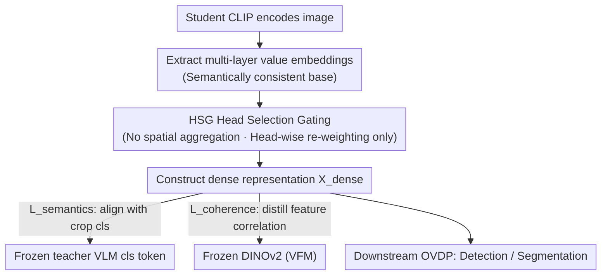

# Reconstructing CLIP for Open-Vocabulary Dense Perception

**Conference**: CVPR 2026  
**Paper**: [CVF Open Access](https://openaccess.thecvf.com/content/CVPR2026/html/Liu_Reconstructing_CLIP_for_Open-Vocabulary_Dense_Perception_CVPR_2026_paper.html)  
**Code**: To be confirmed  
**Area**: Multimodal VLM (Open-Vocabulary Dense Perception / CLIP Self-Distillation)  
**Keywords**: Open-Vocabulary Dense Perception, CLIP, Self-Distillation, value embedding, Head Selection Gating

## TL;DR
DenseRC addresses the neglected problem of "how to construct high-quality dense features for CLIP." It reveals that the generalized semantics of the cls token actually derive from multi-layer value embeddings, whereas spatial aggregation tends to amplify semantic misalignment. By using multi-layer values as a foundation and employing a lightweight Head Selection Gating (HSG) for re-weighting solely across the head dimension, the authors construct dense representations aligned with global semantics. DenseRC sets new SOTAs on multiple open-vocabulary detection and segmentation benchmarks.

## Background & Motivation

**Background**: Large-scale vision-language models (VLMs) like CLIP excel at zero-shot image classification. Researchers aim to adapt them for Open-Vocabulary Dense Perception (OVDP, including OVD and OVS) to enable models to recognize arbitrary unseen categories at the region/pixel level during training.

**Limitations of Prior Work**: CLIP is optimized for "global image-text alignment," resulting in weak cross-modal alignment and poor consistency in dense features. Existing approaches have drawbacks: ① Re-training CLIP with fine-grained region-text supervision (e.g., FineCLIP creating 40M region-caption pairs), which is difficult to scale due to the high cost of dense annotation; ② Self-distillation: using frozen CLIP global representations (cls token) as a bridge to supervise a trainable dense encoder without extra annotations. Self-distillation is more scalable, but current implementations remain suboptimal.

**Key Challenge**: Self-distillation requires aligning student dense features with the frozen cls tokens of corresponding image crops; thus, **how to construct dense features** is the critical factor, yet this step has not been rigorously studied. CLIPSelf directly uses the spatial output of the last CLIP layer, where residual connections inevitably inject noise. DeCLIP uses self-self attention aggregation to enhance patch semantics, but aggregation incorporates irrelevant patches (e.g., sky regions), creating a semantic gap with the crop teacher. Furthermore, the issue of feature consistency (high intra-class variance and low inter-class separability, especially in "stuff" regions) remains unresolved.

**Goal**: To decompose the problem into two sub-questions: (1) **What features to extract** as the dense foundation; (2) **How to construct them** to be both discriminative and aligned.

**Key Insight**: This work investigates what the cls token actually encodes. By expanding the self-attention update $c^{(l)} = c^{(l-1)} + \text{Proj}(\text{Attn}^{(l)} \cdot v^{(l)})$ across all layers, it is found that the final cls token essentially aggregates multi-layer value embeddings. This provides a principled answer to "what to extract." The "how to construct" part is then theoretically analyzed by decomposing self-attention along spatial and head dimensions.

**Core Idea**: Use multi-layer value embeddings as a semantically consistent foundation for dense features. Abandon spatial aggregation, which introduces interference from irrelevant patches, and instead use Head Selection Gating (HSG) for adaptive re-weighting only in the head dimension. Additionally, apply a consistency constraint by distilling feature correlations from DINOv2 to construct a dense representation "compatible with cls."

## Method

### Overall Architecture
DenseRC (Dense Representations Construction) is a self-distillation framework. After the student VLM encodes an image, instead of using the last layer's spatial output, it extracts multi-layer value embeddings as the foundation for dense features. These values are adaptively re-weighted in the head dimension via HSG (without any spatial aggregation) to construct the dense representation $X_{dense}$. During training, one branch performs semantic alignment (self-distillation) using frozen teacher VLM cls tokens from image crops, while another branch distills patch-to-patch feature correlations from a frozen DINOv2 for consistency constraints. Finally, DenseRC can directly replace CLIP in downstream pipelines for open-vocabulary detection/segmentation without hyperparameter tuning.

### Key Designs

**1. Deconstructing cls token semantics: Multi-layer values as a consistent base**

Addressing the noise injected by residual connections in CLIPSelf, this work first answers "what to extract." In CLIP's ViT, the cls token is updated via self-attention and MLP in each layer. Since MLPs are mainly intra-token transformations, the source of visual information is captured by rewriting the attention path as $c^{(l)} \leftarrow c^{(l-1)} + A^{(l)}v^{(l)}$ (where $A^{(l)}$ absorbs attention weights and projection parameters). Expanding across all $L$ layers (omitting the data-independent initialization $c^{(0)}$) yields:

$$c^{(L)} \leftarrow \sum_{l=1}^{L} A^{(l)} v^{(l)}$$

This demonstrates that the final cls token fundamentally aggregates **multi-layer value embeddings**. Consequently, the student's dense representation is designed with the same aggregation form: $X_{dense} = \sum_{l=1}^{L} A_p^{(l)} \cdot v_p^{(l)}$, where $v_p^{(l)}$ represents value features and $A_p^{(l)}$ is the construction module. Compared to using last-layer spatial features (with residual noise) or a single last-layer value, multi-layer values provide the most consistent foundation with global semantics (confirmed by Ablation Table 5).

**2. HSG Head Selection Gating: Theoretical proof that spatial aggregation amplifies alignment error**

This addresses "how to construct," specifically the semantic gap caused by spatial aggregation in DeCLIP. Analyzing the construction module $A_p$ across spatial and head dimensions: let the teacher's target representation for region $r$ be $c_r = \sum_l M^{(l)} v_r^{(l)} + \varepsilon_r$. Comparing two strategies—"Spatial-Head Fusion (S)" which aggregates across spatial positions $\tilde{v}_r^{(S)} = \sum_j S_{rj} P v_j$, and "Head-only Modeling (H)" which transforms each patch independently $\tilde{v}_r^{(H)} = W v_r$. Deriving expected loss using MSE shows that spatial aggregation adds a strictly positive interference term compared to head-only modeling:

$$\Delta L = \sum_{j \in U_r} S_{rj}^2\, \mathbb{E}\|P v_j\|^2 > 0 \quad (\exists j \in U_r,\, S_{rj} \neq 0)$$

As long as spatial aggregation assigns non-zero weights to off-target tokens irrelevant to the region, $L^{(H)} < L^{(S)}$ is guaranteed, and alignment error is amplified. Empirically (Fig.3), spatial aggregation also causes a few dominant patches to consume most gradients (peak magnitude ~10, mean only 0.26), whereas many patches receive almost no supervision. Removing spatial aggregation results in a more uniform gradient distribution (mean 0.7), stabilizing dense supervision. Thus, HSG abandons spatial aggregation and performs gating only in the head dimension: $v = W_v(\text{LN}(x)) \in \mathbb{R}^{H \times N \times (D/H)}$, $A_p = \sigma(W_H(\text{LN}(x))) \in \mathbb{R}^{N \times H}$, where $\sigma$ is the sigmoid function, generating gating weights per head. $W_H$ is a single-layer linear projection shared across all Transformer layers, adding minimal parameters. This is justified by the observation that heads are highly heterogeneous in their "cross-modal semantic contribution to cls" and "locality preference," making uniform aggregation suboptimal.

**3. Feature Coherence Distillation: Distilling patch correlation from DINOv2**

Semantic alignment alone is insufficient; feature consistency (intra-class compactness and inter-class separability) must also be addressed. DenseRC distills patch-wise feature correlations directly onto the dense features from a frozen DINOv2 foundation model. The key difference from DeCLIP is that DeCLIP applies consistency loss (on a decoupled attention stream) and dense alignment loss (on the value stream) separately. DenseRC applies both constraints to the **same** dense feature stream $X_{dense}$, forcing it to achieve both cross-modal alignment and feature consistency simultaneously. The total objective is:

$$L_{total} = L_{semantics} + \lambda\, L_{coherence}$$

$L_{semantics}$ uses cosine similarity to align RoIAligned region features with the teacher's crop cls tokens, and $L_{coherence}$ uses MSE to distill feature correlations from DINOv2, with $\lambda$ as a balance coefficient (optimized at 0.025).

### Loss & Training
Self-distillation is performed on COCO train2017 using 4×A100 GPUs with a batch size of 4 per card. Training lasts 6 epochs using AdamW with a learning rate of $1\times10^{-5}$ and weight decay of 0.1. During training, each image is randomly divided into an $m \times n$ grid ($m,n \in \{1,\dots,6\}$) for local alignment distillation, with inputs resized to 1024×1024. $v_p$ uses the last three layers of value embeddings. $\lambda = 0.025$.

## Key Experimental Results

**Metric Descriptions**: **AP$^{Novel}_{50}$**=mAP for OV-COCO novel classes at IoU=0.5; **mAP$_r$**=mAP for OV-LVIS rare classes (average IoU 0.5–0.95); **mIoU**=Mean Intersection over Union; **mAcc**=Average of Top-1/Top-5 accuracy for zero-shot region classification. All downstream settings involve direct replacement of CLIP with DenseRC without hyperparameter changes.

### Main Results: Open-Vocabulary Detection / Segmentation

| Task/Benchmark | Metric | CLIPSelf | DeCLIP (Prev. SOTA) | **DenseRC (Ours)** |
|-----------|------|----------|------|------|
| OV-COCO (ViT-B/16) | AP$^{Novel}_{50}$ | 37.6 | 41.1 | **45.6** (+4.5) |
| OV-COCO (ViT-L/14) | AP$^{Novel}_{50}$ | 44.3 | 46.2 | **54.8** |
| OV-LVIS (ViT-B/16) | mAP$_r$ | 25.3 | 26.8 | **29.0** (+2.2) |
| OV-LVIS (ViT-L/14) | mAP$_r$ | 34.9 | 37.2 | **39.6** |
| OVSS A-150 (ViT-B/16) | mIoU | 29.0 | 36.3 | **37.6** |
| OVSS PC-59 (ViT-B/16) | mIoU | 58.0 | 60.6 | **61.3** |
| OVSS A-150 (ViT-L/14) | mIoU | 34.5 | 40.7 | **41.5** |

In zero-shot region classification (ViT-B/16, no RPN), DenseRC achieves 76.7 for Boxes Top1, 78.1 for Thing Masks, and 55.8 for Stuff Masks, outperforming R-SC-CLIPSelf (76.0 / 76.2 / 53.5) and CLIPSelf. In cross-dataset transfer (trained on LVIS → tested on COCO/Objects365), DenseRC consistently leads (COCO AP 43.4 vs DeCLIP 41.0).

### Ablation Study: $v_p$ Base and $A_p$ Construction Module (mAP@OV-COCO / mIoU@Seg)

| Variant | A-847 | PC-459 | A-150 | OV-COCO |
|------|-------|--------|-------|---------|
| $v_p$=x+v (Last-layer spatial, CLIPSelf style) | 15.2 | 21.7 | 36.6 | 41.3 |
| $v_p$=v (Last-layer single value, DeCLIP style) | 15.4 | 22.1 | 36.7 | 41.9 |
| $v_p$=multi-v (Multi-layer values, Ours) | 15.7 | 22.3 | 37.2 | 44.4 |
| $A_p$=no attention | 15.7 | 22.3 | 37.2 | 44.4 |
| $A_p$=self attention (Q-K, vanilla CLIP) | 14.7 | 21.3 | 36.0 | 39.1 |
| $A_p$=self-self attention (Q-Q, DeCLIP) | 15.4 | 21.9 | 36.7 | 42.3 |
| $A_p$=HSG (Ours) | **15.9** | **22.7** | **37.6** | **45.6** |

### Key Findings
- **Spatial aggregation is harmful**: Adding any spatial aggregation to $A_p$ (self-attention 39.1, self-self 42.3) performs worse than the no-attention baseline (44.4), empirically validating the theoretical $\Delta L > 0$. HSG (45.6) is the only design providing positive gains.
- **Multi-layer values are the primary driver**: Moving from x+v (41.3) to multi-v (44.4) yields +3.1 on OV-COCO, verifying that "what to extract" is more critical than "how to aggregate."
- **Layer and weight selection**: Using the last three layers for $v_p$ is optimal (earlier layers have low SNR). $\lambda=0.025$ is stable across segmentation tasks. HSG weights are consistent across 2,000 samples, indicating they capture inherent head roles rather than image-specific patterns.

## Highlights & Insights
- **The "abductive reasoning" approach is robust**: By expanding cls updates to reveal it as an "aggregation of multi-layer values," the authors provide a principled answer for dense feature selection rather than arbitrary trial and error.
- **Theoretical rejection of spatial aggregation**: The term $\Delta L = \sum_{j\in U_r} S_{rj}^2 \mathbb{E}\|Pv_j\|^2 > 0$ clearly shows that spatial aggregation inevitably introduces off-target interference, a conclusion applicable to any region-level alignment task.
- **HSG is nearly zero-cost**: Utilizing single-layer linear projections with cross-layer sharing to exploit "head functional heterogeneity" results in a lightweight, plug-and-play module.
- **Unified single-stream constraint**: This is more elegant than DeCLIP's dual-stream setup. Applying both alignment and consistency to the same feature stream prevents the two objectives from competing.

## Limitations & Future Work
- Consistency relies on an external DINOv2, introducing a second foundation model. The propagation of DINOv2's specific biases or failure modes into dense features was not explored. ⚠️ Robustness when using other VFMs lacks independent experimentation.
- Theoretical analysis is simplified for single-layer values and assumes a small residual $\varepsilon_r$; the multi-layer extension is discussed only briefly.
- HSG modeling is head-only and discards spatial info entirely; whether this remains optimal for extremely dense tasks requiring local spatial aggregation is not fully edge-tested.
- Distillation is performed only on COCO. Gaps in gain for larger-scale or diverse-domain pre-training data remain unverified.

## Related Work & Insights
- **vs CLIPSelf**: CLIPSelf uses last-layer spatial outputs as dense features, which are noisy due to residuals; DenseRC uses multi-layer value embeddings as a clean base and removes spatial aggregation.
- **vs DeCLIP**: DeCLIP uses self-self attention for spatial aggregation (introducing off-target interference) and decouples consistency and alignment losses onto two streams; DenseRC proves spatial aggregation is harmful, uses HSG, and unifies constraints on a single stream (+4.5 on OV-COCO, +2.2 on OV-LVIS).
- **vs Region-supervised re-training (FineCLIP)**: FineCLIP requires 40M region-caption pairs to re-train CLIP, which is expensive; DenseRC uses self-distillation without extra labels, offering better scalability and performance.

## Rating
- Novelty: ⭐⭐⭐⭐⭐ Decoupling the cls token into multi-layer values and providing theoretical proof against spatial aggregation while proposing HSG provides new, principled answers to feature extraction and construction.
- Experimental Thoroughness: ⭐⭐⭐⭐⭐ Covers region classification, detection, segmentation, and cross-dataset transfer; comprehensive ablations for $v_p$, $A_p$, layers, and $\lambda$.
- Writing Quality: ⭐⭐⭐⭐ Strong logic from motivation to analysis to method; theory and empirical results correspond well, though some formula/figure noise exists in OCR.
- Value: ⭐⭐⭐⭐ Lightweight and plug-and-play; direct CLIP replacement yields significant gains, offering high utility for the open-vocabulary detection/segmentation community.

<!-- RELATED:START -->

## Related Papers

- [\[CVPR 2026\] SynCLIP: Synonym-Coherent Language-Image Pretraining for Robust Open-Vocabulary Dense Perception](synclip_synonym-coherent_language-image_pretraining_for_robust_open-vocabulary_d.md)
- [\[CVPR 2026\] Vocabulary Scaling Law: Tuning Open-vocabulary Predictors for Their Openness](vocabulary_scaling_law_tuning_open-vocabulary_predictors_for_their_openness.md)
- [\[CVPR 2026\] Towards Open-Vocabulary Industrial Defect Understanding with a Large-Scale Multimodal Dataset](towards_open-vocabulary_industrial_defect_understanding_with_a_large-scale_multi.md)
- [\[CVPR 2026\] Reevaluating the Intra-Modal Misalignment Hypothesis in CLIP](reevaluating_the_intra-modal_misalignment_hypothesis_in_clip.md)
- [\[CVPR 2026\] IsoCLIP: Decomposing CLIP Projectors for Efficient Intra-modal Alignment](isoclip_decomposing_clip_projectors_for_efficient_intramodal_alignment.md)

<!-- RELATED:END -->
