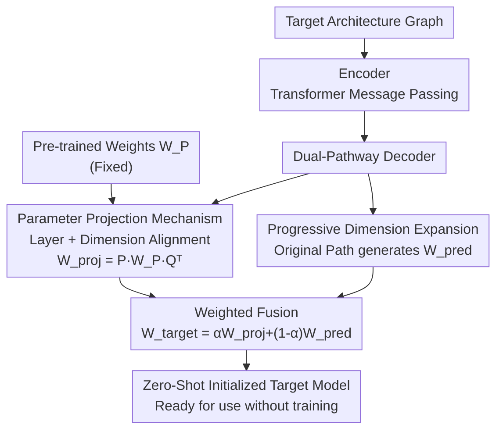

# Unlocking Pre-trained Weights: Parameter Inheritance for Zero-Shot Initialization

**Conference**: CVPR 2026  
**Paper**: [CVF Open Access](https://openaccess.thecvf.com/content/CVPR2026/html/Xu_Unlocking_Pre-trained_Weights_Parameter_Inheritance_for_Zero-Shot_Initialization_CVPR_2026_paper.html)  
**Code**: https://github.com/mathieuxu/PITH-ParameterInheriTance-HyperNetwork  
**Area**: Model Initialization / HyperNetworks / Parameter Generation  
**Keywords**: Graph HyperNetworks, Parameter Inheritance, Zero-Shot Initialization, Parameter Projection, ViT

## TL;DR
PITH utilizes a Graph HyperNetwork to dynamically generate "projection matrices" that map internal weights of large pre-trained models directly onto target ViTs of arbitrary sizes for initialization. This enables the initialized networks to be used immediately without training—achieving a zero-shot accuracy of 53.35% for ViT-Base on ImageNet-1K, which is 6.54% higher than the previous SOTA (TAL).

## Background & Motivation
**Background**: Selecting a high-quality set of initial weights for a new architecture can significantly reduce training costs and accelerate convergence. Graph HyperNetworks (GHN) are representative tools for this task: they encode the target network architecture into a computational graph (where nodes represent operators like convolution or self-attention) and use a decoder to map each node's representation into actual parameter matrices, "generating" an initialized network in a single forward pass. The GHN itself learns this mapping via meta-training—evaluating generated models on a proxy task like ImageNet and using the task loss to backpropagate and update the GHN.

**Limitations of Prior Work**: Meta-training for GHNs typically starts **from scratch**, ignoring the vast amount of existing knowledge in public pre-trained models. Recent work like Task-Aware Learngene (TAL) attempts to utilize this knowledge but only at the **functional level**—treating the pre-trained model as an "indirect teacher" and using its soft labels as supervisory signals. This supervision is too indirect: gradients must pass through the entire generated target model before reaching the GHN, introducing noise and diluting the learning signal. Meanwhile, the **most direct and information-rich part of pre-trained models—their internal weights—is completely wasted.**

**Key Challenge**: Knowledge is embedded within pre-trained weights, but target network dimensions (layer depth, hidden dimensions) vary widely. Pre-trained weights cannot be directly transferred due to dimensional misalignment. Manually learning projection matrices for every possible target configuration is impractical.

**Goal**: To find a mechanism that can transfer the **actual weights** of a pre-trained model to target networks of arbitrary size using only a single forward pass for initialization.

**Key Insight**: The primary strength of HyperNetworks is "dynamically generating parameter matrices according to target specifications." Thus—instead of having the HyperNetwork generate target weights directly, it should **dynamically generate projection matrices** based on the target specifications, then use these matrices to transform pre-trained weights into the target dimensions.

**Core Idea**: Utilize a HyperNetwork to generate "dimension-adaptive projection matrices" to directly project and inherit pre-trained weights into the target model, achieving "zero-shot initialization" (generating usable parameters for any configuration in a single forward pass; note that this differs from traditional zero-shot learning generalized to unseen categories).

## Method

### Overall Architecture
PITH (Parameter InheriTance HyperNetwork) is built upon the recent Graph HyperNetwork LoGAH, extending its single decoder into a **dual-pathway decoder**. The input consists of the target model's architecture graph and a fixed set of pre-trained model weights $W_P$ (using a pre-trained ViT-Large here). The output is a complete set of initialized weights for the target model.

The encoder (Transformer) first performs multi-layer message passing on the computational graph to obtain contextual representations for each node. The decoder then splits into two paths: the **projection path** dynamically generates projection matrices $P, Q$ per node to project pre-trained weights $W_P$ into $W_{proj}$ (parameter inheritance); the **original path** follows standard GHN logic to predict weights $W_{pred}$ directly from graph features (residual prediction to adapt to architectural differences). The two paths are combined via weighted fusion $W_{target}=\alpha W_{proj}+(1-\alpha)W_{pred}$ to obtain the final target weights, which are then loaded into the target network for immediate use.

### Key Designs

**1. Dual-Pathway Decoder: Inheriting and Compensating**

The fundamental issue with TAL is the indirect use of pre-trained knowledge. PITH splits the decoder into two complementary paths to decouple "inheriting existing weights" from "adapting to new architectures." The **projection path** handles the direct transfer of $W_P$—the core of the knowledge. The **original path** retains the "architecture-to-parameter" capability of the original GHN, specifically compensating for structural differences between the target and pre-trained architectures (acting as a residual prediction on top of inheritance). The paths are fused with coefficient $\alpha$:

$$W_{target}=\alpha W_{proj}+(1-\alpha)W_{pred}$$

$\alpha$ controls the ratio between "inherited knowledge" and "hypernetwork adaptation." This design directly utilizes the internal weights of the pre-trained model rather than relying on soft-label backpropagation. Furthermore, it avoids being strictly constrained by the pre-trained architecture, as the original path provides room for adaptation. Crucially, $W_P$ serves as a **fixed input** and is not updated; the HyperNetwork only learns "how to project it correctly."

**2. Parameter Projection Mechanism: Layer and Dimension Alignment**

This addresses the challenge where pre-trained and target models differ in depth and width. PITH solves this in two steps. **Layer alignment** uses a first-N strategy: if the target has $N$ layers and the pre-trained model has $M \ge N$ layers, the target's $i$-th layer aligns with the pre-trained $i$-th layer (assuming lower layers capture more transferable features). **Dimension alignment** uses two projection matrices to multiply the pre-trained weights $W_P \in \mathbb{R}^{h_P \times w_P}$ on both sides to match the target dimensions $W_{proj} \in \mathbb{R}^{h_{proj} \times w_{proj}}$:

$$W_{proj}=P\,W_P\,Q^T,\quad P\in\mathbb{R}^{h_{proj}\times h_P},\ Q\in\mathbb{R}^{w_{proj}\times w_P}$$

This factorized transformation (row projection on the left, column projection on the right) efficiently adapts to various dimensions. Crucially, these projection matrices are not fixed but are **dynamically generated by the decoder for each parameter block** (e.g., QKV in attention, MLP in FFN). Following LoGAH's low-rank generation strategy, the decoder gradually expands hidden features through linear layers, reshapes them to 2D, and pads to a predefined maximum capacity $d_{max}$. It then splits and crops to the target layer's actual size, producing two low-rank factors $A' \in \mathbb{R}^{h_{proj} \times r}$ and $B' \in \mathbb{R}^{h_P \times r}$, where $P = A'B'^T$. $Q$ is generated similarly. 

**3. Progressive Dimension Expansion: Stabilizing Parameter Generation**

The original GHN/LoGAH decoder expands from a low-rank dimension $r$ to maximum capacity $d_{max}$ in one step, which can be unstable and lose information. PITH replaces this with **progressive dimension expansion**: instead of a single jump, it inserts intermediate MLP layers to **expand dimensions in stages**. This smoother transition preserves representation capacity and mitigates information loss during large-scale transformations. Ablation studies show this contributes significantly to performance (removing it causes a 2.59% drop, compared to a 2.12% drop when removing projection).

### Loss & Training
Ours follows the meta-training paradigm of GHN/Learngene without introducing new loss terms. Each iteration samples target architectures and data, generates parameters via the HyperNetwork, performs a forward pass, and backpropagates cross-entropy loss to update the HyperNetwork. Main experiments were conducted on ImageNet-1K for 200 epochs (mixed precision, cosine annealing, $lr=3\text{e-}4$, weight decay $1\text{e-}2$, parameter prediction regularization $\gamma=3\text{e-}5$). Decathlon multi-task experiments involved ImageNet pre-training followed by 100 epochs of joint fine-tuning with temperature-based sampling ($T=2$).

## Key Experimental Results

### Main Results
Zero-shot initialization (evaluation **without training** after generation) is the primary showcase for PITH. Zero-shot accuracy for 12-layer ViTs on ImageNet-1K:

| Configuration | GHN-3 | LoGAH | TAL | Ours | Gain vs TAL |
|---------------|-------|-------|-----|------|-------------|
| Tiny          | 34.95 | 44.82 | 46.74 | 53.27 | +6.53 |
| Small         | 35.33 | 44.85 | 46.81 | 53.35 | +6.54 |
| Base          | 33.74 | 37.63 | 46.35 | 53.35 | +7.00 |

PITH maintains its lead after 75 epochs of training (ImageNet-1K, Base: 67.29% for Ours vs 64.28% for TAL). Training costs remain nearly identical:

| Method | Training Time (h) | Avg. Accuracy (%) |
|--------|-------------------|-------------------|
| LoGAH (200 ep) | 89.52 | 38.65 |
| TAL (200 ep)   | 92.37 | 43.72 |
| TAL (300 ep)   | 139.25| 47.54 |
| Ours (200 ep)  | 95.43 | 51.03 |

Even when TAL is trained for an extra 100 epochs (300 total, 139h), its 47.54% remains 3.49% lower than the 51.03% achieved by Ours in 200 epochs. In zero-shot initialization across 9 Decathlon tasks, Ours leads across almost all scales and depths (e.g., 12-Tiny average 49.00% vs TAL 47.06%). After 100 epochs of training, ViT-Tiny/Small outperform TAL by an average of 2.67%/2.34%.

### Ablation Study
Ablation on ViT-Tiny/Small (6/9 layers) on ImageNet-1K:

| Configuration | Parameter Projection | Progressive Expansion | Avg. Accuracy |
|---------------|----------------------|-----------------------|---------------|
| Full PITH     | ✓                    | ✓                     | 49.02         |
| w/o Projection| ✕                    | ✓                     | 46.90 (↓2.12) |
| w/o Expansion | ✓                    | ✕                     | 46.43 (↓2.59) |

Low-cost variant (Sharing MLPs between projection/prediction paths):

| Implementation | Params (M) | Avg. Accuracy (%) |
|----------------|------------|-------------------|
| LoGAH (Baseline) | 21.41 | 45.73 |
| Dual-Pathway     | 41.59 | 46.43 |
| Shared-Pathway   | 24.40 | 46.08 |

### Key Findings
- **Both components are essential, with Progressive Expansion contributing more**: Removing it results in a 2.59% drop vs. 2.12% for removing parameter projection. This indicates that "stable parameter generation" is a prerequisite—if the base generation fails due to large-scale transformations, the projection pathway cannot compensate.
- **Shared-Pathway variant is highly cost-effective**: With only 13.9% more parameters than LoGAH (24.40M vs 21.41M), it outperforms the baseline by 0.35%, proving the effectiveness of the parameter projection mechanism even under minimal architectural overhead.
- **Alignment in parameter space explains effectiveness**: Visualizing similarity between generated QKV parameters and pre-trained ViT-Large shows that Ours achieves an average cosine similarity of 0.836 / Pearson of 0.844, significantly higher than TAL (0.802/0.814) and LoGAH (0.793/0.809). Direct projection brings the initialized model much closer to the pre-trained parameter space.

## Highlights & Insights
- **Shifting pre-trained knowledge utilization from the functional level to the weight level**: While TAL relies on indirect supervision via soft labels, PITH treats pre-trained weights as fixed inputs for direct inheritance. This shorter path provides stronger signals and is a useful insight for any initialization method aiming to reuse large models.
- **Generating "projection matrices" instead of "weights themselves" is brilliant**: Using projection matrices transforms the combinatorial explosion of "arbitrary target sizes" into a standard HyperNetwork task. This paradigm of "generating transformation operators" rather than "final objects" is transferable to other cross-dimensional parameter transfer scenarios.
- **Progressive Dimension Expansion is a simple but crucial engineering insight**: Breaking down the expansion from $r$ to $d_{max}$ into steps preserves information. Its high contribution in ablation studies serves as a reminder not to overlook the smoothness of dimension transformations in parameter generation.

## Limitations & Future Work
- **Naive First-N layer alignment**: Aligning the $i$-th target layer to the $i$-th pre-trained layer assumes lower layers are more transferable and ignores inter-layer semantic alignment, which may not be optimal for deeper networks.
- **Limited to homogeneous architectures (ViT)**: The pre-trained model is a ViT-Large and targets are within the ViT family; cross-architecture family inheritance (e.g., CNN ↔ Transformer) was not explored.
- **$\alpha$ is a hyperparameter**: The balance between inheritance and adaptation is a fixed coefficient. The paper does not discuss its sensitivity or the possibility of layer-wise adaptive weighting.
- **Absolute levels of zero-shot accuracy**: While significantly improved, 53% on ImageNet-1K is still far from production-ready. Currently, it is more a "good starting point to save training costs" than a "deployment-ready" solution.

## Related Work & Insights
- **vs TAL (Task-Aware Learngene)**: Both use pre-trained models, but TAL uses indirect functional-level supervision. PITH directly inherits **internal weights**, making it a more direct and efficient extension.
- **vs LoGAH / GHN-3**: PITH is built on LoGAH's low-rank generation but utilizes pre-trained knowledge, whereas prior GHNs start from scratch.
- **vs Weight Selection (First-N source)**: Weight selection uses heuristic rules to extract parameters, lacking adaptive learning. PITH uses a HyperNetwork to learn optimal projection strategies across diverse configurations.

## Rating
- Novelty: ⭐⭐⭐⭐ Inheriting pre-trained weights directly within the GHN framework and shifting the view to "generating projection matrices" is clever.
- Experimental Thoroughness: ⭐⭐⭐⭐ Comprehensive coverage of Decathlon, unseen tasks, and parameter space visualization. However, it is limited to ViT architectures.
- Writing Quality: ⭐⭐⭐⭐ Logical progression of motivations (indirect supervision → direct inheritance → dimensionality challenges → HyperNetwork projection generation).
- Value: ⭐⭐⭐⭐ Provides high-quality initialization for resource-constrained scenarios. The methodology is inspiring for parameter reuse research.

<!-- RELATED:START -->

## Related Papers

- [\[AAAI 2026\] GranAlign: Granularity-Aware Alignment Framework for Zero-Shot Video Moment Retrieval](../../AAAI2026/llm_pretraining/granalign_granularity-aware_alignment_framework_for_zero-shot_video_moment_retri.md)
- [\[ECCV 2024\] Prompting Language-Informed Distribution for Compositional Zero-Shot Learning](../../ECCV2024/llm_pretraining/prompting_language-informed_distribution_for_compositional_zero-shot_learning.md)
- [\[NeurIPS 2025\] ZEUS: Zero-shot Embeddings for Unsupervised Separation of Tabular Data](../../NeurIPS2025/llm_pretraining/zeus_zero-shot_embeddings_for_unsupervised_separation_of_tabular_data.md)
- [\[AAAI 2026\] PrefixGPT: Prefix Adder Optimization by a Generative Pre-trained Transformer](../../AAAI2026/llm_pretraining/prefixgpt_prefix_adder_optimization_by_a_generative_pre-trained_transformer.md)
- [\[ACL 2025\] AutoDS: Autonomous Data Selection with Zero-shot Generative Classifiers for Mathematical Texts](../../ACL2025/llm_pretraining/autonomous_data_selection_with_zero-shot_generative_classifiers_for_mathematical.md)

<!-- RELATED:END -->
