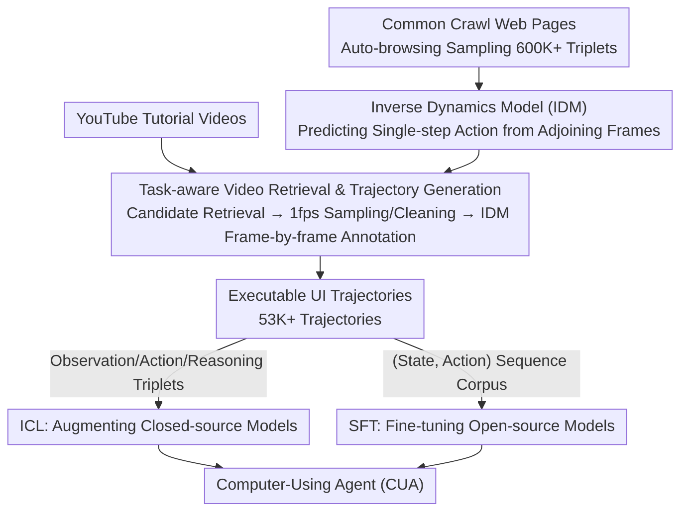

# Watch and Learn: Learning to Use Computers from Online Videos

**Conference**: CVPR2026  
**arXiv**: [2510.04673](https://arxiv.org/abs/2510.04673)  
**Code**: [Project Page](https://chanh.ee/wandl/)  
**Area**: LLM Pre-training  
**Keywords**: computer-using agent, inverse dynamics model, video-to-trajectory, in-context learning, supervised fine-tuning, UI grounding

## TL;DR

The Watch & Learn (W&L) framework is proposed, which automatically transforms human computer-operation videos from the internet into executable UI trajectory data using an Inverse Dynamics Model (IDM). It generates 53K+ high-quality trajectories, significantly improving the performance of various Computer-Using Agents (CUAs) when used as In-Context Learning (ICL) examples or Supervised Fine-Tuning (SFT) data.

## Background & Motivation

**Severe CUA data bottleneck**: Computer-Using Agents (CUAs) require a large number of multi-step human-computer interaction trajectories for training. However, manual annotation costs are extremely high—the OpenCUA AgentNet dataset took 6 months and $\$32,000+$ for 22K tasks; scaling to millions would exceed $\$500K$.

**Existing datasets are narrow and static**: Manually annotated UI datasets have limited scale and insufficient domain coverage, making it difficult to generalize to diverse and constantly evolving applications and operating systems.

**Poor quality of synthetic data**: Exploratory synthesis (e.g., BAGEL, OS-Genesis) introduces noise; tutorial-driven synthesis depends on LLM annotation, which is fragile and poorly aligned with real operations.

**Abundant but underutilized web video resources**: Platforms like YouTube host massive amounts of human operation tutorial videos that naturally encode task workflows across applications. However, effective methods to convert these into structured trajectories are lacking.

**Insufficient accuracy of existing video-to-trajectory methods**: Cascaded pipelines like MONDAY achieve only about 70% accuracy. TongUI relies on MLLM action annotation, which is equally unreliable, leading to error propagation.

**Difficulty in cross-OS generalization**: CUAs need to operate across various OSs like Ubuntu, macOS, and Windows. Annotation quality is strongly tied to the OS environment, and prior methods struggle to maintain consistency across platforms.

## Method

### Overall Architecture

W&L addresses the bottleneck of expensive and narrow CUA training data by automatically converting massive human operation tutorial videos from the internet into executable UI trajectories. The pipeline consists of three stages: first, building a large-scale state-transition corpus to train an Inverse Dynamics Model (IDM) that learns to "predict the intermediate action from two frames of screenshots"; second, retrieving YouTube tutorial videos based on tasks and using the IDM to annotate trajectories frame by frame; finally, feeding these trajectories to CUAs as either ICL examples or SFT data.

### Key Designs

**1. Inverse Dynamics Model (IDM): Reducing "Trajectory Recovery" to "Single-step Action Prediction"**

Prior video-to-trajectory methods (e.g., MONDAY, TongUI) rely on cascaded pipelines or direct MLLM annotation, leading to error propagation and only ~70% accuracy. W&L adopts an easier objective: given adjoining screenshots $(O_t, O_{t+1})$, it predicts only the action $a_t$ that caused the transition, decomposing trajectory recovery into a series of single-step inverse dynamics predictions. The action space consists of 6 atomic operations: Click (with coordinates), Release, Scroll, Type (with text), Wait, and Move (with coordinates), where Click+Move+Release can represent Drag. The model uses a SigLIP-2 vision encoder followed by a 4-layer Transformer backbone, with three prediction heads: Action Classification (6 classes), Coordinate Head (discretizing $(x, y)$ into 0–999 classification, which is more stable than regression), and Language Head (a lightweight GPT-2 decoder auto-regressively generating input text). Training data is obtained by sampling web entries from Common Crawl, auto-browsing, and recording 600K+ $(O_t, a_t, O_{t+1})$ triplets. The pixels-only input allows the IDM to generalize naturally across applications and OSs.

**2. Task-aware Video Retrieval & Trajectory Generation: Accurate Video Search and Frame Annotation**

An IDM requires clean tutorial videos as input. At inference time, the system uses task descriptions and an initial screenshot to let Gemini 2.5 Flash optimize search queries, retrieving the top-15 videos via the YouTube Search API and keeping the top-3 after filtering non-screen-recording or blurry segments. For training, it covers 69 applications across 7 major categories (Productivity, Programming, Design, Video Edit, Audio, System, Science), using Gemini to generate diverse queries for batch retrieval, collecting 53,125 tutorial videos. All videos are sampled at 1fps, and Gemini 2.5 Flash automatically removes segments containing non-screen-recording content, cropping issues, or blurry transitions. After cleaning, the IDM predicts actions frame-by-frame to assemble complete trajectories:

$$\tau = (O_0, a_0, O_1, a_1, \ldots, O_T, a_T, O_{T+1})$$

Precise retrieval is the key to gains—while random retrieval does not degrade performance because the labels are accurate, only task-related retrieval brings significant improvements.

**3. Dual Usage of Trajectories: Feeding Closed-source ICL and Open-source SFT**

To support both closed-source models (without gradient access) and open-source models, the trajectories are organized into two forms. The ICL route decomposes each trajectory into (observation, action, reasoning) triplet examples, where reasoning is a natural language explanation generated by Gemini 2.5 Flash, allowing the model to see procedural intent. The SFT route aggregates annotated trajectories into (state, action) sequence corpora, fine-tuning with standard sequence modeling objectives.

### Loss & Training

The training objective for the IDM is multi-task cross-entropy: activating loss branches for action classification, coordinate classification, or text generation depending on the action type of each sample. Downstream CUAs introduce no new objectives—ICL uses triplets as context examples directly, while SFT uses standard sequence modeling on the (state, action) corpus.

## Experiments

### Main Results

| Setting | Model | Method | Success Rate (%) |
|------|------|------|-----------|
| **ICL** | Gemini 2.5 Flash | Base | 19.0 |
| | | + W&L | **22.0** (+3.0) |
| | OpenAI o3 | Base | 21.8 |
| | | + TongUI | 21.1 (-0.7) |
| | | + W&L | **24.3** (+2.5) |
| | Claude 4 Sonnet | Base | 43.9 |
| | | + TongUI | 43.4 (-0.5) |
| | | + W&L | **45.5** (+1.6) |
| | Jedi (o3) | Base | 50.6 |
| | | + W&L | **52.8** (+2.2) |
| **SFT** | Qwen 2.5VL 7B | Base | 1.9 |
| | | + TongUI | 5.4 (+3.5) |
| | | + W&L | **13.0** (+11.1) |
| | UI-TARS-1.5-7B | Base | 27.3 |
| | | + TongUI | 23.8 (-3.5) |
| | | + W&L | **31.1** (+3.8) |

> OSWorld-Verified (50-step). W&L consistently outperforms baselines and TongUI in both ICL and SFT routes.

### WindowsAgentArena Results (15-step)

| Model | Success Rate (%) |
|------|-----------|
| UI-TARS-1.5-7B (zero-shot) | 18.1 |
| + TongUI SFT | 12.9 (-5.2) |
| + **W&L SFT** | **24.0** (+5.9) |
| OpenCUA-7B | 13.5 |
| UltraCUA-7B | 21.7 |

> W&L achieves SOTA among 7B models, whereas TongUI annotations lead to performance degradation.

### Ablation Study

**IDM Annotation Accuracy Comparison** (held-out test set, 100 transitions per class):

| Metric | Gemini 2.5 Flash | TongUI | **W&L IDM** |
|------|-----------------|--------|------------|
| ActionType Acc. | 81.5% | 84.3% | **95.8%** |
| Action Acc. | 70.5% | 72.3% | **91.7%** |

**ICL Component Ablation** (OSWorld):

| Configuration | Gemini Flash | o3 | Claude Sonnet |
|------|-------------|-----|--------------|
| No Examples | 19.0 | 21.8 | 43.9 |
| + Frame | 18.4 | 21.8 | 43.9 |
| + Frame + Action | 20.1 | 23.0 | 44.4 |
| + Frame + Action + Reasoning | **22.0** | **24.3** | **45.5** |

**Retrieval Strategy Ablation**: Random retrieval provides no gain for o3 (21.8), while task-related retrieval adds +2.5 → 24.3.

### Key Findings

- IDM annotation accuracy (91.7%) significantly leads TongUI (72.3%) and Gemini (70.5%), especially in grounding actions like click/scroll.
- TongUI annotations perform worse in Windows environments (TongUI is based on UI-TARS trained on Ubuntu), leading to a 5.2-point drop in SFT performance.
- Both action labels and reasoning traces in ICL contribute incremental gains, indicating that trajectories convey procedural/causal knowledge beyond visual context.
- Random retrieval does not harm performance (labels are inherently accurate), but precise retrieval is necessary for significant improvements.

## Highlights & Insights

- **Inverse Dynamics modeling as the core innovation**: It simplifies the trajectory recovery problem from end-to-end generation to single-step prediction, drastically lowering learning difficulty and enabling cross-app generalization.
- **Extreme scaling efficiency**: 53K trajectories are generated fully automatically without human annotation, making data production costs much lower than schemes like AgentNet.
- **Dual application routes**: The same set of trajectories can be used for both ICL and SFT, flexibly adapting to closed-source and open-source models.
- **Cross-OS generalization**: Effective on both Ubuntu (OSWorld) and Windows (WAA), proving the platform robustness of IDM annotations.
- **+11.1 Gain for Qwen 2.5VL 7B**: Demonstrates that general multimodal models acquire previously lacking operational capabilities through this data.

## Limitations & Future Work

- IDM handles only 6 atomic actions, with limited coverage for complex interactions (e.g., right-click menus, multi-touch, keyboard combos).
- Dependence on YouTube video quality and availability; some niche applications may lack tutorials.
- Filtering and retrieval depend on Gemini 2.5 Flash, introducing dependence on commercial APIs.
- The paper does not explore automatic multi-task segmentation in long videos, currently assuming one video corresponds to one trajectory.
- RL routes are not explored (only ICL + SFT); the authors list RL as future work.
- 1fps sampling may lose intermediate states of rapid operations (e.g., rapid clicking or scrolling).

## Related Work & Insights

- **Exploration-based Synthesis**: BAGEL, NNetNav, Explorer, OS-Genesis — Random exploration + backtracking annotation, high noise.
- **Tutorial-driven Synthesis**: Synatra, AgentTrek (text tutorials), TongUI (multimodal tutorials + MLLM annotation) — Broad coverage but fragile annotations.
- **Self-improving Agents**: OpenWebVoyager, WebRL, ZeroGUI — No human data needed but narrow task distribution.
- **IDM in Robotics**: VPT (Minecraft pre-training), DreamGen — Inspired the IDM design in this work.
- **Agent ICL**: Focuses on workflow abstraction and example selection, complementary to the ICL route in this paper.

## Rating

- Novelty: ⭐⭐⭐⭐ — Transferring the IDM concept from robotics to GUI agents is highly original.
- Experimental Thoroughness: ⭐⭐⭐⭐ — Dual benchmarks + dual ICL/SFT routes + multiple models + complete ablation.
- Writing Quality: ⭐⭐⭐⭐ — Clear structure and coherent logic from motivation to experiments.
- Value: ⭐⭐⭐⭐⭐ — Opens a practical route for large-scale production of CUA training data using web videos.

<!-- RELATED:START -->

## Related Papers

- [\[ICCV 2025\] Synchronization of Multiple Videos](../../ICCV2025/llm_pretraining/synchronization_of_multiple_videos.md)
- [\[ICML 2026\] Constrained Bayesian Experimental Design via Online Planning](../../ICML2026/llm_pretraining/constrained_bayesian_experimental_design_via_online_planning.md)
- [\[NeurIPS 2025\] Optimal Online Change Detection via Random Fourier Features](../../NeurIPS2025/llm_pretraining/optimal_online_change_detection_via_random_fourier_features.md)
- [\[CVPR 2025\] Precise Event Spotting in Sports Videos: Solving Long-Range Dependency and Class Imbalance](../../CVPR2025/llm_pretraining/precise_event_spotting_in_sports_videos_solving_long-range_dependency_and_class_.md)
- [\[ACL 2026\] Fine-tuning vs. In-context Learning in Large Language Models: A Formal Language Learning Perspective](../../ACL2026/llm_pretraining/fine-tuning_vs_in-context_learning_in_large_language_models_a_formal_language_le.md)

<!-- RELATED:END -->
