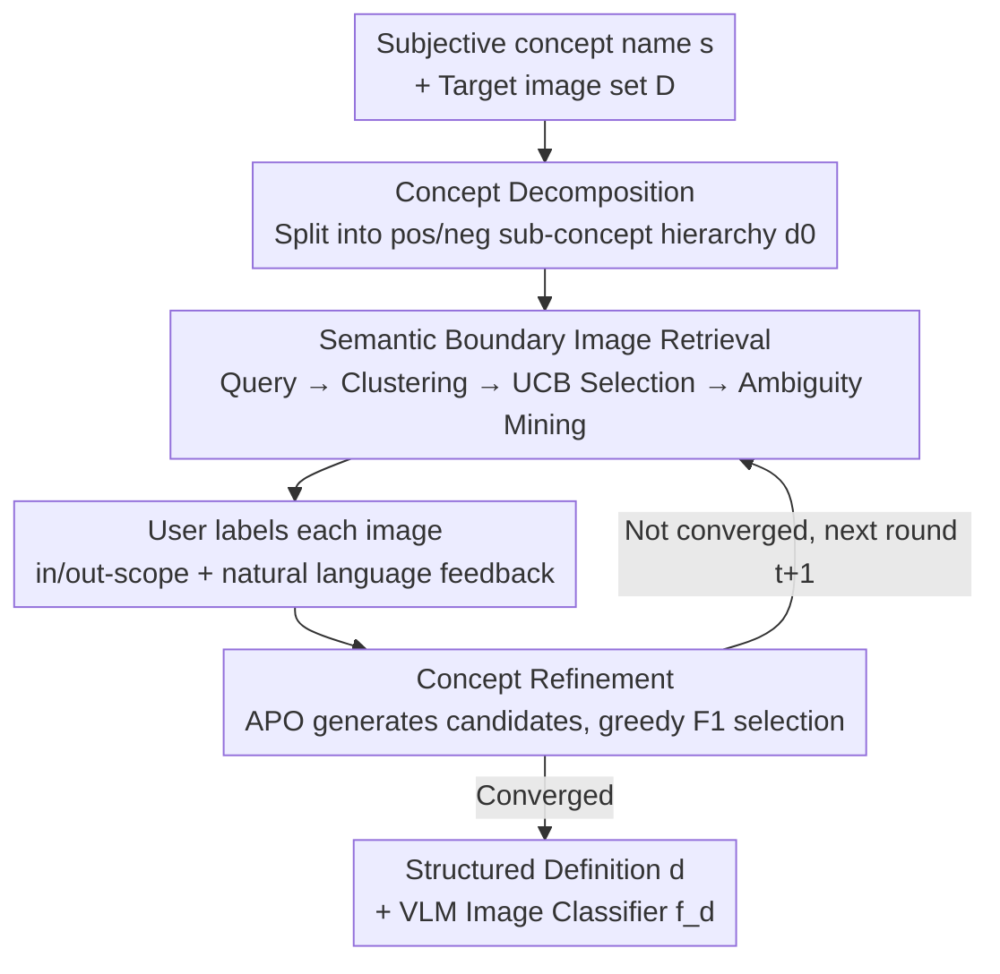

# Agile Deliberation: Concept Deliberation for Subjective Visual Classification

**Conference**: CVPR 2026  
**Paper**: [CVF Open Access](https://openaccess.thecvf.com/content/CVPR2026/html/Wang_Agile_Deliberation_Concept_Deliberation_for_Subjective_Visual_Classification_CVPR_2026_paper.html)  
**Code**: https://github.com/google-research/google-research/tree/master/agile_deliberation  
**Area**: LLM Reasoning / Human-in-the-loop / Multimodal VLM  
**Keywords**: Subjective Visual Classification, Concept Deliberation, Human-in-the-loop, Prompt Optimization, Boundary Case Retrieval  

## TL;DR
For subjective concepts with fuzzy boundaries like "healthy food" or "clickbait," this work proposes Agile Deliberation, a human-in-the-loop framework. The system decomposes concepts into hierarchies of positive/negative sub-concepts, iteratively retrieves "semantic boundary samples" for user annotation and reflection, and automatically compiles feedback into VLM prompts. This allows the image classifier to align with users' evolving intentions. In 18 real-user experiments, it outperformed automatic decomposition baselines by 7.5% in F1 and manual deliberation by over 3%.

## Background & Motivation
**Background**: Computer vision has long focused on objective concepts with consensus answers like "dog," "car," or "tomato." However, increasing real-world applications require identifying **subjective concepts**—such as "unsafe images" in content moderation or "exquisite cuisine" in content curation—where boundaries are inherently debatable. Existing human-in-the-loop methods (Agile Modeling relying on manual labeling of hundreds of images, or experts handwriting prompts for VLMs) assume users have a clear and stable understanding of a concept from the start.

**Limitations of Prior Work**: Through structured interviews with content moderation experts, the authors found the opposite: people often start with vague ideas and must **gradually clarify their definitions** by repeatedly examining boundary cases, a practice termed "concept deliberation." Without meticulously crafted definitions as few-shot prompts, downstream VLM classifiers may resolve ambiguities arbitrarily, failing to capture the user's true decision boundary. Furthermore, experts often provide inconsistent labels as they encounter more samples, which is particularly harmful in real-world scenarios with limited data for fine-tuning.

**Key Challenge**: Existing tools assume "definitions are static and known," but the essence of subjective concepts is that "definitions evolve through interaction." There is a lack of systematic support for reliably translating evolving, subjective concepts into a VLM classifier.

**Goal**: Construct a human-in-the-loop framework that helps users **write** a human-readable structured concept definition while simultaneously using that definition as a VLM prompt to **induce** a high-performance image classifier, keeping both synchronized as the user's understanding evolves.

**Key Insight**: The authors decomposed the strategies of real moderation experts: they first "scope" the concept (identifying key visual signals via representative images) and then "reflect on boundary images." However, experts struggle to efficiently find boundary cases or align nuanced understanding with a classifier. Agile Deliberation **automates and productizes** this manual process.

**Core Idea**: Replace static prompting with iterative deliberation driven by "semantic boundary samples." The system actively identifies images that are semantically most ambiguous under the current definition to force user stance-taking, then automatically compiles feedback into optimized prompts, allowing the classifier to converge greedily toward the user's intention.

## Method

### Overall Architecture
Formally, given an image space $X$, a user-provided subjective concept name $s$ (e.g., $s=$ healthy food), and an optional target unlabeled image set $D=\{x_i\}_{i=1}^N$ (defaulting to WebLI large-scale web data). The system constructs a structured concept definition $d \in D_{\text{def}}$—a text containing positive/negative sub-concepts and boundary cases—which serves as both (1) a human-readable representation and (2) a VLM prompt to induce a classifier $f_d(x)=P(y=1\mid x;d)$. In rounds $t=1,2,\dots,T$, the system expands the labeled set $L_t$ and updates the definition according to $d_{t+1}=\arg\max_{d'\in C_t}\text{F1}(f_{d'},L_t)$, where $C_t$ is the set of candidate definitions generated from user feedback.

The workflow consists of two stages: **Scoping** (decomposing the initial concept into a sub-concept hierarchy) and **Iteration** (multi-round boundary image retrieval $\to$ user annotation/reflection $\to$ automatic definition refinement). The design is inspired by interviews with 5 content moderation experts and qualitative coding of 20 high-quality concept definitions from their workflow.

The implementation utilizes two types of off-the-shelf tools: ① Image search engines (mapping text queries to visually similar images using web search or CLIP/ALIGN embedding neighbor search); ② VLM classifiers (given definition $d$ and image $x$, the VLM generates a Chain-of-Thought rationale before outputting a binary judgment, following Modeling Collaborator). Above these are three core modules corresponding to the framework's contribution nodes.

### Key Designs

**1. Concept Decomposition Module: Breaking a vague concept into a decidable hierarchy**

Asking a VLM directly about a composite concept like $s=$ healthy food results in the model relying on arbitrary general priors. Borrowing from how humans combine visual concepts using first-order logic, the system uses **prompt-chained reasoning** to decompose the concept into small unit concepts: $s \Rightarrow \phi(u_1, \dots, u_M), M \le 3$, where $\phi$ is a conjunction/disjunction formula (e.g., "people exercising" splits into $u_1=$ people, $u_2=$ exercises). $M$ is kept small to maintain reasoning clarity. Each unit concept $u_m$ is expanded into candidate positive sub-concepts $S_m^+$ (e.g., healthy dish, fresh fruit) and negative sub-concepts $S_m^-$ (e.g., fried fast food, processed snacks). Representative images are retrieved for each; the user decides whether to keep, reject, or flip them. This yields the initial structured definition $d_0 = \{(S_m^+, S_m^-)\}_{m=1}^M$ and the first classifier $f_{d_0}$, providing an operational scaffold.

**2. Semantic Boundary Image Retrieval Module: Surfacing semantically ambiguous images**

The most critical decision in the iteration phase is how to find boundary samples. A direct approach would be standard Active Learning—selecting samples where the classifier's predicted probability is close to 0.5 ($|f_{d_t}(x)-0.5|\approx 0$). The authors explicitly **reject** this: VLM outputs are often **uncalibrated** generative outputs, giving high confidence to images humans find ambiguous and vice versa. Furthermore, a classifier instantiated via prompting lacks a well-defined margin. Instead, they search in the **semantic space** for a set of images $B_t \subseteq D$ that lie near the decision boundary implied by the natural language in $d_t$.

The implementation uses a structured pipeline: (1) **Boundary Query Generation**: LLM generates diverse boundary queries based on $d_0$ (e.g., "salads with heavy mayo dressings"); (2) **Deduplication + Clustering**: Cross-pool deduplication followed by **Dictionary Learning** on visual features $z(x) \approx W\alpha(x)$ to learn a basis $W$ and sparse codes $\alpha(x)$. Images with similar sparse codes are grouped into overlapping clusters representing shared visual traits; (3) **Cluster Selection**: Using a Multi-Armed Bandit (MAB) framework, clusters are treated as arms. Rewards $r_t(m)$ (e.g., error correction rate or feedback richness) are tracked, and the next cluster is chosen via the UCB rule $m_t=\arg\max_m\big(\hat\mu_t(m)+\rho_t\sqrt{\log t/n_t(m)}\big)$ to direct attention toward areas where the model and human disagree; (4) **Ambiguity Mining**: From the selected cluster $G_{m_t}$, the VLM generates one-sentence ambiguity summaries $a(x)$ for a subset. These summaries are embedded to pick $|B_t| \le 5$ images forming a tight cluster in embedding space, ensuring each deliberation batch focuses on **one coherent dimension of ambiguity** (e.g., mayo content vs. portion size).

**3. Concept Refinement Module: Compiling natural language feedback into VLM prompts**

In each round, users label images in $B_t$ and provide free-text comments $c(x)$ (e.g., "this salad has too much cream; a small amount of dressing is OK"). The interface displays user labels alongside $f_{d_t}(x)$ and its rationale; users provide brief reasons when they conflict. The refinement module uses **Automatic Prompt Optimization (APO)**: user comments are expanded into full rationales $r_{\text{user}}(x)$, and an LLM synthesizes candidate definitions $C_t=\{d_t^{(1)},\dots,d_t^{(M)}\}$ incorporating these rationales. Each candidate is evaluated against the accumulated labeled set $L_t$ using the VLM's F1 score. The update $d_{t+1}=\arg\max_m\text{F1}(f_{d_t^{(m)}},L_t)$ is performed **greedily**. This greedy approach ensures the definition's evolution is **transparent and traceable** for the user while maintaining low latency suited for real-time deliberation.

### Implementation Details
Concept decomposition uses Gemini-Pro 2.5; all other tasks (classification, query generation, ambiguity mining) use Gemini-Flash 2.5. The base models are **not fine-tuned**, ensuring accessibility for domain experts regardless of available compute. Image retrieval uses off-the-shelf neighbor search, and the interface is implemented in interactive Google Colab notebooks.

## Key Experimental Results

Evaluating subjective visual classification is difficult—there is no static ground truth, and user definitions change during deliberation. Therefore, the authors used **18 real-user experiments** (90 minutes each). 9 participants performed two sessions (one Agile, one Manual, varying concepts) with randomized ordering to mitigate sequence effects. Two concepts: "Paid to Play" (moderation: clickbait promising unrealistic rewards) and "Healthy Food" (curation).

### Main Results: Classification Performance (F1, SD in parentheses)

Since participant complexity of understanding varies, absolute values cannot be compared directly across groups (Agile vs. Manual). The authors compare gains relative to the zero-shot baseline (↑ rows).

| Concept | Condition | Agile Group F1 | Manual Group F1 |
|------|------|------|------|
| Paid to play | Zero-shot | 0.48 | 0.43 |
| | Modeling Collaborator | 0.53 | 0.47 |
| | Assigned System | **0.59** | 0.51 |
| | Gain vs Zero-shot | **+11%** | +8% |
| Healthy food | Zero-shot | 0.48 | 0.82 |
| | Modeling Collaborator | 0.50 | 0.78 |
| | Assigned System | **0.58** | 0.79 |
| | Gain vs Zero-shot | **+10%** | **−3%** |

On average, Agile Deliberation outperformed zero-shot by 10.5% and Modeling Collaborator by approx. 7% in F1. Gains primarily came from **Precision improvements** with only slight Recall drops. Modeling Collaborator (LLM-only enrichment without feedback) showed limited gains, proving that **pure automation cannot capture nuanced user intent**.

### User Experience (7-point Likert, * denotes p < .05)

| Item | Agile Mean (SD) | Manual Mean (SD) |
|--------|------|------|
| Effort to reach performance (lower is better) | **3.11 (1.62)*** | 4.67 (0.71)* |
| Success in expressing intent (higher is better) | 5.56 (0.88) | 5.11 (1.54) |
| Frustration during definition (lower is better) | **1.78 (1.09)** | 2.33 (0.87) |
| Feeling insecure/stressed/annoyed (lower is better) | **1.67 (0.71)*** | 3.00 (1.41)* |
| Mental demand (lower is better) | **3.22 (2.05)** | 4.56 (1.01) |

### Key Findings
- **Higher value for subjective concepts deviating from priors**: On "Paid to Play," both Agile and Manual improved over zero-shot. However, for "Healthy Food," the Manual group actually performed slightly worse than zero-shot because participants already had a clear conventional understanding (zero-shot F1 reached 0.82). Agile still yielded a +10% gain, proving its effectiveness for "finely disputed" concepts.
- **Iterative improvement with fluctuations**: F1 generally trended upward over rounds but with some noise, attributed to the trade-off of greedy optimization for real-time responsiveness.
- **Lowering barriers for non-experts**: Manual users averaged 7.3 queries to find boundary images but often got stuck in one ambiguity type ("Hard to think of queries to disprove myself"). Agile users explored diverse ambiguities (e.g., non-subject focus, high-carb ingredients) and used natural language feedback rather than writing prompts. All 9 participants **unanimously preferred Agile**.

## Highlights & Insights
- **Clear distinction between "Semantic" vs. "Confidence" boundaries**: The authors correctly point out that generative VLM outputs are uncalibrated and lack well-defined margins, rendering standard active learning uncertainty sampling ineffective—a critical insight for bridging AL and VLMs.
- **Dictionary Learning + UCB for boundary organization**: Grouping boundary images into interpretable visual dimensions and using a bandit to guide user attention is far more efficient than random ambiguity. This "sampling by dimension" approach is transferable to any data curation task requiring human reflection.
- **Greedy over Beam Search for transparency**: Choosing a slightly sub-optimal search for the sake of "traceability and low latency" reflects the reality that control and explainability take precedence in human-in-the-loop systems.
- **Honest evaluation methodology**: By acknowledging the lack of static ground truth for subjective concepts, the researchers measured "dynamic intent alignment" through live sessions, providing a model for future human-AI alignment work.

## Limitations & Future Work
- **Small sample size and concept count**: 18 sessions across 2 concepts and 9 non-experts limit statistical power.
- **Incomparable absolute F1 across groups**: As the authors noted, huge zero-shot F1 differences (0.48 vs 0.82) suggest significant variation in concept complexity between participant groups.
- **Session duration limits**: Sessions were forced to stop while F1 was still trending upward; long-term gains remain unknown.
- ⚠️ **Specific hyperparameter values** ($r_t(m)$, $\rho_t$) were not provided in the main text (referred to Appendix F).
- **Dependency on closed-source models**: Use of Gemini and private 100M datasets (for "Paid to Play") makes open-source replication challenging.

## Related Work & Insights
- **vs. Agile Modeling [38]**: Both bootstrap classifiers for subjective concepts, but Agile Modeling assumes static definitions and relies on classifier confidence for Active Learning. This work models **evolvability** and uses semantic boundary sampling.
- **vs. Modeling Collaborator [43]**: While it uses prompt chains for decomposition, it is **fully automated**. This work demonstrates that human-in-the-loop feedback is the key performance differentiator.
- **vs. Classical Active Learning [19, 35]**: Traditional AL selects samples near the decision boundary to maximize model gain. This work selects samples along **interpretable dimensions** to provoke human reflection and clarify intent.
- **vs. Automatic Prompt Optimization (APO) [28, 29]**: Traditional APO optimizes for a scalar target on a static set. This work applies APO to the human-in-the-loop context, using rich natural language feedback for alignment.

## Rating
- Novelty: ⭐⭐⭐⭐⭐ Successfully productizes the practice of "concept deliberation" from expert interviews; the analysis of VLM calibration issues is particularly keen.
- Experimental Thoroughness: ⭐⭐⭐⭐ Solid live-session design with mixed-method validation, though limited by sample size and concept variety.
- Writing Quality: ⭐⭐⭐⭐⭐ Logical flow from motivation to method; modules are well-explained.
- Value: ⭐⭐⭐⭐ Provides a practical human-in-the-loop paradigm for high-stakes subjective classification in moderation and curation.

<!-- RELATED:START -->

<!-- RELATED:END -->

## Related Papers

- [\[ACL 2025\] Towards Safety Reasoning in LLMs: AI-agentic Deliberation for Policy-embedded CoT Data Creation](../../ACL2025/llm_reasoning/towards_safety_reasoning_in_llms_ai-agentic_deliberation_for_policy-embedded_cot.md)
- [\[CVPR 2026\] Step-CoT: Stepwise Visual Chain-of-Thought for Medical Visual Question Answering](step-cot_stepwise_visual_chain-of-thought_for_medical_visual_question_answering.md)
- [\[CVPR 2026\] Human-like Abstract Visual Reasoning via Understanding and Solving Reasoning Loop](human-like_abstract_visual_reasoning_via_understanding_and_solving_reasoning_loo.md)
- [\[CVPR 2026\] VisRef: Visual Refocusing while Thinking Improves Test-Time Scaling in Multi-Modal Large Reasoning Models](visref_visual_refocusing_test_time_scaling.md)
- [\[AAAI 2026\] From Classification to Ranking: Enhancing LLM Reasoning for MBTI Personality Detection](../../AAAI2026/llm_reasoning/from_classification_to_ranking_enhancing_llm_reasoning_capabilities_for_mbti_per.md)

<!-- RELATED:END -->
