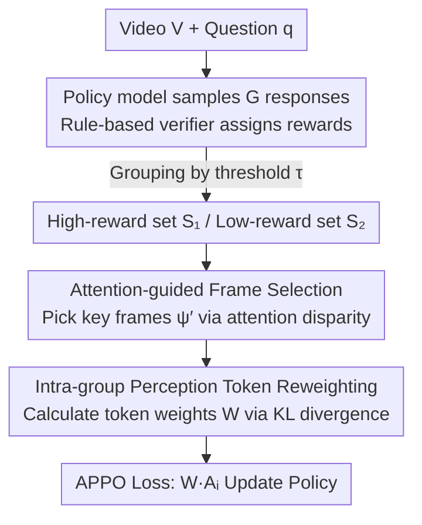

# APPO: Attention-guided Perception Policy Optimization for Video Reasoning

**Conference**: CVPR 2026  
**Paper**: [CVF Open Access](https://openaccess.thecvf.com/content/CVPR2026/html/Du_APPO_Attention-guided_Perception_Policy_Optimization_for_Video_Reasoning_CVPR_2026_paper.html)  
**Code**: https://github.com/GeWu-Lab/APPO  
**Area**: LLM Reasoning / Multimodal VLM / Video Understanding  
**Keywords**: Video Reasoning, Reinforcement Learning, Policy Optimization, Attention-guided, token-level dense reward

## TL;DR
APPO identifies that "the bottleneck of video reasoning lies in perception rather than reasoning." It leverages the model's own attention on video frames to convert sparse outcome rewards into token-level dense rewards. By applying differential weighted learning to "intra-group perception tokens" that focus on the same key frames across different responses based on reward disparities, it consistently outperforms GRPO and DAPO on Qwen2.5-VL-3/7B by 0.5%–4%.

## Background & Motivation
**Background**: Post-training via Reinforcement Learning from Verifiable Rewards (RLVR), such as GRPO, DAPO, and GSPO, has significantly enhanced the reasoning capabilities of LLMs. Recent work has extended this paradigm to video MLLMs to improve video reasoning, mostly focusing on "data quality" or "reward design" (e.g., bbox IoU, timestamp IoU).

**Limitations of Prior Work**: Unlike text-only tasks, video reasoning depends on both **fine-grained perception** (accurately perceiving what happens in the scene) and **multi-step reasoning**, where perception is a prerequisite. However, current RL methods utilize **sparse outcome rewards** (signals based only on final answer correctness), which fail to provide guidance for fine-grained perception such as "which frame to focus on" or "whether it was perceived correctly." Direct supervision of perception requires expensive fine-grained annotations or additional reward models.

**Key Challenge**: The authors first conducted a counter-intuitive empirical analysis to locate the bottleneck. They decoupled perception and reasoning using a "divide and conquer" approach: 4 models with increasing perception capabilities (Qwen2.5-VL-3/7/32B, Gemini-2.0-flash) were used to describe videos, and 4 models with increasing reasoning capabilities (Qwen3-4/8B, Qwen3-235B-thinking, OpenAI-o3) generated answers based on those descriptions, creating a 4×4 cross-combination. Results showed that on SEED-Bench-R1, keeping the perception model as Qwen2.5-VL-7B and upgrading the reasoning model from Qwen3-8B to o3 yielded only a 0.7% gain. Conversely, upgrading only the perception model from 7B to 32B yielded a 1.4% gain. **Conclusion: In complex video scenarios, improving perception is more critical than improving reasoning**, yet existing RL fails to optimize perception effectively.

**Goal**: To extract fine-grained, frame/token-level guidance signals **directly from sparse outcome rewards** without relying on fine-grained annotations or external reward models, thereby training perception alongside the reasoning process.

**Core Idea**: The model's **attention** to video frames serves as the most direct representation of its perception. High-reward responses are more likely to focus on the correct frames, while low-reward responses often miss or misinterpret them. By leveraging this disparity, "key frames that should be focused on" can be inferred. Tokens focusing on the same key frame across different responses (intra-group perception tokens) are then identified and assigned different learning intensities based on the reward levels—effectively converting sparse rewards into token-level dense rewards.

## Method

### Overall Architecture
APPO is a modification of group-relative policy optimization methods like GRPO/DAPO. The pipeline involves: sampling $G$ responses for a sample $x=\{V,q,a\}$ using the old policy → ruleverifiers assigning rewards to each response → splitting responses into high-reward set $S_1$ and low-reward set $S_2$ based on a threshold → **Step 1** "Attention-guided Frame Selection" selects key frames $\psi'$ based on attention disparities → **Step 2** "Intra-group Perception Token Reweighting" groups tokens focusing on the same key frames across responses, measures distribution differences using KL divergence to calculate token-level weights $\mathcal{W}$ → multiplying $\mathcal{W}$ into the advantage term of GRPO to obtain the APPO loss for policy updates. The entire process introduces no additional networks and reuses only the model's own attention and existing outcome rewards.

### Key Designs

**1. Attention-guided Frame Selection: Converting Sparse Rewards into Frame-level Dense Signals**

The limitation is that outcome rewards only indicate "correctness" but not "where to look." APPO uses the model's attention to video frames as a proxy for perception. It first splits the $G$ responses into two sets:

$$S_1=\{o_i \mid r_i \ge \tau\}, \quad S_2=\{o_i \mid r_i < \tau\}$$

where $\tau$ is the reward threshold (accuracy-based reward, $\tau=0.5$). It then tracks attention from "response tokens to visual tokens": for the $h$-th layer, the weight $a^{(h)}_{jv}$ from the $j$-th response token to the $v$-th visual token is averaged across visual tokens within a frame $f_t$ and across layers to get $\text{Attn}(j,f_t)=\frac{1}{\sum_h |f_t|}\sum_h\sum_{v\in f_t}a^{(h)}_{jv}$. For each response $o_i$, the top-$K_1$ tokens with the highest attention are averaged to get $\text{Attn}(o_i,f_t)$; then, the top-$K_2$ frames for each response form the set $\psi(i)$, and unions are taken within $S_1$ and $S_2$:

$$\psi^{S_1}=\bigcup_{o_i\in S_1}\psi(i), \quad \psi^{S_2}=\bigcup_{o_i\in S_2}\psi(i)$$

These represent "frames focused on by high-reward responses" and "frames focused on by low-reward responses." The final target frames $\psi'$ can be selected via three strategies: **Hard** as the difference set $\psi'=\psi^{S_1}\setminus\psi^{S_2}$; **Soft** as $\psi'=\psi^{S_1}$; or **All** as the union $\psi'=\psi^{S_1}\cup\psi^{S_2}$. The ingenuity lies in identifying key frames through the disagreement between high and low reward responses without external labels.

**2. Intra-group Perception Token Reweighting: Refining Frame Signals into Token-level Dense Rewards**

Identifying the frames is insufficient; they must be mapped to parameter optimization. For each frame $f_k \in \psi'$, several tokens across the $G$ responses focus on it—these are **intra-group perception tokens**. APPO groups them by frame into $K=|\psi'|$ groups:

$$\Omega^{(k)}=\big\{\operatorname{TopK}_{o_{i,j}}\big(\text{Attn}(o_{i,j},f_k),K_3\big)\big\}_{i=1}^G$$

Drawing on the insight that key reasoning tokens can be identified via token-level distribution disparities, the authors use KL divergence to measure the difference between intra-group tokens and the group average distribution:

$$D^{(k)}=\sum_{i=1}^{G} D_{\mathrm{KL}}\big(p(\Omega^{(k)}_{i,j})\,\|\,\mathbb{E}[\Omega^{(k)}_j]\big)$$

After min-max normalization, the final token weight is calculated:

$$\mathcal{W}=1+\alpha\cdot\frac{1}{K}\sum_{k=1}^{K}D^{(k)}$$

Tokens with higher variance are assigned higher learning weights. Perception tokens in high-reward responses focusing on correct frames are "promoted," while those in low-reward responses are relatively "suppressed." Unlike methods like Visionary-R1 or Perception-R1 that explicitly separate perception and reasoning with external reward models, APPO **jointly** optimizes perception during reasoning.

### Loss & Training
The APPO objective is obtained by multiplying the token weights $\mathcal{W}$ with the advantage term (following DAPO without KL constraints and normalizing by output length):

$$\mathcal{L}_{\text{APPO}}=\mathbb{E}_{o\sim\pi^{\text{old}}_\theta}\left[\frac{1}{\sum_{i=1}^G|o_i|}\sum_{i=1}^G\sum_{t=1}^{|o_i|}r_{i,t}(\theta)\cdot\mathcal{W}\cdot A_i\right]$$

Training starts directly from Qwen2.5-VL-3B/7B via RL **without cold-start SFT or CoT data**; $G=8$, batch 16, lr 1e-6, frame resolution 224×224, $\tau=0.5$, $\alpha=1.7$, and attention is taken from the last 3 layers.

## Key Experimental Results

### Main Results
Comparison of SFT / GRPO / DAPO on Qwen2.5-VL-3B/7B (SEED-Bench-R1 averages include L1 in-distribution and L2/L3 OOD):

| Model | Method | SEED-R1 Avg | NExT-GQA mIoU | VSI-Bench | NExT-QA Acc |
|------|------|-------------|---------------|-----------|-------------|
| 3B | GRPO | 34.0 | 10.3 | 34.8 | 74.2 |
| 3B | DAPO | 35.3 | 10.6 | 36.7 | 76.1 |
| 3B | **APPO** | **37.2** | **11.1** | **38.2** | **76.4** |
| 7B | GRPO | 48.9 | 32.0 | 35.9 | 78.4 |
| 7B | DAPO | 50.0 | 32.4 | 36.6 | 79.9 |
| 7B | **APPO** | **50.5** | **32.9** | **36.9** | 79.6 |

APPO consistently outperforms GRPO/DAPO on video reasoning benchmarks (1.5%–3.2% on 3B, 0.3%–1.6% on 7B). Notably, the 3B model shows more significant improvement, which the authors attribute to its weaker baseline perception. On NExT-GQA mIoU (measuring spatio-temporal grounding), APPO gains 1.0% while GRPO/DAPO show negligible improvements, confirming enhanced "seeing the right frame" ability.

### Comparison with Existing Video Reasoning Models
Using only a 34K subset of Video-R1-260K to train Qwen2.5-VL-7B, zero-shot results compared to models with much larger training data:

| Method | Training Size | SEED-R1 Avg | Perception Test | VSI-Bench | NExT-QA |
|------|--------|-------------|-----------------|-----------|---------|
| Video-R1 | 260K | 30.7 | 64.7 | 35.8 | 76.5 |
| VideoRFT | 310K | 30.9 | 72.0 | 30.3 | 78.3 |
| VideoChat-R1 | 18K | 31.8 | 63.2 | 19.9 | 74.5 |
| **APPO** | **34K** | **36.1** | **76.3** | 32.7 | **79.2** |

APPO leads overall on SEED-R1, Perception Test, VSI-Bench, MVBench, and NExT-QA (gains of 0.7%–5.2%) with significantly less data.

### Ablation Study
Hyperparameter sweep based on SEED-Bench-R1 + Qwen2.5-VL-7B:

| Hyperparameter | Optimal | Observations |
|------|------|-----------|
| $K_1$ (Tokens per response for frame attention) | Higher better (≈15–25) | Better characterizes response-to-frame attention for reliable selection |
| $K_2$ (Frames per response) | **3** | Too few miss key frames; too many introduce noise |
| $K_3$ (Tokens per frame to group) | Moderate | Excess tokens introduce interference from irrelevant perception tokens |
| $\alpha$ (Weighting intensity) | **1.7** | Peak at 1.7; OOD performance is more sensitive to this |
| Attention Layers | **Last 3 layers** | Last layer only is inaccurate; 3 is a trade-off for GPU memory |

### Key Findings
- **Perception > Reasoning** is the foundational premise: keeping one constant while enhancing the other proves perception yields higher overall gains.
- APPO exhibits **higher generation entropy and gradient norms** than GRPO/DAPO, indicating that optimizing intra-group perception tokens allows for broader exploration.
- **Larger Gains on OOD**: Improvements on SEED-R1 L2/L3 (Ego4D cross-environment) reach 1.6%/3.2% over DAPO, far exceeding the 0.9% on L1, suggesting token optimization is strongly linked to generalization.

## Highlights & Insights
- **Attention as Free Perception Supervision**: No external annotations or reward models are required; key frames are inferred solely from the disparity in "where high vs. low reward responses look."
- **Sparse-to-Dense Refinement**: The hierarchy (outcome reward → frame-level → token-level) is clear and non-intrusive to existing RLVR frameworks.
- **Value for Small Models/OOD**: APPO provides high cost-performance for compute-constrained or out-of-distribution scenarios.
- The use of KL divergence to measure intra-group token distribution for identifying key tokens successfully migrates text-based reasoning insights to video perception tokens.

## Limitations & Future Work
- The improvement on 7B is less pronounced than 3B, suggesting diminishing returns for models with already strong perception.
- Several technical details (comparison of Hard/Soft/All strategies, data composition) are in the supplementary material. Note: Some formulas in the original text (e.g., $\text{Attn}$ normalization) contain OCR artifacts.
- Attention as a proxy for perception is noisy and sensitive to hyper-parameters.
- Future work involves making frame selection strategies adaptive or verifying scalability on longer videos/higher frame rates.

## Related Work & Insights
- **vs GRPO / DAPO**: Both use sparse outcome rewards for group-relative optimization; APPO inserts attention-guided token-level dense rewards to specifically bolster fine-grained perception.
- **vs Visionary-R1 / Perception-R1**: These rely on extra rewards or "caption-then-reason" pipelines, separating perception and reasoning; APPO jointly optimizes them with zero additional model overhead.
- **vs Time-R1 / Video-R1**: These design task-specific rewards (bbox/time IoU); APPO reinforces perception generally through intrinsic attention.

## Rating
- Novelty: ⭐⭐⭐⭐ Empirical "Perception > Reasoning" decoupling combined with attention-guided token refining.
- Experimental Thoroughness: ⭐⭐⭐⭐ Covers 6 benchmarks, 2 scales, SOTA comparisons, and ablations.
- Writing Quality: ⭐⭐⭐ Logical and well-motivated, though internal formula formatting/OCR is somewhat messy.
- Value: ⭐⭐⭐⭐ High utility due to zero-intrusion into RLVR frameworks and significant OOD benefits.

<!-- RELATED:START -->

## Related Papers

- [\[ICLR 2026\] Reference-guided Policy Optimization for Molecular Optimization via LLM Reasoning](../../ICLR2026/llm_reasoning/reference-guided_policy_optimization_for_molecular_optimization_via_llm_reasonin.md)
- [\[ACL 2026\] Think Outside the Policy: In-Context Steered Policy Optimization](../../ACL2026/llm_reasoning/think_outside_the_policy_in-context_steered_policy_optimization.md)
- [\[ICML 2026\] UCPO: Uncertainty-Aware Policy Optimization](../../ICML2026/llm_reasoning/ucpo_uncertainty-aware_policy_optimization.md)
- [\[ICLR 2026\] Slow-Fast Policy Optimization: Reposition-Before-Update for LLM Reasoning](../../ICLR2026/llm_reasoning/slow-fast_policy_optimization_reposition-before-update_for_llm_reasoning.md)
- [\[ICLR 2026\] Inpainting-Guided Policy Optimization for Diffusion Large Language Models](../../ICLR2026/llm_reasoning/inpainting-guided_policy_optimization_for_diffusion_large_language_models.md)

<!-- RELATED:END -->
