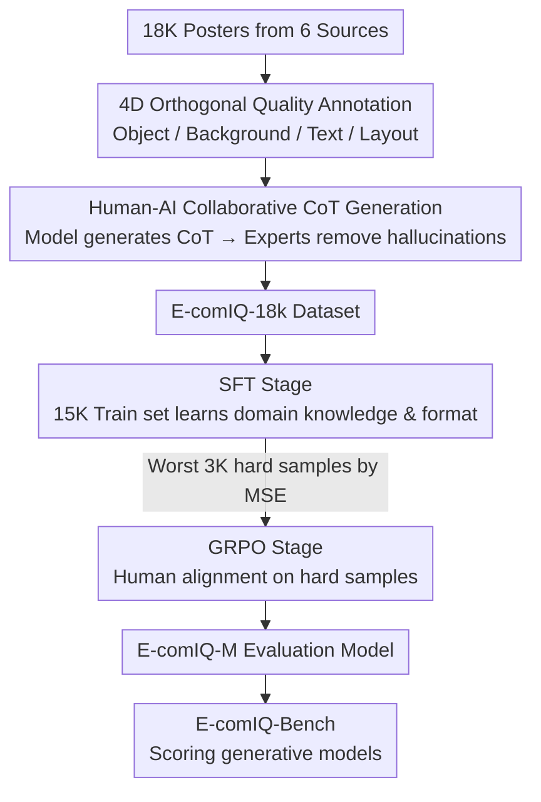

# E-comIQ-ZH: A Human-Aligned Dataset and Benchmark for Fine-Grained Evaluation of E-commerce Posters with Chain-of-Thought

**Conference**: CVPR 2026  
**arXiv**: [2602.21698](https://arxiv.org/abs/2602.21698)  
**Code**: [GitHub](https://github.com/4mm7/E-comIQ-ZH)  
**Area**: Image Quality Assessment / E-commerce AI  
**Keywords**: E-commerce Poster Evaluation, Image Quality Assessment (IQA), Chain-of-Thought (CoT), Multi-dimensional Scoring, Chinese Text Quality  

## TL;DR
Constructed the first multi-dimensional quality evaluation framework for Chinese e-commerce posters, E-comIQ-ZH, consisting of an 18K expert-annotated dataset (including CoT reasoning chains), a dedicated evaluation model E-comIQ-M (trained via SFT+GRPO), and a standardized benchmark E-comIQ-Bench.

## Background & Motivation
**Background**: While generative AI is extensively used in e-commerce poster production, automated quality evaluation significantly lags behind generative capabilities. Existing IQA methods focus on general aesthetics or low-level distortions, failing to measure the functional standards required for e-commerce.

**Limitations of Prior Work**: Chinese e-commerce content is particularly challenging—complex strokes in Chinese characters often produce subtle but critical text rendering errors, which existing methods (including powerful models like GPT-4o and Gemini 2.5 Pro) overlook. As shown in Fig 1, Gemini 2.5 Pro and Q-Insight both failed to identify stroke-level character corruption.

**Key Challenge**: A lack of formal multi-dimensional quality standards leads to an inability to perform systematic evaluations, which prevents the construction of training data and the training of dedicated evaluators—creating a vicious cycle. Current workflows still rely on slow, non-scalable manual audits.

**Goal**: To establish multi-dimensional quality evaluation standards and an automated evaluation toolchain for e-commerce posters.

**Key Insight**: In collaboration with senior e-commerce art directors, quality is decomposed into four dimensions: Object, Background, Text, and Layout. A large-scale expert-annotated dataset and a specialized evaluation model are then constructed.

**Core Idea**: Training a domain-specific evaluation model using expert annotations and CoT reasoning chains to align automated evaluation with human expert judgment.

## Method

### Overall Architecture

E-comIQ-ZH addresses the issue where "generative capabilities outpace evaluation" in Chinese e-commerce posters. The framework outputs three mutually supportive components: (a) E-comIQ-18k dataset (18K posters + multi-dimensional scores + CoT reasoning chains), (b) E-comIQ-M evaluation model (two-stage training), and (c) E-comIQ-Bench (an evaluation platform for scoring generative models). The dataset feeds the model, the model supports the benchmark, and the benchmark in turn inspects generative quality.

### Key Designs

**1. Orthogonal Four-Dimensional Quality Annotation: Replacing Single Scores with Complementary Dimensions**

General IQA only considers aesthetics or low-level distortions, which cannot characterize the functionality of e-commerce posters. This paper, in collaboration with senior e-commerce art directors, decomposes quality into four orthogonal dimensions: Object (product integrity/clarity), Background (compatibility/visual appeal), Text (typographic readability/correctness), and Layout (composition/visual hierarchy). Each dimension is assigned a continuous score anchored to three tiers (Excellent [4.0, 5.0], Good [3.0, 4.0), Poor [1.0, 3.0)), with defect labels selected from a pre-defined checklist. To ensure reliability, annotation follows a two-step process: six domain experts first cross-annotated 1,000 calibration samples and held consensus meetings until Krippendorff's $\alpha = 0.858$. The remaining 17K samples were then annotated with 10% random sampling and shared logs to prevent drift. The average Pearson correlation between dimensions is low ($\rho \approx 0.24$), proving that a single overall score cannot capture the quality structure; "weakest link" analysis shows Text is the bottleneck for 44.8% of low-quality images and has the highest correlation with overall quality ($\rho=0.67$).

**2. Human-AI Collaborative CoT Generation: Model-Generated Reasoning with Expert Verification**

To train an evaluator capable of explaining its logic, reliable reasoning chain supervision is required. Qwen-2.5-VL-Max first generates reasoning chains based on expert scores and defect labels. Original annotators then use a NER interface to remove hallucinations, correct errors, and add domain knowledge, resulting in an average CoT length exceeding 800 Chinese characters. This approach achieves scalable reasoning annotation while ensuring factual grounding via human verification.

**3. Two-Stage SFT+GRPO Training: Learning Domain Formats then Aligning with Humans on Hard Samples**

E-comIQ-M uses Qwen-2.5-VL-7B as a backbone and is trained in two steps. Stage 1 involves SFT on 15K samples targeting expert scores and CoT chains to teach the model task formats and domain concepts. Stage 2 utilizes GRPO on a hard subset $\mathcal{D}_{hard}$, consisting of the 3K samples with the highest MSE from the SFT model.

The reward design is critical for alignment: $R(x,y) = R_{score}(x,y) + \lambda_{fmt} R_{fmt}(y)$, where $R_{fmt}$ is a binary reward for valid JSON formatting. The scoring reward is split into accuracy and distribution terms $R_{score} = \lambda_{score} R_{acc} + (1-\lambda_{score}) R_{dist}$ ($\lambda_{score}=0.65$): $R_{acc}$ is a hit rate with a tier penalty (a hit is within $\tau=0.2$, but crossing an expert-defined quality tier results in a 0.7 multiplier penalty). $R_{dist}$ uses exponential decay of the Euclidean distance $\exp(-\alpha\lVert\vec v_{pred}-\vec v_{gt}\rVert_2)$ to constrain geometric consistency across dimensions. SFT followed by tier-aware GRPO on hard samples yields results closer to human judgment than either stage alone.

## Key Experimental Results

### Main Results: SOTA Comparison of Correlations (E-comIQ-18k Test Set)

| Model | Overall PLCC/SRCC | Text PLCC/SRCC | Layout PLCC/SRCC |
|------|-------------------|----------------|------------------|
| GPT-4o | 0.242/0.219 | 0.126/0.148 | 0.297/0.282 |
| Gemini 2.5 Pro | 0.213/0.228 | 0.146/0.122 | 0.350/0.320 |
| Qwen2.5-VL-72B | 0.127/0.144 | 0.100/0.070 | 0.142/0.153 |
| Q-Insight | 0.183/0.152 | -0.024/-0.027 | 0.134/0.149 |
| Qwen2.5-VL-7B+SFT | 0.346/0.346 | 0.272/0.283 | 0.390/0.418 |
| **E-comIQ-M (Ours)** | **0.425/0.433** | **0.364/0.392** | **0.483/0.506** |

E-comIQ-M outperforms general models and specialized evaluators across all dimensions, with significant advantages in the Text dimension.

### Inter-annotator Agreement

| Dimension | Krippendorff's $\alpha$ | Relaxed Accuracy |
|------|------------------------|-------------|
| Overall | 0.858 | 96.4% |
| Object | 0.745 | 92.2% |
| Background | 0.721 | 94.6% |
| Text | 0.765 | 93.2% |
| Layout | 0.877 | 96.6% |

### Ablation Study: Training Strategy Effectiveness

| Method | Overall PLCC/SRCC | Background PLCC/SRCC |
|------|-------------------|---------------------|
| Q-Insight+GRPO | 0.265/0.235 | 0.312/0.312 |
| Q-Insight+SFT | 0.297/0.319 | 0.442/0.478 |
| Q-Insight+SFT+GRPO | 0.338/0.348 | 0.459/0.496 |
| **E-comIQ-M** | **0.425/0.433** | **0.496/0.520** |

The two-stage SFT+GRPO training outperforms any single stage, and Qwen2.5-VL-7B proves to be a superior backbone compared to Q-Insight.

### Key Findings
- Traditional NR-IQA models (MUSIQ, SPAQ) almost entirely fail in e-commerce scenarios (correlation < 0.2 or negative).
- Strong general MLLMs (GPT-4o, Gemini) achieve an Overall PLCC of only around 0.2, indicating a need for domain adaptation.
- The Text dimension is the key bottleneck for Chinese e-commerce poster quality, yet existing methods perform worst in this dimension.

## Highlights & Insights
- **Novelty**: The first complete system (dataset + model + benchmark) for multi-dimensional IQA for Chinese e-commerce posters.
- **Sophisticated CoT Design**: The AI-generation + human-verification workflow balances scale and quality, with 800+ word reasoning chains providing rich diagnostic information.
- **Orthogonality Verification**: Low correlation ($\rho \approx 0.24$) strongly supports the necessity of multi-dimensional evaluation.
- **High Consistency**: $\alpha = 0.858$ with a relaxed accuracy of 96.4%.

## Limitations & Future Work
- The dataset is primarily based on Taobao/Tmall; generalization to other platforms (Pinduoduo, cross-border e-commerce) is unverified.
- Annotations were performed by 6 experts without full cross-annotation; bias was mitigated through 10% sampling but not entirely eliminated.
- The model is based on Qwen2.5-VL-7B; potential improvements from larger models remain unexplored.
- The GRPO hard sample selection (MSE top 3K) is simple; more refined curriculum learning could be explored.
- Future work could extend to video ads/dynamic posters.
- CoT quality depends on Qwen-2.5-VL-Max's ceiling; extremely fine stroke errors might still be missed.
- Lacks quantitative cost/speed comparison against manual review processes.

## Related Work & Insights
- Traditional IQA (SSIM, MUSIQ) only covers low-level distortions, failing to judge e-commerce functionality.
- AIGC quality datasets (ImageRewardDB, AGIQA-3K) provide general preferences but lack domain depth.
- AIGuard, a related e-commerce IQA dataset, provides 253K binary labels but lacks multi-dimensional scores and CoT.
- E-comIQ-ZH fills the gap for interpretable, multi-dimensional quality evaluation in e-commerce.
- MLLM evaluators (Q-Align, VQ-R1, DeQA, Q-Insight) focus on general scenes and perform poorly on e-commerce functional dimensions.
- DPO/GRPO preference alignment is effective in general domains, but this work proves that domain-specific data is the critical bottleneck.

## Dataset Details
- **Sources**: 5K high-quality merchant photos + 5K low-quality merchant photos + professional designs + AI-generated posters + AI-edited composites + template workflows.
- **Annotation Process**: Continuous scores anchored to three tiers—Excellent [4.0, 5.0], Good [3.0, 4.0), Poor [1.0, 3.0), supplemented with defect labels per dimension.
- **Data Split**: 15K training / 2K validation / 1K testing, balanced across sources and quality tiers.
- **Backbone Selection**: Qwen-2.5-VL-7B was chosen for its strong vision-language capabilities and native Chinese support.
- **GRPO Hard Subset**: $\mathcal{D}_{hard}$ consists of the worst 3K samples ranked by SFT model MSE.

## Rating ⭐
- Novelty: ⭐⭐⭐⭐ — Defines a new track with the first multi-dimensional IQA system for Chinese e-commerce posters.
- Experimental Thoroughness: ⭐⭐⭐⭐⭐ — Comprehensive comparisons (Traditional IQA / General MLLM / Specialized Evaluators) and clear ablations.
- Writing Quality: ⭐⭐⭐⭐ — Clear problem-solution logic with informative visualizations.
- Value: ⭐⭐⭐⭐ — Direct application value for quality control in AI-generated e-commerce content.

<!-- RELATED:START -->

## Related Papers

- [\[CVPR 2025\] VideoEspresso: A Large-Scale Chain-of-Thought Dataset for Fine-Grained Video Reasoning via Core Frame Selection](../../CVPR2025/llm_reasoning/videoespresso_a_large-scale_chain-of-thought_dataset_for_fine-grained_video_reas.md)
- [\[ICLR 2026\] Fine-R1: Make Multi-modal LLMs Excel in Fine-Grained Visual Recognition by Chain-of-Thought Reasoning](../../ICLR2026/llm_reasoning/fine-r1_make_multi-modal_llms_excel_in_fine-grained_visual_recognition_by_chain-.md)
- [\[ACL 2025\] Beyond the Answer: Advancing Multi-Hop QA with Fine-Grained Graph Reasoning and Evaluation](../../ACL2025/llm_reasoning/beyond_the_answer_advancing_multi-hop_qa_with_fine-grained_graph_reasoning_and_e.md)
- [\[ACL 2026\] Decoupling the Effect of Chain-of-Thought Reasoning: A Human Label Variation Perspective](../../ACL2026/llm_reasoning/decoupling_the_effect_of_chain-of-thought_reasoning_a_human_label_variation_pers.md)
- [\[CVPR 2026\] Step-CoT: Stepwise Visual Chain-of-Thought for Medical Visual Question Answering](step-cot_stepwise_visual_chain-of-thought_for_medical_visual_question_answering.md)

<!-- RELATED:END -->
