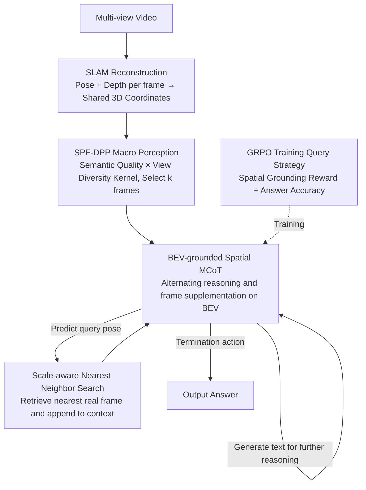

# EagleVision: A Dual-Stage Framework with BEV-grounding-based Chain-of-Thought for Spatial Intelligence

**Conference**: CVPR 2026  
**arXiv**: [2512.15160](https://arxiv.org/abs/2512.15160)  
**Code**: [https://wallelwan.github.io/EagleVision](https://wallelwan.github.io/EagleVision)  
**Area**: LLM Reasoning / Spatial Intelligence  
**Keywords**: Spatial Reasoning, BEV, Active Vision, Chain-of-Thought, DPP Frame Selection, Reinforcement Learning

## TL;DR
The proposed EagleVision is a dual-stage framework. In the macro-perception stage, it utilizes Semantic-Perspective Fusion DPP (SPF-DPP) to jointly optimize semantic relevance and perspective diversity in $SE(3)$ space for keyframe selection. In the micro-verification stage, the model actively queries new perspective frames on a BEV plane to conduct iterative spatial CoT reasoning (hypothesis $\rightarrow$ view $\rightarrow$ verification loop). The query strategy is trained purely via RL without human annotation, achieving open-source SOTA on VSI-Bench and SQA3D.

## Background & Motivation

**Background**: Video spatial reasoning (estimating distances, determining directions, understanding layouts) requires integrating geometric cues across multiple perspectives. Existing MLLMs are constrained by fixed token budgets and rely on uniform frame sampling, which prevents them from requesting new perspectives during the reasoning process.

**Limitations of Prior Work**: (1) Uniform sampling guarantees neither semantic relevance nor perspective diversity—it might entirely miss critical geometric parallax frames; (2) Once initial frames are fixed, the model cannot request new perspectives when it discovers insufficient evidence mid-reasoning; (3) Collecting multi-step spatial reasoning annotations is impractical—learning must occur from answer-level supervision.

**Key Challenge**: (a) Initial frame selection must balance the semantic and perspective dimensions; (b) Spatial hypotheses must be verified within a shared 3D coordinate system $\rightarrow$ requiring the mapping of abstract spatial queries to specific frame retrieval; (c) Human-annotated CoT trajectories are unavailable.

**Key Insight**: Extending the "thinking with images" paradigm from single-image (crop/zoom) to multi-perspective 3D spatial reasoning.

**Core Idea**: BEV-grounded pose querying—the model predicts poses on the BEV plane to retrieve the nearest real frames, alternating with textual reasoning to form a closed loop.

## Method

### Overall Architecture
The core problem EagleVision addresses is how an MLLM under a fixed token budget can both see key geometric cues and actively supplemental new perspectives during reasoning from a multi-view video. It decomposes this into two stages: "selecting initial frames first, then supplementing frames while thinking." The video undergoes a SLAM reconstruction to obtain camera poses and depth for each frame, serving as a shared 3D coordinate system—this is the only heavy pre-processing task and is performed only once. Next, **Macro Perception** uses SPF-DPP to select $k$ frames that are both semantically relevant and perspectively complementary within the budget. **Micro Verification** allows the model to generate reasoning text while predicting poses on the BEV plane to retrieve new perspective frames, forming a "hypothesis $\rightarrow$ view $\rightarrow$ verification" loop. Every step post-preprocessing uses only a lightweight 2D VLM plus a nearest-neighbor search, ensuring low marginal cost for viewing additional frames.

### Key Designs

**1. SPF-DPP Macro Perception: Balancing Relevance and Coverage in Initial Selection**

The flaw of uniform sampling is that it ignores both relevance to the query and perspective complementarity, likely missing frames providing essential parallax. SPF-DPP models the "quality $\times$ diversity" conflict using a Deterministic Point Process (DPP). Diversity is derived from geometry: a pose distance is defined on $SE(3)$ as $d_{ij}^2 = \|\mathbf{t}_i - \mathbf{t}_j\|^2/\sigma_t^2 + \beta^2 \theta(R_i, R_j)^2$, combining translation and rotational angular distance $\theta(R_i,R_j)$. A Graph Laplacian $\mathcal{L}$ is constructed from a sparse adjacency matrix $W$, and a heat kernel diffusion yields the perspective kernel $K_{view} = \exp(-\tau \mathcal{L})$, propagating local pairwise affinities into global geometric relationships while ensuring the matrix is positive semi-definite. Quality comes from semantics: FG-CLIP calculates similarity between frames and the query, calibrated via temperature softmax into a diagonal quality matrix $Q$, with elements $q_i = (1-\alpha) + \alpha \tilde{s}_i$ ($\alpha$ controls semantic weight; the floor $1-\alpha$ prevents zeroing out low-score frames). Their product forms the L-ensemble:

$$L_{dpp} = Q\,K_{view}\,Q$$

A greedy MAP subset is then solved, with a $(1-1/e)$ approximation guarantee due to the submodularity of DPP. Compared to simple top-k similarity selection, this avoids redundant adjacent perspectives.

**2. BEV-grounded Spatial MCoT: Turning Evidence Deficits into On-the-fly Supplementation**

Even perfectly selected initial frames cannot foresee every verification requirement during reasoning. This stage of iterative reasoning is termed **Spatial MCoT** (Multimodal Chain-of-Thought): at each step, the model maintains generated text, retrieved images, and a BEV pose cache, choosing from three actions—generate text, terminate with an answer, or predict a query pose $(x, y, \theta)$ on the BEV plane. The system uses scale-aware distance to find the nearest real frame and appends it to the context. This forms a loop: the model hypothesizes (e.g., "Object A is ~2m left of B"), predicts an observation pose to verify it, and then confirms or corrects its statement after seeing the retrieved frame. Unlike "one-shot 3D injection" into prompts, visual evidence is retrieved step-by-step as needed; critical geometry does not need to be present in the initial set.

**3. GRPO Training Query Strategy: Learning "When and Where to Look" without CoT Labels**

Human trajectory annotation for multi-step spatial reasoning is nearly impossible, so the query strategy must be reverse-engineered from answer-level supervision. This work uses GRPO for pure RL training, adding a **spatial grounding reward**: it penalizes the model when predicted query poses fall into areas without camera coverage, forcing it to point queries at locations where frames actually exist rather than "imagining" non-existent perspectives. Combined with answer accuracy rewards, the model autonomously learns a "coarse-to-fine" query rhythm—using long-range frames for global layout before supplementing frames for specific local distance checks.

### A Complete Example
Consider a query like "distance from object A to B": The video is processed by SLAM for poses and depth. SPF-DPP selects $k$ frames—favoring those clearly depicting A and B (higher $Q$) while ensuring different orientations and large parallax (suppressed by $K_{view}$). In Spatial MCoT, the model might hypothesize "A is ~2m front-left of B" but identifies the depth is uncertain from initial views. It predicts a lateral observation pose on the BEV plane, retrieves the closest real frame, corrects its estimate to "1.6m" based on the new side-view parallax, and finally outputs the answer. Textual reasoning and frame queries alternate until evidence meets the hypothesis.

### Loss & Training
Macro perception is computed purely at inference; DPP selection requires no training. Micro verification uses GRPO to train the query strategy, with rewards composed of spatial grounding and answer accuracy. The framework is backend-agnostic: SLAM can be replaced by other pose estimation methods like VGGT without affecting the pipeline.

## Key Experimental Results

### Main Results (VSI-Bench)

| Method | Rank | Obj.Count | Abs.Dist | Obj.Size | Rel.Dir | Route Plan |
|------|------|-----------|----------|----------|---------|------------|
| Human | - | 79.2 | 94.3 | 47.0 | 94.7 | 95.8 |
| GPT-4o | 3 | 34.0 | 46.2 | 5.3 | 37.0 | 31.5 |
| Gemini-1.5 Pro | 1 | 45.4 | 56.2 | 30.9 | 51.3 | 36.0 |
| InternVL2-8B | 10 | 34.6 | 23.1 | 28.7 | 36.7 | 29.9 |
| **EagleVision** | **Open-source SOTA** | **Best** | **Best** | **Best** | **Best** | **Best** |

EagleVision also achieves open-source VLM SOTA on SQA3D.

### Ablation Study

| Configuration | VSI-Bench Avg | Description |
|------|-------------|------|
| Uniform Sampling (Baseline) | Basis | Standard MLLM approach |
| SPF-DPP Selection | +Significant | Value of semantic + perspective diversity |
| +Spatial MCoT (Text only) | +Improvement | Improved reasoning chain |
| +BEV Pose Query (Full) | **Best** | Core contribution of active vision |
| W/O Perspective Kernel (Semantic only) | Decrease | Geometric diversity is indispensable |
| W/O Semantic Kernel (Perspective only) | Decrease | Semantic relevance is also necessary |
| SLAM $\rightarrow$ VGGT | Consistent | Verification of backend independence |

### Key Findings
- SPF-DPP selection vs. Uniform sampling yields consistent gains across all spatial tasks, especially in distance estimation and path planning.
- BEV pose querying is the most critical component—spatial hypotheses require specific perspective verification; active acquisition far outperforms static initial frames.
- The human upper bound (95.8%) remains much higher than the strongest models, indicating spatial reasoning is still a major AI challenge.
- The model learned a "coarse-to-fine" query strategy: establishing a global layout with distant frames first, then querying specific locations for distance verification.

## Highlights & Insights
- **Paradigm Shift from Passive to Active Reasoning**: EagleVision is the first to allow MLLMs to actively acquire cross-perspective visual evidence during reasoning rather than passively consuming a fixed set of frames. This has direct implications for embodied AI and robot navigation.
- **Mathematical Elegance of DPP + Heat Kernel**: Pose distance on $SE(3) \rightarrow$ heat kernel perspective kernel $\rightarrow$ DPP quality-diversity trade-off formalizes geometric intuition into a graceful mathematical framework.
- **Pure RL Training without CoT Labels**: The spatial grounding reward cleverly guides reasonable query strategies from answer-level supervision, avoiding impractical manual CoT annotation.
- **Backend-Agnostic Design**: SLAM can be replaced by any pose estimation method, ensuring the framework's utility is not tied to a specific reconstruction system.

## Limitations & Future Work
- Relies on SLAM pre-processing for poses and BEV maps—cannot handle real-time reasoning in completely unknown environments.
- BEV pose queries only retrieve the nearest *real* frames—if the required perspective is missing from the original video, it cannot be obtained.
- Currently focused on indoor scenes (ScanNet); generalization to large-scale outdoor scenes remains to be verified.
- The query strategy trained via GRPO might overfit the scene types in the training distribution.

## Related Work & Insights
- **vs. 3D Feature Enhancement (e.g., SpatialVLM)**: These inject 3D information but cannot actively acquire new perspectives during reasoning.
- **vs. 3D Reconstruction + LLM**: Such methods treat reconstruction as an offline black-box step that cannot be iteratively refined.
- **vs. ChatGPT-o3/DeepEyes**: While they crop/zoom on a single image, EagleVision operates across perspectives in 3D space.
- **Insight**: The BEV-grounded reasoning paradigm can be extended to autonomous driving (querying blind spots) and robotics (planning exploration paths).

## Rating
- Novelty: ⭐⭐⭐⭐⭐ The BEV-grounded active spatial reasoning paradigm is entirely new.
- Experimental Thoroughness: ⭐⭐⭐⭐ Verified on both VSI-Bench and SQA3D with thorough ablations.
- Writing Quality: ⭐⭐⭐⭐⭐ Clear framework design, complete mathematical formalization, and intuitive diagrams.
- Value: ⭐⭐⭐⭐⭐ Significant contribution to spatial intelligence and embodied AI.

<!-- RELATED:START -->

## Related Papers

- [\[ICML 2026\] FloorplanQA: A Benchmark for Spatial Reasoning in LLMs Using Structured Representations](../../ICML2026/llm_reasoning/floorplanqa_a_benchmark_for_spatial_reasoning_in_llms_using_structured_represent.md)
- [\[CVPR 2026\] Reinforcing Structured Chain-of-Thought for Video Understanding](reinforcing_structured_chain-of-thought_for_video_understanding.md)
- [\[CVPR 2026\] Step-CoT: Stepwise Visual Chain-of-Thought for Medical Visual Question Answering](step-cot_stepwise_visual_chain-of-thought_for_medical_visual_question_answering.md)
- [\[ICML 2026\] Beyond Two-Stage Training: Cooperative SFT and RL for LLM Reasoning](../../ICML2026/llm_reasoning/beyond_two-stage_training_cooperative_sft_and_rl_for_llm_reasoning.md)
- [\[CVPR 2026\] E-comIQ-ZH: A Human-Aligned Dataset and Benchmark for Fine-Grained Evaluation of E-commerce Posters with Chain-of-Thought](e-comiq-zh_a_human-aligned_dataset_and_benchmark_for_fine-grained_evaluation_of_.md)

<!-- RELATED:END -->
