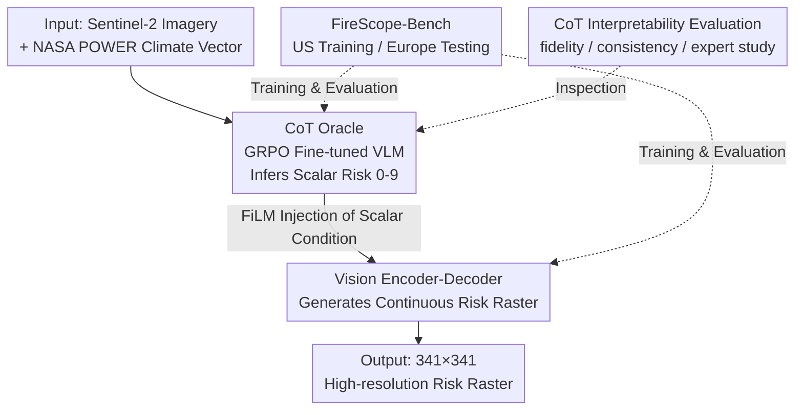

# FireScope: Wildfire Risk Raster Prediction with a Chain-of-Thought Oracle

**Conference**: CVPR 2026  
**arXiv**: [2511.17171](https://arxiv.org/abs/2511.17171)  
**Code**: https://firescope.ai/research (Project page, no open-source repository link)  
**Area**: LLM Reasoning / Multi-modal VLM / Remote Sensing Geospatial  
**Keywords**: Wildfire Risk Prediction, Chain-of-Thought Reasoning, Raster Generation, Cross-continent Generalization, GRPO

## TL;DR
A VLM (Oracle) fine-tuned with GRPO and Chain-of-Thought (CoT) reasoning first infers a scalar wildfire risk score from satellite imagery and climate data. Then, FiLM is used to feed this score into a lightweight vision Encoder-Decoder to generate a high-resolution continuous risk raster. In a "US training, Europe testing" cross-continent setting, explicit linguistic reasoning significantly improves out-of-distribution (OOD) generalization, and the reasoning traces are interpretable and recoverable by wildfire experts.

## Background & Motivation

**Background**: Wildfire risk assessment is crucial in environmental science, but the vision community has largely ignored the target of "continuous risk fields." Traditional approaches involve physical/meteorological indices (such as the Canadian Forest Fire Weather Index FWI), which only utilize meteorological variables and have coarse spatial resolution, or pure vision models (detection, segmentation, spread estimation) that only look at imagery and learn local appearance correlations.

**Limitations of Prior Work**: Wildfire risk is intrinsically a **multi-modal reasoning problem**—it requires synthesizing causal drivers such as vegetation, topography, climate interactions, and human activities to infer an abstract, spatially structured quantity (a continuous risk raster). However, pure climate models lack high-resolution visual/geographical context; pure vision models lack causal reasoning and fail when applied to different biomes or continents. Furthermore, there is **no unified benchmark** for this direction: no dataset integrates imagery, climate, and topography simultaneously, and no framework spans the spectrum from "pixel-level visual understanding" to "multi-modal causal reasoning."

**Key Challenge**: Climate-conditioned models perform very strongly in-distribution (ID) because they **memorize regional climate signatures** rather than learning generalizable physical laws—a form of overfitting. The real difficulty lies in out-of-distribution (OOD) generalization: models relying on local appearance correlations fail on real European fires.

**Goal**: (1) Create a wildfire risk benchmark that strictly measures "cross-continent OOD generalization"; (2) Design a framework where explicit linguistic reasoning grounds raster generation, achieving both generalization and interpretability.

**Key Insight**: The authors hypothesize that **explicit linguistic reasoning (CoT) forces the model to rely on complex, generalizable causal features** rather than spurious correlations tied to local appearance. If a large VLM is tasked to first "explain why this area is dangerous," this judgment is less likely to overfit the training geographical distribution than direct pixel regression.

**Core Idea**: Treat structured prediction as a two-stage "reasoning $\to$ generation" problem—first use a CoT VLM to derive a scalar risk judgment, then use it as a conditional prior to guide a vision decoder in generating the raster, complementing the causality of linguistic reasoning with the spatial precision of the vision decoder.

## Method

### Overall Architecture

FireScope is a **two-stage "reasoning $\to$ generation" framework**. The input consists of Sentinel-2 optical imagery (~100 $km^2$ area, 10m resolution, $1024\times1024$) and the climate normals vector for that area (NASA POWER monthly climate: temperature, precipitation, humidity, wind speed, wind direction, $\text{dim}=60$); the output is a $341\times341$ continuous wildfire risk raster.

In the first stage, the **Oracle** (a VLM) processes imagery and climate data, outputting a scalar risk score (discretized into unified levels 0–9) that summarizes the entire region through explicit CoT reasoning. In the second stage, a lightweight vision **Encoder-Decoder** is conditioned on the Oracle’s scalar score (injected via FiLM) to regress fine-grained continuous risk rasters. This leverages the generalization capabilities of the large VLM while maintaining the spatial precision of the vision decoder.

### Key Designs

**1. FireScope-Bench: The first multi-modal wildfire risk benchmark for "cross-continent OOD generalization"**

The limitation in this field was the lack of a unified dataset to distinguish between "memorizing regional climate" and "true generalization." The authors constructed a benchmark covering 5.7M $km^2$, 55K regions, and 6.3B pixels: Training/calibration uses US regions (50K regions, 2021), where the target variable is "Risk to Potential Structures" from the Wildfire Risk to Communities project (integrating burn probability and potential fire intensity consequences), normalized to $[0,1]$ via quantile transformation as relative risk. Evaluation uses a **geographically disjoint** European partition (4,989 regions, 2018–2025), including 3K real wildfire events (from the EFFIS burn area database, filtering fires $<5 km^2$) and 2K no-fire control areas. A key design choice: European fire events use imagery from the **year prior to the fire**, forcing the model to "predict" rather than "detect" burned scars. This "US training $\to$ Europe testing" setup naturally exposes the tension between climate overfitting and true generalization.

**2. CoT Oracle: A VLM trained via GRPO reinforcement learning to compress multi-modal reasoning into a generalizable scalar judgment**

If supervised fine-tuning is used directly with ordered labels, the Oracle only outputs a single scalar without exploring intermediate reasoning steps. Instead, the authors use reinforcement learning—specifically **GRPO** (Group Relative Policy Optimization), which requires no critic model, has much lower overhead than standard RL, and is not restricted by "gradient-free arbitrary length outputs." The reward is a weighted sum:

$$R = 0.9\cdot R_{\mathrm{acc}} + 0.1\cdot R_{\mathrm{fmt}}$$

where $R_{\mathrm{acc}}$ rewards ordered prediction accuracy (using frequency-weighted aggregation to counter label imbalance) and $R_{\mathrm{fmt}}$ rewards correct formatting, both in $[0,1]$. Notably, the authors **do not explicitly guide the reasoning content**, rewarding only final answer accuracy and allowing CoT to evolve naturally—observing increasingly detailed CoT during training is collateral evidence that "reasoning assists wildfire risk prediction." The mechanism: RL + CoT allows the Oracle to learn to synthesize cross-modal interactions of climate and imagery into a semantically grounded judgment that remains valid across continents; in ablation, the OOD ROC AUC of CoT Qwen (0.748) is significantly higher than the version without CoT (0.701).

**3. FiLM Scalar-Conditioned Vision Encoder-Decoder: Converting "a number" into a spatial prior to generate pixel-level rasters**

Since the Oracle only provides a scalar, how does it affect the entire raster? The authors first use the trained Oracle to deterministically generate scalar outputs for the training set, then inject this scalar condition before each trainable block of the Encoder-Decoder via **FiLM** (feature-wise linear modulation). The decoder regresses the normalized raster $y\in[-1,1]^{341\times341}$ with a three-part weighted loss:

$$\mathcal{L} = \underbrace{\mathcal{L}_{\text{s}\ell_1}(y,\hat{y})}_{\text{Reconstruction}} + 0.5\underbrace{(1-\text{SSIM}(\tilde{y},\tilde{\hat{y}}))}_{\text{Structure}} + 0.2\underbrace{\mathcal{L}_{\ell_1}(\nabla y,\nabla\hat{y})}_{\text{Edge}}$$

The reconstruction term is Smooth-$\ell_1$ with $\beta=1.0$, the structure term uses SSIM with an $11\times11$ Gaussian window, and the edge term matches first-order finite differences to encourage sharper boundaries. Mechanism: Surprisingly, with **only a scalar condition**, the Encoder-Decoder achieves systematic improvements in pixel-level OOD metrics (U-Net+CoT wildfire-pixel ROC AUC 0.652, IoU 0.178 outperform unconditional versions)—indicating the decoder treats the Oracle's reasoning as **contextual prior** rather than simple auxiliary metadata. In ablation, "directly attaching a perceiver decoder head to Qwen (Qwen+decoder)" performed worse, proving FireScope's gains stem from structured, semantically grounded conditions provided by explicit reasoning, rather than the raw representation capacity of the VLM.

**4. CoT Interpretability Evaluation: Proving reasoning "works and is human-readable" via expert studies + two automatic metrics**

To move beyond anecdotal interpretability, the authors designed a quantitative scheme. In the expert study, Oracle CoT and "golden CoT" (reasoning reverse-engineered from GPT-5 after correct classification) were summarized as "list of factors, no conclusion." After anonymous shuffling, two wildfire experts re-rated risk levels based on these factors to measure Quadratic Weighted Kappa (QWK). Two automatic metrics involve perturbing CoT and observing final classification changes: **fidelity** measures if the Oracle is actually guided by its CoT—by changing CoT to argue for the opposite risk level (without changing facts) and measuring prediction shift;

$$\mathrm{fid} = \frac{1}{N}\sum_{i=1}^{N}\frac{(\tilde{y_i}-y_i)}{(y_i^{*}-y_i)}\in[-1,1]$$

where $y_i^{*}=1.0$ if $y_i<0.5$, else $=0$; **consistency** measures if predictions remain stable when paraphrasing wording while retaining factual logic (high = the model relies on CoT in a human-understandable way). This evaluation transforms "whether reasoning grounds generation" from a slogan into measurable figures.

### Loss & Training

Two-stage separate training. The Oracle uses Qwen2.5-VL-7B-Instruct as the backbone, fine-tuned with GRPO (rewards as above). For the vision end, three Encoders were evaluated: SegFormer MiT-B5, the remote sensing foundation model AlphaEarth (frozen encoder), and a lightweight U-Net trained from scratch; decoders were adapted accordingly. Each Encoder-Decoder was trained in four conditional versions: Imagery-only Baseline, Climate-conditioned, Oracle (Qwen without CoT), and CoT Oracle (Ours). Most experiments were conducted on a small training set (1K samples) to save compute, unless otherwise specified.

## Key Experimental Results

### Main Results

OOD (European) raster prediction, comparing Encoder-Decoders under different conditions (Table 1, excerpt). "wildfire events" = distinguishing burned vs control areas; "wildfire pixels" = fine-grained pixel-level prediction:

| Condition | Encoder | events Brier ↓ | events ROC AUC ↑ | events ECE ↓ | pixels ROC AUC ↑ | pixels IoU ↑ |
|------|---------|------|------|------|------|------|
| Imagery-only | U-Net | 0.217 | 0.679 | 0.050 | 0.587 | 0.159 |
| + Climate | U-Net | 0.274 | 0.591 | 0.167 | 0.559 | 0.145 |
| + Oracle | U-Net | 0.213 | 0.698 | 0.087 | 0.655 | 0.181 |
| **+ CoT (Ours)** | U-Net | **0.191** | **0.750** | 0.068 | 0.652 | 0.178 |
| **+ CoT (Ours)** | SegFormer | 0.205 | 0.727 | 0.078 | 0.658 | 0.184 |

Adding CoT Oracle achieved the best or near-best OOD Brier and ROC AUC across all vision backbones; conversely, adding raw climate data degraded OOD performance (U-Net ROC AUC dropped from 0.679 to 0.591), confirming climate overfitting.

Oracle comparison (Table 2):

| Oracle | OOD Brier ↓ | OOD ROC AUC ↑ | OOD ECE ↓ | ID QWK ↑ |
|--------|------|------|------|------|
| FWI (Meteorological Index) | 0.321 | 0.551 | 0.255 | – |
| Climate MLP | 0.276 | 0.524 | 0.150 | 0.766 |
| GPT-5 | 0.281 | 0.636 | 0.229 | 0.316 |
| Qwen (No CoT) | 0.225 | 0.701 | 0.134 | 0.751 |
| **CoT Qwen** | **0.196** | **0.748** | **0.077** | **0.766** |

Crucial comparison: Climate MLP has a high ID QWK of 0.766 (equal to CoT Qwen), but an OOD ROC AUC of only 0.524 (near random)—it relies entirely on memorizing regional climate; CoT Qwen remains stable both ID/OOD.

### Ablation Study

| Configuration | OOD Performance | Description |
|------|---------|------|
| U-Net + CoT Oracle (Ours) | Best OOD | Full configuration |
| U-Net without CoT | Slightly worse | CoT Qwen OOD ROC AUC 0.748 vs Qwen 0.701 |
| U-Net trained on 40× data | Improved ID but OOD still inferior | Structured reasoning gains exceed pure data scaling |
| Qwen+decoder (VLM with decoder head) | Inferior to Ours | Gains from explicit reasoning rather than VLM capacity |

Explainability (Table 4):

| Source | Expert Exp.1 QWK ↑ | Expert Exp.2 QWK ↑ | Fidelity ↑ | Consistency ↑ |
|------|------|------|------|------|
| Oracle | 0.33 | 0.11 | 0.33 | 0.91 |
| Golden (Upper Bound) | 0.50 | 0.59 | n/a | n/a |

### Key Findings
- **Climate conditions are a double-edged sword**: They perform slightly better ID but collapse OOD—FireScope-Bench successfully probes the tension between climate overfitting and true generalization.
- **Reasoning beats data scaling**: Training U-Net on 40x the data improves ID but OOD still trails the CoT Oracle version, indicating that generalization from structured reasoning cannot be replaced by data stacking.
- **A single scalar improves pixel-level prediction**: Despite only passing one scalar, the Oracle systematically improves wildfire-pixel ROC AUC/IoU—the decoder utilizes it as a contextual prior rather than simple metadata.
- **CoT is functional and readable**: Consistency of 0.91 (paraphrasing hardly changes predictions), fidelity of 0.33 (perturbing CoT shifts pixel risk by 33% on average), and one expert recovered 0.33 QWK (about 70% of golden) using only Oracle reasoning factors.

## Highlights & Insights
- **Clean "Reasoning $\to$ Generation" decoupling**: Language CoT provides causal generalization while the vision decoder provides spatial precision, linked by FiLM via a scalar—this is a pioneering framework proving that "linguistic reasoning can improve vision generation generalization," transferable to any dense prediction task requiring causal reasoning (depth, segmentation, geographic regression).
- **Implicit CoT supervision is effective**: By rewarding only final accuracy and letting reasoning evolve, authors avoided bias from manual templates; the increasing detail of CoT during training serves as evidence for its utility.
- **"Golden CoT" as an interpretability upper bound**: Using GPT-5 to reverse-engineer reasoning from correct answers provided a reference for the expert study, turning "CoT interpretability" from subjective into quantifiable—this fidelity/consistency evaluation paradigm is highly reusable.
- **Cross-continent "Prediction not Detection" design**: Using the year prior to European fires for imagery cleanly distinguishes "predicting risk" from "identifying burn scars," a commendable OOD experimental design.

## Limitations & Future Work
- **Bottleneck**: Communication between the Oracle and Encoder-Decoder is limited to **a single scalar**, severely restricting spatial granularity; CoT cannot currently guide local spatial patterns. Future work could involve token-level or region-aware multi-dimensional conditions.
- **Fidelity at 0.33**: Perturbing CoT only shifts predictions by 33% toward the opposite risk (partially explained by factual constraints), suggesting a significant portion of the signal still comes from imagery rather than reasoning; CoT causal dominance is not as strong as its consistency.
- **Expert signal variance**: Reconstructed QWK from Oracle CoT was 0.33 for one expert and 0.11 for another, whereas golden CoT was stable (0.50/0.59), indicating Oracle CoT "usability" is subjective and lack robustness.
- **Target variable is the product of expert modeling**: ID training targets are from the Wildfire Risk to Communities probability modeling, not real observations; "strong ID performance" partially reflects fitting another model's output.
- **Scale**: Most experiments were run on a 1K small training set; full-scale validation is needed.

## Related Work & Insights
- **vs Physical/Meteorological Indices (FWI, hybrid climate models)**: These only use meteorology and have coarse resolution (FWI OOD ROC AUC only 0.551); Ours integrates high-res imagery + climate + reasoning for continuous interpretable rasters, leading significantly OOD.
- **vs Pure Vision Raster Generation (SegFormer/U-Net/Diffusion/Transformer Decoders)**: These learn direct correlations between input-output modalities and overfit local appearances; Ours reshapes structured prediction into "reasoning $\to$ generation," using VLM causal reasoning as a conditional prior.
- **vs CoT Reasoning in VLM**: Existing CoT is mostly for discrete QA or natural image generation, rarely for "spatially aligned, physically meaningful rasters"; this is the first instance of a CoT-trained VLM guiding raster generation.
- **vs Direct VLM Generation (Qwen+decoder ablation)**: Directly attaching a decoder head to the VLM performed worse, indicating gains come from the "semantic bottleneck" of explicit reasoning rather than the VLM's raw representation capacity—a counter-intuitive but valuable finding.

## Rating
- Novelty: ⭐⭐⭐⭐⭐ First proof of "linguistic reasoning improving vision generation OOD" + first cross-continent high-res wildfire risk framework.
- Experimental Thoroughness: ⭐⭐⭐⭐ Full grid of 3 backbones × 4 conditions + cross-continent OOD + expert study + automatic metrics; however, main experiments utilized the 1K small set.
- Writing Quality: ⭐⭐⭐⭐⭐ Clear motivation, well-articulated tension between climate overfitting and generalization, and rigorous interpretability evaluation.
- Value: ⭐⭐⭐⭐⭐ A practical tool for cross-continent wildfire risk and a transferable paradigm for "reasoning-grounded dense prediction."

<!-- RELATED:START -->

## Related Papers

- [\[CVPR 2026\] Reinforcing Structured Chain-of-Thought for Video Understanding](reinforcing_structured_chain-of-thought_for_video_understanding.md)
- [\[CVPR 2026\] Rationale-Enhanced Decoding for Multi-modal Chain-of-Thought](rationale-enhanced_decoding_for_multi-modal_chain-of-thought.md)
- [\[NeurIPS 2025\] Re-FORC: Adaptive Reward Prediction for Efficient Chain-of-Thought Reasoning](../../NeurIPS2025/llm_reasoning/re-forc_adaptive_reward_prediction_for_efficient_chain-of-thought_reasoning.md)
- [\[CVPR 2026\] Latent Chain-of-Thought World Modeling for End-to-End Autonomous Driving](latent_chain-of-thought_world_modeling_for_end-to-end_autonomous_driving.md)
- [\[CVPR 2026\] Revisiting the Necessity of Lengthy Chain-of-Thought in Vision-centric Reasoning Generalization](revisiting_the_necessity_of_lengthy_chain-of-thought_in_vision-centric_reasoning.md)

<!-- RELATED:END -->
