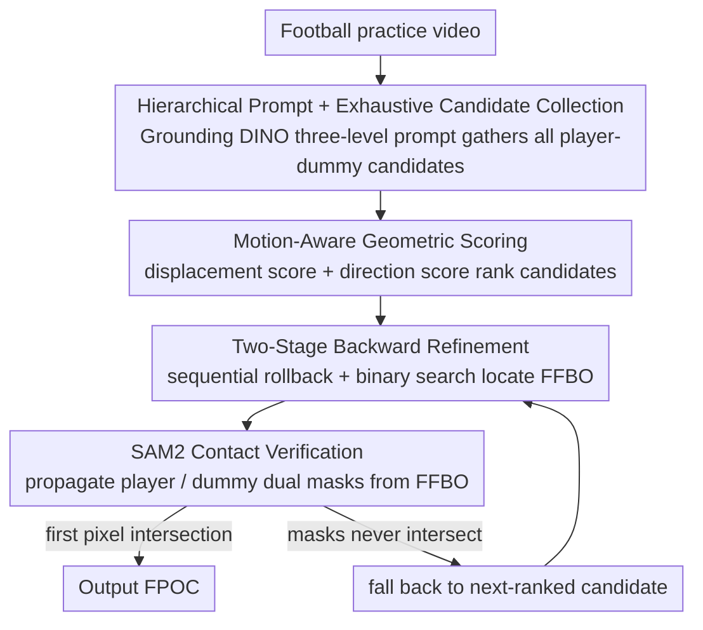

# GRAZE: Grounded Refinement and Motion-Aware Zero-Shot Event Localization

**Conference**: CVPR 2026  
**arXiv**: [2604.01383](https://arxiv.org/abs/2604.01383)  
**Code**: yes  
**Area**: LLM Reasoning / Motion Analysis  
**Keywords**: Zero-Shot Event Localization, First-Point-of-Contact Detection, Grounding DINO, SAM2 Verification, Motion Scoring

## TL;DR
GRAZE is a training-free pipeline for first-point-of-contact (FPOC) localization in American-football practice videos — it uses Grounding DINO with hierarchical prompts for multi-candidate discovery, motion-aware geometric scoring for candidate ranking, and SAM2 mask propagation as an independent pixel-level contact verifier, achieving 97.4% valid output across 738 videos with 77.5% localization accuracy within ±10 frames.

## Background & Motivation

**Background**: American-football practice produces large volumes of video, but the contact actions of interest to biomechanical analysis occupy only an extremely short window of each clip. Frame-accurate first-point-of-contact (FPOC) localization is needed to anchor pose measurement and dynamics analysis.

**Limitations of Prior Work**: (1) The scenes are extremely complex — handheld / sideline cameras, motion blur, multiple athletes in similar gear, and training dummies causing occlusion; (2) standard bounding boxes cannot distinguish "detected but not in contact" from "in contact but occluded"; (3) existing action-localization methods (BMN / ActionFormer, etc.) require frame-level annotations, which practice videos lack; (4) zero-shot methods (T3AL / ZEETAD) output temporal-segment granularity that is too coarse (half a second at 30fps = 15 frames, making it impossible to determine pre- vs. post-contact pose).

**Key Challenge**: Detection confidence and physical contact are two independent quantities — high detection confidence does not imply contact has occurred. The pipeline must decouple "candidate discovery" from "contact confirmation".

**Key Insight**: Because grounding quality and the true contact time are not monotonically related, the correct candidate must not be discarded prematurely; physical contact must be confirmed by pixel-level evidence rather than detection confidence.

**Core Idea**: Use Grounding DINO to discover candidate pairs (player–dummy) → rank by motion-direction scoring → use SAM2 mask propagation for pixel-level contact verification (mask intersection = contact evidence) → apply two-stage backward refinement to correct temporal bias.

## Method

### Overall Architecture
GRAZE aims to localize the frame where "a player first hits a training dummy" (FPOC) in cluttered football-practice videos, with no task-specific training and not a single annotated sample. Its core idea is to decouple "discovering candidate interaction pairs" from "confirming that contact happened", then chain four foundation models into a pipeline: (1) Grounding — Grounding DINO with three-level prompts (gear/nogear/generic) × 6 temporal positions × 3 thresholds, exhaustively collecting all candidate player–dummy pairs; (2) Validation — temporal-consistency verification over 14 neighboring frames + displacement magnitude + direction-cosine scoring to rank candidates; (3) Refinement — backward refinement (sequential rollback + binary search) to find the first frame with both objects visible (FFBO); (4) Contact Verification — SAM2 propagates the player and dummy masks from FFBO, the first frame where the masks intersect is the FPOC, and if they never intersect the pipeline falls back to the next candidate.

### Key Designs

**1. Hierarchical Prompt + Exhaustive Candidate Collection: keep the correct candidate in the pool with multi-granularity descriptions**
Gear and pose vary enormously across clips, so a single prompt easily misses detections. GRAZE uses three-level prompts ranging from precise to generic to cover appearance variation: $P_{gear}$ (description of a helmeted player sprinting forward) → $P_{nogear}$ (description without gear) → $P_{generic}$ (generic description), searching one by one across six temporal sampling positions, offset windows at each position, and three decreasing confidence thresholds, and **collecting all valid candidates rather than returning on first success**. This is done because grounding quality is not monotonically related to the true contact time — detection is strongest at mid-contact but may track the wrong athlete, while a weak detection in an early frame may actually be the correct starting point; only exhaustive collection avoids discarding the right candidate too early.

**2. Motion-Aware Geometric Scoring: separate the colliding player from bystanders with physical priors**
Temporal consistency (matching the candidate across 14 neighboring frames by IoU / center displacement / area, averaged into a consistency score $c_{cons}$) only confirms the candidate "persists"; it cannot distinguish an active collider from a passive bystander. GRAZE adds two geometric scores: a displacement score $m_{disp} = \min(\frac{1}{|\mathcal{Q}|}\sum_{m \in \mathcal{Q}} \frac{\|c_0 - c_m\|}{200},\, 1)$, taking the **average** displacement of the player center across matched frames relative to the current frame (normalized by 200px) — more movement, higher score; and a direction score $m_{dir} = \frac{\langle \hat{v}_{motion},\, \hat{v}_{to\text{-}dummy}\rangle + 1}{2}$, scaling the cosine similarity between the "player motion vector" and the "player→dummy direction vector" into $[0,1]$ — better alignment, higher score. The three terms are ranked by the weighted sum $conf_{overall} = 0.3\,c_{cons} + 0.3\,m_{disp} + 0.4\,m_{dir}$ (direction weighted highest), and candidates with displacement or direction too low ($m_{disp}<0.08$ or $m_{dir}<0.30$) are discarded outright. The physical prior it injects is "a collision must involve movement and the movement must point toward the dummy", so stationary teammates are naturally excluded.

**3. Two-Stage Backward Refinement: correct grounding's temporal bias toward mid-contact frames**
Grounding is strongest at mid-contact (both objects most salient), so its localization is systematically late. GRAZE first does sequential rollback: stepping back frame by frame from the grounding frame until detection is lost, bounding the event start; then it binary-searches between the start and the grounding frame to precisely locate the FFBO, which serves as the starting point for the next mask-propagation step.

**4. SAM2 as a Contact Verifier: mask intersection is the contact evidence (the core innovation)**
GRAZE redefines SAM2 from a "segmentation backend" into a "contact-detection signal": starting from the FFBO frame, it separately prompts SAM2 to propagate the player and dummy masks, and the first time the two masks produce a pixel intersection is judged as the FPOC, with the entire decision fully decoupled from detection confidence. The rationale is that bounding boxes may overlap without physical contact (a box may be mostly background) and may not overlap while contact is happening (occlusion), whereas the intersection of pixel masks directly corresponds to the two objects occupying the same space. Combined with the multi-candidate fallback — if the current candidate's masks never intersect, GRAZE proceeds down the ranking to the next candidate until some candidate's mask intersection confirms contact — the whole pipeline therefore does not depend on the success or failure of any single detection.

### A Worked Example
Consider a clip in which a player charges at a dummy from the side: Grounding collects a dozen-plus player–dummy candidates, two of which are teammates standing in the background. Validation scores the candidates — the standing teammates, with near-zero displacement and low direction scores, are pushed to the bottom, while the charging player earns the highest score thanks to large displacement and motion directed at the dummy. The system applies backward refinement to the top-ranked candidate, rolling back from the mid-contact frame to where both objects are about to disappear, then binary-searching to locate the FFBO. SAM2 propagates the two masks simultaneously from the FFBO; the first few frames still have a gap, until some frame produces a first pixel intersection — output as the FPOC. If that candidate's masks never intersect, the system falls back to repeat the process for the second-ranked candidate until contact is confirmed.

## Key Experimental Results

### Main Results (738 practice videos)

| Metric | Value |
|------|:---:|
| Valid output rate | **97.4%** |
| Accuracy within ±10 frames | **77.5%** |
| Accuracy within ±20 frames | **82.7%** |

### Ablation Study

| Config | Accuracy within ±10 frames |
|------|:---:|
| w/o motion scoring (confidence ranking only) | drops significantly |
| w/o SAM2 verification (box overlap only) | drops more |
| w/o backward refinement (use grounding frame directly) | systematically late |
| w/o hierarchical prompt (single level) | lower candidate recall |
| **Full GRAZE** | **77.5%** |

### Key Findings
- SAM2 verification is the most critical component — judging contact by box overlap has an extremely high false-positive rate.
- Motion-direction scoring effectively excludes bystanders (95%+ of erroneous candidates are excluded).
- Exhaustive candidate collection (not returning on first success) is ~5% more accurate than a greedy strategy.
- Backward refinement corrects the FPOC forward by 4.8 frames on average.

## Highlights & Insights

- **The conceptual innovation of "SAM2 as a contact verifier"**: redefining the segmentation model from a passive "give me masks" into an active "tell me when two objects first make contact" — mask intersection is physical-contact evidence that detection confidence cannot provide. This idea generalizes to any scenario requiring the timing of object interaction (collision detection, hand-off action analysis, etc.).
- **Decoupling candidate discovery from contact confirmation**: traditional methods equate detection confidence with event occurrence — GRAZE explicitly separates "finding possible player–dummy pairs" from "confirming when they make contact", using the best-suited tool for each.
- **Practicality of zero-shot + training-free**: practice videos vary enormously in gear/field/shooting conditions across sessions → training a specific detector is unrealistic. GRAZE's pure prompt + mask solution generalizes naturally.
- **Physical-prior injection via motion-direction scoring**: leveraging the simple physical intuition that "a collision must move toward its target" → a learning-free rule effectively excludes the vast majority of wrong candidates.

## Limitations & Future Work
- Currently it only targets the player–dummy practice scenario — in real games, player–player contact is more complex (both sides are moving).
- SAM2 mask propagation may fail under extreme motion blur and occlusion.
- The localization precision (±10 frames ≈ 0.33s) is still too coarse for some biomechanical analysis — higher-frame-rate video may improve precision.
- The hierarchical-prompt design relies on prior knowledge about sports gear — transferring to other sports requires redesigning prompts.
- Integrating optical-flow information into contact confirmation could be explored (adding motion-consistency verification beyond mask intersection).

## Related Work & Insights
- **vs BMN/ActionFormer**: they require frame-level annotated training, GRAZE is zero-shot.
- **vs T3AL/ZEETAD**: zero-shot but with temporal-segment granularity too coarse — FPOC requires frame precision.
- **vs traditional contact detection**: typically trains a classifier for a specific scenario. GRAZE replaces a dedicated classifier with a combination of foundation models.
- **Insight**: SAM2's mask propagation can serve as a general "when do two objects first interact" detector — this paradigm transfers to medicine (detecting the moment an instrument contacts tissue), sports (ball contacting racket), manufacturing (part-assembly verification), and more.

## Rating
- Novelty: ⭐⭐⭐⭐⭐ The idea of SAM2 as a contact verifier is entirely new, and the candidate-discovery / contact-confirmation decoupling is elegant.
- Experimental Thoroughness: ⭐⭐⭐⭐ 738 real videos, detailed ablations, multi-granularity precision evaluation.
- Writing Quality: ⭐⭐⭐⭐ Clear problem motivation, well-justified design rationale for each pipeline step.
- Value: ⭐⭐⭐⭐ A practical contribution to zero-shot applications of foundation-model combinations for sports biomechanics.

<!-- RELATED:START -->

## Related Papers

- [\[ICLR 2026\] CoT-RVS: Zero-Shot Chain-of-Thought Reasoning Segmentation for Videos](../../ICLR2026/llm_reasoning/cot-rvs_zero-shot_chain-of-thought_reasoning_segmentation_for_videos.md)
- [\[ICML 2026\] Scaling-Aware Adapter for Structure-Grounded LLM Reasoning](../../ICML2026/llm_reasoning/scaling-aware_adapter_for_structure-grounded_llm_reasoning.md)
- [\[ICLR 2026\] SceneCOT: Eliciting Grounded Chain-of-Thought Reasoning in 3D Scenes](../../ICLR2026/llm_reasoning/scenecot_eliciting_grounded_chain-of-thought_reasoning_in_3d_scenes.md)
- [\[ICLR 2026\] Thinking in Latents: Adaptive Anchor Refinement for Implicit Reasoning in LLMs](../../ICLR2026/llm_reasoning/thinking_in_latents_adaptive_anchor_refinement_for_implicit_reasoning_in_llms.md)
- [\[ICML 2026\] Many-Shot CoT-ICL: Making In-Context Learning Truly Learn](../../ICML2026/llm_reasoning/many-shot_cot-icl_making_in-context_learning_truly_learn.md)

<!-- RELATED:END -->
