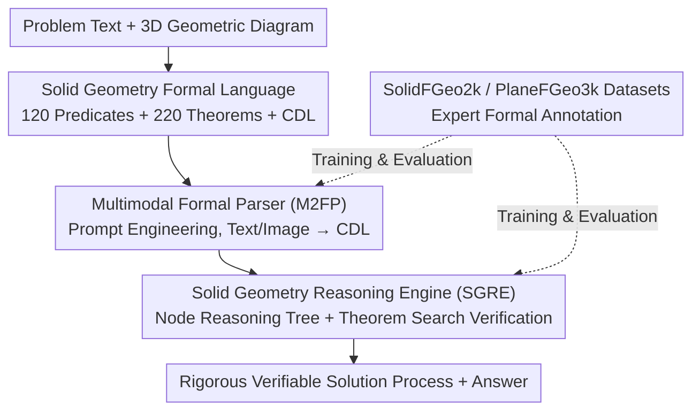

# Hilbert-Geo: Solving Solid Geometric Problems by Neural-Symbolic Reasoning

**Conference**: CVPR 2026  
**Paper**: [CVF Open Access](https://openaccess.thecvf.com/content/CVPR2026/html/Xu_Hilbert-Geo_Solving_Solid_Geometric_Problems_by_Neural-Symbolic_Reasoning_CVPR_2026_paper.html)  
**Code**: To be confirmed (Paper claims it will be released)  
**Area**: LLM Reasoning / Neural-Symbolic Reasoning / Multimodal Geometry  
**Keywords**: Solid Geometry, Neural-Symbolic Reasoning, Formal Language, Multimodal Large Language Models, Theorem Search

## TL;DR
Hilbert-Geo is the first unified formal language framework (including a predicate library and a theorem library) for **solid geometry**. It utilizes a "Parse2Reason" approach: first, a Multimodal Large Language Model (MLLM) translates text and 3D diagrams into a formal Condition Description Language (CDL); then, a specialized symbolic reasoning engine performs rigorous theorem searching. This method improves MLLM accuracy in solid geometry from approximately 50% to 77.3%, approaching human performance.

## Background & Motivation

**Background**: Automatic solving of plane geometry has seen significant progress recently, with systems like FormalGeo formalizing plane geometry problems and performing formal reasoning with visual understanding. However, **solid geometry**, a more complex domain, remains largely unexplored.

**Limitations of Prior Work**: MLLMs exhibit three critical weaknesses in solid geometry: (1) Inadequate ability to precisely grasp 3D spatial relationships, reason about occluded structures, and handle spatial transformations, leading to reasoning errors and knowledge gaps; (2) Difficulty in multimodal vision-language alignment, where mapping 2D representations of 3D objects and implicit spatial information to text often results in perceptual errors and hallucinations; (3) Frequent quantitative calculation errors. Fine-grained error analysis on Gemini 2.5 Pro and GPT-5 shows that **visual perception errors and reasoning errors together account for 73%–76% of failure cases**.

**Key Challenge**: Solid geometry knowledge is naturally **heterogeneous and scattered** across text, diagrams, and intuition, lacking a unified formal paradigm. Models limited to informal natural language cannot fully encode the topological and metric details of 3D entities, leading to ambiguity. Existing formalization methods for plane geometry **cannot characterize the topological features and metric relationships** of 3D entities (polyhedrons, spheres, etc.).

**Goal**: (1) Establish a unified formal language (predicates + theorems) for solid geometry; (2) Design a complete pipeline that parses multimodal problems into this formal language for rigorous symbolic reasoning; (3) Construct a high-quality, formally annotated solid geometry dataset and benchmark.

**Key Insight**: The authors advocate for merging the **perception capabilities of modern neural networks** with the **rigor of formal logic**. By extending the FormalGeo framework to 3D, MLLMs are tasked solely with "understanding the problem and converting it to formal language" (perception), while "rigorous reasoning" is delegated to a symbolic engine to ensure verifiability and eliminate hallucinations.

**Core Idea**: A two-stage "Parse (Neural) + Reason (Symbolic)" strategy is used to convert solid geometry problems into verifiable CDL, followed by a theorem search engine to derive a rigorous, readable, and verifiable solution process.

## Method

### Overall Architecture
Hilbert-Geo consists of three components: at the base is the **Solid Geometry Formalization Language** (predicate library + theorem library + CDL). Above this is the **Parse2Reason** method: the **Multimodal Formal Parser (M2FP)** translates natural language problems and geometric diagrams into formal CDL, and the **Solid Geometry Reasoning Engine (SGRE)** performs tree-search-based symbolic reasoning based on the CDL and theorem library. This design decouples "perception" from "reasoning": the parsing stage leverages the multimodal capabilities of MLLMs (GPT-5, Gemini 2.5 Pro, etc.), while the reasoning stage uses a pure symbolic engine to ensure rigor. Two expert-annotated datasets, SolidFGeo2k (solid) and PlaneFGeo3k (plane), are provided for training and evaluation.

### Key Designs

**1. Solid Geometry Formalization Language: A Unified, Unambiguous Vocabulary for 3D Entities**

This is the foundation of the framework. The authors extend FormalGeo's plane theory: treating the original plane geometry category as a "plane" entity for base referencing and using **augmented geometric primitives** + **generalized composition strategies** (covering, clipping, topological connection, etc.) to precisely describe basic solid components and complex 3D assemblies. This layered expansion preserves 2D integrity while gaining 3D problem-solving capabilities. It includes a **predicate library** and a **theorem library**. Predicates are basic building blocks integrated into the **Geometric Condition Description Language (CDL)**. The solid predicate library contains 120 predicates (35 native, 20 entity types, 35 entity relations, 30 attribute descriptors). Each predicate specification includes the name, point variable declarations, validity assertions, multi-representation support, and automatic expansion mechanisms. The theorem library expands on FormalGeo with a "premise + conclusion" structure comprising 220 theorems to support search-based reasoning. CDL serves to **eliminate ambiguity between multimodal representations** and establish solid premises for reasoning.

**2. Multimodal Formal Parser (M2FP): Letting MLLMs "Translate" to CDL**

Multimodal ambiguity in solid geometry is a primary source of MLLM hallucinations. M2FP positions the model as a "translator" rather than a solver. Using **prompt engineering**, the MLLM is provided with expert-designed examples covering basic predicates and formal language without complex geometric relations. Each example provides a geometric description and its formalization. Guided by these "structural and logical references," the model parses unseen text + diagrams into CDL, grounding textual entities to images. The paper conducts experiments with varying numbers of examples (15/25/35/45) and uses **Fuzzy Jaccard Similarity** to quantify parsing quality, which performs fuzzy matching between predicted CDL set $P'$ and ground truth set $G'$:
$$\text{Score}=\dfrac{\sum_{p'\in P'}\max_{g'\in G'}S(p', g')}{|P'|+|G'|-\sum_{p'\in P'}\max_{g'\in G'}S(p', g')}$$
where $S(p', g')$ is the fuzzy matching score function. GPT-5 and Gemini 2.5 Pro achieve stable parsing scores $>0.7$ with 45 examples.

**3. Solid Geometry Reasoning Engine (SGRE): Pure Symbolic Theorem Search**

Once CDL is obtained, reasoning is handled entirely by the symbolic engine, preventing MLLM calculation/reasoning hallucinations. SGRE initializes a **node-based reasoning tree** from the CDL (see Algorithm 1 in the original paper). Each node represents a geometric state: expandable nodes are unsolved subproblems, solved nodes mark completed subgoals, and failed nodes indicate invalid theorem applications. The engine iteratively matches expandable nodes with applicable theorems in the library, performing logical substitution and computation to generate new states, eventually deriving the final result. Theoretically, as long as the problem is valid and the upstream parsing is accurate, the search mechanism will produce a correct, verifiable solution process. The authors note that SGRE solves an NP problem, and most failures result from combinatorial explosion; however, **over 80% of solvable problems are resolved within 1.2 seconds and 57 reasoning steps**. By anchoring reasoning in structured solid geometry knowledge, the output is a traceable, human-aligned solution chain.

**4. SolidFGeo2k and PlaneFGeo3k Datasets: High-Quality Formally Annotated Benchmarks**

Existing solid geometry datasets are fragmented or flawed (e.g., SolidGeo uses LLM-generated answers which may contain errors and includes non-geometric physics problems). The authors constructed two expert-annotated sets: **SolidFGeo2k** (1,908 solid geometry problems) and **PlaneFGeo3k** (3,022 plane problems). Each problem includes a structured natural language description, a geometric diagram, and a standard answer (numerical values or spatial relations). Annotation was completed by experts adhering to a standard protocol, with formal logic encoded in CDL. Quality was verified via independent expert cross-validation on 20% of samples, yielding a Cohen's Kappa of 0.89 for SolidFGeo2k and 0.91 for PlaneFGeo3k, indicating "almost perfect" agreement.

### A Complete Example
Using a pyramid volume problem: The text "Given a pyramid... find the volume" and its 3D diagram are fed into **M2FP**. Guided by predicate examples, the model translates points, edges, faces, and relations into CDL predicates (eliminating visual ambiguity like "which edge occludes which face"). These CDL conditions serve as the root node for **SGRE**, which matches theorems (e.g., pyramid volume formula, Pythagorean theorem, spatial perpendicularity tests) to expand "unsolved subgoals" into "solved nodes." If parsing is correct, the search terminates at the target node, outputting a step-by-step verifiable solution chain and the numerical answer. In theory, SGRE produces no calculation or reasoning errors; failures stem only from CDL distortions or problem defects.

## Key Experimental Results

### Main Results
Performance on SolidFGeo2k comparing direct MLLM solving vs. Hilbert-Geo (using Gemini 2.5 Pro with 45-shot parsing), categorized by four sub-tasks: CSS (Composite Solid Structure), SMR (Spatial Metric Relationship), SSI (Solid Shape Identification), and MSGF (Metric of Solid Geometric Figures).

| Model | Overall.Avg | CSS | SMR | SSI | MSGF |
|------|-------------|-----|-----|-----|------|
| GPT-4o | 35.8 | 25.9 | 27.8 | 39.2 | 40.0 |
| GPT-5 | 50.6 | 51.2 | 55.4 | 40.6 | 46.8 |
| Claude 3.7 Sonnet | 47.1 | 39.2 | 40.4 | 52.9 | 56.8 |
| Gemini 2.5 Pro | 54.2 | 60.2 | 62.4 | 48.2 | 49.8 |
| Llama 3.3 70B | 33.6 | 36.3 | 34.4 | 31.1 | 28.7 |
| **Human** | **81.8** | 84.3 | 81.2 | 86.1 | 78.7 |
| **Ours (GT CDL)** | **78.7** | 80.5 | 84.1 | 76.3 | 75.1 |
| **Ours (Gemini 2.5 Pro)** | **77.3** | 80.3 | 79.4 | 76.2 | 74.8 |

> Note: All MLLMs directly solving problems scored below 54.2%, far below the human baseline of 81.8%. Hilbert-Geo improved Gemini 2.5 Pro from 54.2% to 77.3%, nearing human performance. On the MathVerse-Solid cross-dataset, it reached 84.1% (vs. 62.9% for GPT-5 direct), and 80.2% on PlaneFGeo3k, proving generalizability.

### Ablation Study
Table 2: Accuracy and solving cost using different MLLMs as parsers within the same framework (45-shot).

| Parsing Model | Overall.Avg | Avg.time(s) | Avg.steps |
|----------|-------------|-------------|-----------|
| Hilbert-Geo (Qwen2.5-VL-7B) | 30.7 | 2.9 | 32.0 |
| Hilbert-Geo (Llama 3.3 70B) | 44.3 | 28.0 | 101.1 |
| Hilbert-Geo (GPT-4o) | 50.3 | 38.1 | 112.6 |
| Hilbert-Geo (Claude 3.7 Sonnet) | 63.2 | 50.0 | 129.2 |
| Hilbert-Geo (GPT-5) | 71.2 | 77.5 | 152.0 |
| Hilbert-Geo (Gemini 2.5 Pro) | **77.3** | 81.2 | 159.1 |
| Hilbert-Geo (GT CDL) | **78.7** | 88.0 | 174.6 |

### Key Findings
- **Parsing quality determines the upper bound**: With ground truth (GT) CDL, accuracy is 78.7%; with Gemini 2.5 Pro parsing, it is 77.3%. The 1.4% gap suggests that if parsing is accurate, the symbolic engine maximizes solvability. Models with better parsing result in longer reasoning times and more steps (as complex problems yield complex CDL requiring more search).
- **Framework provides universal gains**: Even small models like Qwen2.5-VL-7B reach 30.7%, and GPT-5 improves from 50.6% to 71.2%, proving that "formal parsing + symbolic reasoning" is model-agnostic.
- **Few-shot effectiveness**: Even with only 15 examples, accuracy on SolidFGeo2k reaches 42.1%, exceeding the peak of Deepseek-V3 67B.
- **Error source shift**: Hilbert-Geo errors primarily stem from CDL distortion during parsing, combinatorial explosion during reasoning, or problem defects. Analysis shows the parsing stage significantly reduces hallucinations and visual perception errors. Expanding the time limit to 300s allowed 87% of previously timed-out problems to be solved, confirming knowledge base completeness.

## Highlights & Insights
- **Clean division of labor (Perception = Neural, Reasoning = Symbolic)**: MLLMs are least reliable in rigorous multi-step reasoning and calculation but excel at visual/textual understanding. Hilbert-Geo delegates reasoning to a verifiable symbolic engine, architecturally eliminating reasoning hallucinations. This approach is transferable to fields like physics or chemistry.
- **CDL as a dual-purpose intermediate representation**: It eliminates multimodal ambiguity and provides formal premises for symbolic reasoning. Since parsing and reasoning are decoupled, improvements in MLLMs directly translate to higher points without retraining the framework.
- **Filling the gap with the first 3D unified formal framework**: 120 predicates, 220 theorems, and two high-Kappa datasets constitute significant community assets. It validates the path of extending Plane FormalGeo by "encapsulating it as a plane entity."

## Limitations & Future Work
- **Ceiling constrained by parsing**: While the reasoning engine is near-perfect, overall accuracy is limited by CDL parsing quality; weak MLLMs (e.g., Qwen-7B at 30.7%) fail to provide accurate input.
- **Combinatorial explosion**: SGRE solves an NP problem. Exponential search for complex problems remains a failure source; the framework also has limited capacity for auxiliary line construction and vector-based problems.
- **Dependency on manual annotation and expert design**: Predicate libraries, theorem libraries, and parsing examples require expert construction, making expansion to new geometry types costly.
- **OCR/Caching symbols**: Some formulas in the cache had encoding issues; they have been restored based on semantics, but specific symbolic details ⚠️ should refer to the original text.

## Related Work & Insights
- **vs. FormalGeo**: FormalGeo established structured formalization (predicates + theorems) for plane geometry. Hilbert-Geo serves as its 3D sequel by encapsulating "plane" as an entity and augmenting primitives and composition strategies.
- **vs. Early Algebraic Methods (Wu's Method / Gröbner Bases)**: These methods solve geometry via algebraic equations; while powerful, they lack multimodal perception and readable reasoning chains. Hilbert-Geo integrates MLLM parsing while maintaining symbolic rigor.
- **vs. Geometry3K / GeoQA / UniGeo**: These use procedural or expression tree representations for 2D. Hilbert-Geo distinguishes itself by focusing on 3D with a predicate/theorem-based formal language and tree-search engine to guarantee verifiability.
- **vs. Direct MLLM Solving**: Direct solving suffers from hallucinations and calculation errors (≤54.2% on 3D). Hilbert-Geo uses the same models as parsers to achieve 77.3%.

## Rating
- Novelty: ⭐⭐⭐⭐⭐ First unified solid geometry formal framework + neural-symbolic Parse2Reason.
- Experimental Thoroughness: ⭐⭐⭐⭐⭐ 9 MLLMs across multiple benchmarks + fine-grained sub-tasks + ablation of parsing/reasoning components + human baseline.
- Writing Quality: ⭐⭐⭐⭐ Solid motivation and error analysis, though formal details are heavily relegated to the appendix.
- Value: ⭐⭐⭐⭐⭐ Model-agnostic method transferable to other rigorous reasoning domains; datasets are major assets.

<!-- RELATED:START -->

## Related Papers

- [\[CVPR 2026\] Human-like Abstract Visual Reasoning via Understanding and Solving Reasoning Loop](human-like_abstract_visual_reasoning_via_understanding_and_solving_reasoning_loo.md)
- [\[ICLR 2026\] GeoGramBench: Benchmarking the Geometric Program Reasoning in Modern LLMs](../../ICLR2026/llm_reasoning/geogrambench_benchmarking_the_geometric_program_reasoning_in_modern_llms.md)
- [\[AAAI 2026\] MathSmith: Towards Extremely Hard Mathematical Reasoning by Forging Synthetic Problems with a Reinforced Policy](../../AAAI2026/llm_reasoning/mathsmith_towards_extremely_hard_mathematical_reasoning_by_forging_synthetic_pro.md)
- [\[ICLR 2026\] $\textbf{Re}^{2}$: Unlocking LLM Reasoning via Reinforcement Learning with Re-solving](../../ICLR2026/llm_reasoning/textbfre2_unlocking_llm_reasoning_via_reinforcement_learning_with_re-solving.md)
- [\[NeurIPS 2025\] MuSLR: Multimodal Symbolic Logical Reasoning](../../NeurIPS2025/llm_reasoning/muslr_multimodal_symbolic_logical_reasoning.md)

<!-- RELATED:END -->
