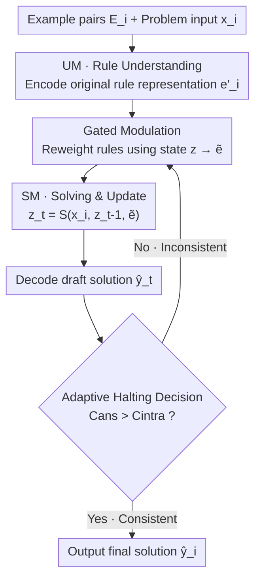

# Human-like Abstract Visual Reasoning via Understanding and Solving Reasoning Loop

**Conference**: CVPR 2026  
**Paper**: [CVF Open Access](https://openaccess.thecvf.com/content/CVPR2026/html/Chen_Human-like_Abstract_Visual_Reasoning_via_Understanding_and_Solving_Reasoning_Loop_CVPR_2026_paper.html)  
**Code**: None  
**Area**: LLM Reasoning / Abstract Visual Reasoning  
**Keywords**: ARC-AGI, Abstract Reasoning, Reasoning Loop, Adaptive Halting, Small Models  

## TL;DR
This work decomposes the iterative human cognitive process of "understanding-solving-reunderstanding" into a cyclic interaction between an Understanding Module (UM) and a Solving Module (SM). Supplemented by representation isomorphism constraints and an adaptive halting mechanism, a small model with only 7M parameters achieves 47.2% accuracy on ARC-AGI-1, surpassing TRM and several general-purpose large language models.

## Background & Motivation
**Background**: Abstract visual reasoning benchmarks like ARC-AGI require models to induce generalizable transformation rules from 2-5 input-output demonstrations and apply them to new inputs. Current mainstream approaches include general LLMs (e.g., DeepSeek-R1, o3-mini-high) and small task-specific architectures (e.g., Tiny Recursion Model, TRM).

**Limitations of Prior Work**: General LLMs perform poorly on ARC-AGI—DeepSeek-R1 achieves only 15.8% and o3-mini-high reaches 34.5%, both with extremely high inference costs. While small models like TRM are efficient (7M parameters), they rely on static puzzle-embedding tables constructed from training task IDs, making them essentially static lookups that cannot dynamically encode and understand rules for unseen tasks.

**Key Challenge**: Existing models process examples in a "static single forward pass"—treating examples as fixed inputs to produce an answer in one shot. In contrast, humans do not solve ARC-AGI in a single pass; they form initial hypotheses, generate trial solutions, check consistency with examples, and refine hypotheses. Understanding and solving evolve jointly in a loop until self-consistency is reached. Current architectures lack this mechanism for "dynamic alignment between understanding and solving."

**Goal**: To enable small models to behave like humans by (1) dynamically extracting and refining rule representations from examples, (2) repeatedly aligning understanding with draft solutions, and (3) adaptively deciding reasoning steps based on task difficulty.

**Key Insight**: Starting from the "understanding-solving loop" in neuro-cognition, the authors hypothesize that explicitly decoupling "understanding" and "solving" into interacting modules can replicate human iterative reasoning, while keeping parameters minimal through cross-step weight sharing.

**Core Idea**: Replace static lookup tables (like puzzle-embeddings) with a recursive loop between an Understanding Module (rule understanding) and a Solving Module (draft generation), using "consistency between solution and rules" as an adaptive halting signal.

## Method

### Overall Architecture
USRL (Understanding and Solving Reasoning Loop) models each ARC-AGI problem as a dynamic recursive process. Given the example set $E_i=\{(x_{i,k},y_{i,k})\}$ and input $x_i$ for problem $i$, the goal is to predict $y_i$. The architecture consists of two interacting modules: UM $U_\theta$ encodes the examples into a problem-level rule representation $e'_i$; SM $S_\theta$ (a Recurrent Transformer) maintains and iteratively updates a latent solution state $z_i$. The modules interact over multiple steps $t$: in each step, UM provides a (cacheable) original rule representation $e'_i$, which is modulated by a gate $g_\theta$ using the current solution state $z_{i,t-1}$ to produce $\tilde e_{i,t-1}=g_\theta(z_{i,t-1},e'_i)$. SM then updates the solution state $z_{i,t}=S_\theta(x_i,z_{i,t-1},\tilde e_{i,t-1})$, and a draft solution $\hat y_{i,t}=f_\theta(z_{i,t})$ is decoded. Each step feeds the draft back to UM to check for self-consistency, determining whether to continue the loop. Since modules reuse parameters across all steps, the total count remains at 7M.

### Key Designs

**1. UM–SM Reasoning Loop and Gated Modulation: Decoupling Understanding and Solving**

To address the failure of single-forward-pass models in dynamic rule understanding, USRL splits reasoning into two roles: UM "reads the rules of the examples" and SM "drafts answers based on current rules." These interact in an outer loop to form a multi-step "understand-solve-reunderstand-solve" process. Critically, instead of just feeding $e'_i$ to SM, a learned gate $g_\theta$ uses the current solution state $z_{i,t-1}$ to **re-weight** the original rule: $\tilde e_{i,t-1}=g_\theta(z_{i,t-1},e'_i)$. The intuition is that the current draft solution should determine "which part of the rule to focus on"—e.g., if the draft has incorrect colors, rule components related to color should be amplified. This bidirectional dependency explicitly encodes "understanding serves solving, and solving feeds back to understanding." Ablations show that adding UM to an SM-only baseline (+4.3%) and then adding gating (+2.4%) both contribute significantly.

**2. Rule Representation Isomorphism and Contrastive Loss: Clustering Example Rule Representations**

With only ~1,000 ARC-AGI training tasks, UM is prone to overfitting and rule representations may lack discriminative power. The authors propose a "rule representation isomorphism" hypothesis: different example pairs $(x_{i,k},y_{i,k})$ within the same problem $i$ share the same latent transformation rule; thus, their representations $e_{i,k}, e_{i,j}$ should be close in the embedding space but far from other tasks. While this "implicit isomorphism" emerges naturally via the main loss $L_{CE}$, the authors strengthen it with a supervised InfoNCE contrastive loss $L_{contrast}$: for each $e_{i,k}$, other representations from the same task are positive samples, while others are negative. $L_{e_{i,k}}=-\frac{1}{N}\sum_{p\in P(e_{i,k})}\log\frac{\exp(s(e_{i,k},p)/\tau)}{\sum_{a\in A(e_{i,k})}\exp(s(e_{i,k},a)/\tau)}$, where $s$ is cosine similarity and $\tau$ is temperature. This forces faster convergence and a more discriminative rule space, yielding a +3.2% boost. This isomorphism also provides the geometric foundation for the halting mechanism.

**3. Adaptive Reasoning Halting: Using Solution-Example Consistency**

Reasoning should not loop infinitely, and different tasks require different depths. Leveraging the isomorphic geometry, the authors design a halting criterion without explicit supervision: the current draft $(x_i,\hat y_{i,t})$ is treated as a "hypothetical new example" and fed to UM to obtain an answer representation $e_{i,ans}=U_\theta(\{(x_i,\hat y_{i,t})\})$. Two cosine similarities are computed: intra-example consistency $C_{intra}=\mathrm{avg}_{j\neq k}\,\mathrm{sim}(e_{i,j},e_{i,k})$ (internal cohesion of known examples) and answer-example consistency $C_{ans}=\mathrm{avg}_k\,\mathrm{sim}(e_{i,ans},e_{i,k})$. The halting condition is $C_{ans}>C_{intra}$: when the draft's consistency with examples reaches the level of consistency among the examples themselves, the loop terminates. This allows computation to be allocated based on task complexity (early exit for easy tasks, more steps for hard ones), maintaining performance (47.2% fixed vs 47.0% adaptive) while providing computational flexibility. During training, a **stochastic halting** strategy is used to prevent the model from overfitting to a fixed reasoning length (+0.8%).

### Loss & Training
The total loss is the primary solution loss plus the contrastive term: $L=L_{CE}(y,\hat y)+\lambda_c L_{contrast}$ ($\lambda_c=0.5$, $\tau=0.07$). During training, $L$ is calculated and backpropagated for **every intermediate reasoning step** $\hat y_{i,t}$, allowing UM/SM to refine parameters throughout the unfolding process. UM and SM are both 2-block Recurrent Transformers with embedding dimension $D=368$ and 8 attention heads. The maximum reasoning steps $T_{max}=16$, and inference uses pass@2. Data augmentation follows TRM (color/geometric transformations), expanding 400 training tasks to approximately 876k.

## Key Experimental Results

### Main Results
On the ARC-AGI-1 evaluation set (400 unseen tasks, pass@2):

| Model | Parameters | Accuracy (%) |
|------|--------|-----------|
| DeepSeek-R1 | ~671B | 15.8 |
| o3-mini-high | - | 34.5 |
| Gemini 2.5 Pro 32K | - | 37.0 |
| Omni-ARC (Qwen2.5-0.5B + TTT) | 0.5B | 40.0 |
| HRM | 27M | 40.3 |
| TRM | 7M | 44.6 |
| **USRL (Ours)** | **7M** | **47.2** |

USRL achieves the highest accuracy of 47.2% with only 7M parameters, outperforming TRM (44.6%) and significantly larger general-purpose LLMs, demonstrating that compact, well-designed architectures can outperform scale in strong inductive reasoning tasks.

### Ablation Study

| Configuration | Parameters | Acc.(%) | ∆ |
|------|--------|---------|----|
| Base (SM only) | 3.3M | 36.5 | - |
| + UM (No Gating) | 6.7M | 40.8 | +4.3 |
| + UM (With Gating) | 7.0M | 43.2 | +2.4 |
| + Contrastive Loss $L_{contrast}$ | 7.0M | 46.4 | +3.2 |
| + Stochastic Halting (Training) | 7.0M | 47.2 | +0.8 |
| + Adaptive Halting (Inference) | 7.0M | 47.0 | −0.2 |

### Key Findings
- **Decoupling "Understanding/Solving" is the primary contributor**: Adding UM alone provides +4.3%, and gating adds +2.4%. This confirms that an independent understanding channel and dynamic modulation based on solution state are the main performance drivers.
- **Reasoning depth is a hard threshold**: Accuracy crashes when $T_{max} \le 8$ steps (11.4%), rises to 25.1% at 12 steps, and jumps to 47.0% at 16 steps. Increasing beyond 16 steps (the training budget) yields no further benefit.
- **Adaptive halting saves computation**: Even with $T_{max}=16$, the adaptive mechanism uses 12.4 steps on average to reach peak accuracy, allocating more effort to difficult tasks.

## Highlights & Insights
- **Halting as a geometric self-consistency criterion**: Instead of relying on extra supervision or a separate halting network, the model reuses the isomorphic rule space. Halting when $C_{ans}>C_{intra}$ is elegant and naturally coupled with the representation learning objective.
- **Gating as the crucial touch**: Allowing the "half-finished solution" to influence which parts of the rule to emphasize mimics the human "check as you go" cognition. This is a clear advancement over TRM's simple recursive hidden state.
- **Structure wins over scale**: A 7M model beating the 671B DeepSeek-R1 serves as a reminder that for strong induction and few-shot rule induction, recursive refinement architectures can be more effective than parameter stacking.

## Limitations & Future Work
- The authors acknowledge that 47.2% is still far below human level, and many abstract patterns remain difficult for USRL.
- Scope is limited to "example-based rule induction," making it less suitable for fixed-rule problems (like Sudoku) or tasks without demonstration pairs.
- Adaptive halting depends on the validity of the isomorphism hypothesis; it is unclear how reliable $C_{intra}$ is when rules are ambiguous or noisy.
- Future work: Extending this loop to other domains that follow the rule induction paradigm.

## Related Work & Insights
- **vs TRM**: Both are 7M recurrent models. TRM recursively feeds its own latent state back but depends on static puzzle-embedding tables of training IDs, limiting generalization (44.6%). USRL uses dynamic rule encoding + gating, achieving 47.2%.
- **vs Adaptive Computation Time (ACT)**: Both use dynamic steps, but USRL’s signal comes from a task-semantic consistency criterion rather than a generic halting probability.
- **vs Rule Learning Paradigms**: Compared to task adapters, condition injection, and task embedding, USRL combines the latter two—learning latent rule representations and dynamically modulating them using the solver's state.

## Rating
- Novelty: ⭐⭐⭐⭐ Explicitly building UM/SM interaction + self-consistency halting is clever and well-integrated.
- Experimental Thoroughness: ⭐⭐⭐⭐ Results, ablations, and depth analyses are comprehensive, though limited to ARC-AGI-1.
- Writing Quality: ⭐⭐⭐⭐ Logical flow from motivation to method and criteria is clear.
- Value: ⭐⭐⭐⭐ Provides a strong case for "structure over scale" in inductive reasoning.

<!-- RELATED:START -->

## Related Papers

- [\[ICLR 2026\] Theory-Grounded Evaluation of Human-Like Fallacy Patterns in LLM Reasoning](../../ICLR2026/llm_reasoning/theory-grounded_evaluation_of_human-like_fallacy_patterns_in_llm_reasoning.md)
- [\[CVPR 2026\] Hilbert-Geo: Solving Solid Geometric Problems by Neural-Symbolic Reasoning](hilbert-geo_solving_solid_geometric_problems_by_neural-symbolic_reasoning.md)
- [\[CVPR 2026\] Agile Deliberation: Concept Deliberation for Subjective Visual Classification](agile_deliberation_concept_deliberation_for_subjective_visual_classification.md)
- [\[NeurIPS 2025\] Visual Thoughts: A Unified Perspective of Understanding Multimodal Chain-of-Thought](../../NeurIPS2025/llm_reasoning/visual_thoughts_a_unified_perspective_of_understanding_multi.md)
- [\[CVPR 2026\] VisRef: Visual Refocusing while Thinking Improves Test-Time Scaling in Multi-Modal Large Reasoning Models](visref_visual_refocusing_test_time_scaling.md)

<!-- RELATED:END -->
