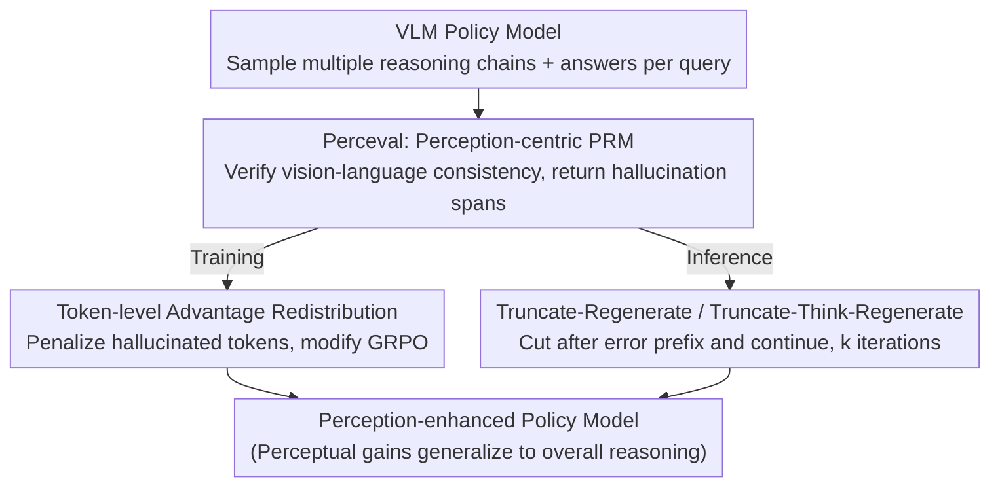

# Improving Vision-language Models with Perception-centric Process Reward Models

**Conference**: CVPR 2026  
**Paper**: [CVF Open Access](https://openaccess.thecvf.com/content/CVPR2026/html/Min_Improving_Vision-language_Models_with_Perception-centric_Process_Reward_Models_CVPR_2026_paper.html)  
**Code**: https://github.com/RUCAIBox/Perceval (To be open-sourced)  
**Area**: Multimodal VLM / LLM Reasoning  
**Keywords**: Process Reward Model, Perceptual Hallucination, RLVR, GRPO, Test-time Scaling

## TL;DR
Addressing the limitation in VLM reinforcement learning where result-only rewards fail to locate specific errors, this paper introduces Perceval, a perception-centric Process Reward Model. Perceval verifies vision-language consistency step-by-step and identifies hallucinated tokens. These signals are used both during training (via token-level advantage redistribution in GRPO) and inference (via truncate-regeneration). The method achieves consistent improvements across multiple visual reasoning benchmarks and demonstrates that improved perception generalizes to stronger overall reasoning capabilities.

## Background & Motivation
**Background**: Post-training with Reinforcement Learning from Verifiable Rewards (RLVR, primarily GRPO) is the mainstream approach to enhance the complex reasoning of VLMs. It optimizes the policy by providing a scalar reward (correct/incorrect) for the entire reasoning chain using policy gradients.

**Limitations of Prior Work**: Visual reasoning is inherently multi-step. A chain-of-thought might misinterpret the image early on (e.g., misidentifying colors or spatial relations), causing all subsequent logic to fail. However, GRPO rewards are **sequence-level**: every token in the response shares the same advantage (the $\hat{A}_i$ in Equation 1 is constant for each token). The model only knows the overall response is poor but cannot identify **exactly which step or span is incorrect**—a significant credit assignment problem. Consequently, sparse rewards limit the gains of RLVR on VLMs.

**Key Challenge**: Step-level supervision requires grain-level annotations, which are expensive. Furthermore, the correctness of certain reasoning steps can only be determined by subsequent derivations, making reliable labeling difficult.

**Key Insight**: The authors observe that many intermediate steps in visual reasoning are **perceptual assertions** (referring to objects, attributes, or spatial relations). These assertions can be **directly verified against the image**—vision-language alignment is automatically checkable. Thus, the sparse reward problem can be bypassed through the lens of perception.

**Core Idea**: Train a perception-centric Process Reward Model (PRM) named Perceval to specifically "catch hallucinated spans inconsistent with the image." Its fine-grained signals are used for two purposes: redistributing GRPO advantages during training and performing truncation-regeneration during inference.

## Method

### Overall Architecture
The method revolves around an external critic—Perceval (Perception-centric process reward evaluation model). Given a ⟨image, question, model response⟩, Perceval uses a think-then-answer paradigm to verify perceptual assertions step-by-step, eventually returning a Python list in its `<answer>` containing the hallucinated strings (or "The response is correct." if no errors are found). Once trained, this PRM is integrated into both **training** and **inference** pipelines: during training, it maps hallucinated tokens to token-level negative advantages for GRPO; during inference, it truncates responses at the identified error spans and triggers regeneration.

### Key Designs

**1. Perceval: Formulating Vision-Language Alignment as Trainable Process Rewards**

Step-level annotation is costly and often lacks immediacy. The authors narrow the scope to **perceptual assertions**, which can be verified against the image to allow automated labeling. Perceval follows a think-then-answer paradigm: it extracts individual claims within `<think>`, compares them against visual evidence, and outputs a list of hallucinated strings in `<answer>`. Training data is constructed via a four-stage pipeline: ① **Query Selection**—primarily from visual search datasets requiring localization to ensure high perceptual load; ② **Rollout Generation**—using open-source VLMs (e.g., Qwen2.5-VL-7B) to produce realistic hallucination samples; ③ **Automated Verification**—using a strong model (e.g., Gemini-2.5-Pro) for step-by-step hallucination detection; ④ **SFT**—fine-tuning the Perceval backbone to output structured verifications. This PRM reliably identifies hallucinated spans without human step-level labels.

**2. Token-level Advantage Redistribution: Decomposing Sequence Rewards**

Standard GRPO treats all tokens in a response identically regarding the advantage $\hat{A}_i$. The authors modify this step by using Perceval’s detected hallucination substrings. By locating the token indices $[j_k, l_k]$ for each hallucination via exact string matching, they construct a binary mask $M_i$ (where $m_{i,t}=1$ for hallucinated tokens, 0 otherwise). This mask modulates the sequence-level advantage to produce token-level advantages:

$$\hat{A}'_{i,t} := \hat{A}_i - \alpha \cdot m_{i,t} \cdot |\hat{A}_i|,$$

where $\alpha \in [0,1]$ controls penalty intensity. Normal tokens ($m_{i,t}=0$) retain $\hat{A}'_{i,t}=\hat{A}_i$. Hallucinated tokens are suppressed: if $\hat{A}_i>0$, they receive less reward $\hat{A}_i(1-\alpha)$; if $\hat{A}_i<0$, they receive more penalty $\hat{A}_i(1+\alpha)$. Substituting $\hat{A}'_{i,t}$ back into the GRPO objective provides precise credit assignment by applying direct pressure on content lacking visual grounding while preserving the overall preference direction. **Conditional Policy** is applied: Perceval is only used for perception-related data, while mathematical data defaults to standard GRPO.

**3. Test-time Truncate-Regenerate: PRM as an Inference Corrector**

Perceval also serves as an inference-time corrector. **Truncate–then–Regenerate**: When Perceval detects an error, the reasoning chain is cut before the first hallucinated token. The model then regenerates from the verified prefix. This allows the model to resample only the erroneous part. **Truncate–Thinking–then–Regenerate**: An additional reflection prompt is appended at the truncation point (e.g., "Wait, I need to reconsider... the mug is not on the brick"), guiding the model to correct its specific failure mode before continuing.

### Loss & Training
Perceval is fine-tuned using standard SFT on the four-stage pipeline (3B and 7B scales). The policy models are trained using the modified GRPO with token-level advantages, using Qwen2.5-VL as the backbone for both 3B and 7B versions. SFT data is sourced from DeepEyes and SophiaVL-R1; RL data primarily comes from DeepEyes (perception-focused) mixed with general reasoning data.

## Key Experimental Results

### Main Results
Evaluations were conducted across 8 benchmarks covering visual search, perception-intensive reasoning, and math/charts (V*, BLINK, MMStar, MME-RealWorld, RealWorldQA, MathVision, MathVista, ChartQA).

| Model (7B) | V* (all) | BLINK | MMStar | RWQA | MathVision | MathVista |
|--------|------|------|------|------|------|------|
| Qwen2.5-VL | 62.30 | 48.56 | 62.3 | 60.6 | 26.97 | 70.2 |
| + GRPO | 84.29 | 53.55 | 62.0 | 66.4 | 27.96 | 71.7 |
| **+ Ours** | **86.39** | **54.49** | **63.8** | **67.4** | **30.92** | 72.0 |

The 3B model also consistently outperformed GRPO: V*(all) increased from 80.10 to 83.25. Gains were ~4% in visual search, ~3% in math/charts, and ~1% in perception-intensive reasoning.

### Test-time Scaling (Table 2, k=4)
| Strategy | V* (Attr) | V* (Pos) | V* (All) | BLINK |
|------|------|------|------|------|
| Majority Voting | 91.30 | 76.32 | 85.34 | 48.24 |
| **Truncate (Ours)** | **93.04** | **77.63** | **87.96** | — |

Truncate-Regenerate outperformed majority voting under the same sampling budget, indicating that local rewriting is more efficient than redundant global sampling.

### Key Findings
- **Generalization**: Perceval was only used for perception data during training, yet performance improved in non-PRM areas like MathVision (27.96 → 30.92 for 7B). This supports the claim that perception-centric supervision is a generalizable strategy.
- **Credit Assignment**: Token-level advantage redistribution provides more stability than standard GRPO by systematically suppressing specific hallucinated spans.
- **Limitations**: On ChartQA (7B), performance dipped slightly (85.16 → 84.44), suggesting perception-centric supervision offers limited benefit for text/logic-heavy tasks.

## Highlights & Insights
- **Dual-Purpose PRM**: Uses the same Perceval model for both training (token-level advantage) and inference (truncation-regeneration), making it resource-efficient.
- **Perception as a Breakthrough**: Instead of attempting to verify every reasoning step, the focus is narrowed to perception—assertions that can be ground-truthed against the image. This makes automated labeling and token-level localization feasible.
- **Transferable Formula**: The modulation $\hat{A}'_{i,t}=\hat{A}_i-\alpha m_{i,t}|\hat{A}_i|$ can be applied to other RLVR tasks where error spans can be localized (e.g., code execution or tool calls).

## Limitations & Future Work
- Relies on a strong teacher model for labels; PRM quality is capped by the teacher's hallucination detection capability.
- Gains are concentrated in perception-dense tasks; logical tasks might see diminished or slightly negative results without careful data-conditioned execution.
- Truncate-regenerate depends on exact string matching; localization may fail if the PRM output deviates slightly from the reasoning chain.
- Test-time scaling involves a trade-off between additional computation (iterations $k$) and latency.

## Related Work & Insights
- **vs GRPO / RLVR (VLM-R1, LMM-R1)**: These use sequence-level rewards; this paper uses PRM to provide token-level signals, improving credit assignment in perception tasks.
- **vs R1-VL (StepGRPO)**: While both aim for dense rewards, R1-VL uses rule-based step rewards. This paper uses a learned, interpretable PRM that identifies specific failure modes.
- **vs DeepEyes / Pixel-Reasoner**: These utilize external tools or pixel-level operations; this paper modifies the reward side without changing the policy's action space, making it more lightweight.

## Rating
- Novelty: ⭐⭐⭐⭐ Combining perception-centric PRM with token-level advantages and truncation-regeneration is a novel synthesis.
- Experimental Thoroughness: ⭐⭐⭐⭐ Broad coverage across 8 benchmarks; includes TTS and generalization analysis.
- Writing Quality: ⭐⭐⭐⭐ Clear logical flow from motivation to generalization findings.
- Value: ⭐⭐⭐⭐ The finding that perception-specific supervision generalizes to overall reasoning is highly practical for VLM post-training.

<!-- RELATED:START -->

## Related Papers

- [\[CVPR 2026\] Revisiting the Necessity of Lengthy Chain-of-Thought in Vision-centric Reasoning Generalization](revisiting_the_necessity_of_lengthy_chain-of-thought_in_vision-centric_reasoning.md)
- [\[CVPR 2026\] Think-as-You-See: Streaming Chain-of-Thought Reasoning for Large Vision-Language Models](think-as-you-see_streaming_chain-of-thought_reasoning_for_large_vision-language_.md)
- [\[ICLR 2026\] Vision-R1: Incentivizing Reasoning Capability in Multimodal Large Language Models](../../ICLR2026/llm_reasoning/vision-r1_incentivizing_reasoning_capability_in_multimodal_large_language_models.md)
- [\[ACL 2026\] Process Reward Models Meet Planning: Generating Precise and Scalable Datasets for Step-Level Rewards](../../ACL2026/llm_reasoning/process_reward_models_meet_planning_generating_precise_and_scalable_datasets_for.md)
- [\[ICML 2025\] Improving Rationality in the Reasoning Process of Language Models through Self-playing Game](../../ICML2025/llm_reasoning/improving_rationality_in_the_reasoning_process_of_language_models_through_self-p.md)

<!-- RELATED:END -->
